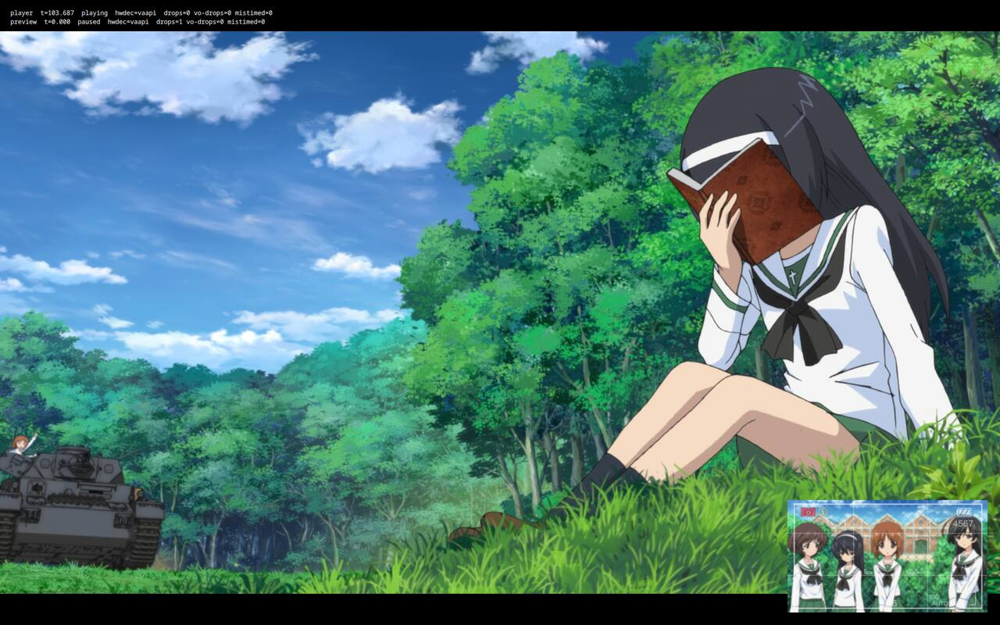
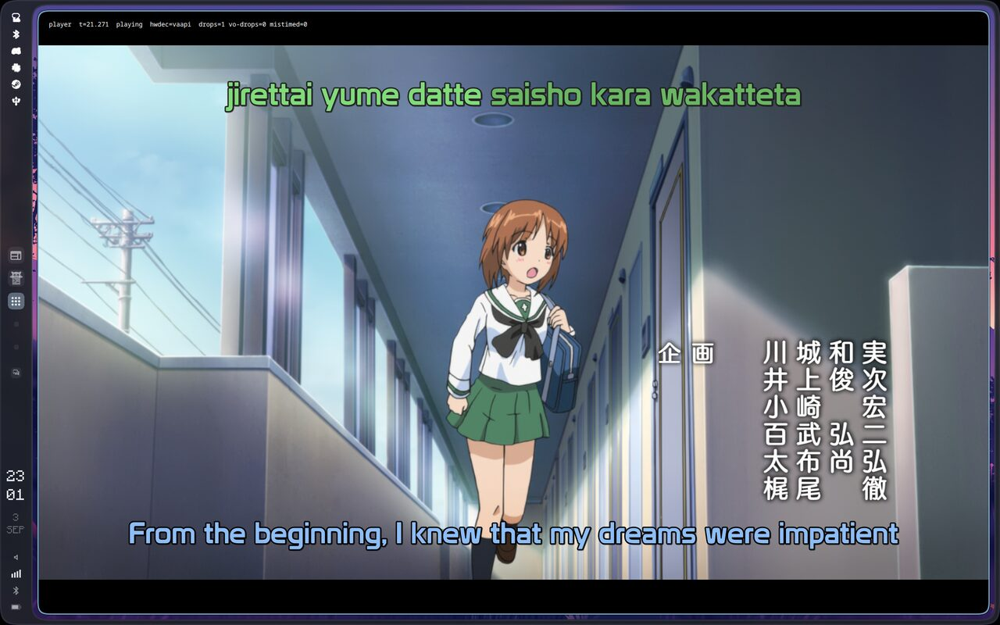

# Spike: libmpv renders inside a QML window on the AMD laptop

Resolves wayfinder ticket #18 on the native line map (#2), the other half of [the desktop spike](libmpv-qml.md) (#9). Run on 2026-09-03 on kangaeru over SSH from the desktop: Arch, kernel 7.1.11-zen1, Hyprland 0.56.2 on the laptop's own 1920 by 1200 panel at 60 Hz (VRR off), Radeon 860M (Krackan) on Mesa 26.2.1 with libva 2.24.1, qt6-base, qt6-declarative and qt6-wayland 6.11.2, mpv 0.41.0, mpvqt 1.2.0-1. Nobody was at the laptop; the window went up on the empty focused workspace and every run was measured there, tiled by Hyprland into a 1824 by 1156 slot.

Same app, same file, same 68 second script as the desktop. The laptop runs through `spikes/libmpv-qml/run-laptop.sh` (no window moves, one monitor) and `occlude.sh` for the hidden-workspace test. The one package installed for the spike was mpvqt; the VA driver is Mesa's own `radeonsi_drv_video.so`, so no libva driver package was needed, and `libva-utils` is not installed and was not missed.

## Answer

The laptop plays the same file the same way, and slightly better in two places. `hwdec=auto` lands on vaapi with p010 frames on the first try, zero frames drop after the first one across seven runs, libass draws the karaoke from the embedded fonts, chapters and one-frame steps behave, and fullscreen and tiling are clean. Qt picks the threaded render loop by itself here, so frame steps settle in half the desktop's default time. The one place the laptop differs in kind is XWayland: Qt's default GLX integration hides the EGL that vaapi's interop needs, so `hwdec=auto` walks past vaapi to vulkan-copy unless `QT_XCB_GL_INTEGRATION=xcb_egl` is set.

## Rendering

- Qt Wayland (wayland-egl) on Mesa hands mpv a desktop OpenGL 4.6 compatibility context (the NVIDIA desktop gave OpenGL ES 3.2). mpv compiled `#version 440` shaders and picked the rgba16f FBO format. Both contexts work; the shell should not assume either.
- Qt 6.11.2 picks the **threaded** render loop on Wayland on this box, where 6.11.1 on the NVIDIA desktop picks basic. The animation driver reports a 16.67 ms vsync. `QSG_RENDER_LOOP=basic` also works (the basic run below); the spec should force threaded on both machines rather than take the default, since the choice moves frame-step latency by 2 to 3 times.
- A report of 30 blocking `getProperty` calls costs 0.7 to 1.4 ms during playback. Same conclusion as the desktop: cheap.
- The window maps about 420 ms after launch on every run.

## Hardware decoding

`hwdec=auto` looks at `hevc-vulkan` and skips it, tries `hevc-nvdec` and fails to load `libcuda.so.1` (two lines on stderr, harmless), then engages `hevc-vaapi`: `hwdec-current=vaapi`, `video-params/pixelformat=vaapi`, `video-params/hw-pixelformat=p010`, `hwdec-interop=vaapi,drmprime`. The decoder hands mpv `vaapi[p010]` frames and the render API imports them without a copy.

`hwdec=vaapi-copy` also plays without a drop with `pixelformat=p010` in system memory, and software decode (`hwdec=no`, `yuv420p10`) holds zero drops on this CPU too.

Under XWayland (`QT_QPA_PLATFORM=xcb`) Qt's xcb plugin uses GLX by default. mpv's vaapi interop is EGL only (`dmabuf-interop-gl`), so `hwdec=auto` looks at `hevc-vaapi`, finds no interop, and settles on `vulkan-copy` (`hwdec-interop` comes back empty). Still zero drops, but a copy per frame. With `QT_XCB_GL_INTEGRATION=xcb_egl` the xcb run engages vaapi exactly like Wayland. The shell's X11 fallback should set that.

## Frame pacing

`frame-drop-count` observed as property change events over each run's 68 seconds, about 123 s of video after the chapter seek:

| Run | Platform | GL | Loop | hwdec | Drops after the first frame |
| --- | --- | --- | --- | --- | --- |
| vaapi | wayland | EGL | threaded (default) | vaapi | 0 |
| vaapi-preview (preview item visible and seeking) | wayland | EGL | threaded | vaapi | 0 |
| sw | wayland | EGL | threaded | no | 0 |
| basic (`QSG_RENDER_LOOP=basic`) | wayland | EGL | basic | vaapi | 0 |
| vaapi-copy | wayland | EGL | threaded | vaapi-copy | 0 |
| xcb | XWayland | GLX (default) | threaded | vulkan-copy | 0 |
| xcb-egl (`QT_XCB_GL_INTEGRATION=xcb_egl`) | XWayland | EGL | threaded | vaapi | 0 |

Every run counts exactly one drop at time 0: the first decoded frame arrives before Qt's first render call, and mpv logs one "mpv_render_context_render() not being called or stuck" at 0.36 to 0.40 s. The chapter seek at 20 s resets the counter and it stays at 0 through the final report at 122.9 s, through the pause, ten frame steps, the fullscreen toggle and the preview seeks. `decoder-frame-drop-count` and `vo-delayed-frame-count` stay at 0 as well. The VO timing properties (`vsync-*`, `display-fps`, `mistimed-frame-count`) are empty under `vo=libmpv` here too.

## Occlusion: a hidden workspace

The desktop could not test a hidden regular workspace because moving the window switched the monitor to it. The laptop has one monitor, so `occlude.sh` plays for 10 s, switches the focused workspace away with `hl.dsp.focus({ workspace = 2 })` for 12 s, and switches back.

Hyprland stops the surface's frame callbacks on the switch. mpv drops **every** frame while hidden: the first drop lands on the first frame after the switch, 286 drops accumulate over 11.8 s of video (23.976 fps), and mpv writes the "not being called or stuck" line 60 times, once per 200 ms. Audio keeps playing. Drops stop on the first frame after the workspace comes back and stay at zero. This is the full version of the desktop's fullscreen-occlusion finding (14 of 24 frames there), and it is the input for the player behaviours ticket (#16): a shell whose surface is not being presented must either pause, or accept that video drops while audio runs on.

## Fullscreen and tiling

`Window.visibility = Window.FullScreen` gives Hyprland `fullscreen: 2`, the window at 0,0 sized 1920 by 1200 with the video re-letterboxed; setting it back returns the window to its 1824 by 1156 tiled slot at 74,22 (the owner's gaps). No drops on either transition on any run. Tiled, the window is an ordinary xdg-toplevel; no floating rule needed.

## Subtitles

The ASS track is selected by default (`sid=1`). libass 0.17.5 with the fontconfig provider resolved Prototype, Garupan_Tanks, Latienne Becker Med and HalfLife2 to the embedded fonts by name, no fallback lines. The OP karaoke renders with syllable highlighting, and the typeset credits overlay lands on the Japanese credits:

`sub-text` returns the line on screen ("Is she a friend of yours?" at the final report, same as the desktop).

## Chapters

`chapter-list` on `fileLoaded` is the same five entries. Setting `chapter` to 1 seeks to 89.965 within 10 ms of the command and the observed `chapter` follows.

## Frame stepping

Time from the `frame-step` command to the observed `pause` returning true, and from `frame-back-step` to the observed paused `time-pos` moving back one frame:

| Run | Step forward | Step back |
| --- | --- | --- |
| vaapi, threaded | 26 to 43 ms | 51 to 106 ms |
| vaapi-preview | 33 to 43 ms | 100 to 251 ms |
| sw | 35 to 52 ms | 232 to 271 ms |
| basic loop | 70 to 96 ms | 119 to 145 ms |
| vaapi-copy | 13 to 37 ms | 137 to 191 ms |
| xcb, vulkan-copy | 37 to 42 ms | 133 to 254 ms |
| xcb-egl, vaapi | 17 to 46 ms | 80 to 251 ms |

Every step moves `time-pos` by exactly 41.7 ms, and five forward plus five back land on the starting timestamp to the millisecond on every run. The threaded loop is the difference between the desktop's 45 to 95 ms and the laptop's 26 to 43 ms; forced back to basic, the laptop lands where the desktop did. One step under GLX reported the new `time-pos` without the pause round trip; it did not recur in the other 34 steps.

## Thumbnails and the seek preview

- Child process, the desktop's command (`mpv --no-config --vo=image --vo-image-format=png --frames=1 --start=600 --hr-seek=yes --no-audio --no-sub --vf=scale=320:-2`): 329 to 334 ms with `hwdec=no`, 349 to 364 ms with `vaapi-copy`, 327 to 340 ms with `hwdec=auto` (which picks vulkan-copy, since `vo=image` has no interop), 313 to 328 ms with a bare `hwdec=vaapi` (falls back to software for the same reason). The decoder makes no difference to a single frame; the laptop's CPU takes about 330 ms where the desktop's took 185. `hwdec=no` stays the rule for the thumbnail job.
- Seek preview, the second `MpvAbstractItem`: reaches `seeking=false` 37 to 88 ms after a `time-pos` set on vaapi (visible or hidden, Wayland or xcb-egl), 46 to 166 ms on the basic loop, 85 to 292 ms with vaapi-copy, 79 to 171 ms with vulkan-copy, 126 to 426 ms in software. Never costs the main player a frame.
- Stills from the playback core: `screenshot-to-file` fails on vaapi frames ("Input image format vaapi not supported by libswscale", all five shots in every zero-copy run) and works on software, vaapi-copy and vulkan-copy frames at 1.5 to 2.9 s per 1080p PNG. Same shape as nvdec on the desktop; not a thumbnail route.

## What did not work

- vaapi under XWayland with Qt's default GLX integration, above. `QT_XCB_GL_INTEGRATION=xcb_egl` fixes it.
- Presentation on a hidden workspace: every frame drops, above. A design point for #16, not a blocker.
- `screenshot-to-file` on zero-copy vaapi frames, above.
- Not covered: an external monitor, battery against mains, `video-sync=display-resample`, and the VRR-off panel is the only display measured.

## Environment notes for whoever reruns this

- Launching a window from an SSH session needs `WAYLAND_DISPLAY=wayland-1`, `XDG_RUNTIME_DIR=/run/user/1000` and `HYPRLAND_INSTANCE_SIGNATURE` from `ls /run/user/1000/hypr`; `DISPLAY=:1` for the xcb runs. `run-laptop.sh` sets all of them.
- Hyprland 0.56 switches workspaces with `hl.dsp.focus({ workspace = 2 })`. There is no `hl.dsp.workspace.goto` (and `goto` is a Lua keyword, so the parser rejects it before looking), and the legacy `hyprctl dispatch workspace 2` form is refused.
- An SSH session has no locale set; Qt warns and switches to C.UTF-8. Harmless.
- `pkill -x mpvspike`, never `-f`, for the same reason as on the desktop.
- Raw run output (events, mpv logs, grim shots) is left under `~/spike-libmpv/runs/` on the laptop.
