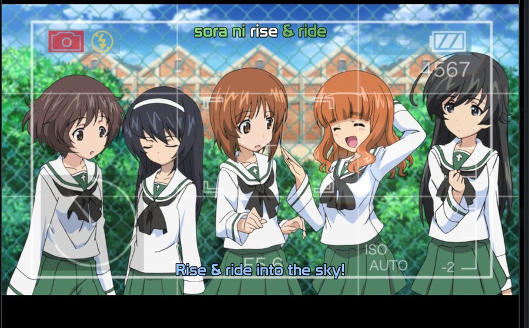
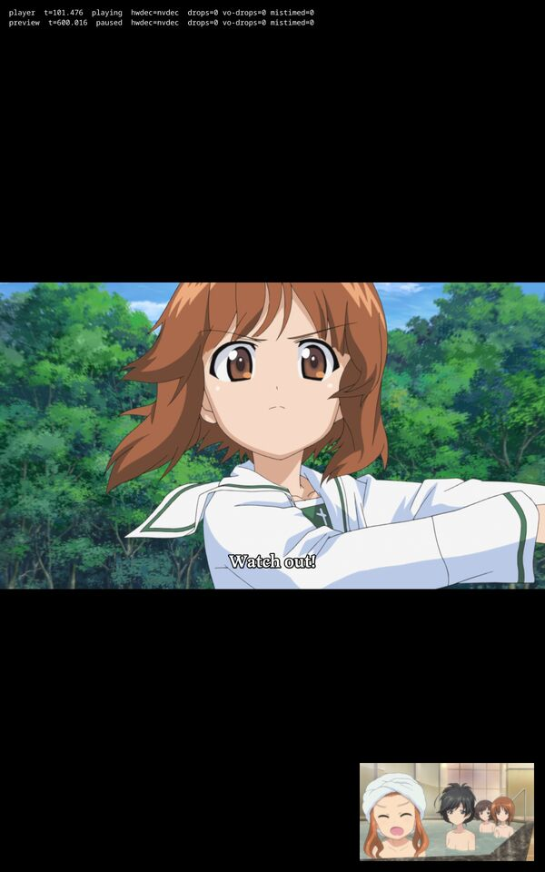

# Spike: libmpv renders inside a QML window on the NVIDIA desktop

Resolves wayfinder ticket #9 on the native line map (#2). Run on 2026-09-03 on banditbox: Arch, Hyprland 0.56.1, RTX 3090 with nvidia-utils 610.43.03, qt6-base and qt6-declarative 6.11.1, mpv 0.41.0 (libmpv client API 2.5), mpvqt 1.2.0-1 installed from extra for this spike. The AMD laptop was offline all session; its half is a separate ticket.

Code: `spikes/libmpv-qml/` on this branch. A C++ and CMake app, no Rust: one `MpvItem` subclass of `MpvAbstractItem` marked `QML_ELEMENT`, `QQuickWindow::setGraphicsApi(OpenGL)` before the application object, a second `MpvItem` in the corner as a seek preview, and a scripted 68 second sequence that logs observed mpv properties as JSON events instead of polling them.

Test file: Girls und Panzer 03 (ak-Submarines BD 1080p). HEVC Main 10 (yuv420p10), FLAC, one ASS subtitle track with 15 embedded fonts, chapters OP, Part A, Part B, ED, Preview, 23.976 fps.

The owner was in a fullscreen game on the 144 Hz main monitor for the whole session, so every run was moved to the portrait 60 Hz DP-1 monitor (1200 by 1920) right after mapping and measured there, tiled by Hyprland into a 1104 by 1876 slot.

## Answer

libmpv renders inside a Qt 6 QML window on this hardware with no environment variables and no driver flags. Hardware decoding engages through nvdec, the ASS track renders from its embedded fonts, chapters and frame stepping work, fullscreen toggles cleanly, and dropped frames stay at zero once the window is visible. The transcode pipeline goes away on Linux.

## Rendering

- Qt Wayland (wayland-egl) hands mpv an OpenGL ES 3.2 context by default. mpv compiled its shaders as `#version 320 es` and picked the rgba16f FBO format. Under XWayland (`QT_QPA_PLATFORM=xcb`) it is a desktop OpenGL 4.6 compatibility context; both work.
- MpvQt sets `vo=libmpv`. The `gpu-context` and `gpu-api` properties come back empty because Qt owns the context; mpv never names it.
- Qt 6.11.1 picks the basic render loop on Wayland, so mpv's `render()` runs on the GUI thread. `EGL_KHR_fence_sync` is present on the NVIDIA Wayland display, so this is Qt policy, not a driver gap. `QSG_RENDER_LOOP=threaded` works: the threaded loop comes up, the animation driver reports a 6.95 ms vsync, and frame steps settle in half the time. Under xcb Qt picks the threaded loop by itself.
- A report of 30 blocking `getProperty` calls costs 0.3 to 0.5 ms in total during playback (measured on every run's final report). Blocking gets are cheap in practice; the research's warning only bites when the core is busy loading.

## Hardware decoding

`hwdec=auto` lands on `hwdec-current=nvdec` with `video-params/hw-pixelformat=p010` and the decoder handing mpv `cuda[p010]` frames. The log shows mpv looking at `hevc-vulkan` first and skipping it, as the research predicted for the render API. `hwdec-interop` reports `vaapi,cuda,drmprime`, which is the load-all behaviour of `vo=libmpv`. Software decode (`hwdec=no`) also plays 10-bit 1080p HEVC on this CPU without a dropped frame.

## Frame pacing

`frame-drop-count` is the VO drop counter in 0.41 (`vo-drop-frame-count` no longer exists; `decoder-frame-drop-count` is the decoder one). Observed as property change events, not polled:

| Run | Platform | Loop | hwdec | Drops after the first second, over about 120 s of video |
| --- | --- | --- | --- | --- |
| nvdec2 | wayland | basic | nvdec | 0 |
| nvdec-preview (preview item visible and seeking) | wayland | basic | nvdec | 0 |
| sw | wayland | basic | no | 0 |
| threaded | wayland | threaded | nvdec | 0 |
| xcb | XWayland | threaded | nvdec | 0 |

Each run contained a chapter seek, a pause with ten frame steps, a fullscreen toggle and four preview seeks. Every run counted one to three drops before 0.2 s of video: the window maps on the game's workspace behind a fullscreen window and only becomes visible once moved. The first, polled run counted five drops in its first twelve seconds while its preview item seeked during the OP; the event-driven runs did not reproduce that and it stays unexplained.

`vsync-ratio`, `vsync-jitter`, `display-fps`, `estimated-display-fps` and `mistimed-frame-count` return nothing under `vo=libmpv`: the render API does not know the display. Timing is `video-sync=audio`; display-resample cannot be judged here. The 144 Hz VRR monitor was not measured.

## Occlusion

Behind a fullscreen window on the same workspace, Hyprland stops sending frame callbacks. mpv logs "mpv_render_context_render() not being called or stuck" every 200 ms and drops about 14 of every 24 frames (141 drops over 9.6 s of video) while audio keeps playing. Under a special-workspace overlay (Discord fullscreen in `special:communication` on top of the window) the callbacks keep coming and nothing drops. A hidden regular workspace was not tested; moving the window to a new workspace switched the monitor to it. The player behaviours ticket should decide what the shell does when its surface stops being presented.

## Fullscreen and tiling

`Window.visibility = Window.FullScreen` from QML gives Hyprland `fullscreen: 2`, the window at 0,0 sized 1200 by 1920, and the video re-letterboxed; setting it back returns the window to its tiled slot. No drops across either transition on any run. Tiled, the window is an ordinary xdg-toplevel: 1104 by 1876 in its slot, no floating rule needed.

## Subtitles

The ASS track is selected by default (`sid=1`). libass 0.17.5 with the fontconfig provider resolved `(Prototype, 400, 0)` and `(Latienne Becker Med, 700, 0)` to the embedded fonts by name, with no fallback lines in the log. The OP karaoke rendered with its styled fonts:

The `sub-text` property returns the line on screen.

## Chapters

`chapter-list` on `fileLoaded`: OP at 0, Part A at 89.965, Part B at 782.907, ED at 1354.937, Preview at 1444.902. Setting `chapter` to 1 seeks to 89.965 within 40 ms and the observed `chapter` property follows. The AniSkip fallback has what it needs.

## Frame stepping

While paused, `frame-step` unpauses, presents exactly one frame (time-pos advances 41.7 ms, one frame at 23.976), and pauses again; the observed `pause` returns to true after 45 to 95 ms on the basic loop, 30 to 45 ms threaded, 20 to 45 ms under xcb. `frame-back-step` moves time-pos back exactly one frame in 70 to 180 ms with nvdec and 160 to 190 ms in software. Five steps forward and five back land on the starting timestamp to the millisecond (95.971). Works on nvdec surfaces.

## Thumbnails and the seek preview

- Child process: `mpv --no-config --vo=image --vo-image-format=png --frames=1 --start=600 --hr-seek=yes --no-audio --no-sub --vf=scale=320:-2 FILE` writes one frame in 180 to 190 ms with `hwdec=no`, 375 to 390 ms with `nvdec-copy`, 690 to 735 ms with `hwdec=auto`. All under a second; software is fastest because CUDA setup dominates a single frame. Thumbnails are a core job with a child mpv and `hwdec=no`.
- Seek preview: a second `MpvAbstractItem` in the same window (Haruna's pattern: own core, `pause`, `aid=no`, `sid=no`, `hr-seek=yes`) engages nvdec on its own and reaches `seeking=false` 22 to 83 ms after a `time-pos` set with nvdec, 84 to 256 ms in software, without costing the main player a frame, visible or not.

- Stills from the playback core: `screenshot-to-file` fails on nvdec frames ("Input image format cuda not supported by libswscale"; `vo=libmpv` falls back to the software screenshot path) and works with software decode, taking 0.9 to 1.7 s per 1080p PNG. Not a thumbnail route.

## What did not work

- `screenshot-to-file` and `screenshot-raw` on hwdec frames, above.
- Presentation while occluded by a fullscreen window, above. A design point for the shell, not a blocker.
- The VO timing properties (`vsync-*`, `display-fps`, `mistimed-frame-count`) are unavailable under the render API.
- Not covered: the 144 Hz main monitor, a hidden regular workspace, `video-sync=display-resample`, and the AMD laptop (offline).

## Environment notes for whoever reruns this

- `pkill -f mpvspike` kills the shell that runs it because the pattern matches the shell's own command line; use `pkill -x mpvspike`.
- Hyprland 0.56 `hyprctl dispatch` takes Lua: `hl.dsp.window.move({ workspace = 6, silent = true, window = "class:mpvspike" })`, `hl.dsp.focus({ monitor = "DP-1" })`, `hl.dsp.workspace.toggle_special("communication")`. `silent` did not stop focus from following the window.
- Qt logs go to journald when stderr is not a terminal; `QT_FORCE_STDERR_LOGGING=1` with `QSG_INFO=1` prints the render loop and context to stderr.
