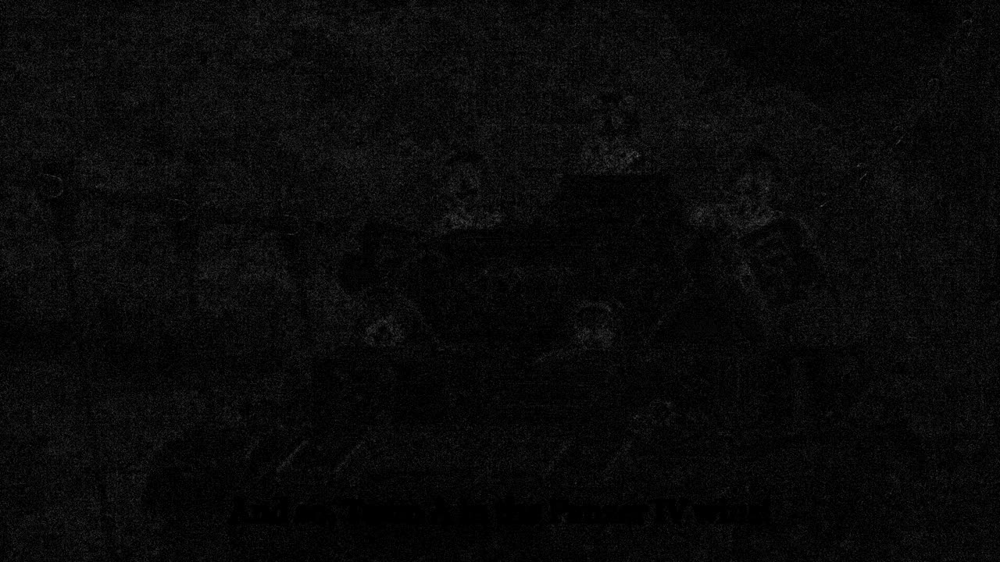
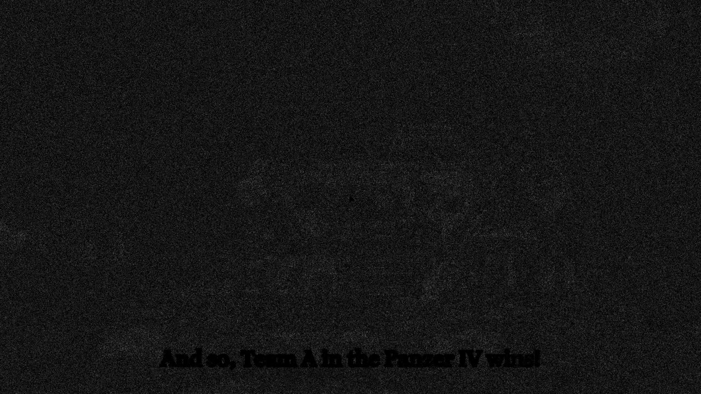
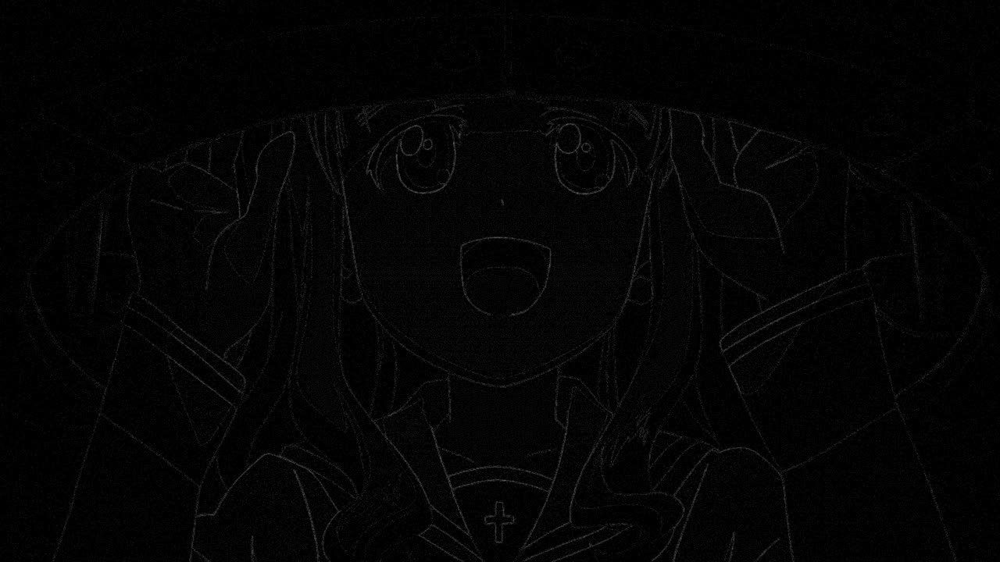

# The bundled mpv.conf: quality options on the NVIDIA desktop

Resolves wayfinder ticket #25 on the native line map (#2), the desktop half of the quality
matrix whose laptop half is [mpv-quality-options-laptop.md](mpv-quality-options-laptop.md). The
laptop could not upscale and had no 144 Hz panel; this machine has both, so it answers the two
questions that document left open.

Run on 2026-09-04 on banditbox: Arch, kernel 7.1.5-arch1, Hyprland 0.56.1, RTX 3090 on
nvidia-utils 610.43.03, qt6-base and qt6-declarative 6.11.1, mpv 0.41.0, mpvqt 1.2.0, libplacebo
7.360.1. Every run played fullscreen on HDMI-A-1, the 5120 by 1440 panel at 144 Hz with VRR on,
on its own workspace while the owner was away from the desk. `QSG_RENDER_LOOP=threaded` on every
run, and Qt's animation driver reported a 6.95 ms vsync on every run, so the window really was
paced at 144 Hz.

## Answer

**Nothing on the candidate list earns a line on this machine either.** The two cases the laptop
could not produce both came out the same way:

- **Upscaling.** 1080p fullscreen here is a 1.33x upscale, and `scale` does reach the main scale
  now: `scale=ewa_lanczossharp` and `cscale=ewa_lanczossharp` produce different output, where on
  the laptop they were byte for byte identical. The cost is about 4 W and 2.4 points of GPU busy
  on a 3090, 5 W at 4K. The picture moves by at most 5 of 255 on any pixel and 0.1 on average,
  along every edge, and at 1:1 the two are indistinguishable.
- **144 Hz.** `interpolation=yes` with `video-sync=display-resample` is inert on the real 144 Hz
  panel too. Both properties stick, mpv logs nothing, compiles the same seven fragment shaders
  as the baseline, and produces bit for bit identical frames. `display-fps`,
  `estimated-display-fps`, `vsync-ratio`, `vsync-jitter` and `mistimed-frame-count` are all null
  under `vo=libmpv`: the render API never tells mpv about the display, whatever the panel does.

The renderer is the older shader-based one here as well: the log runs under a `[libmpv_render]`
prefix, dumps hand-written vertex and fragment shader sources, prints vo_gpu's "Disabling HDR
peak computation" line, and never mentions gpu-next. So `profile=high-quality` is again exactly
`scale=ewa_lanczossharp`, byte for byte, and its two HDR lines read back as set and do nothing.

`/usr/share/anibeam/mpv.conf` therefore holds `hwdec=auto` and nothing else, on both machines.
The per-option reasons, merging both machines' numbers, are at the end.

## What was measured

Eighteen runs on the spike harness, the laptop's `quality.sh` rewritten as `quality-nv.sh` for
this box: the window launches straight onto a workspace through `hl.dsp.exec_cmd` with a
`workspace N silent` rule, so it never appears on the owner's workspace; `nvsample.py` reads
`utilization.gpu`, `power.draw`, `clocks.gr` and `temperature.gpu` from `nvidia-smi` four times a
second, in the same five-field format `summarise.py` already parses; `grim -o HDMI-A-1` grabs the
panel on each still. Each run plays 60 undisturbed seconds, then pauses on three exact frames.
`frame-drop-count`, `decoder-frame-drop-count` and `vo-delayed-frame-count` are watched throughout.

`nvidia-smi pmon` reports no per-process load for the player (it shows as a `C+G` process with
every column blank), so the numbers are whole-GPU. `base` runs first in every block and `base2`
last with identical settings, and the pair is the noise floor. In the fhd block busy held at 0.0
points of drift and power rose 1.3 W as the card warmed two degrees. In the uhd block busy
drifted 3.2 points between the two baselines while power moved 0.3 W, so on this box **power is
the cost column to read** and busy is shown for completeness; `utilization.gpu` is a coarse
time-busy sample and the compositor shares it. The board sits at about 138 W with the player
idle because two panels keep the memory clock pinned and the compositor holds the core at
1725 MHz; the player itself is a few watts on top of that.

Two geometries. The third laptop block, a tiled window, is pointless on this panel: a lone tiled
window is 5100 pixels wide and the video draws at the same 1.3x.

| Block | File | Video drawn at | Which scaler runs |
| --- | --- | --- | --- |
| fhd | gup03.mkv, 1920x1080 HEVC 10-bit | 2560x1440, fullscreen | chroma 2x to 1920x1080 through `cscale`, then the whole picture 1.33x through `scale` |
| uhd | gup03-4k.mkv, 3840x2160 HEVC 10-bit | 2560x1440, fullscreen | chroma 2x to 3840x2160 through `cscale`, then the whole picture 0.67x through `dscale` |

`gup03-4k.mkv` is 160 seconds of the same episode from 290 s, upscaled to 3840x2160 with lanczos
and re-encoded HEVC Main 10 through `hevc_nvenc` at qp 20, 3.6 Mbit/s, video only. It decodes as
`cuda[p010]` on nvdec like the source. Its still at clip time 90 is the episode's frame at 380,
the fhd block's first still.

## Frame drops and GPU cost

Every run: `frame-drop-count` 0, `decoder-frame-drop-count` 0, `vo-delayed-frame-count` 0,
`estimated-vf-fps` 23.976, nvdec decoding p010, clock 1725 MHz throughout.

```
## fhd: 1080p fullscreen on 5120x1440, video drawn 2560x1440, 1.33x upscale
config        busy%   watt   Cmax        delta over base
base            3.3  137.67   60
hq              5.6  140.96   61        +3.3 W  +2.3 points
scale-ewa       5.7  141.48   62        +3.8 W  +2.4 points
cscale-ewa      4.2  139.92   62        +2.3 W  +0.9 points
dscale-mit      3.3  139.29   63        +1.6 W  (nothing downscales; this is the drift)
dither8         3.3  139.13   63        +1.5 W
deband          3.5  139.41   63        +1.7 W  +0.2 points
interp          3.4  138.98   62        +1.3 W
base2           3.3  138.96   62        +1.3 W  +0.0 points  (the floor: the card warmed 2 degrees)

## uhd: 2160p fullscreen on 5120x1440, video drawn 2560x1440, 0.67x downscale
config        busy%   watt   Cmax        delta over base
base            4.5  145.04   63
hq              9.4  148.95   63        +3.9 W
scale-ewa       8.1  150.26   64        +5.2 W
cscale-ewa      7.5  149.32   64        +4.3 W
dscale-mit      8.2  145.54   63        +0.5 W
dither8         5.7  145.14   63        +0.1 W
deband          4.8  146.17   63        +1.1 W
interp          8.1  145.56   63        +0.5 W
base2           7.7  144.74   63        -0.3 W  (the floor: busy drifted 3.2 points across this block, power did not)
```

## Did the picture change

Every config's three stills against the same block's `base` stills, cropped to 2000 by 1200
inside the video, as PSNR in dB, worst single-pixel delta, and mean delta, both out of 255.

```
=== fhd
  base2        inf /   0   / 0            bit for bit identical: the pipeline is deterministic
  hq           55-58 / 3-5 / 0.09-0.14
  scale-ewa    55-58 / 3-5 / 0.09-0.14    byte for byte the same output as hq
  cscale-ewa   56-60 / 1-2 / 0.06-0.09    different from scale-ewa now: scale reaches luma here
  dscale-mit   inf /   0   / 0            nothing downscales on an upscale
  dither8      inf /   0   / 0
  deband       50   /   3   / 0.34-0.36
  interp       inf /   0   / 0

=== uhd
  base2        inf /   0   / 0
  hq           62   /   1   / 0.03-0.04
  scale-ewa    62   /   1   / 0.03-0.04    byte for byte the same as hq and cscale-ewa: only chroma upscales here
  cscale-ewa   62   /   1   / 0.03-0.04
  dscale-mit   59-61 / 2-3  / 0.05-0.08
  dither8      inf /   0   / 0
  deband       52   /   2   / 0.25-0.26
  interp       inf /   0   / 0
```








## Option by option, both machines

**`profile=high-quality` is `scale=ewa_lanczossharp` on both machines.** The render API runs the
older gpu renderer on NVIDIA and on Mesa, so `hdr-peak-percentile` and `hdr-contrast-recovery`
are inert, and `hq` matches `scale-ewa` byte for byte in every block on both boxes.

**`scale=ewa_lanczossharp` costs 4 W on the upscale and 5 W at 4K on the 3090 for a change
nobody can see.** This was the desktop's one real question and the answer is no. On the upscale
it does exactly what it is for, a different kernel along every edge, and the worst pixel moves
5 of 255. At 4K it only reaches chroma again, 1 of 255, byte for byte what `cscale` alone gives.
On the laptop it only ever reached chroma and cost 5 points and 2 W at 4K. A user who wants it puts it in
their own mpv.conf behind the Use my mpv.conf toggle from the player ticket (#16).

**`cscale=ewa_lanczossharp` is the cheaper half of the same nothing.** 2 W on the upscale for 1 to
2 of 255, and identical to `scale-ewa` at 4K here and everywhere on the laptop, where chroma was
all `scale` reached.

**`dscale=mitchell` is bit identical to the default on an upscale and within 3 of 255 on a
downscale, for 0.5 W.** mpv 0.41's `hermite` stays.

**`dither-depth=8` is bit identical to `auto` everywhere.** `auto` already resolves to the 8-bit
target the render API hands mpv on both GPUs.

**`deband=yes` is nearly free on the 3090 and the most expensive option on the laptop, and does
the same thing on both: adds grain.** About 1 W here, 8 points and 2.5 W at 4K on the Radeon. No
banding removed on any test frame on either machine. One bundled file serves both, and the laptop
pays.

**`interpolation=yes` with `video-sync=display-resample` is inert on a 60 Hz panel and on a
144 Hz VRR panel.** The render API gives mpv no display timing, so `video-sync` stays at `audio`
where it can be honoured.

**None of them touch subtitles.** libass draws after the scaler on both renderers.

## What the file holds after this

```conf
# AniBeam's base mpv configuration. The user's own mpv.conf loads after this one when
# "Use my mpv.conf" is on, and ~/.config/anibeam/mpv.conf loads last. The shell re-sets
# what it owns after every load. Scripts never load.

# nvdec on NVIDIA, vaapi on AMD, zero copy on both (#9, #18).
hwdec=auto
```

The reasons for every absent line, one each:

- `scale`: the default `lanczos` and `ewa_lanczossharp` are indistinguishable at 1:1 on a 1.33x
  upscale; the sharper kernel costs 2 to 5 points of GPU on the two machines.
- `cscale`: follows `scale`; on its own it changes chroma by 1 to 2 of 255 for 1 to 5 points.
- `dscale`: `hermite` is the 0.41 default and `mitchell` moves nothing past 3 of 255.
- `dither-depth`: `auto` is already 8 on both GPUs.
- `deband`: grain with no banding removed, and the laptop's most expensive option.
- `interpolation` and `video-sync`: the render API reports no display fps, so neither can act.
- `profile=high-quality`: only its `scale` line does anything, covered above.
- `gpu-api`: left alone as the ticket asked; the render API owns it and reports it empty.

## What was not covered

- A real 4K release. The 4K block is a re-encode of the 1080p source, so its detail is synthetic
  even though its decode and downscale load is real; the library holds no 4K file.
- 720p content. A 2x upscale is where `scale` would show most, and the library holds none.
- HDR. Nothing in the library is HDR, and the profile's HDR lines are inert under the render API.
- A hidden regular workspace on this box. The laptop measured that; the player ticket already
  decided playback continues while not presented.

## Reruns

The harness lives at `spikes/libmpv-qml`; export it to `~/spike-libmpv` and build with
`cmake -S . -B build -G Ninja` and `ninja -C build`, then:

    ./matrix-nv.sh fhd HDMI-A-1 3        # nine runs fullscreen on workspace 3 of the panel, about 14 minutes
    ./matrix-nv.sh uhd HDMI-A-1 3
    QRUNS=~/spike-libmpv/qruns QDESKTOP=1 python3 table.py
    QRUNS=~/spike-libmpv/qruns QCROP=crop=2000:1200:1560:120 python3 compare2.py

`quality-nv.sh NAME FILE [args]` runs one config; `FULL=1` makes it fullscreen, `MON` and `WS`
pick the output and workspace. When the panel is in use, a headless output stands in with the
same mode and the same numbers came out of the smoke run there:

    hyprctl output create headless
    hyprctl eval 'hl.monitor({ output = "HEADLESS-1", mode = "5120x1440@144", position = "20000x0", scale = 1 })'
    MON=HEADLESS-1 WS=11 ./matrix-nv.sh fhd HEADLESS-1 11
    hyprctl output remove HEADLESS-1

Raw output for this document is under the session scratchpad, not in the repo.
