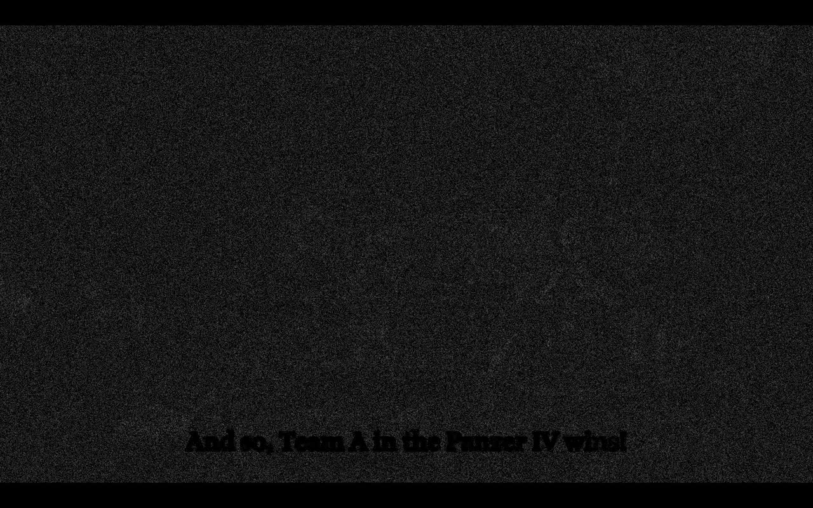
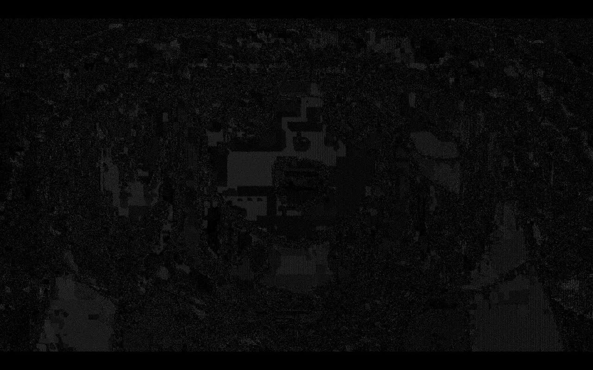
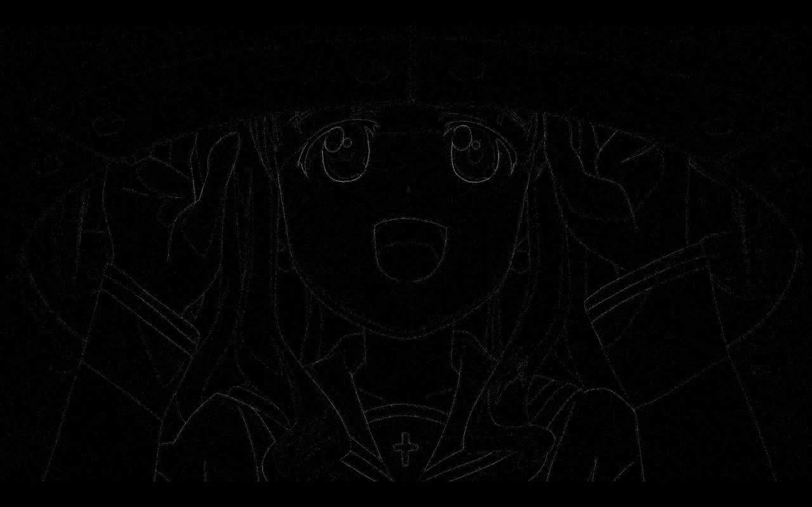

# The bundled mpv.conf: quality options on the AMD laptop

Resolves the laptop half of wayfinder ticket #23 on the native line map (#2). The NVIDIA desktop
half is its own ticket, the same split the libmpv spike took between [#9](libmpv-qml.md) and
[#18](libmpv-qml-laptop.md).

Run on 2026-09-04 on kangaeru over SSH from the desktop: Arch, kernel 7.1.11-zen1, Hyprland 0.56
on the laptop's own 1920 by 1200 panel at 60 Hz, Radeon 860M (Krackan) on Mesa 26.2.1 with libva
2.24.1, qt6-base and qt6-declarative 6.11.2, mpv 0.41.0, mpvqt 1.2.0, libplacebo 7.360.1. On
mains the whole time, battery 27 to 72 percent, nobody at the machine, the window on an empty
focused workspace. `QSG_RENDER_LOOP=threaded` on every run, per the laptop spike.

## Answer

**Nothing on the candidate list earns a line in `/usr/share/anibeam/mpv.conf` on this machine.**
Every option was accepted, none dropped a frame, and none changed the picture by more than 3 of
255 on any test frame. Two of them are outright inert under the render API, one is a no-op against
mpv 0.41's default, and the three that do something cost GPU for a difference nobody can see. The
file keeps `hwdec=auto` from the libmpv spikes and adds nothing here.

The desktop is not a formality: its 5120 by 1440 panel at 144 Hz makes 1080p fullscreen a 1.33x
**upscale**, which is the one case this laptop cannot produce, and 144 Hz is where interpolation
would matter if it worked at all.

## What was measured

Twenty three runs on the spike harness (`spikes/libmpv-qml`, extended for this ticket with
`--set key=value`, `--play SECONDS`, `--start`, `--stills` and `--fullscreen`). Each run plays 60
undisturbed seconds, then pauses on three exact frames and grabs the panel with `grim`. A sampler
reads `gpu_busy_percent`, `power1_average`, `freq1_input` and `temp1_input` four times a second
and the numbers below are the mean over the playback window alone. `frame-drop-count`,
`decoder-frame-drop-count` and `vo-delayed-frame-count` are watched throughout.

Three geometries, because the window size decides which scaler runs at all:

| Block | File | Video drawn at | Which scaler runs |
| --- | --- | --- | --- |
| fhd | gup03.mkv, 1920x1080 HEVC 10-bit | 1920x1080, fullscreen | none, it is 1:1; only chroma is scaled |
| uhd | gup03-4k.mkv, 3840x2160 HEVC 10-bit | 1920x1080, fullscreen | `dscale`, 0.5x |
| win | gup03.mkv | 1824x1026, tiled | `dscale`, 0.95x |

The library holds no 4K file, so `gup03-4k.mkv` is 160 seconds of the same episode upscaled to
3840x2160 and re-encoded HEVC 10-bit through `hevc_vaapi` at qp 20. It decodes zero-copy as
`vaapi[p010]` like the source, which is what the block is there to load.

`base` runs first in every block and `base2` last, with identical settings, so the tables carry
their own noise floor: 0.5, 0.7 and 0.1 points of GPU busy, and under 0.4 W.

## Frame drops and GPU cost

Every run: `frame-drop-count` 0, `decoder-frame-drop-count` 0, `vo-delayed-frame-count` 0,
`estimated-vf-fps` 23.976.

```
## fhd: 1080p fullscreen, 1:1
config        busy%   watt    MHz   Cmax        delta over base
base           15.0   6.82   1207   47.0
hq             16.9   7.52   1258   52.0        +1.9  +0.70 W
scale-ewa      15.9   7.18   1240   48.0        +0.9  +0.36 W
cscale-ewa     15.3   7.22   1223   48.0        +0.3  +0.40 W
dscale-mit     15.1   6.76   1210   47.0        noise
dither8        15.2   6.76   1215   48.0        noise
deband         16.5   7.30   1257   48.0        +1.5  +0.48 W
interp         15.2   6.77   1213   48.0        noise
base2          14.5   6.77   1201   47.0        -0.5  (the noise floor)

## uhd: 2160p fullscreen, 0.5x
base           25.0   9.92   1443   54.0
hq             29.7  11.95   1554   60.0        +4.7  +2.03 W
scale-ewa      30.0  12.02   1567   60.0        +5.0  +2.10 W
cscale-ewa     30.5  12.25   1577   61.0        +5.5  +2.33 W
dscale-mit     24.6  10.23   1432   57.0        noise
dither8        24.4  10.03   1432   56.0        noise
deband         33.0  12.46   1629   59.0        +8.0  +2.54 W
interp         25.2  10.22   1454   56.0        noise
base2          25.7  10.24   1459   55.0        +0.7  (the noise floor)

## win: 1080p tiled, 0.95x
base           26.1  10.35   1429   56.0
hq             27.8  10.90   1471   59.0        +1.7  +0.55 W
scale-ewa      27.5  10.93   1467   58.0        +1.4  +0.58 W
dscale-mit     26.4  10.61   1436   58.0        noise
base2          26.0  10.59   1433   57.0        -0.1  (the noise floor)
```

## Did the picture change

Every config's three stills against the same block's `base` stills, cropped to the video interior,
as PSNR in dB, worst single-pixel delta, and mean delta, both out of 255.

```
=== fhd
  base2        inf /   0 / 0            bit for bit identical: the pipeline is deterministic
  hq           54 /   1-2 / 0.15
  scale-ewa    54 /   1-2 / 0.15        byte for byte the same output as hq and cscale-ewa
  cscale-ewa   54 /   1-2 / 0.15
  dscale-mit   inf /   0 / 0            nothing downscales at 1:1
  dither8      inf /   0 / 0
  deband       50 /   3   / 0.38
  interp       inf /   0 / 0

=== uhd
  base2        inf /   0 / 0
  hq           55 /   1   / 0.13
  scale-ewa    55 /   1   / 0.13        again identical to hq and cscale-ewa
  cscale-ewa   55 /   1   / 0.13
  dscale-mit   62 /   1-3 / 0.04
  dither8      inf /   0 / 0
  deband       52 /   2   / 0.22
  interp       inf /   0 / 0

=== win   (max delta is a constant 185-188 in every row including base2: a clock on the
           desktop behind the tiled window, inside the crop, not the video. Read the mean.)
  base2        0.04-0.07   the noise floor
  hq           0.18-0.19
  scale-ewa    0.19-0.20
  dscale-mit   0.21-0.43
```

## Option by option

**`profile=high-quality` is exactly `scale=ewa_lanczossharp` here, nothing more.** In mpv 0.41 the
profile is three lines: `scale=ewa_lanczossharp`, `hdr-peak-percentile=99.995` and
`hdr-contrast-recovery=0.30`. The last two are gpu-next options, and the libmpv render API runs
the older shader-based gpu renderer, not gpu-next: the mpv log dumps hand-written GLSL under a
`[libmpv_render]` prefix, and `gpu-api` and `gpu-context` come back empty. Both properties read
back as set and neither does anything. The proof is in the stills: `hq` and `scale-ewa` are
byte for byte identical on every frame in every block.

**`scale` never touches the main scale on this machine, only chroma.** At 1:1 there is no picture
scale, and at 0.5x and 0.95x the picture goes through `dscale`. What `scale` does reach is the
4:2:0 chroma upscale, because `cscale` defaults to empty and follows `scale`. That is why
`scale=ewa_lanczossharp` and `cscale=ewa_lanczossharp` produce identical output. Amplified 64
times the difference is diffuse plus or minus one of chroma with no structure, and it costs 5
points of GPU busy and 2.1 W at 4K.

**`dscale=mitchell` is free and pointless.** No cost over mpv 0.41's default `hermite` anywhere.
At 2x downscale the difference traces every edge, which is what a different downscale kernel does,
but the worst pixel moves by 3 of 255. Nothing to buy here; hermite stays.

**`dither-depth=8` is a no-op.** Bit for bit identical to `auto` in every block. `auto` already
resolves to the 8-bit target the render API hands mpv.

**`deband=yes` costs the most and buys the least.** 8 points of GPU busy and 2.5 W at 4K, the
largest number in the whole matrix. Amplified, the difference is uniform grain over the entire
frame, which is `deband-grain=32` doing its job, with no banding actually removed on any of the
three test frames. On an integrated GPU on battery this is the one option that would show up in
runtime, and it earns nothing.

**`interpolation=yes` with `video-sync=display-resample` is inert, confirmed rather than assumed.**
Both properties stick (`interpolation=true`, `video-sync="display-resample"`) and mpv logs no
complaint, but the output is bit for bit identical to the baseline on every frame and the GPU cost
is zero. `display-fps`, `estimated-display-fps`, `vsync-ratio`, `vsync-jitter` and
`mistimed-frame-count` are all empty under `vo=libmpv`: mpv has no display timing through the
render API, so it has nothing to interpolate against. `video-sync` stays at `audio`; a resample
mode mpv cannot honour is worse than no line at all.

**None of them touch subtitles.** Every amplified difference shows the subtitle line as an exact
zero silhouette. libass draws after the scaler, so no quality option reaches it.








## What the file holds after this

```conf
# AniBeam's base mpv configuration. The user's own mpv.conf loads after this one when
# "Use my mpv.conf" is on, and ~/.config/anibeam/mpv.conf loads last. The shell re-sets
# what it owns after every load. Scripts never load.

# nvdec on NVIDIA, vaapi on AMD, zero copy on both (#9, #18).
hwdec=auto
```

Nothing else. mpv 0.41's defaults are already what the candidate list was reaching for:
`scale=lanczos`, `dscale=hermite`, `dither-depth=auto`, `correct-downscaling=yes`,
`linear-downscaling=yes` and `sigmoid-upscaling=yes` are all on out of the box, and the subtitle
defaults are mpv's stock values by the player ticket (#16). `gpu-api` was left alone as the
ticket asked; the render API owns it and reports it empty.

## What was not covered

- The NVIDIA desktop, its own ticket. 1080p fullscreen upscales there, which is the one case
  `scale` would actually reach, and 144 Hz is the one case interpolation might.
- Battery against mains. Every run here was on mains; `deband` is the option most likely to
  differ, and it is out either way.
- A real 4K release. The 4K block is a re-encode of the same 1080p source, so its detail is
  synthetic even though its decode and downscale load is real.
- HDR. Nothing in the library is HDR, and the two HDR lines in `profile=high-quality` are inert
  under the render API regardless.

## Reruns

The harness lives at `spikes/libmpv-qml`, exported to `~/spike-libmpv` on the laptop.

    ninja -C build
    ./matrix.sh                 # all 23 runs, about 30 minutes, writes qruns/<name>/
    python3 table.py            # drops and GPU load per config
    python3 compare2.py         # every config's stills against its block's base

`quality.sh NAME FILE [args]` runs one config; `FULL=1` makes it fullscreen. Raw output stays
under `~/spike-libmpv/qruns/` on the laptop.
