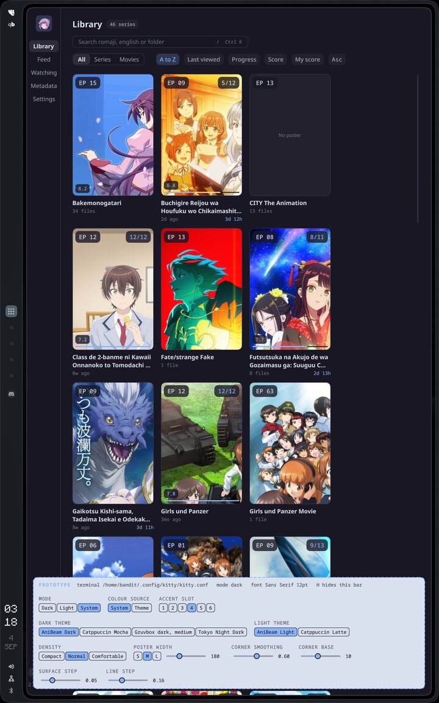
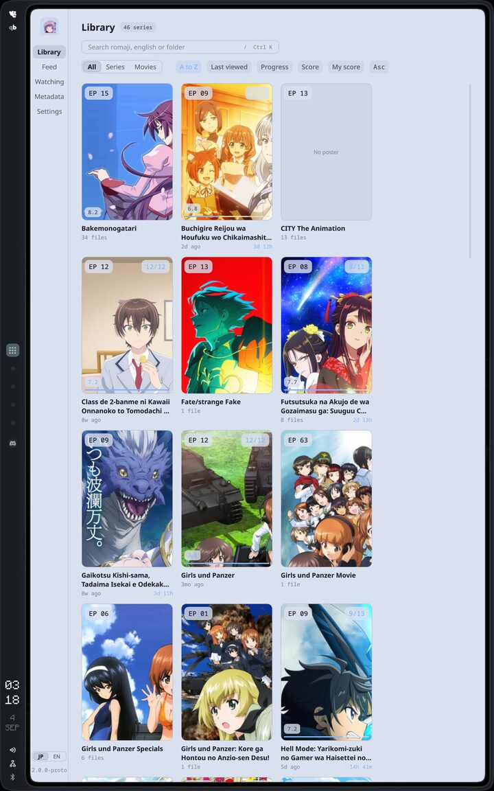
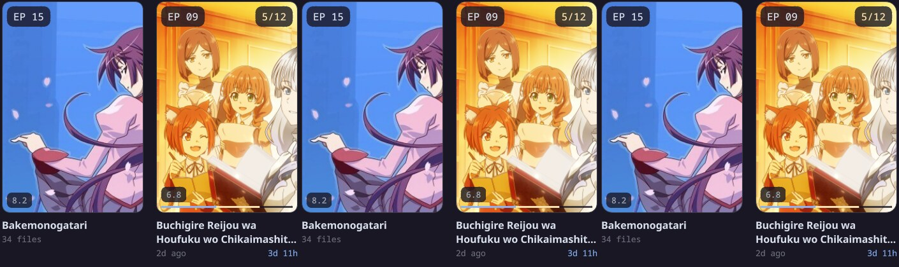
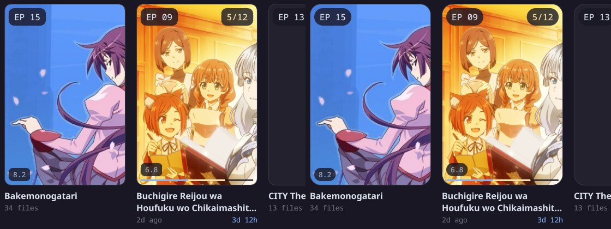
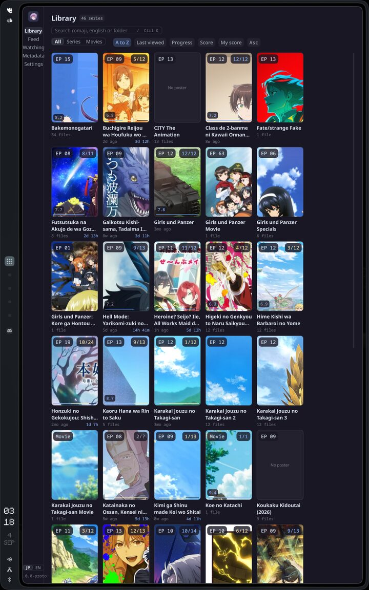
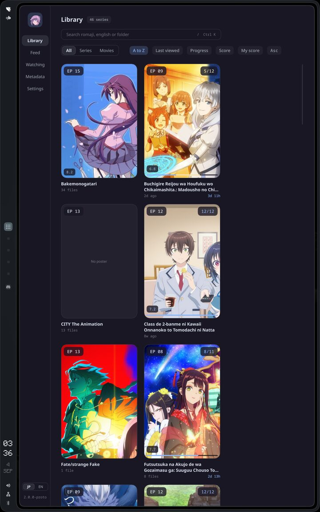
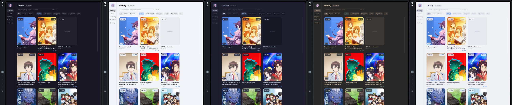
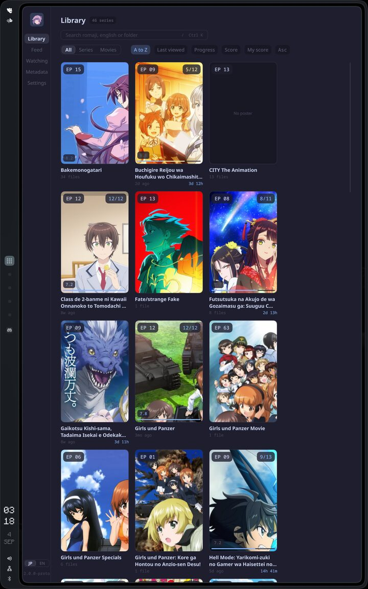
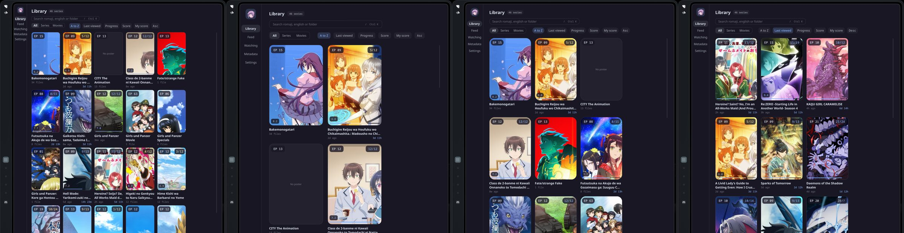
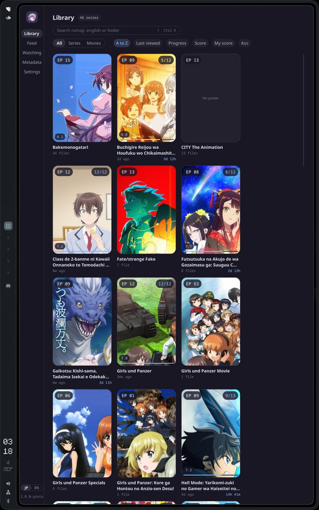

# AniBeam native line: the core and the shells

Date: 2026-09-04. Branch: `docs/native-line-spec`, merged to main together with the research and spike write-ups it cites. Map: [Native line: core and Linux shell spec](https://github.com/marcusbandit/AniBeam/issues/2). This document is that map's destination.

## How to read this document

AniBeam is leaving Electron. The native line is one Rust core that holds every rule, and one shell per platform that owns the window, the input and the video surface and nothing with a rule in it. This document closes every architecture decision for the core and the Linux shell, records what the phase 0 spikes proved, and ends with an appendix that is enough for someone else's Claude to build the macOS shell. Phases 1 to 4 read this document and the code, and nothing else.

Every decision here was made on a ticket of the map, in conversation with the owner, between 2026-09-03 and 2026-09-04. Each section opens by naming its ticket and lifts that ticket's resolution in full: the identifiers, the numbers, the rejected alternatives and the reasons. Where a later ticket edited an earlier decision, the section carries the edited text and says so. Where no ticket decided a rule and the Electron app has one, the section carries Electron's rule and marks it "carried from Electron" with the file it came from. Where neither has it, the section says "left open" and asks the question rather than guessing. The one item the map itself left open is the volume gain above 100, in section 1.6. Beyond it, several sections end with a short "Left open" list: questions no ticket reached, small enough for phase 1 to settle in code, listed so nobody mistakes silence for a decision.

The vocabulary is in `CONTEXT.md` at the root of the repository: core, shell, bridge, call, reply, event, job, session, tick, view, mark, resume point, completion, skip window, track choice, subtitle defaults, source, series, match, missing, forget, export, private data, import, token, terminal palette, colour source, theme, mode, accent, density, parity checklist, switch line, retire line, app id, install, frame, rail, status strip, activity log, unseen errors and inline confirm. This document uses those words and none of the synonyms the glossary avoids.

The research write-ups live under `docs/research/`, the spike write-ups with their pictures under `docs/spikes/`, the prototype's captures under `docs/prototypes/home-grid-qml/` and its code under `spikes/home-grid-qml/`. The spike code is under `spikes/` too. Appendix B lists every source.

## Contents

- [1. Route](#1-route)
  - [1.1 Destination and audience](#11-destination-and-audience)
  - [1.2 Repository, branches and versions](#12-repository-branches-and-versions)
  - [1.3 Choices handed to the agent](#13-choices-handed-to-the-agent)
  - [1.4 What the native line drops at the border](#14-what-the-native-line-drops-at-the-border)
  - [1.5 The phases](#15-the-phases)
  - [1.6 Left open](#16-left-open)
  - [1.7 Out of scope](#17-out-of-scope)
  - [1.8 Roads not taken](#18-roads-not-taken)
- [2. Phase 0: what the spikes proved](#2-phase-0-what-the-spikes-proved)
  - [2.1 libmpv renders inside a QML window on the NVIDIA desktop](#21-libmpv-renders-inside-a-qml-window-on-the-nvidia-desktop)
  - [2.2 libmpv renders inside a QML window on the AMD laptop](#22-libmpv-renders-inside-a-qml-window-on-the-amd-laptop)
  - [2.3 A Cargo-only cxx-qt app packages through a PKGBUILD](#23-a-cargo-only-cxx-qt-app-packages-through-a-pkgbuild)
  - [2.4 The bundled mpv.conf: quality options on both machines](#24-the-bundled-mpvconf-quality-options-on-both-machines)
  - [2.5 The export shipped in Electron and the freeze](#25-the-export-shipped-in-electron-and-the-freeze)
- [3. The core](#3-the-core)
  - [3.1 The contract: calls, replies, events and errors](#31-the-contract-calls-replies-events-and-errors)
  - [3.2 Storage: the schema, the image cache and the secrets](#32-storage-the-schema-the-image-cache-and-the-secrets)
  - [3.3 Scanning](#33-scanning)
  - [3.4 Matching](#34-matching)
  - [3.5 Trackers](#35-trackers)
  - [3.6 Franchise](#36-franchise)
  - [3.7 Feed, watching and subscriptions](#37-feed-watching-and-subscriptions)
  - [3.8 The playback rules](#38-the-playback-rules)
  - [3.9 Import and export](#39-import-and-export)
- [4. The shell](#4-the-shell)
  - [4.1 The parity checklist](#41-the-parity-checklist)
  - [4.2 The theme model](#42-the-theme-model)
  - [4.3 The look](#43-the-look)
  - [4.4 The player](#44-the-player)
  - [4.5 Frame and settings](#45-frame-and-settings)
- [5. The Linux shell](#5-the-linux-shell)
  - [5.1 The stack](#51-the-stack)
  - [5.2 The video surface](#52-the-video-surface)
  - [5.3 Packaging](#53-packaging)
  - [5.4 The bundled mpv.conf](#54-the-bundled-mpvconf)
  - [5.5 Left open](#55-left-open)
- [Appendix A. The macOS shell](#appendix-a-the-macos-shell)
  - [A.1 Who this is for and what is fixed](#a1-who-this-is-for-and-what-is-fixed)
  - [A.2 The core as a Swift package](#a2-the-core-as-a-swift-package)
  - [A.3 Calls and events from Swift](#a3-calls-and-events-from-swift)
  - [A.4 The video layer](#a4-the-video-layer)
  - [A.5 The frame and platform services](#a5-the-frame-and-platform-services)
  - [A.6 Building, signing and updating](#a6-building-signing-and-updating)
  - [A.7 Left open for the Mac](#a7-left-open-for-the-mac)
- [Appendix B. Sources](#appendix-b-sources)

## 1. Route

### 1.1 Destination and audience

This document is the one thing the effort that builds phases 1 to 4 reads besides the code. It closes every architecture decision for the core and the Linux shell, records the phase 0 spikes as facts, keeps its shell chapter platform-neutral, and carries a macOS appendix good enough for another person's Claude to build the macOS shell later. The map [Native line: core and Linux shell spec](https://github.com/marcusbandit/AniBeam/issues/2) charted it as twenty-two closed tickets. The vocabulary both halves share is `CONTEXT.md` at the repository root, and this document uses its terms.

Two readers. The agent that builds the core and the Linux shell reads all of it. Liam's Claude reads the shell chapter and the macOS appendix later.

The audience for the app was settled while charting, in conversation on 2026-09-03 with no ticket. The owner comes first, on two machines: the Arch desktop (banditbox, an RTX 3090 on the NVIDIA driver, Hyprland) and the Arch laptop (kangaeru, a Radeon 860M on Mesa, Hyprland). Liam, a friend with a Mac, comes later and builds that shell with his own Claude; the owner has no Mac and there is none in the fleet. Friends on Windows and on Debian or Arch come later still. Nothing in this document may block any of them, and nothing on this route serves them: the Qt shell compiles on those platforms, and that is as far as the spec goes.

### 1.2 Repository, branches and versions

Settled while charting on 2026-09-03: the same repository. Native code lands in `core/`, `apps/linux/` and `apps/macos/` beside the untouched Electron tree, through short branches merged into `main`. `main` stays green for both worlds until phase 3 deletes Electron in one commit. Electron is frozen: it got one more feature, the export (section 2.5), and from then on takes fixes only on the `electron` branch. Also settled then: the shell installs through a PKGBUILD, and the package ships the `.desktop` entry and the current icon; section 5.3 carries the rest.

Decided on [Freeze the Electron line: tag, branch, prune](https://github.com/marcusbandit/AniBeam/issues/12), 2026-09-04. `main`, the tag and the `electron` branch are all on origin.

- `v1.0.0` is an annotated tag at `1b0fb08` on `main`. That commit is the export commit `1b4c9d4` plus the stranded Watching tab spec (`docs/superpowers/specs/2026-05-28-watching-tab-design.md`, already implemented on `main`) committed as history as `0002f7a` and merged as `1b0fb08`, so the tag covers every Electron feature including the export. `package.json` already said 1.0.0 and is unchanged.
- `electron` is cut at `v1.0.0` and pushed. Fixes to the Electron app go there.
- `main` belongs to the native line from `f1dcb06` on. That commit is the charting branch `docs/wayfinder-charting`, merged after the owner read `CONTEXT.md`: it put `CONTEXT.md`, `docs/agents/issue-tracker.md`, `docs/agents/domain.md` and ten lines in `CLAUDE.md` pointing at them on `main`. The branch is deleted on both ends, and every session reads the vocabulary from `main`.
- The native line starts at 2.0.0. The `v2.0.0` tag is cut when the switch line goes green, and the commit it points at sets the workspace version to match. Until it exists an install's version reads from the nearest tag, which is `v1.0.0`; section 5.3 carries the `pkgver` rule.

What was pruned. Six local branches from the audit of 2026-09-03, each re-checked before deletion: `feat/mpv-player` (`69d0af3`), `feat/player-seek-preview-and-fs-dropdown` (`2afd9ec`), `feat/subtitle-failed-marker` (`c59f162`), `fix/franchise-crossover-overmerge` (`76ea785`), `fix/franchise-graph-view` (`8755e94`) and `fix/subtitle-prewarm` (`caad048`). Also `feat/export` (`1b4c9d4`, fully merged) and, with the owner's OK, the merged-by-ancestry `UI-changes`, `feat/bonus-content-section` and `fix/auto-metadata-match`. Deleted on origin: `feat/mpv-player`, `UI-changes`, `feat/franchise-live-crawl`, `feat/franchise-map`, `feat/transcode-cancel`, `feat/transcode-encoder-notice`, `fix/auto-metadata-match`, `fix/back-navigation-trail`, `fix/season-subfolder-split` and `docs/wayfinder-charting`. `prod` stays on both ends: a 30 May merge, fully on `main`, kept because `CLAUDE.md` treats the name as protected.

What remains unmerged on origin: the six `research/*` branches and the two `spike/*` branches. Their write-ups (`docs/research/*.md`, `docs/spikes/*.md`) reach `main` with this spec. Section 2.5 carries the rest of the freeze ticket: how the deletions were checked, the icon, and the leftover build output.

### 1.3 Choices handed to the agent

The owner handed these technical choices to the agent while charting on 2026-09-03. They are decisions, not questions, and the later tickets built on them without reopening one. Each is listed with the ticket that fixed its detail.

- Calls return fast and long work is a job that reports through events. Fixed as the four enums and the `Started { job }` reply on [The call and event contract between core and shells](https://github.com/marcusbandit/AniBeam/issues/15).
- tokio inside the core behind a synchronous facade. The same ticket; [Research: uniffi constraints on the core API and Swift event delivery](https://github.com/marcusbandit/AniBeam/issues/5) confirmed tokio stays inside behind spawn on the macOS side too.
- rusqlite with bundled SQLite. rusqlite 0.40 with `rusqlite_migration`, one connection-owning thread and IMMEDIATE transactions under WAL, from [Research: notify, rusqlite, keyring and the AniList client in Rust](https://github.com/marcusbandit/AniBeam/issues/6); the tables on [Schema and image cache: the contract's records become tables](https://github.com/marcusbandit/AniBeam/issues/21).
- notify with a debouncer replaces chokidar, and no polling. notify 8.2 with `notify-debouncer-full` on the same research ticket; the subtree walk stays because new directories can miss files on every backend.
- The Linux shell builds with Cargo alone through cxx-qt-build. Proved on the PKGBUILD spike, section 2.3.
- Tokens go to the keyring (gnome-keyring on the owner's desktop) with a file fallback. The fallback is a 0600 JSON file at `<data_dir>/secrets.json`, chosen when the Secret Service store fails to construct, with `secret_store` remembering the choice; fixed on the schema ticket.
- XDG paths. The directories are named `anibeam`, fixed on [PKGBUILD for the shell: package name, app id, source and pkgver](https://github.com/marcusbandit/AniBeam/issues/19).
- The Electron end point is tagged `v1.0.0` and its branch is named `electron`; the native line starts at 2.0.0. Done on the freeze ticket, section 1.2.

Two standing preferences shaped every ticket. Speed to the core: Electron is frozen, and every week spent on it is written twice. One spec document: the shell chapter is platform-neutral, and the macOS appendix is suggestions. Questions to the owner went in batches of at most four per round, which is why the resolutions read "decided with the owner in two rounds of four".

Two more decisions were settled while charting on 2026-09-03 and belong to later chapters; they are recorded here so the map's list is complete. The export is a checkbox: unticked it writes the sources and every series with its match; ticked it writes everything, tokens and API keys included, as plain JSON with no encryption, trusting the user. The Linux theme settings are mode (dark, light or system), density (charted as density or scale), poster size and corner style (G2 at a chosen amount, or plain rounding); the colour source is the terminal palette by default (the sixteen ANSI colours plus foreground and background, read from the terminal's config, the portal when no terminal config exists), with a toggle to a built-in theme from a list that ships Catppuccin Latte, Frappé, Macchiato and Mocha, Gruvbox, Tokyo Night and around ten popular others, importable and editable in config rather than in-app. macOS gets none of them. The export format ticket and the theme model ticket fixed the detail.

### 1.4 What the native line drops at the border

Everything the Electron app does comes along except the items below. Each group names where the decision was made.

Settled while charting, 2026-09-03, no ticket:

- The ambient cursor.
- Every transcode setting.
- Per-file subtitle style records. Subtitle settings map onto mpv's `sub-*` options as one global set, the subtitle defaults.
- The grid FLIP animation.
- The franchise graph ships simplified: rendered once from a layout the core computes, pan and zoom only, nothing interactive, no filters. Do not over-invest; the systems behind it will change.

Dropped beyond the border on [Parity checklist: what the Linux shell must do before the launcher switches](https://github.com/marcusbandit/AniBeam/issues/13), 2026-09-04, as dead or superseded in Electron:

- The Metadata sources priority toggles and the Auto-scan on launch toggle, never wired.
- The ASS Style tab, whose apply effect begins with `return`.
- The graph debug panel and Ctrl+Alt+G.
- Native alert and confirm dialogs as the feedback channel. The inline confirm replaces them.
- Clear metadata and Clear all in Storage.
- The episode-row subtitle warning, since libass renders bitmap subtitles.
- Everything on the graph beyond click, pan and zoom: hover highlight, the node menu, the Relations and Formats filters, the Chrono and Release toggle, Inline source, graph fullscreen, Fit and Center.
- Leftovers in the config directory with no code behind them, ignored: `mpv-input.conf`, `ui_scale`, `library_roots`, `lastScanned`.

Struck on [Player behaviours under libmpv: config, subtitles, tracks, skips](https://github.com/marcusbandit/AniBeam/issues/16), 2026-09-04: Open with mpv. One application, one window. Nothing in the native line opens a second window and no mpv process is launched. `OpenExternal`, `ExternalPlaybackEnded` and the ExternalPlayback job left the contract, the "no mpv binary" case left `Unsupported`, the parity checklist's unit 5 and the Open with mpv entry on the episode row's context menu are struck, and the mpv socket service and its verify script die with Electron. The same ticket dropped Electron's 2.5x volume gain stage (section 1.6).

Struck on [The call and event contract between core and shells](https://github.com/marcusbandit/AniBeam/issues/15), 2026-09-04: episode thumbnails. The old main process rendered one per file with ffmpeg at five call sites and no page ever displayed them, so the native line renders none, in the core or in the shell. This corrected the libmpv spikes' consequence that thumbnails would be a core job running a child mpv; sections 2.1 and 2.2 keep the measurements as facts and nothing is built on them.

Out on [Schema and image cache: the contract's records become tables](https://github.com/marcusbandit/AniBeam/issues/21), 2026-09-04: TMDB. The owner has no key and wants none. No key, no search, no fetch, no Film & TV switch in the match modal. A TMDB match carried in from an export keeps `provider`, `tmdb_id` and `tmdb_kind` on its series row as a confirmed match with nothing behind it: the source chip says TMDB, the title is the folder name, there is no poster, auto-match leaves it alone, and Clear match makes it unmatched. The import ignores `keys.tmdb` and counts it under `fields_ignored`.

Gone with the pipeline, from the proposal of 2026-09-03 (https://claude.ai/code/artifact/2ef1a582-b212-4ae1-a762-c70b35d089f7). The contract ticket confirmed it by ending every transcode, probe, encoder and subtitle-extract call, 26 channels and 3 push events, at the border:

- The transcode cache and queue with its stop and opt-out bookkeeping.
- The ffprobe playability gate, the chapter probe and the subtitle extract cache.
- JASSUB and every libass workaround in `VideoPlayer.tsx`, and the subtitle debug log with them.
- The frame-step hacks and the headless Chromium test.
- Electron, Forge, Vite, the castlabs build, the extract-zip shim and a 300 MB baseline.

### 1.5 The phases

The proposal set five phases; the tickets since changed their exits.

- Phase 0, done. The proposal asked for two spikes on the NVIDIA desktop: a QML window with an MpvItem playing 10-bit HEVC with ASS subtitles under Hyprland, and one Rust QObject through cxx-qt with a property bound in QML, both running from a packaged binary. If mpv failed, stop and rethink playback before the core exists. It grew to five spike tickets, the AMD laptop and the bundled `mpv.conf` on both machines included. mpv did not fail. Chapter 2 records the results.
- Phase 1, the core. Module by module with tests: `shared/` first since it is already pure, then library, metadata, trackers, franchise, playback, store. The verify scripts become cargo tests. The proposal's one-time importer that read today's JSON into SQLite is superseded: [Export format: the last Electron feature and the core's import](https://github.com/marcusbandit/AniBeam/issues/11), 2026-09-04, made it the import of an `anibeam-export` file, the one format every core version reads from then on. Exit: a CLI scans the real library and lists it identically to the Electron app. The contract ticket ships that CLI as `anibeam-cli` in the package.
- Phase 2, the Linux shell. Home, series detail, player, feed, watching, subscriptions, metadata and settings, in that order, with the look redesigned on [Prototype: the home grid in QML with the theme knobs live](https://github.com/marcusbandit/AniBeam/issues/17) rather than ported from `App.css`. Exit: the parity checklist's switch line, units 1 to 4, 6 and 7, green on the real library on both machines. Then the launcher entry points at the native binary, Electron stays installed under its own entry renamed AniBeam (Electron), and `v2.0.0` is cut.
- Phase 3, retire Electron. Gates on the retire line, units 8 to 11. Delete `src/main`, `src/renderer`, the transcode cache, the probe queue and JASSUB in one commit; the old app stays on the tag. On each machine the retire, once the import has carried the library and history across, deletes everything in the three XDG directories that is not the native line's own set, then the Electron entry, its icon and the focus-or-launch wrapper. Exit: no Electron in the repository, no `transcode-cache` directory on disk.
- Phase 4, the macOS shell, Liam's. uniffi generates the Swift package from the same crate; SwiftUI over it, MPVKit for the video layer, Sparkle for updates. Exit: the same parity checklist on a Mac. Out of scope for this map; the appendix feeds it.

### 1.6 Left open

- A volume gain above 100. The player ticket fixed volume at 0 to 100 with `volume-max=100`, dropped Electron's 2.5x gain stage, and rejected a gain above 100 for now. The owner wants to hear the native player on both machines before deciding on a boost; mpv's `volume-max` makes it one setting. Nothing on the map could settle it before the player exists, so the spec records it as open.
- The owner's polish list against the prototype's QML (primitives, wording, padding). Per [Frame and settings: single instance, the drawer's home, the settings page layout](https://github.com/marcusbandit/AniBeam/issues/22), 2026-09-04, they will file it as its own issue outside this map once the build stops moving. Nothing on it changes a decision. The QML itself carries into the Linux shell; the Rust glue around it (the Electron JSON loader, the busctl palette read, the string bridge, the fake data, the knob bar) is replaced by the core and the bridge.
- Smaller questions no ticket reached. Several sections end with a "Left open" list: the contract in 3.1, scanning and matching in 3.3 and 3.4, trackers, the franchise and the feed in 3.5 to 3.7, the playback rules and import in 3.8 and 3.9, the look in 4.3, the player in 4.4, the frame in 4.5, the Linux shell in 5.5 and the Mac in A.7. Each is a question for phase 1 to settle in code, listed so nobody mistakes silence for a decision. None of them changes a decision on the map.

### 1.7 Out of scope

From the map, with the reasons:

- Building the macOS shell. Liam's later effort, fed by the spec's appendix.
- A Windows shell and non-Arch packaging (AUR, Flatpak, AppImage). The Qt shell compiles there; the spec must not preclude it.
- A first-run experience for someone without an existing library.
- New branding. The current icon stays until the owner finds something better.
- Franchise graph interaction beyond click, pan and zoom. The owner wants far more later; that is a fresh effort with its own issue once this map is done, not a ticket here.
- Decrypting Electron safeStorage secrets. The export replaces that.
- TMDB matching for the non-anime part of a library. The owner has no key and wants none, decided on the schema ticket on 2026-09-04; a TMDB match carried in from an export keeps its ids on the series row and nothing else. Returns only if users ask, as a fresh effort.
- Executing phases 1 to 4.
- A socket transport and a daemon, so the CLI can write while the app runs. The contract's enums are serde-ready for it; building it is a later effort.

### 1.8 Roads not taken

The proposal weighed three roads and the charting closed each.

- Keep the TypeScript and run it as a Bun daemon. It ships two runtimes on every platform, keeps JSON files as the database, and the playback rules still move client-side because mpv would live in the shell. Closed by the choices in section 1.3: one Rust core with tokio inside, rusqlite, and one contract whether the core is linked in-process or later wrapped as a daemon.
- GTK 4 and libadwaita, one Rust process. No bridge, but Adwaita fights any custom look, there is no GNOME on this desktop, and the owner already writes QML. Kept as the fallback if cxx-qt disappointed in phase 0. It did not: [Research: what cxx-qt can and cannot do today](https://github.com/marcusbandit/AniBeam/issues/3) built and ran the example against Qt 6.11.1, and the PKGBUILD spike (section 2.3) packaged a Cargo-only build.
- One Qt app on both platforms. Qt on macOS runs fine and never feels like a Mac. Taken as the interim Mac build only, for free since the QML shell compiles on macOS the day Linux ships; the real macOS shell is SwiftUI over uniffi, from [Research: building blocks for the macOS shell appendix](https://github.com/marcusbandit/AniBeam/issues/8).

The proposal also asked four questions, and they went this way. Which Mac: none in the fleet; Liam has one and will build that shell later with his own Claude. Does ffmpeg survive: no. Redesign the look in phase 2 or port it: redesign, done on the prototype ticket. Freeze Electron now or keep it alive until phase 3: freeze, done on the freeze ticket.

## 2. Phase 0: what the spikes proved

Five spike tickets, run on 2026-09-03 and 2026-09-04 on the owner's two machines. Chapter 1 gives the shape; this chapter is the record, every number as measured. The write-ups sit under `docs/spikes/` with their pictures beside them. The throwaway code is `spikes/libmpv-qml/` on branch `spike/libmpv-qml` and `spikes/cxx-qt-pkgbuild/` on branch `spike/cxx-qt-pkgbuild`.

### 2.1 libmpv renders inside a QML window on the NVIDIA desktop

Decided on [Spike: libmpv renders inside a QML window on the NVIDIA desktop](https://github.com/marcusbandit/AniBeam/issues/9), 2026-09-03. Write-up: `docs/spikes/libmpv-qml.md`. Pictures under `docs/spikes/libmpv-qml/`: `op-karaoke-nvdec.jpg` (the OP karaoke drawn by libass through nvdec), `fullscreen-with-preview.jpg` (fullscreen on DP-1 with the preview item in the corner) and `mpv-screenshot-sw-part-a.jpg` (a still written by `screenshot-to-file` under software decode).

The answer is yes. libmpv renders inside a Qt 6 QML window on this hardware with no environment variables and no driver flags. Hardware decoding engages through nvdec, the ASS track renders from its embedded fonts, chapters and frame stepping work, fullscreen toggles cleanly, and dropped frames stay at zero once the window is visible. The transcode pipeline goes away on Linux.

#### Setup

banditbox: Arch, Hyprland 0.56.1, RTX 3090 on nvidia-utils 610.43.03, qt6-base and qt6-declarative 6.11.1, mpv 0.41.0 (libmpv client API 2.5), mpvqt 1.2.0-1 installed from extra for this spike. The app is C++ and CMake, no Rust, so the GPU question stays separate from the build-system question: one `MpvItem` subclass of `MpvAbstractItem` marked `QML_ELEMENT`, `QQuickWindow::setGraphicsApi(OpenGL)` before the application object, a second `MpvItem` in the corner as a seek preview, and a scripted 68 second sequence that logs observed mpv properties as JSON lines instead of polling them. Each sequence holds a chapter seek, a pause with ten frame steps, a fullscreen toggle and four preview seeks, about 120 s of video.

Test file: Girls und Panzer 03 (ak-Submarines BD 1080p). HEVC Main 10 (yuv420p10), FLAC, one ASS subtitle track with 15 embedded fonts, chapters OP, Part A, Part B, ED and Preview, 23.976 fps.

The owner was in a fullscreen game on the 144 Hz main monitor for the whole session, so every run was moved to the portrait 60 Hz DP-1 monitor (1200 by 1920) right after mapping and measured there, tiled by Hyprland into a 1104 by 1876 slot.

#### Rendering

- Qt Wayland (wayland-egl) hands mpv an OpenGL ES 3.2 context by default. mpv compiles its shaders as `#version 320 es` and picks the rgba16f FBO format. Under XWayland (`QT_QPA_PLATFORM=xcb`) it is a desktop OpenGL 4.6 compatibility context. Both work.
- MpvQt sets `vo=libmpv`. `gpu-context` and `gpu-api` come back empty because Qt owns the context; mpv never names it.
- Qt 6.11.1 picks the basic render loop on Wayland, so mpv's `render()` runs on the GUI thread. `EGL_KHR_fence_sync` is present on the NVIDIA Wayland display, so this is Qt policy, not a driver gap. `QSG_RENDER_LOOP=threaded` works: the threaded loop comes up, the animation driver reports a 6.95 ms vsync, and frame steps settle in half the time. Under xcb Qt picks the threaded loop by itself.
- Thirty blocking `getProperty` calls cost 0.3 to 0.5 ms in total during playback, measured on every run's final report. Blocking gets are cheap in practice; the research's warning only bites when the core is busy loading.

#### Hardware decoding

`hwdec=auto` lands on `hwdec-current=nvdec` with `video-params/hw-pixelformat=p010`, the decoder handing mpv `cuda[p010]` frames. The log shows mpv looking at `hevc-vulkan` first and skipping it, as [Research: MpvQt and the libmpv render API on Wayland](https://github.com/marcusbandit/AniBeam/issues/4) predicted for the render API. `hwdec-interop` reports `vaapi,cuda,drmprime`, the load-all behaviour of `vo=libmpv`. Software decode (`hwdec=no`) also plays 10-bit 1080p HEVC on this CPU without a dropped frame.

#### Frame pacing

`frame-drop-count` is the VO drop counter in mpv 0.41 (`vo-drop-frame-count` no longer exists; `decoder-frame-drop-count` is the decoder's). Observed through property observation, not polled:

| Run | Platform | Loop | hwdec | Drops after the first second, over about 120 s of video |
| --- | --- | --- | --- | --- |
| nvdec2 | wayland | basic | nvdec | 0 |
| nvdec-preview (preview item visible and seeking) | wayland | basic | nvdec | 0 |
| sw | wayland | basic | no | 0 |
| threaded | wayland | threaded | nvdec | 0 |
| xcb | XWayland | threaded | nvdec | 0 |

Every run counted one to three drops before 0.2 s of video: the window maps on the game's workspace behind a fullscreen window and only becomes visible once moved. The first, polled run counted five drops in its first twelve seconds while its preview item seeked during the OP; the observation-driven runs did not reproduce that and it stays unexplained.

`vsync-ratio`, `vsync-jitter`, `display-fps`, `estimated-display-fps` and `mistimed-frame-count` return nothing under `vo=libmpv`: the render API does not know the display. Timing is `video-sync=audio`. display-resample could not be judged here; section 2.4 later confirmed it inert. The 144 Hz VRR monitor was not measured on this spike.

#### Occlusion

Behind a fullscreen window on the same workspace, Hyprland stops sending frame callbacks. mpv logs "mpv_render_context_render() not being called or stuck" every 200 ms and drops about 14 of every 24 frames (141 drops over 9.6 s of video) while audio keeps playing. Under a special-workspace overlay (Discord fullscreen in `special:communication` on top of the window) the callbacks keep coming and nothing drops. A hidden regular workspace could not be tested here, because moving the window to a new workspace switched the monitor to it; the laptop spike covers that case. The spike handed the question of what the shell does when its surface stops being presented to the player ticket, which decided that playback continues and nothing pauses when hidden.

#### Fullscreen and tiling

`Window.visibility = Window.FullScreen` from QML gives Hyprland `fullscreen: 2`, the window at 0,0 sized 1200 by 1920 with the video re-letterboxed; setting it back returns the window to its tiled slot. No drops across either transition on any run. Tiled, the window is an ordinary xdg-toplevel, 1104 by 1876 in its slot, no floating rule needed.

#### Subtitles

The ASS track is selected by default (`sid=1`). libass 0.17.5 with the fontconfig provider resolves the two ASS styles, `(Prototype, 400, 0)` and `(Latienne Becker Med, 700, 0)`, to the embedded fonts by name with no fallback lines in the log, and the OP karaoke renders with them. The `sub-text` property returns the line on screen. Subtitle rendering and embedded fonts need nothing from the shell.

#### Chapters

`chapter-list` on `fileLoaded`: OP at 0, Part A at 89.965, Part B at 782.907, ED at 1354.937, Preview at 1444.902. Setting `chapter` to 1 seeks to 89.965 within 40 ms and the observed `chapter` property follows. The AniSkip fallback has what it needs.

#### Frame stepping

While paused, `frame-step` unpauses, presents exactly one frame (`time-pos` advances 41.7 ms, one frame at 23.976) and pauses again; the observed `pause` returns to true after 45 to 95 ms on the basic loop, 30 to 45 ms threaded, 20 to 45 ms under xcb. `frame-back-step` moves `time-pos` back exactly one frame in 70 to 180 ms with nvdec and 160 to 190 ms in software. Five steps forward and five back land on the starting timestamp to the millisecond (95.971). Works on nvdec surfaces. Frame stepping maps onto mpv's own commands.

#### Thumbnails and the seek preview

- Child process: `mpv --no-config --vo=image --vo-image-format=png --frames=1 --start=600 --hr-seek=yes --no-audio --no-sub --vf=scale=320:-2 FILE` writes one frame in 180 to 190 ms with `hwdec=no`, 375 to 390 ms with `nvdec-copy`, 690 to 735 ms with `hwdec=auto`. All under a second; software is fastest because CUDA setup dominates a single frame. The spike concluded that thumbnails would be a core job with a child mpv and `hwdec=no`. The contract ticket later struck episode thumbnails from the native line altogether (section 1.4), so the numbers stand as facts and nothing is built on them.
- Seek preview: a second `MpvAbstractItem` in the same window (Haruna's pattern: its own core, `pause`, `aid=no`, `sid=no`, `hr-seek=yes`) engages nvdec on its own and reaches `seeking=false` 22 to 83 ms after a `time-pos` set with nvdec, 84 to 256 ms in software, without costing the main player a frame, visible or not. The seek preview lives in the shell as a second item.
- Stills from the playback core: `screenshot-to-file` fails on nvdec frames ("Input image format cuda not supported by libswscale"; `vo=libmpv` falls back to the software screenshot path) and works with software decode at 0.9 to 1.7 s per 1080p PNG. Not a thumbnail route.

#### What did not work, exactly

- `screenshot-to-file` and `screenshot-raw` on hwdec frames.
- Presentation while occluded by a fullscreen window. A design point for the shell, not a blocker.
- The VO timing properties (`vsync-*`, `display-fps`, `mistimed-frame-count`) under the render API.
- Not measured: the 144 Hz VRR main monitor, a hidden regular workspace, `video-sync=display-resample`, and the AMD laptop, which was offline on the tailnet all session (last seen ten hours earlier), so its half became its own ticket.

#### What the spec takes from it

The Linux shell hosts an `MpvAbstractItem` subclass on the OpenGL RHI backend with `hwdec=auto` and the threaded render loop forced; the seek preview is a second item; subtitle rendering and embedded fonts need nothing from the shell; frame stepping maps onto mpv's own commands; ticks come from an observed `time-pos`, and the contract fixes the cadence at one call a second plus pause, seek and close.

#### Environment notes for reruns

- `pkill -f mpvspike` kills the shell that runs it because the pattern matches the shell's own command line; use `pkill -x mpvspike`.
- Hyprland 0.56 `hyprctl dispatch` takes Lua: `hl.dsp.window.move({ workspace = 6, silent = true, window = "class:mpvspike" })`, `hl.dsp.focus({ monitor = "DP-1" })`, `hl.dsp.workspace.toggle_special("communication")`. `silent` did not stop focus from following the window.
- Qt logs go to journald when stderr is not a terminal; `QT_FORCE_STDERR_LOGGING=1` with `QSG_INFO=1` prints the render loop and context to stderr.

### 2.2 libmpv renders inside a QML window on the AMD laptop

Decided on [Spike: libmpv renders inside a QML window on the AMD laptop](https://github.com/marcusbandit/AniBeam/issues/18), 2026-09-03. Write-up: `docs/spikes/libmpv-qml-laptop.md` (branch commit `f346c40`). Pictures under `docs/spikes/libmpv-qml/`: `op-karaoke-vaapi.jpg` (the OP karaoke through vaapi with syllable highlighting) and `fullscreen-with-preview-laptop.jpg` (fullscreen on the laptop panel with the preview item, both on vaapi).

The answer is yes. The same app plays the same file the same way on the Radeon 860M, and better in two places: Qt picks the threaded render loop by itself, so frame steps settle in half the desktop's default time, and the hidden-workspace case the desktop could not test was measured. The one place the laptop differs in kind is XWayland, where Qt's default GLX integration hides the EGL that vaapi's interop needs.

#### Setup

kangaeru: Arch, kernel 7.1.11-zen1, Hyprland 0.56.2 on the laptop's own 1920 by 1200 panel at 60 Hz (VRR off), Radeon 860M (Krackan) on Mesa 26.2.1 with libva 2.24.1, qt6-base, qt6-declarative and qt6-wayland 6.11.2, mpv 0.41.0-6, mpvqt 1.2.0-1. Run over SSH from the desktop with nobody at the laptop; the tailnet path was direct over the LAN. The window went up on the empty focused workspace and every run was measured there, tiled into a 1824 by 1156 slot at 74,22 (the owner's gaps). Same app, same file (sha256 starting `f9d5a1ed`), same 68 second script, driven through `spikes/libmpv-qml/run-laptop.sh` (no window moves, one monitor) and `occlude.sh` for the hidden-workspace test.

The one package installed for the spike was mpvqt. The VA driver is Mesa 26.2.1's own `radeonsi_drv_video.so`, part of the mesa package now; libva 2.24.1 was already there; `libva-utils` is absent and was not needed.

#### Rendering

- Qt Wayland (wayland-egl) on Mesa hands mpv a desktop OpenGL 4.6 compatibility context, where the NVIDIA desktop gave OpenGL ES 3.2. mpv compiles `#version 440` shaders and picks the rgba16f FBO format. Both contexts work; the shell must not assume either.
- Qt 6.11.2 picks the threaded render loop on Wayland on this box, where 6.11.1 on the NVIDIA desktop picks basic. The animation driver reports a 16.67 ms vsync. `QSG_RENDER_LOOP=basic` also works. The spec forces threaded on both machines rather than take the default, since the choice moves frame-step latency by 2 to 3 times: it is the difference between the desktop's 45 to 95 ms and the laptop's 26 to 43 ms, and forcing basic on the laptop lands it at 70 to 96 ms.
- Thirty blocking `getProperty` calls cost 0.7 to 1.4 ms during playback. Cheap, as on the desktop.
- The window maps about 420 ms after launch on every run.

#### Hardware decoding

`hwdec=auto` looks at `hevc-vulkan` and skips it, tries `hevc-nvdec` and fails to load `libcuda.so.1` (two lines on stderr, harmless), then engages `hevc-vaapi`: `hwdec-current=vaapi`, `video-params/pixelformat=vaapi`, `video-params/hw-pixelformat=p010`, `hwdec-interop=vaapi,drmprime`. The decoder hands mpv `vaapi[p010]` frames and the render API imports them without a copy.

`hwdec=vaapi-copy` also plays without a drop with `pixelformat=p010` in system memory, and software decode (`hwdec=no`, `yuv420p10`) holds zero drops on this CPU too.

Under XWayland (`QT_QPA_PLATFORM=xcb`) Qt's xcb plugin uses GLX by default. mpv's vaapi interop is EGL only (`dmabuf-interop-gl`), so `hwdec=auto` looks at `hevc-vaapi`, finds no interop, and settles on `vulkan-copy` (`hwdec-interop` comes back empty). Still zero drops, but a copy per frame. With `QT_XCB_GL_INTEGRATION=xcb_egl` the xcb run engages vaapi exactly like Wayland. The shell's X11 fallback sets it.

#### Frame pacing

`frame-drop-count` observed over each run's 68 seconds, about 123 s of video after the chapter seek:

| Run | Platform | GL | Loop | hwdec | Drops after the first frame |
| --- | --- | --- | --- | --- | --- |
| vaapi | wayland | EGL | threaded (default) | vaapi | 0 |
| vaapi-preview (preview item visible and seeking) | wayland | EGL | threaded | vaapi | 0 |
| sw | wayland | EGL | threaded | no | 0 |
| basic (`QSG_RENDER_LOOP=basic`) | wayland | EGL | basic | vaapi | 0 |
| vaapi-copy | wayland | EGL | threaded | vaapi-copy | 0 |
| xcb | XWayland | GLX (default) | threaded | vulkan-copy | 0 |
| xcb-egl (`QT_XCB_GL_INTEGRATION=xcb_egl`) | XWayland | EGL | threaded | vaapi | 0 |

Every run counts exactly one drop at time 0: the first decoded frame arrives before Qt's first render call, and mpv logs one "mpv_render_context_render() not being called or stuck" at 0.36 to 0.40 s. The chapter seek at 20 s resets the counter and it stays at 0 through the final report at 122.9 s, through the pause, ten frame steps, the fullscreen toggle and the preview seeks. `decoder-frame-drop-count` and `vo-delayed-frame-count` stay at 0 as well. The VO timing properties (`vsync-*`, `display-fps`, `mistimed-frame-count`) are empty under `vo=libmpv` here too.

#### Occlusion: a hidden workspace

The laptop has one monitor, so `occlude.sh` plays for 10 s, switches the focused workspace away with `hl.dsp.focus({ workspace = 2 })` for 12 s, and switches back. Hyprland stops the surface's frame callbacks on the switch. mpv drops every frame while hidden: the first drop lands on the first frame after the switch, 286 drops accumulate over 11.8 s of video at 23.976 fps, and mpv writes the "not being called or stuck" line 60 times, once per 200 ms. Audio keeps playing. Drops stop on the first frame after the workspace comes back and stay at zero. This is the full version of the desktop's fullscreen-occlusion finding, where 14 of 24 frames dropped. It was the input for the player ticket, which chose to accept the drops: playback continues while the window is not presented, audio plays on, frames that cannot be shown drop, and the rules keep counting.

#### Fullscreen and tiling

`Window.visibility = Window.FullScreen` gives Hyprland `fullscreen: 2`, the window at 0,0 sized 1920 by 1200 with the video re-letterboxed; setting it back returns the window to its 1824 by 1156 tiled slot. No drops on either transition on any run. Tiled, the window is an ordinary xdg-toplevel; no floating rule needed.

#### Subtitles

The ASS track is selected by default (`sid=1`). libass 0.17.5 with the fontconfig provider resolves Prototype, Garupan_Tanks, Latienne Becker Med and HalfLife2 to the embedded fonts by name, no fallback lines. The OP karaoke renders with syllable highlighting, and the typeset credits overlay lands on the Japanese credits. `sub-text` returns the line on screen ("Is she a friend of yours?" at the final report, the same as the desktop).

#### Chapters

`chapter-list` on `fileLoaded` is the same five entries. Setting `chapter` to 1 seeks to 89.965 within 10 ms of the command and the observed `chapter` follows.

#### Frame stepping

Time from the `frame-step` command to the observed `pause` returning true, and from `frame-back-step` to the observed paused `time-pos` moving back one frame:

| Run | Step forward | Step back |
| --- | --- | --- |
| vaapi, threaded | 26 to 43 ms | 51 to 106 ms |
| vaapi-preview | 33 to 43 ms | 100 to 251 ms |
| sw | 35 to 52 ms | 232 to 271 ms |
| basic loop | 70 to 96 ms | 119 to 145 ms |
| vaapi-copy | 13 to 37 ms | 137 to 191 ms |
| xcb, vulkan-copy | 37 to 42 ms | 133 to 254 ms |
| xcb-egl, vaapi | 17 to 46 ms | 80 to 251 ms |

Every step moves `time-pos` by exactly 41.7 ms, and five forward plus five back land on the starting timestamp to the millisecond on every run. One step under GLX reported the new `time-pos` without the pause round trip; it did not recur in the other 34 steps.

#### Thumbnails and the seek preview

- Child process, the desktop's command: 329 to 334 ms with `hwdec=no`, 349 to 364 ms with `vaapi-copy`, 327 to 340 ms with `hwdec=auto` (which picks vulkan-copy, since `vo=image` has no interop), 313 to 328 ms with a bare `hwdec=vaapi` (which falls back to software for the same reason). The decoder makes no difference to a single frame; this CPU takes about 330 ms where the desktop's took 185. The spike kept `hwdec=no` as the rule for the thumbnail job; the job itself was struck later (section 1.4).
- Seek preview, the second `MpvAbstractItem`: reaches `seeking=false` 37 to 88 ms after a `time-pos` set on vaapi (visible or hidden, Wayland or xcb-egl), 46 to 166 ms on the basic loop, 85 to 292 ms with vaapi-copy, 79 to 171 ms with vulkan-copy, 126 to 426 ms in software. Never costs the main player a frame.
- Stills from the playback core: `screenshot-to-file` fails on zero-copy vaapi frames ("Input image format vaapi not supported by libswscale", all five shots in every zero-copy run) and works on software, vaapi-copy and vulkan-copy frames at 1.5 to 2.9 s per 1080p PNG. The same shape as nvdec on the desktop; not a thumbnail route.

#### What did not work, exactly

- vaapi under XWayland with Qt's default GLX integration. `QT_XCB_GL_INTEGRATION=xcb_egl` fixes it.
- Presentation on a hidden workspace: every frame drops. A design point for the player ticket, not a blocker.
- `screenshot-to-file` on zero-copy vaapi frames.
- Not covered: an external monitor, battery against mains, `video-sync=display-resample`; the VRR-off panel is the only display measured.

#### Environment notes for reruns

- Launching a window from an SSH session needs `WAYLAND_DISPLAY=wayland-1`, `XDG_RUNTIME_DIR=/run/user/1000` and `HYPRLAND_INSTANCE_SIGNATURE` from `ls /run/user/1000/hypr`; `DISPLAY=:1` for the xcb runs. `run-laptop.sh` sets all of them. The desktop's `run.sh` hardcodes the desktop's paths, monitors and workspaces; on the laptop drive `mpvspike` directly with `--script --out=DIR --hwdec=auto` and read the `SPIKE` lines from stdout plus `mpv-player.log`.
- Hyprland 0.56 switches workspaces with `hl.dsp.focus({ workspace = 2 })`. There is no `hl.dsp.workspace.goto` (`goto` is a Lua keyword, so the parser rejects it before looking), and the legacy `hyprctl dispatch workspace 2` form is refused.
- An SSH session has no locale set; Qt warns and switches to C.UTF-8. Harmless.
- `pkill -x mpvspike`, never `-f`.
- The spike source and the desktop write-up were exported to `~/spike-libmpv/` on the laptop, the binary at `~/spike-libmpv/build/mpvspike`, the test file at `~/spike-libmpv/media/gup03.mkv`. Raw run output (JSON lines, mpv logs, grim shots) stays under `~/spike-libmpv/runs/` on the laptop.

### 2.3 A Cargo-only cxx-qt app packages through a PKGBUILD

Decided on [Spike: a Cargo-only cxx-qt app packages through a PKGBUILD](https://github.com/marcusbandit/AniBeam/issues/10), findings on 2026-09-03 and the install confirmed on 2026-09-04. Write-up: `docs/spikes/cxx-qt-pkgbuild.md`. Pictures under `docs/spikes/cxx-qt-pkgbuild/`: `cargo-run.jpg` (the plain binary) and `launcher-run.jpg` (started from the desktop entry), both on the portrait DP-1 monitor; the icon at the top left is the qrc resource, the black strip is the mpv item's framebuffer. Code: `spikes/cxx-qt-pkgbuild/` on `spike/cxx-qt-pkgbuild`.

The answer is yes. A Cargo-only cxx-qt build produces an installable Arch package with QML bound to a Rust QObject and a C++ `MpvAbstractItem` subclass linked into the same binary. `cargo build --release` links it, `makepkg` turns it into `anibeam-spike-0.1.0-1-x86_64.pkg.tar.zst`, `pacman -U` installed it on 2026-09-04, and the launcher entry under `/usr/share/applications` started `/usr/bin/anibeam-spike` with the same ticks and mpv version in the journal as the direct run and no portal app-id complaint. Nothing needed CMake.

#### Setup

banditbox on 2026-09-03: Arch, Hyprland 0.56.1, RTX 3090 on nvidia-utils 610.43.03, Rust 1.92.0 stable through rustup 1.29.0 (pacman sees the rustup package as providing rust and cargo), GCC 16.1.1, lld 22.1.8, pacman 7.1.0 with its makepkg, qt6-base 6.11.1-1, qt6-declarative 6.11.1-3, mpvqt 1.2.0-1, mpv 0.41.0-3. cxx-qt, cxx-qt-lib and cxx-qt-build pinned with `=0.10.0`; locked with them qt-build-utils 0.10.0, cxx 1.0.199, cc 1.4.4, tokio 1.53.1.

#### The crate

```text
spikes/cxx-qt-pkgbuild/
  Cargo.toml              cxx-qt, cxx-qt-lib and cxx-qt-build pinned with "=0.10.0"; tokio rt-multi-thread + time
  build.rs                the whole build, below
  src/main.rs             the tokio runtime in a OnceLock, QGuiApplication, QQmlApplicationEngine
  src/spike.rs            the bridge: the Spike singleton and the two C++ helper declarations
  cpp/spikevideo.h/.cpp   SpikeVideo : MpvAbstractItem, QML_ELEMENT, one property
  cpp/helpers.h/.cpp      QQuickWindow::setGraphicsApi(OpenGL) and QGuiApplication::setDesktopFileName
  qml/Main.qml            the window
  assets/icon.png         the current app icon, 512 px, compiled into the binary and installed for the entry
  anibeam-spike.desktop
  packaging/PKGBUILD
```

`build.rs`, complete:

```rust
use cxx_qt_build::{CxxQtBuilder, QmlModule};

fn main() {
    CxxQtBuilder::new_qml_module(
        QmlModule::new("dev.anibeam.spike")
            .version(1, 0)
            .qml_file("qml/Main.qml"),
    )
    .qt_module("Quick")
    .files(["src/spike.rs"])
    .include_dir("cpp")
    .include_dir("/usr/include/MpvQt")
    .cpp_files(["cpp/spikevideo.h", "cpp/spikevideo.cpp", "cpp/helpers.cpp"])
    .qrc_resources(["assets/icon.png"])
    .build();

    println!("cargo:rustc-link-lib=MpvQt");
    println!("cargo:rustc-link-lib=mpv");
}
```

What that one call does, read off the build output: finds Qt through `qmake6`, writes the qmldir and the qrc, runs moc on the generated bridge header and on `spikevideo.h`, rcc on the resources, qmlcachegen on `Main.qml`, qmltyperegistrar on the moc JSON, compiles the generated C++ plus the three listed files with `c++ -std=c++17 -O3` and the Qt include paths, and emits the link lines for Qt6Quick, Qt6OpenGL, Qt6Qml, Qt6Network, Qt6Gui and Qt6Core. The Rust link goes through `-fuse-ld=lld` because the system `ld` is GNU bfd.

Paths that follow from the module URI: `Main.qml` is `qrc:/qt/qml/dev/anibeam/spike/qml/Main.qml` and the icon is `qrc:/qt/qml/dev/anibeam/spike/assets/icon.png`. Every Rust file holding a bridge must sit in one directory per QML module (cxx-qt panics otherwise, citing QTBUG-93443), so the bridge lives in `src/spike.rs` alone and `src/main.rs` carries none. The URI `dev.anibeam.spike` was the spike's own; the packaging ticket ruled `dev.anibeam` out as not the owner's domain, and the shell's app id is `com.marcusrosado.AniBeam`.

#### The bridge and the signal path

The bridge declares `Spike` as `#[qobject] #[qml_element] #[qml_singleton]` with `#[qproperty(i32, counter)]` and `#[qproperty(QString, status)]`, a `#[qsignal] tick(n: i32, worker_thread: QString)`, a `#[qinvokable] start_job(steps: i32)`, and `impl cxx_qt::Threading for Spike {}`. `#[auto_cxx_name]` on the block gives QML `startJob` for `start_job`. The QML engine constructs and owns the singleton, so the bridge reaches the tokio runtime through a `OnceLock` in `main.rs` rather than a constructor argument.

The invokable returns at once. It sets `status` on the calling thread, clones `self.qt_thread()` and spawns on the runtime. The spawned future sleeps 300 ms per step and posts each step with `qt.queue(move |mut spike: Pin<&mut Spike>| { spike.as_mut().set_counter(n); spike.as_mut().tick(n, worker); })`. The closure runs on the Qt thread, the only place the Rust struct is touched. A `queue` that returns `Err` means the QObject is gone, and the future returns.

Observed in the QML handler, which logs `Spike.counter` and the worker's thread id on every tick:

```text
SPIKE status job of 5 started on ThreadId(1)
SPIKE tick 1 counter 1 worker ThreadId(3)
SPIKE tick 2 counter 2 worker ThreadId(3)
...
SPIKE tick 5 counter 5 worker ThreadId(3)
SPIKE status job of 5 finished
```

Thread 1 is the main thread that owns `QGuiApplication`; thread 3 (thread 2 on the launcher run) is a tokio worker named `anibeam-core`. The property already held the new value when the signal handler ran, and the five ticks arrived in order.

Two things needed a C++ line each because cxx-qt-lib does not wrap them: `QQuickWindow::setGraphicsApi(QSGRendererInterface::OpenGL)` before the application exists (the mpv item is a `QQuickFramebufferObject` and wants the OpenGL scene graph), and `QGuiApplication::setDesktopFileName`. Both are free functions in `helpers.cpp`, declared to Rust inside the same `#[cxx_qt::bridge]` in an `unsafe extern "C++"` block with `include!("helpers.h")`.

#### The C++ item

`SpikeVideo` subclasses `MpvAbstractItem`, carries `Q_OBJECT` and `QML_ELEMENT`, and exposes one `mpvVersion` property filled from `getProperty("mpv-version")` when the item's `ready` signal fires. It goes through `cpp_files` like any other C++ source. The header gets moc with the module URI attached, and the generated `dev_anibeam_spike_qmltyperegistration.cpp` registers it beside the Rust type:

```cpp
qmlRegisterTypesAndRevisions<Spike>("dev.anibeam.spike", 1);
qmlRegisterTypesAndRevisions<SpikeVideo>("dev.anibeam.spike", 1);
```

`Main.qml` instantiates it as a 96 px strip. The item constructs an mpv handle on its own thread and reports `mpv v0.41.0` about half a second after the window maps. Nothing is loaded into it; rendering was the libmpv spike's job.

#### What CMake was hiding

The first build failed inside MpvQt's own headers: `mpvqt_export.h` has `#include <mpvqt_version.h>` with no directory, which the CMake target satisfied through its interface include path. mpvqt ships CMake config files and no `.pc` file, so `build.rs` names `/usr/include/MpvQt` as an include directory and links `MpvQt` and `mpv` by hand (mpv itself ships `mpv.pc`; it was not needed). That is the whole list of things CMake did for the libmpv spike that Cargo does not do here.

#### The PKGBUILD

```bash
depends=(qt6-base qt6-declarative mpvqt mpv gcc-libs glibc hicolor-icon-theme)
makedepends=(rust lld)
options=(!lto)
```

`prepare()` copies the crate into `$srcdir` and runs `cargo fetch --locked` for the host target; `build()` exports `RUSTUP_TOOLCHAIN=stable` and `CARGO_TARGET_DIR=target` and runs `cargo build --frozen --release`; `package()` installs the binary to `/usr/bin`, the entry to `/usr/share/applications` and the icon to `/usr/share/icons/hicolor/512x512/apps`. The spike builds the checkout one directory up because it has no tag. The write-up expected the shell's PKGBUILD to fetch a tagged tarball; the packaging ticket decided otherwise, and the shell's PKGBUILD builds the enclosing checkout with `pkgver` from `git describe` (section 5.3).

The PKGBUILD lives in `packaging/` rather than beside `Cargo.toml` because makepkg creates `src/` and `pkg/` next to the PKGBUILD, and `src/` is the crate's source directory.

`options=(!lto)` is mandatory. makepkg's default `OPTIONS` include `lto`, which appends `LTOFLAGS="-flto=auto"` to `CXXFLAGS`. That reaches g++ through cc-rs, g++ writes GIMPLE bytecode objects into the static archive cxx-qt-build produces, rust-lld cannot read them, and the link fails with 19 undefined symbols of the form `cxxbridge1$199$use_opengl_scene_graph`, `rust$cxxqtlib1$cxxbridge1$199$qguiapplication_new` and `cxxbridge1$unique_ptr$QQmlApplicationEngine$load`. `options=(!lto)` was the only change between the failing run and the passing one. Rust's own LTO stays a Cargo profile matter.

makepkg's `CFLAGS` and `CXXFLAGS` reach the C++ half through cc-rs, so the generated bridge and the item compile with `-march=x86-64 -O2 -fstack-clash-protection -fcf-protection -D_FORTIFY_SOURCE=3 -D_GLIBCXX_ASSERTIONS` and the rest of the distribution set. cargo ignores `LDFLAGS`.

Corrected on [PKGBUILD for the shell: package name, app id, source and pkgver](https://github.com/marcusbandit/AniBeam/issues/19), 2026-09-04: the write-up's line "nothing from makepkg reaches rustc" is wrong. `/etc/makepkg.conf.d/rust.conf` sets `RUSTFLAGS="-C force-frame-pointers=yes"` always and appends `DEBUG_RUSTFLAGS="-C debuginfo=2"` under the `debug` option. So the release build carries full debuginfo, makepkg strips it into a `-debug` package, and `makepkg -i` installs both. That is why the packaging ticket keeps the debug package: Rust's backtrace code and coredumpctl look symbols up by build id under `/usr/lib/debug`, so a panic or a segfault at the Qt, mpv and Rust seams comes back with file and line during phases 1 to 4.

makepkg's packaging checks reported nothing. It produced an `anibeam-spike-debug` package from the stripped symbols, as the default `debug` option does.

#### Numbers

| Measure | Value |
| --- | --- |
| Clean `cargo build --release --frozen`, 12 threads | 87 s wall |
| Clean `makepkg -f` (prepare, build, strip, debug package, zstd) | 104 s wall |
| Incremental rebuild after a QML or Rust edit | under 4 s |
| Binary, cargo release, unstripped | 2,760,416 bytes |
| Binary as installed by the package, stripped | 1,952,952 bytes |
| Package file | 884,000 bytes |
| Installed size reported by pacman | 2,242 KiB |
| Window mapped after exec, both runs | 816 ms |

Shared libraries the binary asks for beyond libc: Qt6Quick, Qt6Gui, Qt6Qml, Qt6Core, Qt6QmlMeta, Qt6QmlModels, Qt6QmlWorkerScript, Qt6Network, Qt6OpenGL, Qt6DBus, MpvQt (soname 3), mpv (soname 2), stdc++ and zstd. Every one is owned by a package in `depends`.

#### Desktop entry and the launcher run

`anibeam-spike.desktop` has `Exec=anibeam-spike`, `Icon=anibeam-spike`, `Categories=AudioVideo;Video;` and `StartupWMClass=anibeam-spike`; `desktop-file-validate` passes it. The binary calls `setDesktopFileName("anibeam-spike")`, so the Wayland app id is `anibeam-spike` and Hyprland reports the window's class as such, which pairs the window with the entry's icon in a panel.

Without an entry installed, Qt logs `qt.qpa.services: Failed to register with host portal ... Could not register app ID: App info not found for 'anibeam-spike'` at startup. With the entry under `~/.local/share/applications` and the icon under `~/.local/share/icons/hicolor/512x512/apps`, `gtk-launch anibeam-spike` started the app, the line was gone from the journal, and the window behaved as in the direct run. That user-level copy was removed afterwards so it could not shadow the package's entry. The `pacman -U` install then put three files on the box, the binary, the entry and the icon, and `gtk-launch` against the entry under `/usr/share/applications` started `/usr/bin/anibeam-spike` the same way, with the same five ticks and the mpv version in the journal; the write-up puts that run's window at 818 ms after exec, beside the 816 ms of the two earlier runs in the numbers table. The spike package has since come off the box with `sudo pacman -Rns anibeam-spike`.

#### Noise worth knowing about

- GCC 16 prints a `-Wsfinae-incomplete` warning about `QChar` for every C++ file that includes `QString`. Harmless, from Qt's headers; `-Wno-sfinae-incomplete` through `cc_builder` would silence it.
- Qt 6.11 deprecates reading a property inside its own change handler without qualification (`onTextChanged: console.log(text)` warns about injected parameters). Qualify with the item's id.
- The scene graph runs the basic render loop by default on this NVIDIA box and gets an OpenGL ES 3.2 context, the same as the libmpv spike observed; the shell forces the threaded loop.

#### What the spec takes from it

cxx-qt 0.10.0 pinned exactly, one `build.rs` and no CMake; a C++ `QML_ELEMENT` header through `cpp_files` registers beside the Rust singleton; a tokio worker's `CxxQtThread::queue` delivers property and signal in order on the Qt thread; MpvQt's include directory and two link lines named by hand; `depends`, `makedepends` and `options=(!lto)` as above, with `git` joining `makedepends` on the packaging ticket and `qt6-svg` joining `depends` on the frame and settings ticket.

#### Environment notes for reruns

```text
cd spikes/cxx-qt-pkgbuild
cargo build --release                   # needs qmake6 on PATH, lld installed
QT_FORCE_STDERR_LOGGING=1 target/release/anibeam-spike
cd packaging && makepkg -f              # writes anibeam-spike-0.1.0-1-x86_64.pkg.tar.zst
sudo pacman -U anibeam-spike-0.1.0-1-x86_64.pkg.tar.zst
gtk-launch anibeam-spike                # or pick "AniBeam cxx-qt spike" in the launcher
sudo pacman -Rns anibeam-spike          # when done
```

The window maps on the focused monitor; the runs here moved it to DP-1 workspace 6 with `hyprctl dispatch 'hl.dsp.window.move({ workspace = 6, silent = true, window = "class:anibeam-spike" })'` and shot it with `grim -o DP-1`.

### 2.4 The bundled mpv.conf: quality options on both machines

Decided on [Bundled mpv.conf: the quality options on the AMD laptop](https://github.com/marcusbandit/AniBeam/issues/23) and [Bundled mpv.conf: the same quality options on the NVIDIA desktop](https://github.com/marcusbandit/AniBeam/issues/25), both 2026-09-04. Write-ups: `docs/spikes/mpv-quality-options-laptop.md` (branch commit `032ddfd`) and `docs/spikes/mpv-quality-options-desktop.md` (`470bdf2`). Pictures under `docs/spikes/mpv-quality-options/`: `base-frame.jpg` and `base-frame-desktop.jpg` (the frames the differences are taken from); `diff-fhd-deband.jpg`, `diff-fhd-deband-desktop.jpg`, `diff-uhd-scale.jpg`, `diff-fhd-scale-desktop.jpg`, `diff-uhd-dscale.jpg` and `diff-uhd-dscale-desktop.jpg` (each difference amplified 64 times); and `pixels-fhd-lanczos-vs-ewa.jpg` (a 480 by 270 patch of the desktop's 1.33x upscale, lanczos left and ewa_lanczossharp right, doubled with nearest neighbour).

The player ticket fixed `hwdec=auto` and the layering; the lines themselves waited on a test of the candidate quality options on both GPUs: `profile=high-quality` and its parts (`scale`, `cscale`, `dscale`, `dither-depth`, `deband` with its defaults), and `interpolation` with `video-sync=display-resample`, with `gpu-api` left alone. The rule was to keep what drops nothing and costs nothing visible.

The answer: nothing on the candidate list earns a line on either machine. `/usr/share/anibeam/mpv.conf` holds `hwdec=auto` and nothing else.

```conf
# AniBeam's base mpv configuration. The user's own mpv.conf loads after this one when
# "Use my mpv.conf" is on, and ~/.config/anibeam/mpv.conf loads last. The shell re-sets
# what it owns after every load. Scripts never load.

# nvdec on NVIDIA, vaapi on AMD, zero copy on both (#9, #18).
hwdec=auto
```

mpv 0.41's defaults are already what the candidate list was reaching for: `scale=lanczos`, `dscale=hermite`, `dither-depth=auto`, `correct-downscaling=yes`, `linear-downscaling=yes` and `sigmoid-upscaling=yes` are all on out of the box, and the subtitle defaults are mpv's stock values by the player ticket. `gpu-api` was left alone as asked; the render API owns it and reports it empty. A user who wants a sharper kernel puts it in their own `mpv.conf` behind the Use my mpv.conf toggle.

#### The laptop matrix

Twenty three runs on kangaeru: Radeon 860M on Mesa 26.2.1 with libva 2.24.1, mpv 0.41.0, mpvqt 1.2.0, qt6-base and qt6-declarative 6.11.2, libplacebo 7.360.1, kernel 7.1.11-zen1, Hyprland 0.56 on the 1920 by 1200 panel at 60 Hz, `QSG_RENDER_LOOP=threaded` on every run, on mains the whole time (battery 27 to 72 percent), nobody at the machine, the window on an empty focused workspace. The spike harness at `spikes/libmpv-qml` was extended with `--set key=value`, `--play SECONDS`, `--start`, `--stills` and `--fullscreen`. Each run plays 60 undisturbed seconds while a sampler reads `gpu_busy_percent`, `power1_average`, `freq1_input` and `temp1_input` four times a second, then pauses on three exact frames and grabs the panel with `grim`. The numbers are the mean over the playback window alone, and every config's stills diff against its block's baseline pixel for pixel. `base` runs first in every block and `base2` last with identical settings, so the tables carry their own noise floor: 0.5, 0.7 and 0.1 points of GPU busy, and under 0.4 W.

Three geometries, because the window size decides which scaler runs at all:

| Block | File | Video drawn at | Which scaler runs |
| --- | --- | --- | --- |
| fhd | `gup03.mkv`, 1920x1080 HEVC 10-bit | 1920x1080, fullscreen | none, it is 1:1; only chroma is scaled |
| uhd | `gup03-4k.mkv`, 3840x2160 HEVC 10-bit | 1920x1080, fullscreen | `dscale`, 0.5x |
| win | `gup03.mkv` | 1824x1026, tiled | `dscale`, 0.95x |

The library holds no 4K file, so `gup03-4k.mkv` is 160 seconds of the same episode upscaled to 3840x2160 and re-encoded HEVC 10-bit through `hevc_vaapi` at qp 20. It decodes zero-copy as `vaapi[p010]` like the source; its decode and downscale load is real, its detail is synthetic.

Every run: `frame-drop-count` 0, `decoder-frame-drop-count` 0, `vo-delayed-frame-count` 0, `estimated-vf-fps` 23.976.

GPU cost, mean over the 60 s playback window:

| Block | Config | Busy percent | Watts | MHz | Max temperature | Delta over base |
| --- | --- | --- | --- | --- | --- | --- |
| fhd, 1080p fullscreen 1:1 | base | 15.0 | 6.82 | 1207 | 47 | |
| | hq | 16.9 | 7.52 | 1258 | 52 | +1.9, +0.70 W |
| | scale-ewa | 15.9 | 7.18 | 1240 | 48 | +0.9, +0.36 W |
| | cscale-ewa | 15.3 | 7.22 | 1223 | 48 | +0.3, +0.40 W |
| | dscale-mit | 15.1 | 6.76 | 1210 | 47 | noise |
| | dither8 | 15.2 | 6.76 | 1215 | 48 | noise |
| | deband | 16.5 | 7.30 | 1257 | 48 | +1.5, +0.48 W |
| | interp | 15.2 | 6.77 | 1213 | 48 | noise |
| | base2 | 14.5 | 6.77 | 1201 | 47 | -0.5, the noise floor |
| uhd, 2160p fullscreen 0.5x | base | 25.0 | 9.92 | 1443 | 54 | |
| | hq | 29.7 | 11.95 | 1554 | 60 | +4.7, +2.03 W |
| | scale-ewa | 30.0 | 12.02 | 1567 | 60 | +5.0, +2.10 W |
| | cscale-ewa | 30.5 | 12.25 | 1577 | 61 | +5.5, +2.33 W |
| | dscale-mit | 24.6 | 10.23 | 1432 | 57 | noise |
| | dither8 | 24.4 | 10.03 | 1432 | 56 | noise |
| | deband | 33.0 | 12.46 | 1629 | 59 | +8.0, +2.54 W |
| | interp | 25.2 | 10.22 | 1454 | 56 | noise |
| | base2 | 25.7 | 10.24 | 1459 | 55 | +0.7, the noise floor |
| win, 1080p tiled 0.95x | base | 26.1 | 10.35 | 1429 | 56 | |
| | hq | 27.8 | 10.90 | 1471 | 59 | +1.7, +0.55 W |
| | scale-ewa | 27.5 | 10.93 | 1467 | 58 | +1.4, +0.58 W |
| | dscale-mit | 26.4 | 10.61 | 1436 | 58 | noise |
| | base2 | 26.0 | 10.59 | 1433 | 57 | -0.1, the noise floor |

Did the picture change. Every config's three stills against the same block's `base` stills, cropped to the video interior, as PSNR in dB, worst single-pixel delta and mean delta, both out of 255:

| Block | Config | PSNR dB | Worst pixel | Mean | Note |
| --- | --- | --- | --- | --- | --- |
| fhd | base2 | inf | 0 | 0 | bit for bit identical: the pipeline is deterministic |
| | hq | 54 | 1 to 2 | 0.15 | |
| | scale-ewa | 54 | 1 to 2 | 0.15 | byte for byte the same output as hq and cscale-ewa |
| | cscale-ewa | 54 | 1 to 2 | 0.15 | |
| | dscale-mit | inf | 0 | 0 | nothing downscales at 1:1 |
| | dither8 | inf | 0 | 0 | |
| | deband | 50 | 3 | 0.38 | |
| | interp | inf | 0 | 0 | |
| uhd | base2 | inf | 0 | 0 | |
| | hq | 55 | 1 | 0.13 | |
| | scale-ewa | 55 | 1 | 0.13 | again identical to hq and cscale-ewa |
| | cscale-ewa | 55 | 1 | 0.13 | |
| | dscale-mit | 62 | 1 to 3 | 0.04 | |
| | dither8 | inf | 0 | 0 | |
| | deband | 52 | 2 | 0.22 | |
| | interp | inf | 0 | 0 | |
| win | base2 | | | 0.04 to 0.07 | the noise floor |
| | hq | | | 0.18 to 0.19 | |
| | scale-ewa | | | 0.19 to 0.20 | |
| | dscale-mit | | | 0.21 to 0.43 | |

In the win block the worst pixel is a constant 185 to 188 in every row including `base2`: a clock on the desktop behind the tiled window, inside the crop, not the video. Read the mean.

The laptop's 1920 by 1200 panel cannot produce an upscale at all, so `scale` was never exercised on the path it exists for, and the laptop has no 144 Hz panel. Those two cases went to the desktop.

#### The desktop matrix

Eighteen fullscreen runs on banditbox: RTX 3090 on nvidia-utils 610.43.03, qt6-base and qt6-declarative 6.11.1, mpv 0.41.0, mpvqt 1.2.0, libplacebo 7.360.1, kernel 7.1.5-arch1, Hyprland 0.56.1. Every run played fullscreen on HDMI-A-1, the 5120 by 1440 panel at 144 Hz with VRR on, on its own workspace while the owner was away from the desk. `QSG_RENDER_LOOP=threaded` on every run, and Qt's animation driver reported a 6.95 ms vsync on every run, so the window was paced at 144 Hz.

The laptop's `quality.sh` became `quality-nv.sh` for this box: the window launches straight onto a workspace through `hl.dsp.exec_cmd` with a `workspace N silent` rule, so it never appears on the owner's workspace; `nvsample.py` reads `utilization.gpu`, `power.draw`, `clocks.gr` and `temperature.gpu` from `nvidia-smi` four times a second, in the same five-field format `summarise.py` parses; `grim -o HDMI-A-1` grabs the panel on each still. `nvidia-smi pmon` reports no per-process load for the player (a `C+G` process with every column blank), so the numbers are whole-GPU. In the fhd block busy held at 0.0 points of drift between the two baselines while power rose 1.3 W as the card warmed two degrees; in the uhd block busy drifted 3.2 points while power moved 0.3 W. On this box power is the cost column to read and busy is shown for completeness: `utilization.gpu` is a coarse time-busy sample and the compositor shares it. The board sits at about 138 W with the player idle because two panels keep the memory clock pinned and the compositor holds the core at 1725 MHz; the player itself is a few watts on top.

Two geometries. The laptop's third block, a tiled window, is pointless on this panel: a lone tiled window is 5100 pixels wide and the video draws at the same 1.3x.

| Block | File | Video drawn at | Which scaler runs |
| --- | --- | --- | --- |
| fhd | `gup03.mkv`, 1920x1080 HEVC 10-bit | 2560x1440, fullscreen | chroma 2x to 1920x1080 through `cscale`, then the whole picture 1.33x through `scale` |
| uhd | `gup03-4k.mkv`, 3840x2160 HEVC 10-bit | 2560x1440, fullscreen | chroma 2x to 3840x2160 through `cscale`, then the whole picture 0.67x through `dscale` |

`gup03-4k.mkv` here is 160 seconds of the same episode from 290 s, upscaled to 3840x2160 with lanczos and re-encoded HEVC Main 10 through `hevc_nvenc` at qp 20, 3.6 Mbit/s, video only. It decodes as `cuda[p010]` on nvdec like the source. Its still at clip time 90 is the episode's frame at 380, the fhd block's first still.

Every run: `frame-drop-count` 0, `decoder-frame-drop-count` 0, `vo-delayed-frame-count` 0, `estimated-vf-fps` 23.976, nvdec decoding p010, clock pinned at 1725 MHz throughout.

| Block | Config | Busy percent | Watts | Max temperature | Delta over base |
| --- | --- | --- | --- | --- | --- |
| fhd, 1.33x upscale | base | 3.3 | 137.67 | 60 | |
| | hq | 5.6 | 140.96 | 61 | +3.3 W, +2.3 points |
| | scale-ewa | 5.7 | 141.48 | 62 | +3.8 W, +2.4 points |
| | cscale-ewa | 4.2 | 139.92 | 62 | +2.3 W, +0.9 points |
| | dscale-mit | 3.3 | 139.29 | 63 | +1.6 W; nothing downscales, this is the drift |
| | dither8 | 3.3 | 139.13 | 63 | +1.5 W |
| | deband | 3.5 | 139.41 | 63 | +1.7 W, +0.2 points |
| | interp | 3.4 | 138.98 | 62 | +1.3 W |
| | base2 | 3.3 | 138.96 | 62 | +1.3 W, +0.0 points; the floor, the card warmed 2 degrees |
| uhd, 0.67x downscale | base | 4.5 | 145.04 | 63 | |
| | hq | 9.4 | 148.95 | 63 | +3.9 W |
| | scale-ewa | 8.1 | 150.26 | 64 | +5.2 W |
| | cscale-ewa | 7.5 | 149.32 | 64 | +4.3 W |
| | dscale-mit | 8.2 | 145.54 | 63 | +0.5 W |
| | dither8 | 5.7 | 145.14 | 63 | +0.1 W |
| | deband | 4.8 | 146.17 | 63 | +1.1 W |
| | interp | 8.1 | 145.56 | 63 | +0.5 W |
| | base2 | 7.7 | 144.74 | 63 | -0.3 W; the floor, busy drifted 3.2 points across this block and power did not |

Did the picture change, stills cropped to 2000 by 1200 inside the video:

| Block | Config | PSNR dB | Worst pixel | Mean | Note |
| --- | --- | --- | --- | --- | --- |
| fhd | base2 | inf | 0 | 0 | bit for bit identical |
| | hq | 55 to 58 | 3 to 5 | 0.09 to 0.14 | |
| | scale-ewa | 55 to 58 | 3 to 5 | 0.09 to 0.14 | byte for byte the same output as hq |
| | cscale-ewa | 56 to 60 | 1 to 2 | 0.06 to 0.09 | different from scale-ewa now: `scale` reaches luma here |
| | dscale-mit | inf | 0 | 0 | nothing downscales on an upscale |
| | dither8 | inf | 0 | 0 | |
| | deband | 50 | 3 | 0.34 to 0.36 | |
| | interp | inf | 0 | 0 | |
| uhd | base2 | inf | 0 | 0 | |
| | hq | 62 | 1 | 0.03 to 0.04 | |
| | scale-ewa | 62 | 1 | 0.03 to 0.04 | byte for byte the same as hq and cscale-ewa: only chroma upscales here |
| | cscale-ewa | 62 | 1 | 0.03 to 0.04 | |
| | dscale-mit | 59 to 61 | 2 to 3 | 0.05 to 0.08 | |
| | dither8 | inf | 0 | 0 | |
| | deband | 52 | 2 | 0.25 to 0.26 | |
| | interp | inf | 0 | 0 | |

On a 4:2:0 source the chroma planes upscale 2x to the source size through `cscale` before `dscale` runs, which is why the polar scaler costs more at 4K than on the 1080p upscale even though it never touches luma there.

#### Option by option, both machines

- `profile=high-quality` is exactly `scale=ewa_lanczossharp` on both machines, nothing more. In mpv 0.41 the profile is three lines: `scale=ewa_lanczossharp`, `hdr-peak-percentile=99.995` and `hdr-contrast-recovery=0.30`. The last two are gpu-next options, and the libmpv render API runs the older shader-based gpu renderer, not gpu-next, on Mesa and on NVIDIA alike: the mpv log dumps hand-written GLSL under a `[libmpv_render]` prefix, prints vo_gpu's "Disabling HDR peak computation" line on the desktop, never mentions gpu-next, and `gpu-api` and `gpu-context` come back empty. Both HDR properties read back as set and neither does anything. The proof is in the stills: `hq` and `scale-ewa` are byte for byte identical on every frame in every block on both boxes.
- `scale=ewa_lanczossharp`. On the laptop it never touches the main scale, only chroma: at 1:1 there is no picture scale, at 0.5x and 0.95x the picture goes through `dscale`, and what `scale` reaches is the 4:2:0 chroma upscale because `cscale` defaults to empty and follows `scale`. That is why `scale` and `cscale` gave identical output there; amplified 64 times the difference is diffuse plus or minus one of chroma with no structure, for 5 points of GPU busy and 2.1 W at 4K. On the desktop's 1.33x upscale it does reach the main scale, `scale-ewa` and `cscale-ewa` differ, and it does exactly what it is for, a different kernel along every edge: PSNR 55 to 58 dB, worst pixel 5 of 255, mean 0.1, indistinguishable at 1:1, for about 4 W and 2.4 points of busy on the 3090, and 5 W at 4K where it only reaches chroma again. This was the desktop's one real question and the answer is no.
- `cscale=ewa_lanczossharp` is the cheaper half of the same nothing: 2 W on the upscale for 1 to 2 of 255, identical to `scale-ewa` at 4K on the desktop and everywhere on the laptop, where chroma was all `scale` reached, for 5 points there.
- `dscale=mitchell` is free and pointless. No cost over mpv 0.41's default `hermite` on the laptop, 0.5 W on the desktop; bit identical on an upscale; on a downscale the difference traces every edge, which is what a different kernel does, and the worst pixel moves by 3 of 255. Hermite stays.
- `dither-depth=8` is a no-op, bit for bit identical to `auto` in every block on both GPUs. `auto` already resolves to the 8-bit target the render API hands mpv.
- `deband=yes` costs the most on the laptop and buys the least on both: 8 points of busy and 2.5 W at 4K on the Radeon, the largest number in the matrix, and about 1 W on the 3090. Amplified, the difference is uniform grain over the whole frame, `deband-grain=32` doing its job, with no banding removed on any test frame on either machine. On an integrated GPU on battery this is the one option that would show up in runtime, and one bundled file serves both machines, so the laptop would pay.
- `interpolation=yes` with `video-sync=display-resample` is inert, confirmed rather than assumed, on the 60 Hz panel and on the 144 Hz VRR panel. Both properties stick (`interpolation=true`, `video-sync="display-resample"`), mpv logs no complaint, compiles the same seven fragment shaders as the baseline on the desktop, and the output is bit for bit identical with zero GPU cost. `display-fps`, `estimated-display-fps`, `vsync-ratio`, `vsync-jitter` and `mistimed-frame-count` are all empty under `vo=libmpv`: the render API never tells mpv about the display, whatever the panel does, so it has nothing to interpolate against. `video-sync` stays at `audio`, where it can be honoured; a resample mode mpv cannot honour is worse than no line at all.
- None of them touch subtitles. Every amplified difference shows the subtitle line as an exact zero silhouette; libass draws after the scaler on both renderers.

#### Not covered

- A real 4K release. Both 4K blocks are re-encodes of the 1080p source, so their detail is synthetic even though the decode and downscale load is real; the library holds no 4K file.
- 720p content. A 2x upscale is where `scale` would show most, and the library holds none.
- HDR. Nothing in the library is HDR, and the profile's HDR lines are inert under the render API regardless.
- Battery against mains on the laptop. Every run was on mains; `deband` is the option most likely to differ, and it is out either way.
- A hidden regular workspace on the desktop. The laptop measured that, and the player ticket already decided playback continues while not presented.

#### Reruns

Laptop: the harness lives at `spikes/libmpv-qml`, exported to `~/spike-libmpv` on the laptop.

```text
ninja -C build
./matrix.sh                 # all 23 runs, about 30 minutes, writes qruns/<name>/
python3 table.py            # drops and GPU load per config
python3 compare2.py         # every config's stills against its block's base
```

`quality.sh NAME FILE [args]` runs one config; `FULL=1` makes it fullscreen. Raw output stays under `~/spike-libmpv/qruns/` on the laptop.

Desktop: export the harness to `~/spike-libmpv`, build with `cmake -S . -B build -G Ninja` and `ninja -C build`, then:

```text
./matrix-nv.sh fhd HDMI-A-1 3        # nine runs fullscreen on workspace 3 of the panel, about 14 minutes
./matrix-nv.sh uhd HDMI-A-1 3
QRUNS=~/spike-libmpv/qruns QDESKTOP=1 python3 table.py
QRUNS=~/spike-libmpv/qruns QCROP=crop=2000:1200:1560:120 python3 compare2.py
```

`quality-nv.sh NAME FILE [args]` runs one config; `FULL=1` makes it fullscreen, `MON` and `WS` pick the output and workspace. When the panel is in use, a headless output stands in with the same mode, and the smoke run there gave the same nvdec, geometry and 6.95 ms vsync:

```text
hyprctl output create headless
hyprctl eval 'hl.monitor({ output = "HEADLESS-1", mode = "5120x1440@144", position = "20000x0", scale = 1 })'
MON=HEADLESS-1 WS=11 ./matrix-nv.sh fhd HEADLESS-1 11
hyprctl output remove HEADLESS-1
```

Raw output for the desktop document stayed under the session scratchpad, not in the repo.

### 2.5 The export shipped in Electron and the freeze

Decided on [Ship the export in Electron](https://github.com/marcusbandit/AniBeam/issues/20), 2026-09-03. Nothing was decided on this ticket. It built exactly the format fixed on [Export format: the last Electron feature and the core's import](https://github.com/marcusbandit/AniBeam/issues/11), on a `feat/export` branch merged to `main` as commit `1b4c9d4`, a fast-forward with no conflicts, so that the `v1.0.0` tag includes it.

What shipped:

- A new Export section at the end of Settings, after Cache: an "Include private data" checkbox, an Export button, and a line naming what each variant writes. The button opens a save dialog defaulting to `anibeam-export-<date>.json`, or `anibeam-export-full-<date>.json` when ticked. The section reuses the existing `Section`, `Toggle` and `.pref-list` primitives verbatim, the same pattern as the adjacent Cache and Re-encoding sections, with no new styling; the save dialog reuses the `dialog.showSaveDialog(win, {...})` pattern already shipping in `select-folder`.
- An `export:write` channel that takes the browser side's localStorage state (`video-progress-v1`, `video-last-ep-v1`, `anibeam.titleLanguage`, `anibeam.libraryTab`, `anibeam.librarySortKey`, `anibeam.librarySortDir`, `anibeam.feedSort`) and writes the file.
- `exportHandler.buildExport` assembles the document. `sources` come from `config.json`'s `folderSources`. `series` come from every `metadata.json` entry, matched or not, hidden or not; identity is `kind` plus `path`, a film's path being its file (from `fileEpisodes[0].filePath`, because several films share one Movies folder) and a show's path its `folderPath`; `match` carries only the provider named by the record's `source` field. `titleLanguage` maps JP to `romaji` and EN to `english`. Instants are ISO 8601 UTC strings.
- Ticked adds `accounts` (tokens and the client secret decrypted through safeStorage, via a new `trackerStore.getRefreshToken` beside the existing `getAccessToken` and `getClientSecret`), `keys.tmdb` from `config.json`, `history` (`view-history.json`'s `views`, the browser side's `video-last-ep-v1` as `completed`, and `video-progress-v1` parsed into `resumePoints` keyed by series plus episode, or by file for extras), and `preferences` (title language, library tab, library sort, feed sort).
- `scripts/verify-export.mjs` builds both variants from fixture config, metadata, tracker and view-history files and asserts the shape field by field, including that the library export carries none of `accounts`, `keys`, `history`, `preferences`. Wired as `verify:export`.
- `bun run typecheck`, `bun run lint`, `verify:export` and `bun run package` all green, so the launcher entry picked it up.

Two gaps the ticket recorded. The Settings UI itself was not exercised in a live window: the sandboxed dev-instance screenshot loop (an `XDG_CONFIG_HOME` override) was blocked by that session's worktree-isolation guard, which refuses any command setting `XDG_CONFIG_HOME` from a worktree checkout; the data assembly, which carries the correctness risk, is covered by `verify-export.mjs`. And a real export from the owner's own library was not yet run; the owner should try Settings, then Export, once on either checkbox state to confirm the dialog and file land. The work happened in a git worktree because another session held the main checkout, and the worktree and its branch were removed after the push landed.

The native line reads this file. The import on the export-format ticket ignores `keys.tmdb` and counts it under `fields_ignored`, since the schema ticket dropped TMDB (section 1.4).

The rest of [Freeze the Electron line: tag, branch, prune](https://github.com/marcusbandit/AniBeam/issues/12), 2026-09-04, beyond section 1.2:

- How the six audited branches were checked before deletion: each with `git cherry` and a grep of the identifiers its commits add against `main`. Seven of the eight commits have every identifier on `main`; the one on `feat/mpv-player` (`attemptOpen`) is the in-window auto-transcode that `transcodeCacheHandler` replaced.
- The icon. `assets/icon.png~` was the same frame as the tracked icon with the dark background left in; about a quarter of the pixels differed. The owner saw both side by side and chose delete. Removed from the working tree, nothing committed.
- The leftover. `spikes/cxx-qt-pkgbuild/` sat in the working tree as 862 MB of cargo build output. Its `.gitignore` is tracked only on `spike/cxx-qt-pkgbuild`, so on `main` it shows as untracked. Harmless; delete it or check the spike branch out to hide it.

## 3. The core

The core is the Rust crate that holds every rule: scanning, matching, trackers, the franchise graph, the playback rules and storage. There is one, and every shell uses it through the contract in section 3.1. The choices the owner handed over in section 1.3 stand throughout this chapter: every call returns in milliseconds and long work is a job that reports through events; tokio runs inside the core behind a synchronous facade; rusqlite with bundled SQLite is the store; notify with a debouncer watches the library and nothing polls; secrets go to the keyring with a file fallback; every path is an XDG path. The chapter is ordered the way phase 1 builds it: the contract first, then the store the records land in, then the areas that fill it.

### 3.1 The contract: calls, replies, events and errors

Decided on [The call and event contract between core and shells](https://github.com/marcusbandit/AniBeam/issues/15), 2026-09-04, with the owner in one round: one product call, the CLI ships in the package; one correction, episode thumbnails were never a feature and leave entirely; and the technical shape below, none of it vetoed. Two later tickets edited the contract in place on the same day, and this section carries the edited text. [Player behaviours under libmpv: config, subtitles, tracks, skips](https://github.com/marcusbandit/AniBeam/issues/16) removed `OpenExternal`, `ExternalPlaybackEnded` and the ExternalPlayback job, added `SetTrackChoice` and `SetAutoSkip`, filled in `SubtitleDefaults` with `TextStyle`, `Colour`, `AutoSkip`, `TrackChoice`, `TrackRef` and `Sidecar` beside it, put `track_choice` and typed sidecars on `PlaybackSession`, put `auto_skip` on `Settings`, and widened completion to a known outro window's start and the end of the file. [Schema and image cache: the contract's records become tables](https://github.com/marcusbandit/AniBeam/issues/21) added `ForgetSeries` with `Refused(OnDisk)`, `SeriesCard.missing`, the missing-series rule on `ListSeries` and `ListMetadata` and the coalesced `FillImages` job kind, and took TMDB out of the native line: `SetTmdbKey`, `TmdbKeyValidated`, the ValidateTmdbKey job, `NoApiKey`, `MatchTarget::Tmdb`, `SearchResult.tmdb_kind` and `Settings.tmdb_key_present` are gone, `SearchProvider` is AniList only, and `MatchInfo` keeps `tmdb_id` and `tmdb_kind` for a match carried in from an export.

The contract replaces today's 80 channels: 71 renderer-to-main calls (70 `invoke`, one `send`) and 9 push events. The transcode, probe and subtitle-extract families, 26 channels and 3 events, end at the border with the transcode pipeline; the rest regroup below by core module. Phase 1 codes straight from this section. The ticket added Reply, Session and Skip window to CONTEXT.md's glossary, and the vocabulary here is CONTEXT.md's: core, shell, bridge, call, reply, event, job, session, tick, view, mark, resume point, skip window, source, series, match, export, import.

#### Shape

The core is one object. A shell opens it once, starts it once, subscribes once, and from then on sends calls and receives events.

```rust
impl Core {
    pub fn open(paths: CorePaths) -> Result<Arc<Core>, CoreError>;   // opens and migrates the database, nothing else
    pub fn start(&self) -> Result<(), CoreError>;                    // watcher up, launch jobs queued (scan catch-up, auto-match, airing refresh, relation backfill, gap crawl)
    pub fn call(&self, call: Call) -> Result<Reply, CoreError>;      // returns fast, always
    pub fn subscribe(&self, listener: Arc<dyn EventListener>) -> Arc<Subscription>;  // drop or unsubscribe() removes it
    pub fn shutdown(&self);                                          // cancels jobs, stops the watcher, checkpoints the database
}
pub trait EventListener: Send + Sync { fn on_event(&self, event: Event); }
```

Three enums and one error enum are the contract: `Call`, `Reply`, `Event` and `CoreError`. Each bridge wraps `call` in typed helpers on its own side, one invokable per call on Linux and a Swift extension on macOS. The helpers are mechanical and are not part of the contract.

These rules hold for every row in the tables below.

- A call returns within milliseconds off memory or the database. Anything that touches the disk at scale, the network or a child process is a job: the reply is `Started { job }` and the outcome arrives as events carrying that job id. Both shells implement one helper, "await job N", that resolves on the first event whose `job.phase` is `Finished`.
- Jobs of kind Scan, AutoMatch, RefreshAll, Crawl, RefreshProgress, RefreshWatching, FillImages and Subscriptions run one at a time per kind: a second call while one runs replies `Started` with the running job's id. Every other kind runs concurrently.
- `CancelJob { job }` ends any job. A cancelled job's terminal event has `phase: Finished` and body `JobCancelled`.
- A call fails synchronously only on its own arguments and preconditions: `NotFound`, `Invalid`, `NotConnected`, `Unsupported` or `Refused`. A job's failure arrives as `JobFailed { error }` with `phase: Finished`.
- Records in events are the same records the reads return. A shell that shows a list keeps it in a model and patches it from `SeriesChanged` and `SeriesRemoved`; a shell that shows a detail page re-reads `GetSeries` when a `SeriesChanged` names it.
- Ids are database row ids, `u64`, and are stable for the life of an install. Paths are `String`. Positions and lengths are `f64` seconds. Instants are `SystemTime`. Provider ids are `u64`.
- Every image a record hands out is a local path in the core's image cache, cached before the record leaves the core. The one exception is `SearchResult.cover_url`, a remote URL for the match modal's transient rows.
- The core coalesces: `SeriesChanged` carries a batch, `JobProgress` fires at most four times a second per job, and no event is ever per file.

#### Calls

Each table has three columns: the call and its data; the reply, or `Started { job }` with the job kind; and the events that follow. Fields are named, and `?` marks an `Option`.

##### Library

| Call | Reply | Events after |
|---|---|---|
| `ListSources` | `Sources(Vec<Source>)` | |
| `AddSource { path }` | `Source(Source)`; the core starts a Scan job for it by itself | `SourceChanged`, then the scan's events |
| `RemoveSource { source }` | `Ok`; its series go with it, history included | `SeriesRemoved`, `SourceRemoved` |
| `ForgetSeries { series }` | `Ok` for a missing series (folder gone, row kept); `Refused(OnDisk)` for one on disk | `SeriesRemoved` |
| `Scan { source? }` (none means every source) | `Started` Scan | `JobProgress`, `SeriesChanged`, `SeriesRemoved`, `ScanFinished { source?, added, changed, removed }` |
| `RescanSeries { series }` | `Started` Scan | the same as `Scan` |
| `Lookup { path }` | `Lookup { series?, file? }` for a folder or file path | |
| `ListSeries { tab, query, sort, direction, reveal_hidden }` | `Series(Vec<SeriesCard>)`, ordered by the core; the count chip is the length | |
| `ListAiring { offset, limit }` | `Series(Vec<SeriesCard>)`, releasing series with files, newest aired-or-downloaded first | |
| `GetSeries { series }` | `SeriesDetail(SeriesDetail)` | |
| `SetHidden { series, hidden }` | `Ok` | `SeriesChanged` |
| `ListFeed { sort }` | `Feed(Vec<FeedCard>)` | |
| `ListMetadata { filter, query, reveal_hidden }` | `Metadata { rows: Vec<MetadataRow>, counts: FilterCounts }` | |
| `ListSubscriptions` | `Started` Subscriptions (anirss child process, 15 s timeout) | `SubscriptionsListed { result }` |

`tab` is `All`, `Series`, `Movies` or `Hidden`; hidden series appear only under `Hidden`, and `reveal_hidden` only decides whether the Metadata table includes them. A missing series appears under no tab; `ListMetadata` includes it, and `MissingFiles` is exactly the missing series. `sort` is `Alpha`, `LastViewed`, `Progress`, `CommunityScore` or `MyScore`; the direction, null-last, tie-break and progress-pinning rules from the parity checklist live in the core. `filter` is `All`, `Series`, `Movies` or `MissingFiles`.

##### Metadata

| Call | Reply | Events after |
|---|---|---|
| `SearchProvider { provider, query, limit }` (`Anilist` only; TMDB is out of the native line, so `Tmdb` answers `Unsupported`) | `Started` Search | `SearchFinished { results: Vec<SearchResult> }` |
| `ResolveLink { url }` (an AniList or MyAnimeList link) | `Started` ResolveLink | `LinkResolved { target: MatchTarget }`, or `JobFailed` with a message naming why a MAL id could not resolve |
| `ApplyMatch { series, target }` | `Started` ApplyMatch; the match is written confirmed at once, assets follow | `SeriesChanged`, `MatchApplied { series }` |
| `ClearMatch { series }` | `Ok`; the series stays, auto-match leaves it alone | `SeriesChanged` |
| `RefreshSeries { series }` | `Started` Refresh | `SeriesChanged`, `RefreshFinished { refreshed, failed }` |
| `RefreshAll` | `Started` RefreshAll | `JobProgress`, `SeriesChanged`, `RefreshFinished` |
| `AutoMatch` | `Started` AutoMatch (the Attach sources button: backfill providers, match the rest at the 0.5 gate) | `JobProgress`, `SeriesChanged`, `AutoMatchFinished { backfilled, matched, unmatched }` |
| `RefreshAiring { series }` | `Started` RefreshAiring; finishes at once with `updated: false` inside the six hour window or for a finished series | `AiringRefreshed { series, updated }` |
| `GetStorage` | `Storage { image_count, image_bytes }` | |
| `ClearImages` | `Started` ClearImages | `ImagesCleared`, `SeriesChanged` for every series whose poster went |

`MatchTarget` is `Anilist { id, season? }` or `Mal { id }`. A TMDB match only arrives through an import and sits on its series row as a confirmed match with nothing behind it; `ClearMatch` makes that series unmatched like any other.

##### Trackers

| Call | Reply | Events after |
|---|---|---|
| `GetTrackers` | `Trackers(TrackerState)` | |
| `SetTrackerCredentials { tracker, client_id, client_secret? }` | `Ok` | `TrackersChanged` |
| `ConnectTracker { tracker }` | `Started` ConnectTracker; the loopback listener is up when the reply returns | `AuthUrlReady { tracker, open_url, redirect_url }` (the shell opens the browser and shows the redirect URL), then `TrackerConnected { tracker, username }` and `TrackersChanged`, or `JobFailed`; cancel with `CancelJob` |
| `DisconnectTracker { tracker }` | `Ok`; that tracker's progress cache goes | `TrackersChanged`, `SeriesChanged` |
| `SetMainTracker { tracker }` | `Ok` | `TrackersChanged` |
| `MarkEpisode { series, episode }` | `Started` Mark; refused at once with `Refused(Hidden)`, `Refused(NoMatch)` or `Refused(NotNewer)` | `Marked { series, episode, outcomes: Vec<TrackerOutcome> }`, `SeriesChanged` |
| `SetProgress { series, progress }` (track or untrack to here; may go down) | `Started` SetProgress | `ProgressSet { series, progress, outcomes }`, `SeriesChanged` |
| `SetScore { series, score? }` (`None` clears; 0.0 to 10.0 in tenths) | `Started` Score | `Scored { series, score?, outcomes }`, `SeriesChanged` |
| `RefreshProgress { tracker? }` | `Started` RefreshProgress; a no-op finish inside the five minute cache | `ProgressRefreshed { tracker }`, `SeriesChanged` |
| `ListWatching` | `Watching { list: WatchingList, refreshing: JobId? }`: the cached list at once, plus a RefreshWatching job when the cache is stale | `WatchingRefreshed { list }`; a failed refresh is `JobFailed` and the cached list stands |

Marks, progress and scores go to every connected tracker; `outcomes` carries one entry per tracker. The core joins progress into `SeriesCard` and `SeriesDetail`, so there is no separate progress read.

##### Franchise

| Call | Reply | Events after |
|---|---|---|
| `GetFranchiseGraph { series }` | `Graph(FranchiseLayout?)`: the closed graph laid out by the core, `None` when it has one node; the core starts a Crawl job for gaps by itself, as the Electron app does | `JobProgress` (the Metadata tab's crawl bar), `GraphChanged { root }` when a crawl writes, `CrawlFinished { fetched, deferred }` |

##### Playback

| Call | Reply | Events after |
|---|---|---|
| `OpenPlayback { file }` | `Playback(PlaybackSession)`: everything the player needs to start | |
| `ReportChapters { session, chapters: Vec<Chapter>, duration }` | `Started` SkipWindows; instant when the chapters name an OP or ED (chapters over 300 s ignored), else AniSkip by MAL id, cached on the episode | `SkipWindowsReady { session, windows: Vec<SkipWindow> }` |
| `Tick { session, position, paused }` | `Ok` | `ResumePointChanged { file, position? }` (Debug), `Viewed { series, episode }`, `Marked` when the rules fire |
| `ClosePlayback { session, position, reason }` (`Ended`, `Stopped`, `Switched`) | `Ok` | `ResumePointChanged`, and `Viewed` or `Marked` if the close crosses a threshold |
| `SetTrackChoice { series, audio?: Option<TrackRef>, subtitle?: Option<SubtitleChoice> }` | `Ok`; stored on the series, carried back on every later `PlaybackSession` | |

How a tick works: the shell sends one tick a second while playing, one on pause, one after a seek, and one inside `ClosePlayback`. A tick carries the session, the position in seconds and whether the player is paused. The core answers `Ok` and nothing else; every outcome is an event. The core applies its rules once per session. The resume point is written on every tick after the first five seconds and cleared at completion, which is a position within 30 s of the end, or at or past the start of a known outro window, or the end of the file; completion records the episode as completed. A view is recorded after 30 s of forward movement at roughly real time. A mark fires at the earlier of the outro start and 85 percent of the duration, never for an extra, refused for a hidden series, never lowering progress. A session the core never received a tick for changes nothing. Playback continues while the window is not presented, so ticks keep flowing and the view, mark and completion rules apply to what played while hidden; the player ticket fixed that: Open with mpv is gone, one application in one window.

Frame stepping, the pickers, volume, fullscreen, MPRIS and the controls are the shell's; the remembered track choice is the core's; `PlaybackSession` carries what MPRIS needs. The player ticket fixed how the shell picks tracks, the subtitle defaults and auto-skip.

##### Store

| Call | Reply | Events after |
|---|---|---|
| `About` | `About { version, data_dir, config_dir, cache_dir, db_path }` | |
| `GetPreferences` | `Preferences(Preferences)` | |
| `SetPreferences { preferences }` | `Ok` | `PreferencesChanged { preferences }`; a title language change re-resolves every title, so the shell re-lists |
| `GetSettings` | `Settings(Settings)` | |
| `SetSubtitleDefaults { defaults }` | `Ok` | `SettingsChanged` |
| `SetAutoSkip { intro, outro }` | `Ok` | `SettingsChanged` |
| `Export { path, private }` | `Started` Export | `ExportFinished { path }` |
| `Import { path }` | `Started` Import; `Err(Version { found, supported })` at once for a newer file | `JobProgress`, `SourceChanged`, `SeriesChanged`, `TrackersChanged`, `PreferencesChanged`, `ImportFinished { summary: ImportSummary }` |
| `RecentEvents { limit }` | `Events(Vec<Event>)`: the last 2000 events of level Info or above, oldest first | |
| `ClearEvents` | `Ok` | |
| `ListJobs` | `Jobs(Vec<JobInfo>)` | |
| `CancelJob { job }` | `Ok`; `Err(NotFound)` for an unknown or finished job | `JobCancelled` |

Preferences are core-owned because the import carries them: title language, library tab, library sort and direction, feed sort. Session-only state (show hidden, the trail, scroll positions) and every Linux theme setting (theme, mode, density, poster width, corners) stay in the shell.

Gone from the surface, and why. Every transcode, probe, encoder and subtitle-extract call goes, because there is no pipeline. `saveMetadata`, `loadMetadata`, `clearMetadata` and `deleteSeries` go, because the database is not a file the shell edits and Clear match replaces Delete. `selectFolder` and `openExternal` go, because the shell owns pickers and the browser. `subtitle:log` goes, because there is no subtitle debug log. The eight calls the renderer never used go with them. Episode thumbnails go too: the old main process rendered one per file with ffmpeg at five call sites, and no page ever displayed them, so the native line renders none, in the core or in the shell. The parity checklist's unit 7 said applying a match "renders episode thumbnails with a child mpv"; that line is struck on the checklist, since the thumbnails were dead work, never shown.

#### Events

Every event is one envelope.

```rust
struct Event {
    seq: u64,               // monotonic for the life of the core
    at: SystemTime,
    level: Level,           // Debug, Info, Warn, Error
    stage: Stage,           // Library, Metadata, Trackers, Franchise, Playback, Store, System
    message: String,        // the activity log line, written by the core
    job: Option<JobRef>,    // { id, kind, phase: Started | Running | Finished } when the event belongs to a job
    body: EventBody,        // the typed fact below
}
```

The activity log is this stream. The drawer shows Info and above, filtered by stage and level, grouping consecutive identical messages; Debug events (`JobProgress`, `ResumePointChanged`) drive bars and models and never reach the drawer. Signal-only stays the rule: an event is a state change, and the core writes its line once so neither shell composes log text.

| Body | Data | Stage | Level | Terminal for |
|---|---|---|---|---|
| `Ready` | | System | Info | |
| `Notice` | (the message carries it) | any | Info or Warn | |
| `JobStarted` | `kind` | per kind | Debug | |
| `JobProgress` | `done, total?, label` | per kind | Debug | |
| `JobFailed` | `error: CoreError` | per kind | Error | any job |
| `JobCancelled` | | per kind | Info | any job |
| `SourceChanged` | `source: Source` | Library | Info | |
| `SourceRemoved` | `source: u64` | Library | Info | |
| `SeriesChanged` | `series: Vec<SeriesCard>` | Library | Debug | |
| `SeriesRemoved` | `ids: Vec<u64>` | Library | Info | |
| `ScanFinished` | `source?, added, changed, removed` | Library | Info | Scan |
| `SubscriptionsListed` | `result: SubscriptionsResult` | Library | Debug | Subscriptions |
| `SearchFinished` | `results: Vec<SearchResult>` | Metadata | Debug | Search |
| `LinkResolved` | `target: MatchTarget` | Metadata | Debug | ResolveLink |
| `MatchApplied` | `series: u64` | Metadata | Info | ApplyMatch |
| `RefreshFinished` | `refreshed, failed` | Metadata | Info | Refresh, RefreshAll |
| `AutoMatchFinished` | `backfilled, matched, unmatched` | Metadata | Info | AutoMatch |
| `AiringRefreshed` | `series, updated` | Metadata | Debug | RefreshAiring |
| `ImagesCleared` | `removed` | Metadata | Info | ClearImages |
| `TrackersChanged` | `state: TrackerState` | Trackers | Debug | |
| `AuthUrlReady` | `tracker, open_url, redirect_url` | Trackers | Info | |
| `TrackerConnected` | `tracker, username` | Trackers | Info | ConnectTracker |
| `Marked` | `series, episode, outcomes: Vec<TrackerOutcome>` | Trackers | Info | Mark |
| `ProgressSet` | `series, progress, outcomes` | Trackers | Info | SetProgress |
| `Scored` | `series, score?, outcomes` | Trackers | Info | Score |
| `ProgressRefreshed` | `tracker` | Trackers | Info | RefreshProgress |
| `WatchingRefreshed` | `list: WatchingList` | Trackers | Debug | RefreshWatching |
| `GraphChanged` | `root: u64` | Franchise | Debug | |
| `CrawlFinished` | `fetched, deferred` | Franchise | Info | Crawl |
| `SkipWindowsReady` | `session, windows: Vec<SkipWindow>` | Playback | Debug | SkipWindows |
| `ResumePointChanged` | `file, position?` | Playback | Debug | |
| `Viewed` | `series, episode` | Playback | Info | |
| `PreferencesChanged` | `preferences: Preferences` | Store | Debug | |
| `SettingsChanged` | | Store | Debug | |
| `ExportFinished` | `path` | Store | Info | Export |
| `ImportFinished` | `summary: ImportSummary` | Store | Info | Import |

The job kinds are Scan, AutoMatch, Search, ResolveLink, ApplyMatch, Refresh, RefreshAll, RefreshAiring, ClearImages, FillImages, ConnectTracker, Mark, SetProgress, Score, RefreshProgress, RefreshWatching, Crawl, SkipWindows, Export, Import and Subscriptions. No call starts FillImages; the core starts it by itself, coalesced, at launch and again when a read finds an image gap, and it ends in `SeriesChanged` or `GraphChanged` so the page re-reads. The schema ticket added it.

#### Records

Records have named fields and owned data over the closed type set from the constraints below. Every field the parity checklist demands is here. A field may be added later without touching this contract, never removed. [Schema and image cache: the contract's records become tables](https://github.com/marcusbandit/AniBeam/issues/21) carries these records into tables, with the confirmed flag, the unavailable state and kind-plus-path identity from the export ticket, and the image cache policy behind the "local path or none" rule.

```rust
Source        { id, path, available: bool, series_count: u64, movie_folders: Vec<String> }
Titles        { romaji?, english?, native?, folder: String }
MatchInfo     { provider: Provider, anilist_id?, mal_id?, tmdb_id?, tmdb_kind?: TmdbKind /* carried in from an export, never fetched */, confirmed: bool }
SeriesCard    { id, kind: SeriesKind, path, title: String /* resolved per the title language, folder name last */,
                titles: Titles, poster?, format?, status?: AiringStatus, hidden: bool, missing: bool, match?: MatchInfo,
                episodes_on_disk: u64, extras_on_disk: u64, total_episodes?: u32, total_is_estimate: bool,
                code?: String /* "S01E12" or "Movie" */, watched?: u32, watched_state: WatchedState /* Behind, CaughtUp, Unknown */,
                strip: Strip { watched: f64, aired_unwatched: f64, unknown: f64 },
                community_score?: f64 /* 0 to 10, normalised off the provider */, my_score?: f64, list_status?: ListStatus,
                next_airing?: Airing { episode: u32, at: SystemTime }, last_viewed_at?: SystemTime, latest_activity_at: SystemTime }
SeriesDetail  { card: SeriesCard, banner?, synopsis: String, year?: u32, studio?: String, genres: Vec<String>,
                tags: Vec<Tag { name, rank: u32, spoiler: bool, adult: bool }>, rewatch_count?: u32, site_url?: String,
                progress: ProgressLine { watched?: u32, total?: u32, estimate: bool, on_disk: u64 }, next_up?: u64 /* file */,
                episodes: Vec<Episode>, extras: Vec<Extra>, unmatched_files: Vec<Episode> /* numbered past the match */,
                characters: Vec<Person { name, image?, role }>, recommendations: Vec<Recommendation { anilist_id, title, poster?, owned?: u64, list_status? }>,
                has_graph: bool }
Episode       { file: u64, number: f64, season?: u32, code: String, title?, air_date?, path, sidecars: Vec<Sidecar>,
                resume?: ResumePoint { position: f64, duration: f64 }, watched: bool, next_up: bool }
Extra         { file: u64, kind: ExtraKind /* Op, Ed, Pv, Sp, Other */, code: String /* "OP1" */, label: String, path, sidecars, resume? }
FeedCard      { series: SeriesCard, reason: FeedReason /* Aired { episode, at }, Downloaded { at }, Scheduled { episode, at }, None */, highest_on_disk?: f64 }
MetadataRow   { series: SeriesCard, alt_title?, provider?: Provider, have: u64, expected?: u64, extra_on_disk: u64 }
FilterCounts  { all, series, movies, missing_files: u64 }
SearchResult  { provider, id: u64, title, alt_title?, format?, year?: u32, episodes?: u32, cover_url? }
TrackerState  { main: Tracker, anilist: TrackerAccount, mal: TrackerAccount }
TrackerAccount{ connected: bool, username?, user_id?: u64, expires_at?: SystemTime, last_sync?: SystemTime, client_id: String, has_client_secret: bool, bundled_credentials: bool }
TrackerOutcome{ tracker, ok: bool, progress?: u32, reason?: Refusal, message? }
WatchingList  { entries: Vec<WatchingEntry { anilist_id, title, poster?, progress: u32, total?: u32, updated_at: SystemTime, owned?: u64, repeating: bool }>, fetched_at?: SystemTime }
FranchiseLayout { root: u64, nodes: Vec<GraphNode { anilist_id, x, y, w, h: f64, title, poster?, owned?: u64, released: bool, format?, year?, relation?: String, list_status?, current: bool, root: bool }>,
                edges: Vec<GraphEdge { from, to: u64, relation: String }>, complete: bool }
PlaybackSession { session: u64, file: u64, path, series: u64, series_title, episode_title?, code, is_extra: bool, is_last_episode: bool,
                resume_from?: f64, prev?: u64, next?: u64, sidecars: Vec<Sidecar>, skip_windows: Vec<SkipWindow> /* cached ones */,
                artwork?: String, subtitle_defaults: SubtitleDefaults, track_choice: TrackChoice }
Sidecar       { path: String, language?: String, title?: String }   // parsed from the filename suffix
Chapter       { title: String, start: f64 }
SkipWindow    { kind: SkipKind /* Intro, Outro */, start: f64, end: f64, source: SkipSource /* Chapters, AniSkip */ }
Preferences   { title_language: TitleLanguage /* Romaji, English */, library_tab: Tab, library_sort: Sort, library_direction: Direction, feed_sort: FeedSort }
Settings      { subtitle_defaults: SubtitleDefaults, auto_skip: AutoSkip, main_tracker: Tracker }
SubtitleDefaults { subtitle_languages: Vec<String> /* slang, ["en"] */, audio_languages: Vec<String> /* alang, ["ja"] */,
                scale: f64 /* sub-scale 0.5 to 2.0, 1.0 */, ass_override: AssOverride /* AsScripted, ScaleOnly (default), Force */,
                text_style: TextStyle }   // defaults are mpv's stock values; the player ticket has each field's mpv option
TextStyle     { font: String, colour: Colour, outline_size: f64, outline_colour: Colour, shadow_offset: f64, box_opacity: f64, bold: bool, position: f64 }
Colour        { r: u8, g: u8, b: u8, a: u8 }
AutoSkip      { intro: bool, outro: bool }
TrackChoice   { audio?: TrackRef, subtitle?: SubtitleChoice /* Off | Track(TrackRef) */ }
TrackRef      { kind: TrackKind /* Embedded, Sidecar */, language?: String, title?: String }
ImportSummary { sources_added, sources_unavailable, series_created, matches_applied, views_merged, completed_merged, resume_points_merged, accounts_imported: u64, fields_ignored: Vec<String> }
SubscriptionsResult = Ok { feeds: Vec<Feed { name, active: bool, torrents: u64, query, save_path, url }> } | Missing | NeedsAuth | Timeout
JobInfo       { id: u64, kind: JobKind, started_at: SystemTime, progress?: Progress { done: u64, total?: u64, label: String } }
About         { version, data_dir, config_dir, cache_dir, db_path: String }
```

`ImportSummary.fields_ignored` is where an export's `keys.tmdb` lands: the import ignores it, since TMDB is out of the native line, and counts it there.

#### Errors

One enum, every fallible call returns it, and no exported code panics on shell input.

```rust
enum CoreError {
    NotFound     { what: Entity /* Source, Series, File, Session, Job */, id: u64 },
    Invalid      { field: String, message: String },
    Unavailable  { path: String },                       // the source's path is missing
    NotConnected { tracker: Tracker },
    Refused      { reason: Refusal /* Hidden, NoMatch, NotNewer, Extra, Unmatched, OnDisk */ },
    Provider     { provider: Provider, status?: u32, message: String, retry_after?: f64 },
    Io           { path?: String, message: String },
    Storage      { message: String },
    Keyring      { message: String },
    Unsupported  { what: String },                       // no anirss, not this platform
    Version      { found: u32, supported: u32 },         // an export newer than the importer
    Internal     { message: String },
}
```

Third-party errors arrive as the `message` string; the shell shows `message` and switches on the variant. `Provider` with a `retry_after` is what a 429 becomes after the rate limiter's own retries are exhausted.

#### Subscribing

`subscribe` stores the listener and returns a `Subscription`; dropping it or calling `unsubscribe` removes the listener. The core calls `on_event` on whatever tokio thread produced the event, by value, and never waits on the listener. The shell owns the hop to its UI thread: the Linux bridge's `EventListener` forwards through `CxxQtThread::queue` and re-emits as Qt signals; the macOS listener is a `final class` that forwards into a `@MainActor` model. A shell that subscribes after start reads `RecentEvents` to backfill the drawer; nothing is replayed.

#### Constraints on the enums

Merged from the cxx-qt and uniffi research; section 5.1 carries the cxx-qt half as the Linux bridge's rules and A.3 the uniffi half as the Mac's.

1. `Call`, `Reply`, `Event`, `EventBody` and `CoreError` are plain Rust enums with named-field variants. Every record is a struct with named fields. All of them derive `Clone`, `Debug`, `serde::Serialize`, `serde::Deserialize` and the uniffi derive (`Enum`, `Record`, `Error`).
2. Field types come from a closed set: `bool`, `u8` to `u64`, `i8` to `i64`, `f32`, `f64`, `String`, `Vec<u8>`, `SystemTime`, `Duration`, `Option<T>`, `Vec<T>`, `HashMap<K, V>` with a hashable key, records, enums, and `Box<T>` for recursion. Never `usize`, `u128`, `char`, tuples, arrays, generics, references, `PathBuf`, `Url` or `Uuid`. Counts are `u64`, ids are `u64`, paths are `String`, seconds are `f64`, instants are `SystemTime`.
3. No `Arc<Object>` inside any of them. Events describe facts with plain data; calls name things by id.
4. The core is one `Arc<Core>`, `Send + Sync`, `&self` methods only, state under `std::sync` locks held briefly; tokio lives inside behind `Runtime::spawn`. Nothing exported is `async`.
5. Every job has a cancel path and carries its id in every event; nothing relies on Swift task cancellation.
6. Events leave through the foreign-trait listener on macOS and through `CxxQtThread::queue` on Linux; the core never touches a UI thread.
7. On Linux, enums with fields do not cross cxx-qt: the bridge object exposes one invokable per call variant with flat arguments or a `QJsonObject`, and one Qt signal per event body, and builds `Call` values on the Rust side of the bridge. The core never sees a Qt type.
8. Panics never cross a bridge: cxx aborts the process on one, uniffi traps on one in a non-throwing function. Bridge code catches, and the core returns `Err` on bad input.
9. No `#[cfg(target_os = ...)]` on any exported item: the Swift bindings are generated from the Linux build and would silently lose it.
10. Versions are pinned exactly, uniffi 0.32.0 and cxx-qt 0.10.0, and bindings always come from the same commit as the library.

#### The CLI

`anibeam-cli` is a second binary in the workspace, built and installed beside the shell by the same PKGBUILD. It links the core in-process, opens the same database and never calls `start`, so it runs no watcher and no launch jobs. It has one generic door and a few readable views.

- `anibeam-cli call <Name> [--json '{...}']` sends any call and prints the reply as JSON; `--wait` stays attached to a `Started` job and prints its events until the terminal one.
- `anibeam-cli events [--follow] [--level info]` prints `RecentEvents`, then the live stream.
- `anibeam-cli sources`, `list [--tab --sort --query]`, `show <series>`, `scan` and `jobs` are the readable views. The phase 1 exit check, "lists the real library identically to the Electron app", is `list` against the same folders.

Writes from the CLI while the app is open are unsupported until a socket transport exists, which the map put out of scope; the enums being serde-ready is the whole preparation for that.

#### What crosses each bridge

Found on [Research: what cxx-qt can and cannot do today](https://github.com/marcusbandit/AniBeam/issues/3) and [Research: uniffi constraints on the core API and Swift event delivery](https://github.com/marcusbandit/AniBeam/issues/5), both 2026-09-03, written up in [docs/research/cxx-qt.md](../../research/cxx-qt.md) and [docs/research/uniffi.md](../../research/uniffi.md). The two write-ups hold the mechanics, the build scripts, the thread hop and the Swift package layout; section 5.1 and Appendix A lift those. This subsection states only what the contract's enums meet at each border.

The cxx-qt findings. The Linux bridge is cxx-qt 0.10.0 (2026-08-24, MSRV 1.85, cxx 1.0.176). KDAB's CI stops at Qt 6.10.1 and nothing upstream mentions 6.11, so the evidence for Qt 6.11.1 is the owner's own box: the v0.10.0 Cargo-only example built there in 1m 53s with rustc 1.92.0 and GCC 16, linked the pacman Qt and ran offscreen with no QML errors. Cargo alone builds the shell: one `build.rs` registers the QML module, bundles qrc, runs moc, rcc, qmlcachegen and qmltyperegistrar, compiles shim C++ and links Qt through `qmake6`, with no CMake; the PKGBUILD needs rust, qt6-base, qt6-declarative and lld at build time and qt6-base and qt6-declarative at run time. Dynamic QML plugins are CMake-only and broken for a cdylib, so the shell uses the default static module. The core's bridge object is one Rust QObject marked `#[qml_singleton]`; invokables carry calls, Qt signals carry events. Events cross from tokio threads through `CxxQtThread::queue`, a Clone, Send and Sync handle that posts a queued invocation to the Qt thread and returns `ObjectDestroyed` instead of crashing once the object is gone; each queue call allocates twice and takes a shared lock, so a job batches its progress rather than queueing per file. Invokables cannot be async; the maintainers' pattern is `#[tokio::main]` around `QGuiApplication`, `tokio::spawn` inside the invokable and `queue` on the way back, which is the synchronous facade the map decided on. A Rust `QAbstractListModel` works with no safe wrapper by maintainer choice, so the shell writes a Drop guard for the begin and end row pairs. A QQuickItem can be subclassed from Rust, but cxx-qt-lib ships no QQuickItem, QSGNode or OpenGL types, so the video surface keeps a small C++ helper header either way. The gotchas: the API is pre-1.0 and moves every minor, so the version is pinned exactly; Qt 6.9.2 broke `#[qenum]` code generation for three and a half weeks and Arch users hit it first; a panic in any bridge function aborts the process; there is no runtime borrow check on the inner struct, so a bridge method finishes its `rust_mut` borrow before emitting; a QObject returned without a parent becomes JavaScript-owned.

How the enums cross on Linux: they do not, as themselves. `#[qenum]` takes unit variants only and cxx-qt generates no Q_GADGET, so a `Call` with fields and an `Event` with a payload never reach QML in their own shape. The bridge object exposes one `#[qinvokable]` per call variant and one `#[qsignal]` per event body, with flat arguments drawn from the types that cross (QString, QUrl, QVariant, `QList<T>` for a fixed list of T, QStringList, QVariantMap, QVariantList, and since 0.10.0 QJsonObject, QJsonArray and QJsonValue; every container instantiation needs its own alias line in the bridge) or with the whole payload as one `QJsonObject`. The bridge builds the `Call` value on the Rust side, hands it to `Core::call`, and unpacks the `Reply` and each `Event` into signal arguments the same way. The core never sees a Qt type.

The uniffi findings. The macOS bridge is uniffi 0.32.0 (2026-06-30, a git tag only, no newer pre-release), described with proc-macros and `uniffi::setup_scaffolding!()`, no UDL and no `build.rs`; `with_foreign` is deprecated there and the form is `#[uniffi::export(foreign)]`. The Swift bindings generate on Linux from the Linux `.so`, because the embedded metadata is platform neutral: `uniffi-bindgen-swift` emits `core.swift`, `coreFFI.h` and `module.modulemap`, and the Mac builds the `staticlib` per Apple target and the xcframework, which only Xcode can do. Both sides must use the same commit and the same uniffi version or the checksum check refuses to load. A smoke test ran on this host: a crate with a record, a call enum, an event enum, an error enum, a `Core` object, a tokio async method and a foreign trait, built in `rust:1-bookworm` and compiled and run in `swift:6.3` (Swift 6.3.3) against the Linux `.so`; errors threw, the async call awaited, and both events arrived on tokio worker threads, which is what uniffi's own CI does in `swift:6.3-noble`. The types that cross into the enums are `bool`, integers to 64 bits, floats, `String`, `Vec<u8>` (Data), `SystemTime` (Date), `Duration` (TimeInterval), `Option`, `Vec`, `HashMap` with hashable keys, records, enums with named or positional fields, error enums and `Box<T>` for recursion; refused on 0.32.0, each probed one by one, are `usize`, `u128`, `char`, tuples, arrays, generics, tuple structs, struct errors, `&mut self` and `PathBuf` without a custom type. Async calls become `async throws` in Swift and Swift's executor polls them, so tokio stays inside the core behind `Runtime::spawn`; a cancelled Swift `Task` never reaches Rust, which is why every job carries a cancel call. Events leave through `#[uniffi::export(foreign)] trait EventListener: Send + Sync { fn on_event(&self, event: Event); }`, stored once by `subscribe` and invoked directly on the emitting tokio thread; the Swift listener, a `final class ... @unchecked Sendable`, hops to the main actor itself, since uniffi has no stream or AsyncSequence support and none is planned. The `Core` object sits behind `Arc`, `Send + Sync`, `&self` only, with std locks held briefly; Swift sees `open class Core: @unchecked Sendable` with a refcount lifetime, callable from any thread. The gotchas: Swift 6 support is partial (async foreign traits, and Xcode 26's default main-actor isolation breaks the generated file), so the generated file compiles in Swift 5 language mode as uniffi's CI does; a sync method under `async_runtime = "tokio"` that calls `tokio::spawn` panics; a Rust panic in a non-throwing Swift function is a fatal trap, so every fallible call returns `Result`. The write-up ends with thirteen rules for the call and event enums; the ten constraints above merge them with the cxx-qt half.

How the enums cross on macOS: as themselves. uniffi's derives are attributes on the core's own types, so `Call`, `Reply`, `Event`, `EventBody` and `CoreError` cross unchanged: Swift sees each as an enum with labelled associated values that is `Sendable`, `Equatable` and `Hashable` (`.markEpisode(series:episode:)` for a named-field variant), each record as a `struct` with a memberwise `init`, `CoreError` as an enum conforming to `Swift.Error` with Rust-cased variant names, and `Result<Reply, CoreError>` as `throws -> Reply`. `subscribe` takes the foreign-trait listener. Two choices the uniffi rules left to the contract are settled above: a tick's position and every other span is an `f64` of seconds, never a `Duration`, and a path is a `String`, never a `PathBuf` custom type.

#### Left open

The reply variants are written with positional data, `Sources(Vec<Source>)`, `SeriesDetail(SeriesDetail)`, `Graph(FranchiseLayout?)` and the rest, while the first constraint asks for named fields on every variant of `Reply`; uniffi accepts both and the ticket did not say which shape `Reply` takes.

### 3.2 Storage: the schema, the image cache and the secrets

Decided on [Schema and image cache: the contract's records become tables](https://github.com/marcusbandit/AniBeam/issues/21), 2026-09-04, with the owner in one round. The mechanics under the schema, the crate versions, the connection thread, the transaction shape and the keyring stores, were fixed earlier on [Research: notify, rusqlite, keyring and the AniList client in Rust](https://github.com/marcusbandit/AniBeam/issues/6), 2026-09-03, and written up in [docs/research/core-crates.md](../../research/core-crates.md); the schema ticket kept them as they stood.

The owner made two product calls on the schema ticket. A series whose folder disappears is missing, not gone, and keeps its match and history until the user forgets it. Every image a record references is fetched when the record is written, so the library works offline. One scope call came with them: TMDB leaves the native line, since the owner has no key and wants none. The rest of the schema below was not vetoed.

Vocabulary is CONTEXT.md's: core, source, series, match, export, import, view, mark, resume point, completion, skip window, track choice, subtitle defaults, event, job, plus the two terms the schema ticket added, missing and forget. The records these tables stand behind, `SeriesCard`, `SeriesDetail`, `Episode`, `Extra`, `Source`, `MatchInfo`, `TrackerAccount`, `WatchingList`, `FranchiseLayout`, `PlaybackSession`, `ResumePoint`, `SkipWindow`, `TrackChoice`, `Sidecar`, `Preferences` and `Settings`, are the contract section's, 3.1, and this section does not restate them.

#### Shape

One SQLite file, `<data_dir>/anibeam.db`, which on Linux is `~/.local/share/anibeam/anibeam.db`. `Core::open` opens it, and so does `anibeam-cli`, which links the same core. The image files live under `<cache_dir>/images/`, `~/.cache/anibeam/images/` on Linux. Secrets never enter the database.

The mechanics are the research ticket's and they stand:

- rusqlite 0.40, 0.40.2 when the research checked, with the `bundled`, `serde_json` and `backup` features. `bundled` compiles SQLite 3.53.2 from source through the cc crate, so the package carries no versioned sqlite dependency, and that build comes with the JSON functions on and foreign keys defaulted on. `bundled-full` was passed over because it drags in csv, url, jiff and time, none of which the core needs; `functions`, `hooks` or `trace` join only when a use appears. `backup` wraps SQLite's online backup API, which copies a live database without locking it for the whole copy.
- Every connection sets `journal_mode=WAL`, `synchronous=NORMAL`, `foreign_keys=ON` and a five second `busy_timeout`. WAL lets readers run while the one writer writes. NORMAL keeps every committed transaction across an application crash and may lose a transaction committed just before a power cut or system crash, which is the right trade for a library index. Foreign keys are set per connection even though the bundled build defaults them on, so a later switch to a system SQLite cannot silently drop enforcement. The research notes that `pragma_update_and_check` returns the value SQLite applied, which matters for `journal_mode` because SQLite may refuse WAL. WAL keeps `-wal` and `-shm` files beside the database and needs write access on that directory, so the core runs `create_dir_all` before `Connection::open`; WAL does not work over a network filesystem.
- One writer connection lives on its own std thread, fed by a channel of boxed closures with a oneshot reply per call. `Connection` is `Send` and not `Sync`, so only one thread may use a connection at a time; tokio-rusqlite implements this exact pattern but pins rusqlite 0.37, three minors behind, so the core writes the thirty lines itself behind its synchronous facade instead of taking a dependency stuck on an old rusqlite. Reader connections are opened per job.
- Every multi-table write is one `TransactionBehavior::Immediate` transaction that rolls back on drop and ends with `commit()`. IMMEDIATE takes the write lock at `BEGIN`; a DEFERRED transaction under WAL that tries to turn its read into a write after another connection has written fails with `SQLITE_BUSY_SNAPSHOT`, and IMMEDIATE is what avoids that. Under WAL, IMMEDIATE and EXCLUSIVE are the same thing. This is the old "one document, all or nothing" guarantee of Electron's PID-suffixed tmp-and-rename writes, carried across tables, with SQLite providing the crash safety instead of the rename. Nested work uses savepoints, which also roll back on drop; `prepare_cached` keeps hot statements compiled.
- `shutdown` runs `wal_checkpoint(TRUNCATE)`.

Conventions every table follows: `INTEGER PRIMARY KEY` row ids are the contract's `u64` ids; instants are integer unix seconds and become `SystemTime` at the bridge; positions are `REAL` seconds; a JSON column holds serde text and is named for the record it carries; provider dates stay `YYYY-MM-DD` text because AniList omits the month or the day for some entries.

#### Tables

Migration 1, in full. It is the schema the spec carries.

```sql
-- Library ---------------------------------------------------------------

CREATE TABLE sources (
    id            INTEGER PRIMARY KEY,
    path          TEXT NOT NULL UNIQUE,
    available     INTEGER NOT NULL DEFAULT 1,   -- 0 while the path is missing; nothing under it is touched
    added_at      INTEGER NOT NULL,
    scanned_at    INTEGER                        -- last completed scan
);

CREATE TABLE series (
    id            INTEGER PRIMARY KEY,
    source_id     INTEGER NOT NULL REFERENCES sources(id) ON DELETE CASCADE,
    kind          TEXT NOT NULL,                 -- 'show' | 'movie'
    path          TEXT NOT NULL,                 -- a show is its folder, a film is its file
    folder_name   TEXT NOT NULL,                 -- the title of last resort
    hidden        INTEGER NOT NULL DEFAULT 0,
    missing_since INTEGER,                       -- set while the path is gone and the source available, or by an import for a path never seen
    added_at      INTEGER NOT NULL,
    -- the match: at most one, every column NULL when unmatched
    provider      TEXT,                          -- 'anilist' | 'mal' | 'tmdb'
    anilist_id    INTEGER REFERENCES anilist_media(id),
    mal_id        INTEGER,
    tmdb_id       INTEGER,                       -- carried in from an export, never fetched
    tmdb_kind     TEXT,                          -- 'tv' | 'movie'
    confirmed     INTEGER NOT NULL DEFAULT 0,    -- applied by the user or imported; auto-match never replaces it
    matched_at    INTEGER,
    attempted_at  INTEGER,                       -- the last auto-match attempt that found nothing
    attempt_version INTEGER,                     -- the matcher version that made that attempt
    -- playback memory
    track_choice  TEXT,                          -- JSON TrackChoice, NULL until the first pick
    UNIQUE (kind, path)
);
CREATE INDEX series_source  ON series(source_id);
CREATE INDEX series_anilist ON series(anilist_id);   -- the "owned?" join for recommendations, graph nodes and the watching list
CREATE INDEX series_mal     ON series(mal_id);

CREATE TABLE files (
    id            INTEGER PRIMARY KEY,
    series_id     INTEGER NOT NULL REFERENCES series(id) ON DELETE CASCADE,
    path          TEXT NOT NULL UNIQUE,
    size          INTEGER NOT NULL,
    mtime         INTEGER NOT NULL,              -- the Feed's "downloaded" instant
    kind          TEXT NOT NULL,                 -- 'episode' | 'extra'
    number        REAL,                          -- the episode number; NULL for an extra
    season        INTEGER,
    extra_kind    TEXT,                          -- 'op' | 'ed' | 'pv' | 'sp' | 'other'
    extra_index   INTEGER,                       -- the 1 in OP1
    label         TEXT NOT NULL,                 -- the classifier's label for the row
    episode_key   TEXT NOT NULL,                 -- the history key: the number for an episode, the file name for the rest
    sidecars      TEXT NOT NULL DEFAULT '[]',    -- JSON Vec<Sidecar>
    seen_at       INTEGER NOT NULL
);
CREATE INDEX files_series  ON files(series_id);
CREATE INDEX files_episode ON files(series_id, episode_key);   -- not unique: two encodes of one episode may sit side by side

-- Provider records --------------------------------------------------------
-- One row per AniList media the library has ever needed: a match, a recommendation,
-- a graph node, a watching entry. The franchise store is these rows plus relations;
-- roots and closures are computed on read.

CREATE TABLE anilist_media (
    id            INTEGER PRIMARY KEY,           -- the AniList id
    mal_id        INTEGER,
    media_type    TEXT,                          -- 'ANIME' | 'MANGA'; relations reach manga
    title_romaji  TEXT,
    title_english TEXT,
    title_native  TEXT,
    synonyms      TEXT NOT NULL DEFAULT '[]',    -- JSON, kept this time: the matcher scores against them
    format        TEXT,
    status        TEXT,                          -- AniList's own string
    season        TEXT,
    year          INTEGER,                       -- seasonYear, else the start year
    start_date    TEXT,
    end_date      TEXT,
    episodes      INTEGER,                       -- NULL while airing with no count
    duration      INTEGER,                       -- minutes
    description   TEXT,
    average_score INTEGER,                       -- AniList's 0 to 100; normalised at read
    genres        TEXT NOT NULL DEFAULT '[]',    -- JSON
    studios       TEXT NOT NULL DEFAULT '[]',    -- JSON { id, name, main, animation }, nothing flattened away
    studio        TEXT,                          -- the animation studio the detail page names
    tags          TEXT NOT NULL DEFAULT '[]',    -- JSON { name, rank, spoiler, adult, category }
    characters    TEXT NOT NULL DEFAULT '[]',    -- JSON { id, name, role, image_url }, the top 10
    cover_url     TEXT,
    banner_url    TEXT,
    site_url      TEXT,
    fetched_at    INTEGER,                       -- NULL on a stub: known from an edge, a recommendation, a list or an import
    airing_refreshed_at   INTEGER,
    relations_fetched_at  INTEGER,               -- NULL while the crawl owes this node its edges
    crawl_deferred_until  INTEGER,               -- rate limited: retry after
    raw           TEXT                           -- the reply as fetched, for a later migration to mine without a refetch
);

CREATE TABLE anilist_episodes (                  -- the airing schedule and the episode titles, future rows included
    anilist_id    INTEGER NOT NULL REFERENCES anilist_media(id) ON DELETE CASCADE,
    number        INTEGER NOT NULL,
    title         TEXT,
    aired_at      INTEGER,                       -- in the future for a scheduled episode
    PRIMARY KEY (anilist_id, number)
);

CREATE TABLE recommendations (
    anilist_id      INTEGER NOT NULL REFERENCES anilist_media(id) ON DELETE CASCADE,
    recommended_id  INTEGER NOT NULL REFERENCES anilist_media(id),
    rank            INTEGER NOT NULL,            -- AniList's order, the top 8 kept
    rating          INTEGER,
    PRIMARY KEY (anilist_id, recommended_id)
);

CREATE TABLE relations (
    from_id       INTEGER NOT NULL REFERENCES anilist_media(id) ON DELETE CASCADE,
    to_id         INTEGER NOT NULL REFERENCES anilist_media(id),
    relation      TEXT NOT NULL,                 -- AniList's relationType; CHARACTER and OTHER are display-only
    PRIMARY KEY (from_id, to_id, relation)
);
CREATE INDEX relations_to ON relations(to_id);

-- Trackers ------------------------------------------------------------------
-- Tokens and client secrets live in the keyring or its file fallback; this is the non-secret half.

CREATE TABLE tracker_accounts (
    tracker       TEXT PRIMARY KEY,              -- 'anilist' | 'mal'
    user_id       INTEGER,
    username      TEXT,
    client_id     TEXT,
    expires_at    INTEGER,
    connected_at  INTEGER,
    synced_at     INTEGER,                       -- last successful write to the tracker
    progress_fetched_at INTEGER,                 -- the five minute cache gate
    secret_store  TEXT                           -- 'keyring' | 'file': where the token went, so it stays found
);

CREATE TABLE tracker_entries (                   -- the progress cache, both trackers
    tracker       TEXT NOT NULL,
    media_id      INTEGER NOT NULL,              -- the AniList id or the MAL id, per tracker
    status        TEXT,                          -- watching, planning, completed, paused, dropped, repeating
    progress      INTEGER NOT NULL DEFAULT 0,
    score         REAL,                          -- 0 to 10 in tenths, NULL for unrated
    repeat        INTEGER NOT NULL DEFAULT 0,
    updated_at    INTEGER,                       -- the tracker's own timestamp; the watching list's sort key
    fetched_at    INTEGER NOT NULL,
    PRIMARY KEY (tracker, media_id)
);

-- History --------------------------------------------------------------------
-- Keyed by series and episode key, never by file id: a replaced file keeps its history,
-- and the import's entries land whether or not a file exists yet.

CREATE TABLE views (                             -- one per series, the latest session
    series_id     INTEGER PRIMARY KEY REFERENCES series(id) ON DELETE CASCADE,
    episode_key   TEXT NOT NULL,
    at            INTEGER NOT NULL
);

CREATE TABLE completed (
    series_id     INTEGER NOT NULL REFERENCES series(id) ON DELETE CASCADE,
    episode_key   TEXT NOT NULL,
    at            INTEGER NOT NULL,
    PRIMARY KEY (series_id, episode_key)
);

CREATE TABLE resume_points (
    series_id     INTEGER NOT NULL REFERENCES series(id) ON DELETE CASCADE,
    episode_key   TEXT NOT NULL,
    position      REAL NOT NULL,
    duration      REAL NOT NULL,
    at            INTEGER NOT NULL,
    PRIMARY KEY (series_id, episode_key)
);

CREATE TABLE skip_windows (                      -- the cache behind ReportChapters
    series_id     INTEGER NOT NULL REFERENCES series(id) ON DELETE CASCADE,
    episode_key   TEXT NOT NULL,
    windows       TEXT NOT NULL,                 -- JSON Vec<SkipWindow>, may be empty
    source        TEXT NOT NULL,                 -- 'chapters' | 'aniskip' | 'none'
    fetched_at    INTEGER NOT NULL,
    PRIMARY KEY (series_id, episode_key)
);

-- Store ------------------------------------------------------------------------

CREATE TABLE settings (
    key           TEXT PRIMARY KEY,              -- preferences, subtitle_defaults, auto_skip, main_tracker, auto_match_version, watching_fetched_at
    value         TEXT NOT NULL                  -- JSON
);

CREATE TABLE images (
    url           TEXT PRIMARY KEY,
    path          TEXT NOT NULL,                 -- relative to <cache_dir>/images: <aa>/<sha256>.<ext>
    bytes         INTEGER NOT NULL,
    fetched_at    INTEGER NOT NULL,
    used_at       INTEGER NOT NULL               -- bumped at most once a day per image
);
CREATE INDEX images_used ON images(used_at);

CREATE TABLE events (                            -- the ring: Info and above, the last 2000
    seq           INTEGER PRIMARY KEY,
    at            INTEGER NOT NULL,
    level         TEXT NOT NULL,
    stage         TEXT NOT NULL,
    message       TEXT NOT NULL,
    job_id        INTEGER,
    job_kind      TEXT,
    job_phase     TEXT,
    body          TEXT NOT NULL                  -- JSON EventBody
);
```

#### JSON or table

The rule: a list that is only ever read with its parent row and never filtered or joined across rows is a JSON column; anything joined, sorted across rows or written by more than one job is a table.

The JSON columns are `synonyms`, `genres`, `studios`, `tags` and `characters` on a media row; `sidecars` on a file; `windows` on a skip cache row; `track_choice` on a series; every `settings` value; every event `body`; and `raw`. The `serde_json` feature writes a `serde_json::Value` as TEXT and parses it back on read, and the bundled SQLite has `json_extract` and `->>`, so a migration can reach into a JSON column without loading it in Rust.

The tables, each with the join or sort that earned it:

- `anilist_episodes`: the Feed sorts every series by its latest aired episode, the airing refresh rewrites future rows, and the detail page joins titles onto files.
- `recommendations`: joined to `series` for the Available pill.
- `relations`: the graph closure walks them from any seed.
- `tracker_entries`: joined onto every card.
- the four history tables, `views`, `completed`, `resume_points` and `skip_windows`.
- `images`.

Electron threw away synonyms after matching and flattened studios to names. Both are kept here, since a refetch is the only other way back. The `raw` column is the reply as fetched, so a future migration that wants a field the columns lack mines it instead of hitting AniList again. It costs 20 to 50 KB per matched series and is never read on a page.

#### Identity, the missing state and forget

A series is `(kind, path)`, exactly as the export identifies it. The row id is what crosses the bridge; the path is what survives. Electron's folder-derived string ids leave with Electron, and the import matches its entries by path.

A series whose path is gone while its source is available is missing. The scan that finds it gone sets `missing_since`, deletes its file rows, which describe a disk that has nothing, and leaves everything else in place: the match, the hidden flag, the track choice and the four history tables. A missing series is absent from the library grid, the Feed, the Watching page and every tracker write. It is present in the Metadata table, where the Missing files filter is exactly the missing series and each row offers Forget. In the contract's terms, `SeriesCard` carries `missing: bool`, `ListSeries` excludes missing series and `ListMetadata` includes them. When the path returns, the scan clears `missing_since`, recreates the file rows, and the history reattaches by episode key without anyone doing anything. An import creates a series for a path it cannot find with `missing_since` set at import time, so the imported match, flag and history have a home. That is the same state, and the same scan attaches the files later.

Forget removes a missing series with everything it holds. `ForgetSeries { series }` replies `Ok` and emits `SeriesRemoved`; for a series that is on disk it replies `Refused(OnDisk)`. It is the only way a series leaves the library other than removing its source. Removing a source cascades to its series and their history, as the contract says, and the inline confirm names that.

Two consequences for the scanner follow from the schema and are recorded here rather than on the scanner. A folder rename the watcher sees re-paths the series row and its files in place, so nothing is lost. A rename that happens while the app is closed reads as one missing series and one new series, and the user forgets the old one. An unavailable source freezes everything under it: nothing is marked missing, nothing is deleted, the rows wait for the path.

The parity checklist was edited in place to match: its core rule "a series with no files removed" becomes the missing state above, and unit 7's Missing files rows gain Forget.

#### History keys

Every history row is `(series_id, episode_key)`. The episode key is the episode number rendered canonically for an episode, `12` or `12.5`, and the file name for an extra or a film. The classifier computes it and the file row stores it. This is Electron's `seriesId::12` and `seriesId::x:<path>` with the fragile half replaced by a row id, and it is what the export's `history` entries map onto.

`views` is one row per series, the latest session, which the last-viewed sort reads. `completed` is a set with a time per episode where Electron kept one number per series, so a rewatch of episode 3 does not lose the record of episode 12. Next up is the first on-disk episode after the most recently completed one, falling back to the main tracker's progress and then to the first episode. `Episode.watched` is true when the episode is in `completed` or its number is at or below the main tracker's progress. `resume_points` is written on every tick after the first five seconds and deleted at completion, exactly as the contract's tick paragraph says; a missing row means never started or finished, and `completed` tells which.

`skip_windows` caches whatever the last session determined for the episode, from chapters or from AniSkip, so `PlaybackSession` can carry it without a network call. A found answer stands until the file row changes. A `none` answer is retried after seven days, since AniSkip's data arrives over time. Electron never cached a miss and asked AniSkip on every play.

#### Provider records and the franchise store

`anilist_media` is one table for every role AniList data plays: the match behind a series, a recommendation's target, a graph node, a watching entry. A row is a stub, `fetched_at` NULL, when it is known only from an edge, a recommendation, a list or an import; the launch's relation backfill and gap crawl fill the stubs the library can reach. The match job writes the media row and the match in one transaction, so `series.anilist_id` always resolves.

The franchise store is `anilist_media` plus `relations`. There are no per-root files, no stored root and no stored layout. `GetFranchiseGraph` seeds the closure from the one series asked for, walks the traversable relation types over `relations`, keeps CHARACTER and OTHER neighbours as boundary nodes, computes the root as the smallest member id, and lays the result out. That is what the over-merge fix made the display path do in Electron; here the write path can no longer disagree with it, because nothing decides which file a node lives in. Crawl state is two columns on the node: `relations_fetched_at` NULL means the crawl owes the node its edges, and `crawl_deferred_until` holds a rate limit's retry time. The node cap of 150 per closure stays a read-time limit.

Scores stay in the provider's native scale, AniList's 0 to 100 in this table, and the read normalises them. With one metadata provider left, the scale question Electron had is gone.

#### Trackers and secrets

`tracker_accounts` holds what `TrackerAccount` shows and nothing that unlocks anything. Access tokens, refresh tokens and client secrets go through the keyring as the research decided, with the file fallback described below, and `secret_store` on the account row records which one took the write so a later read looks in the same place. `tracker_entries` caches both trackers' lists with the provider's own `updated_at`, which Electron lacked; the card reads the main tracker's row and falls back to the other tracker's row for a series the main one does not list, as today. Disconnecting a tracker deletes its account row, its entries and its secret.

The keyring stack is the research ticket's:

- keyring-core 1.0.0 with zbus-secret-service-keyring-store 1.0.1, feature `rt-tokio-crypto-rust`, on Linux, and apple-native-keyring-store 1.0.2's `keychain` module on macOS, which works in an app that is not code-signed; its `protected` module needs a provisioning profile and fails in an unsigned app, so the macOS shell stays on `keychain` until it ships signed. The all-in-one `keyring` 4.2.0 crate is a wrapper over the same pieces and is skipped: its own guidance says to depend on keyring-core plus the stores wanted, and owning store selection is exactly where the file fallback hooks in.
- On Linux, items land in the default collection, the user's login collection, with the label `keyring:{user}@{service}`, which is what Seahorse shows. gnome-keyring unlocks that collection at login on the owner's desktop, so no prompt appears. The zbus store won over dbus-secret-service-keyring-store because the core already runs tokio, it links no C library, and it is what the keyring wrapper itself picks; the dbus store is the swap if zbus misbehaves on some desktop. linux-keyutils-keyring-store is an in-memory kernel keyring that does not survive a reboot, so it was never a candidate.
- Every keyring call runs on a blocking thread, never inside a tokio task. The zbus store is synchronous over zbus's blocking layer, and zbus warns against calling that from an async context.
- A missing Secret Service, or no session bus at all, surfaces as `PlatformFailure` from `Store::new()`. A locked collection or a refused prompt is `NoStorageAccess`. `NoEntry` is not a failure; it means "not connected".

The fallback is `<data_dir>/secrets.json`, created with mode 0600, which on Linux is `~/.local/share/anibeam/secrets.json`. Nothing in the ecosystem is a plain file store fit for production: keyring-core's sample store says so of itself, and db-keystore drags in turso as a second SQLite engine and wants a hex key that only moves the secret into another file. So the core ships `FileStore`, about a hundred lines against keyring-core's `CredentialStoreApi` and `CredentialApi` traits, holding one JSON object keyed by service and user and written with the same tmp-and-rename Electron uses. It is unencrypted. That is consistent with the export decision, which carries tokens as plain JSON and trusts the user, and it keeps the rest of the core on one `Entry` API.

Selection happens at startup, on a blocking thread: the core tries `zbus_secret_service_keyring_store::Store::new()` and, on `Err`, sets `FileStore` as the default store instead. On a later `PlatformFailure` or `NoStorageAccess` from a set or a get, it retries through `FileStore` and writes `secret_store` so the token's location stays stable. That answers the map's keyring fallback fog.

#### Migrations

rusqlite_migration 2.6.0 on `PRAGMA user_version`. Each migration is one SQL file under `core/src/store/sql/`, named `NNNN_<what>.sql`, included at compile time and listed in order in `core/src/store/migrations.rs`. `Core::open` runs `to_latest` inside its own transaction before anything else and turns a failure into `CoreError::Storage`. A migration that has reached main is never edited; a fix is the next migration. A database whose `user_version` is above what the core knows was written by a newer build and is refused with `Storage`, the message naming both versions, so a downgrade cannot corrupt it. Every migration carries `foreign_key_check`, and one unit test runs `Migrations::validate()` against an in-memory database, so the chain is proven on every build. The CLI opens the same file and runs the same migrations, since it links the same core.

The research chose the crate for three reasons. It pins rusqlite 0.40 now and has followed each rusqlite release within weeks. `user_version` is one integer at a fixed offset in the file, so there is no history table to keep. `validate()` gives the chain a test for free. refinery 0.9.2 still caps rusqlite at 0.39, records history in a `refinery_schema_history` table, and in its default mode commits each migration and its history row separately.

#### The image cache

The key is `sha256(url)` in hex. The file sits at `<cache_dir>/images/<first two hex>/<hash>.<ext>`, and `images.path` holds the part after `images/`. The extension comes from the URL's path when it is one of jpg, jpeg, png, gif, webp or avif, else from the reply's content type, else jpg. The `images` table is the truth: a file without a row is deleted by the sweep, and a row whose file is gone is deleted and refetched. Electron pruned its index and left the files behind; that leak ends here.

Images are fetched eagerly, the owner's call, so the library works offline. A job that writes a record fetches every image the record references before it reports: the match and refresh jobs fetch the poster, the banner, the ten character images and the eight recommendation covers; the crawl fetches a node's cover when it writes the node; the watching refresh fetches its covers; the import creates stubs and leaves the fetching to the jobs that fill them. `FillImages` is a coalesced job kind, listed in the contract section, 3.1. It runs at launch and fetches every image a series record or the watching list references that the cache lacks. A read that finds a gap, say a download that failed while offline, hands out none and starts the same job for that record; the job ends in `SeriesChanged` or `GraphChanged` so the page re-reads. Graph node covers are fetched by the crawl and by a read of that graph, never by the launch sweep, so a large library's franchises do not churn.

An image has one of three lifetimes:

- Pinned, the poster and banner of every series in the library. They never expire and are never evicted, and change only when a refresh or a match change brings a new URL.
- Referenced, every other URL a current row carries. It does not expire while referenced.
- Orphan, a URL no row carries any more, after a clear match, a forget, a removed source, a crawl rewriting edges or a refresh changing the character list. Orphans are deleted 30 days after they were last used.

The 5000 cap is a bound the sweep enforces above that count by evicting the least recently used non-pinned images, orphans first; an evicted referenced image comes back through the fill on the next read of its record. The owner's library sits near 2500 images. The sweep runs at launch and after every job that writes records.

`used_at` is bumped when a job writes a reference and when a read hands the image out, at most once a day per image, as a batched update queued on the writer thread after the reply has left, so it costs the read nothing. `GetStorage` is a count and a sum over the table. `ClearImages` deletes every row and file and emits `SeriesChanged` for every series whose poster went; the images return through the fill on the next launch or the next read of each record.

What a read costs: the list query joins `images` once for the posters, so `ListSeries` over a library of hundreds is one query. `GetSeries` is five queries, the series with its media row, its files, its history, its recommendations with their owners, and one `WHERE url IN (...)` for the twenty or so images on the page. `GetFranchiseGraph` is the closure walk plus one image query for its nodes. No read touches the network or stats a file.

#### Indexes and the sort keys

The indexes in the schema are for uniqueness and lookup: sources by path; series by `(kind, path)`, by source, by AniList id and by MAL id; files by path, by series and by episode key; relations by both ends; images by `used_at` for the sweep. There is no index for a sort key, on purpose. `ListSeries` loads the whole library in one query, a few hundred rows in well under a millisecond, and sorts in Rust, because the rules the parity checklist fixed are not `ORDER BY` clauses: nulls last whatever the direction, the progress sort pinning completed and not-started series to the bottom, ties broken by a title resolved per language with the folder name last, alphabetical order changing with the title language. The same holds for the Feed, the Metadata table and the airing section. If a library ever reaches the size where that shows, the fix is a covering index, not a different design.

#### What the import writes

`sources` are upserted by path, with `available` set from whether the path exists. `series` are upserted by `(kind, path)`, with the match columns, `confirmed` set, `hidden` from the file and `missing_since` set for a path not on disk; an AniList match also inserts a media stub. `history.views` and `history.completed` land by series path and episode number, the newer `at` winning. A resume point keyed by series and episode lands on episode key `<number>`; one keyed by file lands on the series that owns the file, its folder for a show and the file itself for a film, with the file name as the key. Accounts go to `tracker_accounts` and the keyring. `keys.tmdb` is ignored and counted under `fields_ignored`. Preferences go to `settings`. Importing the same file twice changes nothing, as [Export format: the last Electron feature and the core's import](https://github.com/marcusbandit/AniBeam/issues/11) requires.

#### TMDB

Out of the native line, the owner's call on the schema ticket: no key, no search, no fetch, no Film & TV switch in the match modal. A TMDB match carried in from an export keeps `provider`, `tmdb_id` and `tmdb_kind` on its series row as a confirmed match with nothing behind it: the source chip says TMDB, the title is the folder name, there is no poster, auto-match leaves it alone, and Clear match makes it unmatched. `MatchInfo` keeps `tmdb_id` and `tmdb_kind` for the same carried matches. That is the whole cost of keeping the ids, two columns, against losing them if TMDB ever comes back. The map's Out of scope section carries the decision.

The scope call reached the contract and the parity checklist, both edited in place. `SearchProvider` is AniList only and `ResolveLink` takes AniList and MyAnimeList links; `SetTmdbKey`, `TmdbKeyValidated`, the ValidateTmdbKey job, `NoApiKey`, `MatchTarget::Tmdb`, `SearchResult.tmdb_kind` and `Settings.tmdb_key_present` are gone. On the checklist, unit 6 loses the TMDB key and unit 7 loses the Film & TV switch and the TMDB link.

CONTEXT.md gains Missing and Forget, and Match loses TMDB as a source.

#### Rejected

From the schema ticket:

- Keying history by file id. A replaced file would lose its resume point, and the import would need files present.
- Electron's rule of dropping a series with its folder. History survived only by accident, in localStorage.
- Lazy image fetching. There is nothing to fetch once offline.
- A 30 day expiry on library posters. A poster would flash to none while it refetched.
- Per-root franchise files with a stored root. The over-merge came from exactly that.
- A TMDB table and client, with no key to use them.
- Sort indexes for rules SQL cannot express.

From the research ticket:

- `bundled-full`: it drags in csv, url, jiff and time.
- tokio-rusqlite: pinned to rusqlite 0.37 with the bumps unmerged; the pattern is thirty lines.
- refinery: capped at rusqlite 0.39, needs a history table, commits each migration and its history row separately.
- The `keyring` wrapper crate: a thin layer over keyring-core and the same stores, and it would own the store selection the fallback needs.
- dbus-secret-service-keyring-store: links libdbus; kept as the swap if zbus misbehaves.
- linux-keyutils-keyring-store: in-memory, gone at reboot.
- keyring-core's sample store: not for production, by its own docs.
- db-keystore: a second SQLite engine and a hex key that only moves the secret.

### 3.3 Scanning

Decided on [Parity checklist: what the Linux shell must do before the launcher switches](https://github.com/marcusbandit/AniBeam/issues/13), 2026-09-04, whose core rules name the scanning behaviours; on [Schema and image cache: the contract's records become tables](https://github.com/marcusbandit/AniBeam/issues/21), 2026-09-04, for identity, the missing state, renames and Forget; on [Research: notify, rusqlite, keyring and the AniList client in Rust](https://github.com/marcusbandit/AniBeam/issues/6), 2026-09-03, written up in [docs/research/core-crates.md](../../research/core-crates.md), for the watcher; and on the contract section, 3.1, for the calls, the Scan job and its events. The folder and file rules that no ticket restated are carried from Electron, each with its file.

#### Sources and the launch walk

A source is one folder the core scans, a row in `sources` with `path`, `available`, `added_at` and `scanned_at`. `AddSource { path }` replies `Source` and the core starts a Scan job for it by itself; `RemoveSource { source }` cascades to its series and their history, and the shell's inline confirm names that consequence. `Source`, with its series count and the Movies folders detected under it, is what the Library tab lists, beside Scan all, Add folder through the native picker, and per source Rescan and Remove.

A source whose path is missing is unavailable, `available = 0`, not gone. Nothing under it is touched: no series is marked missing, no file row is deleted, the rows wait for the path, and the Library tab dims the row with an Unavailable chip. A call that needs the path replies `Unavailable { path }`. An import creates unavailable sources for paths it cannot find, and they attach when the path returns.

`Core::start` brings the watcher up and queues the launch jobs the contract names: the scan catch-up, auto-match, the airing refresh, the relation backfill and the gap crawl, with `FillImages` beside them. The four that talk to a provider start once the catch-up has walked every source, carried from `src/main/main.ts`, which fired them at the end of its catch-up. The catch-up walks every available source in full through the same job a Scan call starts, because files that landed while the app was closed produce no events. The watcher is up before the walk starts, so nothing lands between the two. That walk is the only whole-library read the core ever does on its own; there are no intervals and no periodic rescans, ever, and ongoing detection is the watcher's job, carried from `src/main/main.ts`, which says the same in as many words.

The file rules, carried from `src/main/services/watcher.ts` and `src/main/handlers/folderHandler.ts`:

- A video is a file whose extension, case-insensitive, is one of `.mkv`, `.mp4`, `.avi`, `.mov`, `.webm`, `.m4v`, `.ts`, `.wmv` or `.flv`; the walk and the watcher share the list.
- The watcher ignores dot files and dot directories, and `.part`, `.crdownload` and `.tmp` files, the names a downloader gives a file it has not finished. Neither notify nor the debouncer filters by path, so these rules live in the core's event handler.
- The Movies folders a `Source` reports come from a walk of the source that skips dot entries, collects every directory named `Movies`, case-insensitive, and does not descend into one, since its subfolders are films, not nested containers.

#### The watcher

The core watches every available source with notify 8.2.0 and notify-debouncer-full 0.7.0, one `RecursiveMode::Recursive` watch per source on the `RecommendedWatcher`, which is inotify on Linux and FSEvents on macOS. The 9.0 line was a release candidate on 2026-09-03 and the core moves to it once it ships, for `EventKindMask` (kernel-side filtering on inotify) and `Config::with_fsevent_latency`.

inotify charges one watch per directory and none per file, so a library of several thousand files in a few hundred directories costs a few hundred watches and well under a megabyte of kernel memory. The owner's desktop has `max_user_watches` at 524288, `max_user_instances` at 1024 and `max_queued_events` at 16384. When a watch cannot be added, the kernel answers ENOSPC, notify forwards it as `ErrorKind::MaxFilesWatch`, and the core reports it through the event stream. When the queue overflows, notify delivers `EventKind::Other` with `Flag::Rescan`; FSEvents sets `MustScanSubDirs` for the same reason and notify surfaces it in the same shape; the scan job treats that flag as "rescan this source".

The debouncer is not chokidar's `awaitWriteFinish`. It stamps each event on arrival, flushes a path's queue once its front event is older than the timeout, and collapses same-kind events, so a stream of writes yields one Modify after the last one. Create is the exception: while a Create is at the front, every Modify behind it is dropped and nothing extends the Create's timer, so a file created and written for thirty seconds produces a Create about one timeout after creation, while still being written. A Create is therefore never the ingest trigger. The triggers that mean "the file is whole":

- On Linux, `Access(Close(Write))`, which is `IN_CLOSE_WRITE`: a file opened for writing was closed. The 8.2.0 inotify mask includes it and the debouncer passes Access events through untouched.
- On both platforms, `Modify(Name(RenameMode::To))` or `RenameMode::Both` whose new path is a video: a file that landed by `mv`, or a downloader renaming `.part` to the final name.
- On macOS, nothing from the kernel, since FSEvents has no close-on-write at all. The core keeps chokidar's rule for that one case: stat the candidate file every 100 ms until its size has held for 500 ms, then ingest. That is a bounded check on one new file, not a periodic rescan, so it does not touch the no-polling rule.

The debouncer's timeout is 500 ms, the figure chokidar's stability threshold used, carried from `src/main/services/watcher.ts`, whose comment records that the earlier 2000 ms setting was the source of the "watcher feels laggy" symptom. With the default tick of a quarter of the timeout, an event lands 500 to 625 ms after the last write.

Renames. inotify pairs `IN_MOVED_FROM` and `IN_MOVED_TO` by a cookie, and notify emits `RenameMode::From`, `RenameMode::To` and, when the cookies match, one `RenameMode::Both` carrying both paths. A move in from outside the tree yields only To; a move out yields only From and drops the watch; a directory renamed inside the tree has its old watches removed and the new subtree walked and re-watched, with no events for the files inside. FSEvents has no cookie: notify maps `ITEM_RENAMED` to `RenameMode::Any` and the debouncer decides From or To by whether the path still exists, stitching pairs through its `FileIdMap`. `RecommendedCache` is `NoCache` on Linux, which costs nothing, and `FileIdMap` on macOS, which stats every file once at watch time. So a `.part` file renamed to its final name arrives as one Both on Linux, or a From plus a To stitched by file id on macOS, and either way the new path is the ingest.

A folder rename the watcher sees re-paths the series row and its file rows in place, so nothing is lost: the match, the hidden flag, the track choice and the history all stay on the row. A rename that happens while the app is closed cannot be told from a deletion plus an arrival, and reads as one missing series and one new series; the user forgets the old one.

New directories. The kernel documents the race: by the time a watch is added for a new subdirectory, files may already exist inside it, and inotify emits nothing for them. FSEvents is unverified on this point but Apple's guidance for a directory event is to scan it. So the subtree walk Electron does on a new directory stays, carried from `src/main/main.ts`: when a directory appears under a source, the core walks it recursively, ingests every video it finds, and lets the ordinary triggers cover anything still being written. There is no hook to skip a directory during notify's recursive walk; ignoring a path in the handler leaves its watch in place, and keeping an ignored subtree out of the kernel would mean per-directory `NonRecursive` watches, which this library does not need.

Four seconds of quiet. A new series lands as a burst: a whole folder dropped in, or episodes copied one at a time. Matching off the first file races the rest of the folder, and a match that runs against a half-populated folder or a still-renaming temporary name fails and, because an attempt is stamped, is never retried on its own. So each new file for a not-yet-matched series re-arms a four second timer, and the match fires only once no new file has arrived for four seconds, carried from `src/main/main.ts` (`AUTO_FETCH_SETTLE_MS`). A series that has already been attempted, matched or not, is never re-armed, so a weekly episode does not re-fetch; a series whose match is in flight is not re-armed either. The parity checklist states the rule as: a new series is matched four seconds after its folder goes quiet.

Deletions. A video removed from disk reconciles its series, below. A subtitle file that lands after its video is not an event the watcher acts on, since the watcher acts on video files alone, carried from `src/main/services/watcher.ts`; the next scan of that series picks it up.

Polling is never used. notify's `PollWatcher` exists, defaults to a 30 s interval, is documented as extremely expensive on large trees, and is never chosen at runtime, since `RecommendedWatcher` is a compile-time alias. The core does not use it, and no other timer touches the disk.

#### Folder classification

Carried from `src/main/handlers/folderHandler.ts`. The walk decides what each folder is by its structure alone, in three contexts.

The source itself is not a series. A loose video directly under it is a film, titled from its cleaned file name; each subfolder is classified on its own.

A folder named `Movies`, case-insensitive, and every folder beneath one, is a Movies context. Every video in it is its own film, and no series is ever produced there. A subfolder that holds exactly one video and no subfolders lends its folder name as the film's title, which is cleaner than a release-tagged file name; the `Movies` folder itself never does. A film's identity is its file, which is why several films can share one Movies folder. The film title cleaning strips the extension and every `[bracketed]` group, removes `(parenthesised)` groups such as a year, turns `.2018.` and every remaining `.` or `_` into a space, and collapses whitespace.

Any other folder is classified with a shallow look, no full subtree walk. A subfolder is video-bearing when it holds a video directly or has a child subfolder that does, one level down, which covers the common `[release group]/ep01.mkv` wrapping without descending further.

| Shape | Rule | What the core emits |
|---|---|---|
| Wrapper | two or more video-bearing subfolders, or at least one video-bearing subfolder beside at least one loose video | each video-bearing subfolder becomes its own series named from the wrapper (below); loose videos become films titled from their file names; subfolders with no videos, a `screenshots` folder or an empty `Extras`, are skipped |
| Passthrough | exactly one video-bearing subfolder, no loose video, and that subfolder holds no videos of its own | the walk descends into that subfolder and classifies again there, carrying the outermost user-named folder's name and its season hint, so a release-tagged folder name never becomes a series name |
| Series | anything else | the whole subtree is one series; the outer folder name wins, intermediate folders are transparent except for season hints, and a folder that yields no videos is not a series |

The passthrough case exists because the shallow look peeks one level down: a release folder whose episodes live in `S1/`, `S2/` and `OVAs/` still reports as video-bearing, and without it that one subfolder looks like an ordinary release wrapper and a whole franchise collapses into one long series.

A show is its folder. Its name is the folder name verbatim, trimmed and nothing else: `Season N`, `Part N` and a trailing year are not stripped, because the folder string goes to AniList unchanged and the user keeps folders clean. The season and part are read out separately and stored beside the name. A season comes from `Season N`, `SeasonN`, `S01` or `S1` as a whole word, case-insensitive; a folder called `86` yields no season. A part comes from `Part N`, `PartN`, `P1` or `P01`. A file's season is the one in its own name when the classifier finds one, else the nearest folder's; a `Season 2` subfolder inside a series passes its season to the files under it.

A wrapper's subfolders are named from the wrapper, which the user named and which is treated as canonical. First the subfolder name is cleaned: every `[bracketed]` group goes, so does a trailing episode range such as ` - 01 ~ 12` or ` - 01-12 END`, and a trailing `END`, and whitespace collapses. If the cleaned name contains the wrapper's name, case-insensitive, what follows it is the suffix: nothing gives the wrapper's name alone; a pure number `N` gives `Wrapper N` with a season hint of `N`; anything else gives `Wrapper suffix`. If the wrapper's name is not spelled out, as when a release group abbreviates it or the subfolder is a bare `Season 2`, the subfolder's own label decides: `OVA`, `OAD` or `ONA`, singular or plural, gives `Wrapper OVA`; `Special` or `Specials` gives `Wrapper Specials`; an ordinal `2nd Season`, or `Season N` or `SNN`, gives a hint of `N` and a name: the bare wrapper name for season 1, since that is how AniList indexes a first season, and `Wrapper Season N` otherwise. With no label either, the cleaned subfolder name stands, or the wrapper's name if cleaning left nothing.

A series folder whose match turns out to be a film, a wrapper's subfolder such as `Girls und Panzer der Film`, is shown as a film wherever the type is displayed, the Movies tab, the detail page and the Metadata table, once the match's format is `MOVIE`, carried from `src/main/ipc/folder.ts`. Its identity stays what the scan decided, a `show` at its folder path, since identity is `(kind, path)` and the match can change.

Files within a series sort by season, then by episode number. A rescan of one series, `RescanSeries { series }` or Rescan show from the page's right-click menu, classifies the series in the context of its source rather than treating its folder as a source, because a series folder read as a source would turn every episode directly inside it into a film, carried from `folderHandler.scanFolder`.

#### The episode classifier

Carried from `src/shared/episodeClassifier.ts`, pure string in, kind and numbers out. The file name is the only input.

The name is first stripped of its extension and of every `[bracketed]` group, which removes release groups, quality tags and CRC hashes such as `[F1E24928]` that would otherwise match an episode pattern, and whitespace is collapsed.

Extras are found before episodes, on a copy of that name where `_` and `.` become spaces so that `Bakemonogatari_ED1_...` and `Show.Name.OP1.mkv` split into tokens. Each whitespace token is tested whole, anchored at both ends, so `Operations` and `Edge` never fire, and the first hit wins:

| Kind | Token | Index | Variant |
|---|---|---|---|
| `op` | `NCOP` or `OP` followed by digits | required | one optional trailing letter |
| `ed` | `NCED` or `ED` followed by digits | required | one optional trailing letter |
| `pv` | `PV`, `Trailer` or `Teaser` | optional | one optional trailing letter |
| `sp` | `SP`, `Special` or `Specials` | optional | one optional trailing letter |
| `other` | exactly `menu`, `cm`, `bonus`, `extra` or `extras` | none | none |

Matching is case-insensitive. The index is the digits (`ED1` is 1, `PV12` is 12, a bare `Special` has none), the variant is the letter lowercased (`OP4a` is 4 with `a`), and the token itself is kept verbatim as the raw label. An extra's number is its index, 0 when it has none, so extras of one kind sort among themselves; a special carries season 0.

With no extras token the name is an episode, and the number comes from the bracket-stripped name with its separators intact, in this order:

1. `S<n>E<m>` as a whole word gives season `n` and episode `m`: `Show.Name.S02E07.1080p`.
2. `Episode <n>.<m>` gives the decimal `n + m/10`, so `Episode 6.5` is 6.5.
3. Then `Episode <n>`, `Ep <n>` or `Ep. <n>`, `E` followed by two or more digits as a whole word, ` - <n>` followed by a space or the end, and a standalone one to three digit number between spaces or at the end, tried in that order.
4. Failing all of those, every number in the name is collected, any from 1900 to 2099 is dropped as a year, anything of 1000 or more is dropped, and the last survivor is the episode.
5. With nothing left, the episode is 1.

Episode 0 forces season 0. The year and over-1000 guards keep a year in the name, or a long number the bracket strip did not remove, from being read as the episode when no pattern fires. Electron's loader also scrubbed any stored row whose number was 1000 or more, a repair for rows written before the bracket strip existed, carried from `src/main/handlers/metadataHandler.ts`; the native store starts empty, so no row predates the fix.

Every file row carries the classifier's result: `kind` (`episode` or `extra`), `number`, `season`, `extra_kind` (`op`, `ed`, `pv`, `sp`, `other`), `extra_index`, `label` and `episode_key`. The episode key is the history key: the number rendered canonically for an episode (`12`, `12.5`) and the file name for an extra or a film. Two encodes of one episode may sit side by side, which is why `files_episode` is not unique. A file's title of last resort, when the match has no episode title, is the bracket-stripped name with a trailing `-` or `_` removed, carried from `folderHandler.cleanEpisodeTitle`.

The labels a row shows come from `src/shared/extraLabels.ts`, carried, so the series page and the player header never drift: the code chip is the kind, `OP`, `ED`, `PV`, `SP` or `EXTRA`, never the raw token, so a `TRAILER` token does not contradict its `Preview` title and `BONUS Bonus` never doubles; `Extra.code` is that code plus the index, `OP1`; the label is `Opening 4a`, `Ending 1`, `Preview 12`, `Special` or `Special 2` from the kind, index and variant, and for `other` the raw token title-cased (`Bonus`, `Menu`, `Cm`), or `Bonus` when there is none. The series page groups extras as Openings, Endings, Previews & Trailers, Specials and Other; episode rows show `S01E03`, and the player header shows `S01E03`, `EP 3` or the extra's code. Files numbered past the matched episode count are `SeriesDetail.unmatched_files`, shown under Extra files with a note.

#### Sidecars

A sidecar is a subtitle file beside its video. The extensions are `.srt`, `.vtt`, `.ass` and `.ssa`, case-insensitive, and the match is by base name within the same folder, carried from `src/main/handlers/folderHandler.ts`, which matched a subtitle to the video with exactly the same base name, `Show - 01.srt` to `Show - 01.mkv`, kept every match and named the first one primary. The player ticket, [Player behaviours under libmpv: config, subtitles, tracks, skips](https://github.com/marcusbandit/AniBeam/issues/16), 2026-09-04, adds the suffix, which widens that match: whatever sits between the video's base name and the subtitle extension carries the language and an optional title, so `Show - 01.en.srt`, `Show - 01.eng.ass` and `Show - 01.en.forced.srt` all belong to `Show - 01.mkv`, and the core parses them into `Sidecar { path, language?, title? }`. A file with no suffix is a sidecar with neither.

Sidecars are stored as the JSON `sidecars` column on the file row and carried on `Episode`, `Extra` and `PlaybackSession`; section 4.4 says how the shell adds them to mpv and how the track choice matches them.

#### Reconciliation, renames, the missing state and Forget

Every scan reconciles the store with the disk: the launch walk, `Scan { source? }`, `RescanSeries`, the scan an `AddSource` starts, and the work the watcher raises. A file row whose path is gone is deleted, carried from `folderHandler.reconcileMetadata`, unless its source is unavailable, in which case nothing under that source is touched; the series' file rows are rebuilt from what the walk found while the persistent fields on the series row stay untouched. A file row's `seen_at`, `size` and `mtime` come from the walk; `mtime` is the Feed's "downloaded" instant.

A series whose path is gone while its source is available is missing, the schema ticket's product call, and section 3.2 owns that state: what a missing series keeps, where it shows, and what `SeriesCard`, `ListSeries` and `ListMetadata` say about it. The scan's part is this. The scan that finds the path gone sets `missing_since` and deletes the file rows, since they describe a disk that has nothing, and touches nothing else on the row. The scan that finds the path back clears `missing_since` and recreates the file rows, and the history reattaches by episode key without anyone doing anything. An import creates a series for a path it cannot find with `missing_since` set at import time, and the same scan attaches its files later.

Electron did the opposite. Its reconcile dropped a series with its folder, its save path dropped any series with zero files, and the scan's last step dropped every series under the scanned folder that the scan had not seen; history survived only by accident, in the page's local storage. The schema ticket rejected that rule.

Forget is section 3.2's too: `ForgetSeries { series }`, the one way a series leaves the library other than removing its source, `Ok` and `SeriesRemoved` for a missing series and `Refused(OnDisk)` for one on disk.

#### The Scan job and its events

A scan is a job. `Scan { source? }` with no source scans every source, which is the Scan all button; `Scan { source }` is a source's Rescan; `RescanSeries { series }` is Rescan show; `AddSource` starts one on its own. Each replies `Started` with the Scan kind. Scan jobs run one at a time: a second call while one runs replies `Started` with the running job's id, and `CancelJob { job }` ends one with a terminal `JobCancelled`. The work the watcher raises runs through the same job, scoped to the series its events touched, carried from `main.ts`'s `ingestSingleFile`, which re-read the file's source and spliced the one series, under the same one-at-a-time rule, so a change on disk reaches the shell through the same events as a scan the user asked for.

The events are the contract's Scan row: `JobProgress`, `SeriesChanged` in batches, `SeriesRemoved`, and `ScanFinished { source?, added, changed, removed }` as the terminal event; an `AddSource` emits `SourceChanged` before its scan's events. No event is ever per file, and the core writes each log line once; a scan reports state changes and nothing else. `sources.scanned_at` is set when the job completes and feeds the Library tab's last scan tile. `Lookup { path }` answers `Lookup { series?, file? }` for a folder or file path without starting anything.

`anibeam-cli scan` and `anibeam-cli list` run the same job and the same read against the same database, and "lists the real library identically to the Electron app" is phase 1's exit check.

Rejected: keying history by file id, since a replaced file would lose its resume point and the import would need files present; Electron's rule of dropping a series with its folder; treating the debouncer's Create as a write-finished signal, since it fires while the file is still being written; notify's `PollWatcher`, and any interval that reads the disk; per-directory `NonRecursive` watches to keep ignored subtrees out of the kernel, not worth it for a library of this size.

Left open:

- What `removed` counts in `ScanFinished` now that a scan never removes a series: the series that went missing, or nothing but what a removed source took with it.

### 3.4 Matching

Decided on [Parity checklist: what the Linux shell must do before the launcher switches](https://github.com/marcusbandit/AniBeam/issues/13), 2026-09-04, for the core rules and the match modal; on [The call and event contract between core and shells](https://github.com/marcusbandit/AniBeam/issues/15), 2026-09-04, for the Metadata calls; on [Schema and image cache: the contract's records become tables](https://github.com/marcusbandit/AniBeam/issues/21), 2026-09-04, for the provider records, the confirmed flag and TMDB; on [Export format: the last Electron feature and the core's import](https://github.com/marcusbandit/AniBeam/issues/11), 2026-09-04, for imported matches; and on [Research: notify, rusqlite, keyring and the AniList client in Rust](https://github.com/marcusbandit/AniBeam/issues/6), 2026-09-03, for the client and the limiter. The scoring, the fetch set and the airing rules are carried from Electron with their files.

A match is the link from a series to one provider record: AniList, carrying the MAL id when AniList knows it, or MAL alone. AniList is the only matching provider, an owner decision of 2026-07-14 recorded in `src/main/utils/posterMatch.ts` and `src/main/utils/metadataMatcher.ts`: MAL was removed as a matching and fetching provider and is not to be re-added, and Jikan survives only as the per-episode side-fetch below. A series has at most one match, held in the match columns of its own row: `provider`, `anilist_id`, `mal_id`, `tmdb_id`, `tmdb_kind`, `confirmed`, `matched_at`, `attempted_at` and `attempt_version`. `MatchInfo` is what a card carries of it: the provider, the ids and `confirmed`.

#### The auto-match job

Each series is auto-matched once, at the 0.5 gate, with synonyms, and never re-hammered. The job runs at launch after the scan catch-up, four seconds after a new series' folder goes quiet, and as the `AutoMatch` call, which is the Metadata tab's Attach sources button. `AutoMatch` runs one at a time; a second call replies `Started` with the running job's id. The candidates are the series with files on disk that have no match and no attempt; a series with any match, auto or confirmed, is left alone, and so is a series with `attempted_at` set. Hidden series are matched like any other, since hiding guards tracker writes and lists, not matching, carried from `src/main/main.ts`, whose launch matcher had no hidden check. A missing series waits for its folder, carried from the same file and `src/main/handlers/metadataHandler.ts`, where a series without files never reached the matcher.

One series is matched like this, carried from `posterMatch.findShowMatch` and `src/main/utils/titleSimilarity.ts`:

1. The query is the series' name verbatim: the folder name, the wrapper-derived name for a wrapper's subfolder, or the cleaned file name for a film. Nothing is appended. `Season N` and `Part N` are not added to the query, because the folder string already carries them when they matter and appending would double-tag (`Frieren Season 2 Season 2`).
2. The core asks AniList's relevance-ordered search, type ANIME, for the first page of ten, in the same order the match modal shows the user.
3. Every candidate is scored against the query as the best of its romaji, english and native titles and every synonym, by tokenized Dice similarity: lowercase, replace every character that is not a letter or a digit with a space, split on whitespace, and score `2 * |A ∩ B| / (|A| + |B|)` over the two token sets. Dice over tokens because series titles are three to eight tokens and set scoring is stable across word order; over Jaccard because Jaccard over-penalises a size mismatch (`Frieren` against `Sousou no Frieren` is 0.50 by Dice, 0.33 by Jaccard); over character metrics because `Otaku ni Yasashii Gal wa Inai` and `Wotaku ni Koi wa Muzukashii` share characters and a substring and fool them, while their token sets overlap only on particles and score about 0.36. Nothing is stripped from the query: no particles, no stopwords, no quality tags, since cleaning happens at the file level and the user keeps folders clean.
4. The highest score wins, and a tie keeps AniList's order, an earlier result winning by strict comparison.
5. The winner is accepted when its score is at least 0.5 and it has a cover image; a winner without a cover is a miss.

A miss stamps `attempted_at` and `attempt_version`, leaves the series unmatched with the folder name as its title and no poster, and the Metadata tab's Match button is the recovery. The activity log gets one line for the miss, naming the threshold, carried from `posterMatch.findShowMatch`; a search that failed outright adds one warning before it. A hit writes the match and the media row in one transaction, section below, with `confirmed = 0`.

The version guard, carried from `src/main/main.ts` (`AUTO_MATCH_VERSION`, 3 in Electron, whose last bump stripped every MAL registration and re-matched those series through AniList once): the core carries a matcher version, kept under the `auto_match_version` settings key and stamped on each attempt as `attempt_version`. When the matcher's logic changes and previously failed series deserve one more try, the version is bumped; on the next launch the job re-attempts every series that was attempted but never matched, never re-touches a matched series, records the new version, and the attempt-once discipline resumes. This is the only automatic retry there is: no periodic re-matches for ongoing series, no retries for failures, so the user opts into expensive work and the core never re-does it behind their back.

A match the user applied or imported is confirmed, `confirmed = 1`, and the auto-match job never replaces it; nor does it replace an unconfirmed auto match, since a matched series is not a candidate at all. `ClearMatch { series }` replies `Ok`, nulls the match columns, and the series stays with its files and history while the job leaves it alone; the row keeps its `attempted_at`, which is what keeps it out of the next run. Clear match is the parity addition that replaced Delete.

The job walks its candidates one after another so the shared limiter paces it and a large library never bursts, reports `JobProgress`, emits `SeriesChanged` per hit in batches, and ends in `AutoMatchFinished { backfilled, matched, unmatched }`. `backfilled` is the Attach sources half: a series that has a provider id but no provider label gets the label written without a network round trip, carried from Electron's `metadata:attach-missing-sources`, where most "sourceless" series were matched ones whose `source` field had never been set; only series with no match at all reach AniList.

#### Manual search and links

`SearchProvider { provider: Anilist, query, limit }` starts a Search job and ends in `SearchFinished { results: Vec<SearchResult> }`; `Tmdb` answers `Unsupported`, since TMDB is out of the native line. `SearchResult` carries a remote `cover_url`, the one image a record hands out that is not a cache path, because the match modal's rows are transient. The search is AniList's relevance-ordered page, the same query the auto-match job uses, asked for twelve results, carried from `src/renderer/components/MetadataMatchModal.tsx` and `main.ts`'s `anilist:search`.

The modal's rules, from the parity checklist with the numbers carried from `MetadataMatchModal.tsx`: AniList only, the Film & TV switch struck with TMDB; a search box seeded with the current title; searches debounced by 250 ms with a minimum of two characters, and an out-of-order reply discarded by a sequence number; result rows with the cover, the english title with the romaji beneath when they differ, format, year and episode count; applying replaces the series' metadata, keeps its files and marks the match confirmed; closing is blocked while an apply is in flight.

A pasted link skips the search and applies that exact record, since some titles never surface in search and a paste is one change, not a stream to debounce. `ResolveLink { url }` starts a ResolveLink job and ends in `LinkResolved { target: MatchTarget }`, with `MatchTarget` either `Anilist { id, season? }` or `Mal { id }`. The link grammar, carried from `src/shared/metadataLink.ts`:

- Text is a link when it starts with `http://` or `https://`, or when it starts with one of the known hosts without a scheme, because pastes from the address bar drop it; `www.` is ignored. Anything else is a search query, so `example.com/anime/21` is searched for, not resolved.
- `anilist.co/anime/<id>` is an AniList target.
- `myanimelist.net/anime/<id>/<slug>` and the legacy `myanimelist.net/anime.php?id=<id>` are MyAnimeList links.
- An id is digits only and above zero; `21abc`, `-21` and `0` are links with nothing behind them.
- A known host with any other path is an unreadable link, and the shell says so: Electron's copy was "Couldn't read that link. Paste an AniList, MyAnimeList or TMDB page URL." with TMDB now dropped from the list. A `themoviedb.org` link is no longer readable.

A MyAnimeList link carries only a MAL id, and the store is keyed on AniList, so the core resolves it with one cheap AniList query, `Media(idMal: $idMal, type: ANIME) { id }`, and the apply then runs through the normal AniList path; MAL itself is never queried, carried from `main.ts`'s `anilist:resolve-mal-id` and `anilistHandler.resolveAnilistIdByMal`. When AniList has nothing for the id the job ends in `JobFailed` with a message naming why, Electron's being "AniList has no entry for that MyAnimeList id." The modal shows the resolved link as one row labelled `AniList #<id>` or `MyAnimeList #<id>`, with the bare URL beneath and "From link, resolved through AniList" for a MAL link, and applies it at once.

`ApplyMatch { series, target }` starts an ApplyMatch job. The match is written confirmed at once, with `matched_at`, and the assets follow; the events are `SeriesChanged` and `MatchApplied { series }`. The series' files, path and kind survive the apply, carried from `metadata:apply-anilist-match`, which preserved `fileEpisodes`, `folderPath` and `type` across the override. The optional `season` on an AniList target is the folder's season hint: Electron appended ` (Season N)` to the display title and tagged each episode of the record with the season, carried from `anilistHandler.formatMetadata`. An apply also stamps `airing_refreshed_at`, so the series page mounting straight after it does not fetch the schedule a second time, carried from the same `metadata:apply-anilist-match` handler in `main.ts`.

#### What a match fetches

The match job writes the `anilist_media` row and the match in one `IMMEDIATE` transaction, so `series.anilist_id` always resolves, and a row that was a stub, known only from an edge, a recommendation, a list or an import, becomes a fetched row with `fetched_at` set. The record comes from three AniList replies: the media fields, which the search reply carries for an auto match and the media-by-id query for an applied one, the enrichment query, and the airing schedule query, whose field lists Electron's `src/main/handlers/anilistHandler.ts` fixes and the core ports verbatim.

The media row, carried from `anilistHandler.formatMetadata` and `main.ts`'s match path where the columns name the rule:

- `mal_id` from AniList's `idMal`, which is also the key for Jikan and for AniSkip; `media_type`, since relations reach manga.
- `title_romaji`, `title_english`, `title_native`, and `synonyms`, kept this time because the matcher scores against them; Electron threw them away after matching.
- `format`, `status` as AniList's own string, `season`, `year` from `seasonYear` else the start year, `start_date` and `end_date` as `YYYY-MM-DD` text, a missing month or day written as `01`, carried from `formatMetadata`; provider dates stay text because AniList omits the month or the day for some entries.
- `episodes`, NULL while airing with no count; `duration` in minutes; `description`; `average_score` in AniList's 0 to 100, normalised at read; `genres`.
- `studios` as `{ id, name, main, animation }` with nothing flattened away, where Electron kept names alone, and `studio`, the animation studio the detail page names: the studio flagged both main and animation, else the first animation studio, else the first studio of any kind, carried from `main.ts`.
- `tags` as `{ name, rank, spoiler, adult, category }` in AniList's rank order, everything persisted, the page filtering spoilers and adult tags behind its toggle; `spoiler` is AniList's media spoiler or general spoiler flag.
- `characters` as `{ id, name, role, image_url }`, twelve asked for sorted by role, relevance and id, the top ten kept.
- `cover_url` as AniList's extra-large cover, else large; `banner_url`; `site_url`; `raw`, the reply as fetched, 20 to 50 KB per matched series, never read on a page, so a later migration can mine a field the columns lack without a refetch.

`anilist_episodes` holds the airing schedule and the episode titles, future rows included, keyed `(anilist_id, number)`. AniList's `airingSchedule` is a paginated connection of 25 nodes per page and the core holds one page, so `nextAiringEpisode` is queried alongside: it always carries the next broadcast for a releasing series whatever its length, and without it a long runner has nothing in the future to count down to (One Piece: page 1 is episodes 1123 to 1147 while episode 1172 is the one airing next), carried from `anilistHandler.getAiringSchedule` and `posterMatch.fetchEpisodeAirDates`. Titles come from AniList's `streamingEpisodes`, the data behind the Watch tab on anilist.co, parsed from shapes like `Episode 1 - Ordinary Person`, `1 - Ordinary Person` and `S2 Episode 3 - ...`: the first one to three digit number is the episode, what follows the first ` - ` is the title, a bare `Episode N` with no separator is dropped rather than stored as a placeholder, and the first listing per episode wins across the aggregators that list the same episode twice. Jikan fills the gaps by MAL id, below, and the two merge by episode number: AniList's date wins, Jikan's date fills where AniList has none, AniList's title wins, Jikan's fills. The union of episode numbers is kept, since AniList may cover only the airing batch while MAL covers the full run, and the next broadcast is folded in last and wins on its own episode.

`recommendations` keeps the top eight of the twelve asked for by rating, as `(anilist_id, recommended_id, rank, rating)`, each target inserted as a stub media row so the Available pill can join it to an owned series. `relations` keeps every edge as `(from_id, to_id, relation)` with a stub for each target; CHARACTER and OTHER edges are stored for display and never traversed. Electron dropped CHARACTER edges at persist time; the schema ticket keeps them, and it wins.

Every image the record references is fetched before the job reports, the owner's call so the library works offline: the poster, the banner, the ten character images and the eight recommendation covers, into the image cache keyed by `sha256(url)`. The poster and banner of every series in the library are pinned, never expiring and never evicted, and change only when a refresh or a match change brings a new URL. Episode thumbnails are not fetched or rendered: the old app rendered them at five call sites and never displayed them.

`RefreshSeries { series }` starts a Refresh job and `RefreshAll` a coalesced one, the tab's Refresh all with its confirmation and summary; both re-fetch the record behind the existing match, the same queries and the same image set, and end in `RefreshFinished { refreshed, failed }` with `SeriesChanged` on the way. A refresh that changes the character list orphans the old images, which expire 30 days after last use. A refresh never changes the match.

The launch's relation backfill fills a matched series' media row where fields are missing, one enrichment query per series and no re-search, carried from `main.ts`'s `backfillRelationsForLibrary`, which pulled the bundle for any matched series lacking relations, tags, characters, recommendations or a studio, and Jikan titles for any whose episodes had none. In the native store the same job fills stub rows the library can reach, `fetched_at` NULL, and the gap crawl fills edges where `relations_fetched_at` is NULL, deferring a node under rate limit with `crawl_deferred_until`. The crawl itself, the closure and the layout are section 3.6's.

#### The airing refresh

Air dates are fetched once, when a series is matched, and that is fine for a finished series and useless for a releasing one: the next broadcast moves every week, so a countdown captured at match time is wrong within days and vanishes once that episode airs and nothing stored is in the future. The refresh is event-driven, never timed, carried from `main.ts` (`AIRING_REFRESH_TTL_MS`): once per launch, as a launch job, and again whenever a series page opens, through `RefreshAiring { series }`. A series is eligible when it is matched, its status is releasing, it has files on disk, and `airing_refreshed_at` is older than six hours; the six hour window stops repeat opens from re-hitting AniList, and only releasing series are eligible, so a large finished library costs nothing. `RefreshAiring` finishes at once with `updated: false` inside the window or for a finished series, and ends in `AiringRefreshed { series, updated }` at Debug. The launch job walks its candidates one after another so the limiter paces it.

The fetch is the schedule query plus the next broadcast, with the Jikan side-fetch when the MAL id is known, carried from `main.ts`'s `refreshAiringForSeries`, which ran the match's `fetchEpisodeAirDates`, merged over the stored rows: a stored episode takes the fresher date and keeps its title, since this fetch is not the titles' source; episodes the store did not know, notably the upcoming one, are appended; future rows are rewritten. When nothing comes back, because AniList has no schedule or the provider failed, the time is stamped anyway so a series with no schedule is not retried on every open. The Feed, the card's countdown, the Airing section and the detail page's next-episode chip all read `anilist_episodes`, so one refresh serves them all.

#### The Jikan side

Jikan is not a metadata source. It stays for one thing: per-episode titles and air dates by MAL id, since AniList's schedule carries no titles and nothing before about 2014 has an AniList schedule at all, carried from `src/main/handlers/malHandler.ts`. The query is `GET https://api.jikan.moe/v4/anime/{mal_id}/episodes`, keyed by the episode number, never by Jikan's own row id. A title that reads `Episode N` is Jikan's placeholder and is dropped so the file-derived title shows instead.

Jikan's `/episodes` route proxies a live read of MyAnimeList and fails independently of the rest of its API: it can answer 504 with "failed to connect to MyAnimeList" for most titles while `/anime/{id}` still answers 200, and it flaps per title rather than going cleanly down. A failure costs the series its episode titles, and its dates too when AniList has no schedule; it is retried as series are matched and refreshed, never on a timer. Because the activity log is signal-only and a launch job touches hundreds of series, the outage is reported once per ten minute window, not once per failed fetch, so flapping reports once.

#### Rate limiting

Every call to a provider goes through one limiter per provider, AniList and Jikan here, the trackers' MAL client in section 3.5; nothing calls a provider directly. The limits, checked on 2026-09-03: AniList documents 90 requests per minute and is throttled to 30 in its degraded state, answers with `X-RateLimit-Limit` and `X-RateLimit-Remaining`, and on excess gives a one minute timeout with 429 responses carrying `Retry-After` in seconds and `X-RateLimit-Reset`; a separate burst limiter exists with no number published; raises are not granted. Jikan is 60 per minute and 3 per second, unlimited per day, cached 24 hours, and answers 429 when it or MyAnimeList is limiting. TMDB's numbers are void with TMDB.

The mechanism is the research's: governor 0.10.4 paces and backon 1.6.0 backs off, since governor never reads a response. Each provider client wraps a request in `until_ready()` on a `Quota::with_period` of burst 1, which reproduces Electron's fixed gap between request starts, 800 ms for AniList (75 per minute) and 1100 ms for Jikan (about 54 per minute, which also satisfies the 3 per second rule), carried from `src/main/utils/rateLimiter.ts`, `anilistHandler.ts` and `malHandler.ts`. On a 429, backon retries with `when` matching 429 and `adjust` returning `Retry-After` when the header is present, else the exponential schedule Electron used: 1, 2, 4, 8, 16 and 32 seconds, capped at 60, six attempts, which covers a rolling minute with room to spare. Electron's per-call retry loops on top of its limiter, three attempts at 2, 4 and 6 seconds in `searchAndFetchMetadata` and `fetchMetadataById`, fold into that one path. When the attempts are exhausted the error is `CoreError::Provider { provider, status: 429, message, retry_after }`, and a job carrying it ends in `JobFailed`. A request that fails for any other reason degrades to "no candidates" in the auto-match job, so an unreachable provider never stops a scan; the series stays unmatched for manual recovery.

The client is reqwest 0.13.4 with rustls, the platform verifier and no OpenSSL at runtime, one `Client` per provider cloned into jobs, and hand-rolled GraphQL: a `POST` to `https://graphql.anilist.co` with `{"query": ..., "variables": ...}` and a reply of `{"data": ..., "errors": [...]}`, a 429 arriving as `{"data": null, "errors": [{"message": "Too Many Requests.", "status": 429}]}`. Electron's roughly seventeen query strings port verbatim with a serde struct each. graphql_client 0.16.0 is the upgrade if schema drift starts breaking queries; today it would add a checked-in introspection file and a derive per query for a schema that has not moved under these queries.

Every job that talks to a provider walks its work one series at a time, so the launch jobs and the Attach sources button never fan out into the hundreds of parallel requests that cascaded 429s in the app's early days.

#### Hidden series

`SetHidden { series, hidden }` sets the `hidden` column and emits `SeriesChanged`; Hide and Unhide live on the detail page's hero chip. A hidden series is absent from every list and tab, appearing only under the Hidden tab when reveal is on and hidden series exist, never mixed into the others; the Metadata table includes it only when reveal is on; the Watching page drops an owned hidden series rather than showing it as external. Show hidden shows is a session toggle in the shell, off at every launch. The export carries the flag in both variants.

The guard, carried from `src/shared/hiddenMatch.ts` and the tracker channels that used it: no tracker write happens for a media id whose series is hidden. `MarkEpisode` replies `Refused(Hidden)` at once, the tick's mark rule is refused, and progress and score writes are guarded the same way. Provider ids never cross: an AniList id is matched only against `anilist_id`, a MAL id only against `mal_id`. Any hidden series carrying the id hides it, so two folders matched to one AniList record are both guarded once either is hidden. Matching, the airing refresh and image fetching all run for hidden series as for any other.

#### TMDB carried matches

TMDB is out of the native line, the owner's call on the schema ticket, section 3.2: no key, no search, no fetch, no Film & TV switch in the match modal, and the Settings tab loses the key field. `SearchProvider` is AniList only and `ResolveLink` takes AniList and MyAnimeList links; the calls, events and fields that left the contract with TMDB are listed in section 3.1.

A TMDB match carried in from an export keeps `provider`, `tmdb_id` and `tmdb_kind` (`tv` or `movie`) on its series row as a confirmed match with nothing behind it: the source chip says TMDB, the title is the folder name, there is no poster, the auto-match job leaves it alone, and Clear match makes it unmatched. `MatchInfo` keeps `tmdb_id` and `tmdb_kind` for exactly this. That is the whole cost of keeping the ids, two columns, against losing them if TMDB ever comes back. The import ignores `keys.tmdb` and counts it under `fields_ignored`. The Electron exporter writes only the provider its record's `source` names, because applying an AniList match in Electron left an old `tmdbId` behind, so an exported match is one provider's ids and nothing else.

An import's match is confirmed on arrival and the auto-match job never touches it; an import overwrites the library's match for the same series, file wins, and creates an AniList stub row for the match so the launch backfill can fill it. Importing the same file twice changes nothing.

Rejected: MAL as a matching provider, an owner decision of 2026-07-14 whose last trace was the version 3 re-match; TMDB as a provider with a table and client and no key to use them; dropping synonyms after matching and flattening studios to names, since a refetch is the only other way back; lazy image fetching, since there is nothing to fetch once offline; a 30 day expiry on library posters, which would flash a poster to none while it refetched; periodic re-matches and automatic retries of failed matches; graphql_client today, kept as the upgrade path; the oauth2 and tokio-retry crates in place of the loopback listener and backon.

Left open:

- What `RefreshSeries` does for a series with no match. Electron's per-row Refresh re-searched by name at a 0.4 gate with two tiers, released candidates whose episode count covers the disk first and released candidates with an unknown count second (`src/main/utils/metadataMatcher.ts`); the native line's refresh re-fetches the record behind a match and no ticket says what it does without one.
- `MatchTarget::Mal { id }`: what `ApplyMatch` fetches for a MAL-only target, and when a shell sends one rather than the AniList target `ResolveLink` resolves a MAL link to.
- Whether the AniList gap widens from 800 ms to 2 s to sit under the degraded 30 per minute limit. The research flagged it as a contract decision and the contract did not take it; the 429 path covers either choice.

### 3.5 Trackers

Decided on [The call and event contract between core and shells](https://github.com/marcusbandit/AniBeam/issues/15), 2026-09-04, [Schema and image cache: the contract's records become tables](https://github.com/marcusbandit/AniBeam/issues/21), 2026-09-04, and [Parity checklist: what the Linux shell must do before the launcher switches](https://github.com/marcusbandit/AniBeam/issues/13), 2026-09-04, with the client mechanics from [Research: notify, rusqlite, keyring and the AniList client in Rust](https://github.com/marcusbandit/AniBeam/issues/6), 2026-09-03, written up in [docs/research/core-crates.md](../../research/core-crates.md). No ticket owns the tracker rules as a whole. The checklist names them as core rules no unit goes green without: "monotonic marks, completed at the total, scores to every connected tracker, the hidden guard, bulk progress cached for five minutes, sanitized errors, disconnect wiping that provider's cache, tokens in the keyring". The detail behind each name is carried from Electron, with the file path at each rule. Calls and events are named as the contract section, 3.1, defines them.

#### The two providers

The core talks to AniList and MyAnimeList, `anilist` and `mal` in every `tracker` column and enum. One of the two is the main tracker: `SetMainTracker { tracker }` stores it under `settings.main_tracker`, `TrackerState.main` and `Settings.main_tracker` show it, and the Trackers panel in Settings switches it. The main tracker's row is what a card reads for the watched count, the list status, my score and the rewatch count; a series the main tracker does not list falls back to the other tracker's row. The default is AniList, carried from Electron, `src/main/services/trackerStore.ts`.

Credentials come from the build or from the user. The build can inline a client id per tracker and a client secret for MAL from `ANIBEAM_ANILIST_CLIENT_ID`, `ANIBEAM_MAL_CLIENT_ID` and `ANIBEAM_MAL_CLIENT_SECRET`, carried from Electron, `src/shared/trackerConstants.ts`, which also names the developer panels: `https://anilist.co/settings/developer` and `https://myanimelist.net/apiconfig`. `TrackerAccount.bundled_credentials` says whether they exist, and the panel shows client id and secret fields only when they do not. `SetTrackerCredentials { tracker, client_id, client_secret? }` stores a per-user pair and emits `TrackersChanged`; the id lands in `tracker_accounts.client_id`, the secret in the keyring, and `TrackerAccount.has_client_secret` reports the secret without revealing it. Carried from Electron, `src/main/handlers/trackerHandler.ts`: credentials are written before a flow starts, so a kill mid-flow does not lose them, and an empty secret means keep the stored one. AniList needs no secret. MAL needs one: the app is registered there with app type "Web" and the token exchange sends `client_secret`, so a MAL connect with no secret anywhere fails at once with `Invalid` naming the field.

#### The OAuth flows

Both flows return to one loopback listener at `http://127.0.0.1:53682/callback`. The host, port and path are pinned so the URL registered with each provider keeps working, carried from Electron, `src/shared/trackerConstants.ts`; RFC 8252 would let the port float, but both providers match the registered URI exactly, so it cannot. The core binds `tokio::net::TcpListener` on `127.0.0.1:53682`, accepts one connection at a time, reads the request line, answers with one of three pages (the fragment forwarder, a success page, an error page) and closes. There is no HTTP crate. A bind failure, `EADDRINUSE`, fails the job with a message saying another AniBeam is mid-connect. The listener exists only while a `ConnectTracker` job runs.

`ConnectTracker { tracker }` replies `Started` with the listener already bound. `AuthUrlReady { tracker, open_url, redirect_url }` follows; the shell opens `open_url` in the browser and shows `redirect_url` where the user can copy it. The job ends in `TrackerConnected { tracker, username }` plus `TrackersChanged`, or in `JobFailed`. `CancelJob` is the Cancel button while waiting. Carried from Electron, `trackerHandler.ts`: the flow times out after five minutes; a new connect while one is pending tears the old one down and starts fresh, because a hard guard only frustrates a user whose browser tab died; a request to any path but `/callback` gets a 404; a provider `error` parameter on the callback fails the job with that error.

AniList uses the implicit grant. The authorize URL is `https://anilist.co/api/v2/oauth/authorize?client_id=<id>&response_type=token` and carries nothing else: adding `redirect_uri`, `state` or `scope` makes AniList's Laravel Passport answer `unsupported_grant_type`, so the redirect is the one registered on the developer panel, observed in Electron, `trackerHandler.ts`. The token comes back in the URL fragment, which never reaches a server, so the first hit on `/callback` gets the fragment forwarder page, a script that rewrites `location.hash` into a query string and reloads, and the second hit carries `access_token` and `expires_in` as query parameters. AniList tokens last one year, carry no scopes, cannot be refreshed, and the flow has no `state`. The CSRF binding RFC 6749 asks for cannot round-trip, so the core substitutes three things: the listener exists only while a connect is pending, it accepts one token, and the core validates the token with a `Viewer { id name }` query before storing anything. That query also gives the username and user id the account row keeps. `expires_at` is now plus `expires_in`. The authorization code grant is out for AniList: it needs the client secret, and a desktop binary cannot keep one.

MAL uses the authorization code grant with PKCE, and MAL supports only the `plain` challenge method, so the verifier is 32 random bytes base64url encoded (43 characters) and is sent as its own challenge; RFC 7636 wants S256 where possible, and MAL leaves no choice. Authorize at `https://myanimelist.net/v1/oauth2/authorize` with `response_type=code`, `client_id`, `redirect_uri`, `state`, `code_challenge` and `code_challenge_method=plain`. On return the core checks `state` and fails the job on a mismatch. It answers the browser with the success page before the exchange, so the tab is done at once; Electron did the same. Then it posts form-encoded `client_id`, `client_secret`, `code`, `code_verifier`, `grant_type=authorization_code` and `redirect_uri` to `https://myanimelist.net/v1/oauth2/token` and reads `access_token`, `refresh_token` and `expires_in`. MAL's own page contradicts itself on the lifetime (its table says one hour, its example says 2415600 seconds), so the core trusts `expires_in`. The research adds that the core refreshes with `grant_type=refresh_token` when the stored expiry nears; Electron stored the refresh token and never used it, only the export reads it. The profile comes from `GET https://api.myanimelist.net/v2/users/@me` (`id`, `name`).

After a successful connect the core runs `RefreshProgress` for that tracker at once, so cards show watched counts without waiting for the next launch, carried from Electron, `src/main/ipc/tracker.ts`.

#### Tokens in the keyring

Access tokens, refresh tokens and client secrets never enter the database. They go through keyring-core 1.0.0, with the stores, the startup selection and the `secrets.json` fallback exactly as section 3.2 fixes them: the Secret Service store on Linux, whose items Seahorse shows under the login collection; the Keychain store's `keychain` module on macOS, since its `protected` module fails in an unsigned app with error `-34018`; every keyring call on a blocking thread and never inside a tokio task, because the async sandwich footgun the zbus docs warn about is real; and `tracker_accounts.secret_store` (`keyring` or `file`) recording which store took the write, so a later read looks where the write went. `NoEntry` is not a failure; it means not connected. On the owner's desktop gnome-keyring unlocks the login collection at login, so no prompt appears; a headless box needs the keyring unlocked by hand.

#### Account state, disconnect and the main tracker

`GetTrackers` replies `Trackers(TrackerState)`. `TrackerState { main, anilist, mal }` holds one `TrackerAccount { connected, username?, user_id?, expires_at?, last_sync?, client_id, has_client_secret, bundled_credentials }` per tracker. Behind it is `tracker_accounts` with `tracker`, `user_id`, `username`, `client_id`, `expires_at`, `connected_at`, `synced_at`, `progress_fetched_at` and `secret_store`, the non-secret half and nothing that unlocks anything. `synced_at` is the last successful write to the tracker; every mark, progress write and score write updates it, carried from Electron, `trackerStore.ts`, `markSync`, and the panel shows it as last sync beside connected-as. Disconnect sits behind an inline confirm.

`DisconnectTracker { tracker }` replies `Ok` and deletes that tracker's account row, its `tracker_entries` rows and its secret from the keyring, then emits `TrackersChanged` and `SeriesChanged` for every card that lost a number. The cache goes with the account because a reconnect to a different account would otherwise serve numbers from the previous user, carried from Electron, `trackerStore.ts`.

#### The tracker cache and the five minute rule

`tracker_entries` caches both trackers' lists.

| Column | What it holds |
|---|---|
| `tracker` | `anilist` or `mal` |
| `media_id` | the AniList id or the MAL id, per tracker |
| `status` | watching, planning, completed, paused, dropped or repeating |
| `progress` | episodes watched, default 0 |
| `score` | 0 to 10 in tenths, NULL for unrated |
| `repeat` | AniList's `MediaList.repeat` or MAL's `num_times_rewatched`, default 0 |
| `updated_at` | the tracker's own timestamp, the Watching page's sort key; Electron never kept it |
| `fetched_at` | when the row was cached |

Statuses are normalised to that one vocabulary, carried from Electron, `trackerStore.ts`, `normalizeListStatus`. AniList's `CURRENT`, `PLANNING`, `COMPLETED`, `PAUSED`, `DROPPED` and `REPEATING` map one to one. MAL's `watching`, `plan_to_watch`, `completed`, `on_hold` and `dropped` map to the first five, and MAL's `is_rewatching` flag promotes `watching` to repeating, since MAL keeps no separate list for a rewatch. Scores are 0 to 10 on both sides: AniList is asked for `score(format: POINT_10_DECIMAL)` so the value arrives on that scale whatever the user's display format, MAL is native 0 to 10, and both providers report 0 for unrated, which the core stores as NULL.

`RefreshProgress { tracker? }`, with none meaning every connected tracker as Electron's `tracker:refresh-progress` read it in `src/main/ipc/tracker.ts`, replies `Started` for a RefreshProgress job, one at a time per kind, and finishes at once as a no-op inside the five minute cache; the job ends in `ProgressRefreshed { tracker }` and `SeriesChanged`. The gate is `tracker_accounts.progress_fetched_at`. Carried from Electron, `trackerHandler.ts`: five minutes is short enough that a watching session keeps fresh data and long enough that opening and closing the app a few times does not spam AniList; the refresh runs at launch (Electron's renderer asked for one the moment it mounted) and after a connect; a failed fetch keeps the cached rows; every request has a 15 second timeout. AniList is one `MediaListCollection(userId: $userId, type: ANIME)` query returning each entry's `progress`, `status`, `score(format: POINT_10_DECIMAL)`, `repeat` and `media { id }`. MAL is `GET https://api.myanimelist.net/v2/users/@me/animelist` with `fields=list_status{status,num_episodes_watched,is_rewatching,num_times_rewatched,score}` and `limit=1000`, paged by `offset` while `paging.next` exists, with a hard cap of 50 pages against a malformed cursor.

Every successful write patches that tracker's row in place: a mark or a progress write sets `progress` and `status` and keeps the score, a score write sets `score` and any status flip and keeps the progress, so cards update without waiting for the next bulk refresh, carried from Electron, `trackerStore.ts`, `setProgressEntry` and `setProgressScoreAndStatus`.

The cache has no read of its own. The core joins it into `SeriesCard` (`watched`, `my_score`, `list_status`) and `SeriesDetail` (`rewatch_count` and the progress line) from the main tracker's row, falling back to the other tracker's row for a series the main one does not list. `Episode.watched` is true when the episode is in `completed` or its number is at or below the main tracker's progress.

#### Marks

`MarkEpisode { series, episode }` replies `Started` for a Mark job, or refuses at once with `Refused(Hidden)`, `Refused(NoMatch)` or `Refused(NotNewer)`. The job ends in `Marked { series, episode, outcomes: Vec<TrackerOutcome> }` and `SeriesChanged`, where `TrackerOutcome { tracker, ok, progress?, reason?: Refusal, message? }` is one entry per tracker written. Two things call it. The playback rule in section 3.8 marks at the earlier of the outro start and 85 percent of the duration, once per session, never for an extra, refused for a hidden series and never lowering progress, and a `Marked` event also follows a `Tick` or a `ClosePlayback` that crosses that line. The manual Mark watched in the player marks when the series has a tracker id. A passing notice reports the outcome; that part is the shell's.

The per-tracker write is carried from Electron, `trackerHandler.ts`, `markAnilist` and `markMal`:

- The episode number is floored, so episode 12.5 marks 12; zero or a negative number is refused.
- The core reads the current entry first. AniList: `MediaList(userId: $userId, mediaId: $mediaId) { progress status }`, always with the user id, because without it AniList ignores the bearer token and returns some other user's entry, which spuriously trips the guard. MAL: `GET /anime/{id}?fields=my_list_status`, where a 404 means never listed and counts as progress 0.
- Monotonic: if the current progress is at or above the episode, the outcome is `NotNewer` carrying the current progress and nothing is written.
- Completed at the total: the status written is completed when the total episode count is known and the episode reaches it, else watching. AniList takes `SaveMediaListEntry(mediaId, progress, status)` with `COMPLETED` or `CURRENT`; MAL takes `PATCH /anime/{id}/my_list_status` with form-encoded `num_watched_episodes` and a `status` of `completed` or `watching`.
- Then `synced_at` and the cache row are updated, and the activity log gets one line of the shape "anilist 11 to 12 (mediaId N)".

The write goes to every connected tracker whose id the match carries; an AniList match with no `mal_id` writes to AniList alone, and `outcomes` reports each. That is carried from Electron's fan-out in `src/renderer/pages/VideoPlayer.tsx`, which called a tracker only when it had that tracker's id. Of the refusals at the call, `Hidden` is the guard below, `NoMatch` is a series with no provider id at all, and `NotNewer` is the core's own cache already covering the episode.

#### Progress and scores

`SetProgress { series, progress }` is the corrective path: track to here and untrack to here on the episode row's marker, optimistic in the shell and then confirmed by the tracker. It has no monotonic guard and may go down, which is how an over-counted episode from an auto-advance is undone, carried from Electron, `trackerHandler.ts`, `setEpisodeProgress`. The status derives from the target: 0 gives planning (`PLANNING` on AniList, `plan_to_watch` on MAL), a value at or past a known total gives completed, anything else gives watching. The reply is `Started`; the job ends in `ProgressSet { series, progress, outcomes }` and `SeriesChanged`.

`SetScore { series, score? }` takes 0.0 to 10.0 in tenths, or `None` to clear. The picker offers 0.0 to 10.0 in 0.1 steps with Save and Clear behind the detail page's My score or Rate chip, and the same picker with Submit or Skip in the player's final-episode prompt. The reply is `Started`; the job ends in `Scored { series, score?, outcomes }` and `SeriesChanged`. Carried from Electron, `trackerHandler.ts`, `scoreAnilist` and `scoreMal`: AniList takes `scoreRaw` as `round(score * 10)`, which is always 0 to 100 whatever the user's display format (`POINT_100`, `POINT_10`, `POINT_10_DECIMAL`, `POINT_5` or `POINT_3`), through `SaveMediaListEntry(mediaId, scoreRaw, status)`; MAL wants an integer 0 to 10, so the score is rounded to nearest, 8.7 becomes 9 as MAL's own UI rounds it, and patched onto `my_list_status`; 0 clears the rating on both. When the tracker's current progress is at or past a known total, the score write also sets the status to completed, so rating a show on the final episode, or after watching everything without the mark catching, snaps the list to the right state. Scores go to every connected tracker in the one call, which is the checklist's "scores to every connected tracker".

#### The hidden guard

A hidden series gets no tracker writes. A mark, a progress write or a score for a media id is refused when any series carrying that id is hidden, and the ids never cross: an AniList id is only ever matched against `anilist_id`, a MAL id only against `mal_id`, carried from Electron, `src/shared/hiddenMatch.ts`, applied in `src/main/ipc/tracker.ts` before every write. The reply is `Refused(Hidden)`. The same guard stops the playback rule's mark, and the schema ticket adds that a missing series is absent from every tracker write too. Hide and Unhide sit on the detail page's hero chip; unhiding lifts the guard and replays nothing, carried from Electron, `docs/superpowers/specs/2026-06-13-hidden-shows-incognito-design.md`, where watching after an unhide resumes tracker sync.

#### Error sanitising

Carried from Electron, `trackerHandler.ts`, `sanitizeTrackerError`, because a provider client's error stringifies the whole request and reply, and Electron once dumped 600 characters of JSON into the rating popover. The message a shell sees starts with the tracker's label, AniList or MAL:

| Provider reply | Message |
|---|---|
| 429 | "AniList rate limited, try again in a minute." |
| 401 or 403 | "AniList auth expired, reconnect in Settings." |
| 404 | "AniList entry not found." |
| 500 and above | "AniList server error (503), try again later." |
| anything else | the first GraphQL error message, else MAL's `message`, else the raw error, the first of those under 200 characters; failing all three, "AniList error, see activity log." |

The full error goes to the activity log, at Error for a failed mark, progress write or score and at Warn for a failed list fetch, so the drawer keeps it. In the contract this string is `TrackerOutcome.message` for a per-tracker failure and `CoreError::Provider { provider, status?, message, retry_after? }` for a call that fails whole; `retry_after` is set when a 429 outlived the limiter's retries. Electron's strings held em dashes; the native strings use commas.

#### The rate limiter

One limiter per provider, and every request to that provider goes through it, tracker writes included. The limiter itself, governor's pacing gaps, backon's 429 schedule, the documented limits and the reqwest client are section 3.4's. What the trackers add: Electron's tracker calls bypassed its `RateLimiter`, and only the metadata handlers used it, in `src/main/utils/rateLimiter.ts`, `src/main/handlers/anilistHandler.ts` and `src/main/handlers/malHandler.ts`; MAL's own list API documents no limit, so a 429 is the signal; the core enables reqwest's `json` and `form` features; and authenticated requests carry `Authorization: Bearer <token>`. When the attempts run out the error becomes `Provider { retry_after }`.

Rejected:

- `oauth2` 5.0.0. The two flows are two URLs and one form post, under a hundred lines hand-rolled; a typed client for two providers is not worth pulling in.
- `graphql_client` 0.16.0. It needs a checked-in introspected schema (AniList publishes no SDL) and a derive per operation, for queries the schema has not moved under. It is the upgrade if drift starts breaking queries, and nothing in the hand-rolled shape blocks it.
- `tiny_http` or axum for the listener. Each is a larger dependency than the code it replaces.
- The `keyring` wrapper crate. The core has to own store selection to hook the file fallback in.
- `db-keystore` (a second SQLite engine and a key that still has to live somewhere), keyring-core's sample store (its own docs say not for production) and `linux-keyutils-keyring-store` (in-memory, gone at reboot) as the file fallback. `dbus-secret-service-keyring-store` is the swap if zbus misbehaves on some desktop; Arch ships libdbus regardless.
- The AniList authorization code grant. It needs the client secret.
- Decrypting Electron's `safeStorage` secrets. The export replaces that.

#### Left open

- The reply to `MarkEpisode`, `SetProgress` or `SetScore` when no tracker is connected: the contract lists `NotConnected { tracker }` among the precondition errors and names only `Hidden`, `NoMatch` and `NotNewer` for `MarkEpisode`. Electron's renderer sent the call whenever the series had a provider id, the handler answered `no-account`, and the player toasted "No tracker connected. Link AniList/MAL in Settings.", `src/renderer/pages/VideoPlayer.tsx`.
- Whether the client id and the client secret survive a disconnect. Electron kept both so the user need not paste them again on reconnect; the schema deletes the account row, which carries `client_id`, and the secret.
- Whether MAL's own list API gets a governor period of its own. It documents no limit.
- AniList's auth pin redirect, `https://anilist.co/api/v2/oauth/pin`, which shows the token for manual copy on a machine where the loopback port is blocked. The research names it as the escape hatch; no ticket gave it a call or a field in the panel.

### 3.6 Franchise

Decided on [Schema and image cache: the contract's records become tables](https://github.com/marcusbandit/AniBeam/issues/21), 2026-09-04, and [The call and event contract between core and shells](https://github.com/marcusbandit/AniBeam/issues/15), 2026-09-04; the shell's half on [Parity checklist: what the Linux shell must do before the launcher switches](https://github.com/marcusbandit/AniBeam/issues/13), 2026-09-04, unit 9. The map settled the scope while charting: the graph ships simplified, rendered once from a layout the core computes, pan and zoom only, nothing interactive, no filters, and the effort is not to over-invest, because the systems behind it will change. The proposal moved the layout out of the renderer so both shells draw the same graph, and the checklist records the owner wanting far more interaction later as its own effort after this map.

#### The store

The franchise store is `anilist_media` plus `relations`, nothing else. `anilist_media` is one row per AniList media the library has ever needed, in any role: the match behind a series, a recommendation's target, a graph node, a watching entry. A row is a stub, `fetched_at` NULL, when it is known only from an edge, a recommendation, a list or an import, and it carries whatever the edge or list brought: `media_type` (`ANIME` or `MANGA`, since relations reach manga), `format`, `status`, `season`, `year` (`seasonYear`, else the start year), `title_romaji`, `title_english`, `cover_url`, `site_url`. `raw` keeps the reply as fetched, 20 to 50 KB per matched series, never read on a page, so a later migration can mine a field the columns lack without hitting AniList again. Two columns are the crawl's state: `relations_fetched_at` NULL means the crawl owes the node its edges, and `crawl_deferred_until` holds a rate limit's retry time.

`relations (from_id, to_id, relation)` is one row per edge, `relation` being AniList's `relationType`, indexed on `to_id` as well as the primary key so the closure can walk from either end. CHARACTER and OTHER rows are display-only. There are no per-root files, no stored root and no stored layout; Electron's `franchiseStore.json` index and `franchises/franchise-<rootId>.json` files leave with it, together with the provisional-key rename and merge the crawler did when a component turned out to have a smaller id than its seed. Nothing decides which file a node lives in, so the write path can no longer disagree with the read path, which is where the over-merge came from. A node's cover is an image like any other: the crawl fetches it into the image cache when it writes the node, a read of that graph fetches any the cache lacks, and the launch `FillImages` job leaves graph covers alone so a large library's franchises do not churn.

#### The closure

`GetFranchiseGraph { series }` seeds the closure from the one series asked for and walks `relations`. Carried from Electron, `src/shared/franchise.ts`, `closeGraph`, which the schema ticket adopts as the read:

- The traversable relation types are `PREQUEL`, `SEQUEL`, `SIDE_STORY`, `SPIN_OFF`, `ALTERNATIVE`, `PARENT`, `CONTAINS`, `SUMMARY`, `COMPILATION`, `SOURCE` and `ADAPTATION`. `CHARACTER` and `OTHER` edges are kept for display and never traversed, so a shared-character cameo does not drag an unrelated franchise in.
- Members are the seed plus every node reached across a traversable edge from an expanded member. A node reached only across a CHARACTER or OTHER edge is a boundary node: it is in the graph with its edge, it is never expanded, and it never defines the root. This is the rule that stopped Isekai Quartet gluing ten franchises into one blob, and it is what "cross-franchise hops as links, not embedded" means once there are no files: the hop is one `relations` row, and the node on its far side belongs to whichever franchise a read seeded from it closes.
- Nodes dedup by AniList id. A node reached by several edges appears once and accumulates every edge; an edge dedups on `(from, to, relation)`. When a later edge carries a field an existing node lacks, the blank is filled and the values already there win.
- The seed is always drawn, so a series whose node is still a stub, or whose relations the crawl still owes, gets a graph of what is known so far.
- The node cap is 150 per closure, enforced at read time; a node past the cap is skipped. `FranchiseLayout.complete` is true when the walk drained without hitting the cap and without meeting a node whose edges are still owed.

The seeding is the point: Electron's store once seeded the closure from every node in a file, and the display path was rewritten to seed from the one series. Here there is only that path.

#### The crawler and its jobs

Crawl is a job kind, one at a time; a second call while one runs replies `Started` with the running job's id. The core starts crawls itself, never the shell: at launch, where `Core::start` queues the relation backfill and the gap crawl beside the scan catch-up, the auto-match and the airing refresh; and from `GetFranchiseGraph`, which starts a Crawl for the gaps in the graph it just returned, as Electron's `franchise:graph` did. A crawl reports `JobProgress`, which the Metadata tab draws as its crawl bar, `GraphChanged { root }` when it writes, and `CrawlFinished { fetched, deferred }`. The bar's done and total are the owned series whose node has its relations over the owned series with an AniList match, carried from Electron, `src/main/services/franchiseGraph.ts`, `getFranchiseCrawlProgress`.

The fetch is one query per node, the same `Media(id: $id, idMal: $idMal)` enrichment query the match uses for tags, characters, recommendations, studios and streaming episode titles, whose `relations { edges { relationType node { id idMal type format status seasonYear startDate { year } siteUrl title { romaji english } coverImage { large } } } }` is the part the crawl reads, carried from Electron, `src/main/handlers/anilistHandler.ts`, `fetchRelations`. The crawl writes the node's own row, its `relations` rows, stub rows for every neighbour it did not have, `relations_fetched_at`, and the node's cover, then emits `GraphChanged`. Electron's crawler persisted every 200 ms and pushed a debounced 250 ms store-updated event so the tree grew live; the native line's equivalent is the coalesced `GraphChanged` and the page re-reading.

The crawler is rate-limit aware, carried from Electron, `src/main/services/franchiseCrawler.ts` and `franchise.ts`. A 429 the limiter could not clear defers the node: `crawl_deferred_until` takes the retry time, the node's expanded mark is rolled back so a later pass retries it, and the walk continues with the rest; `CrawlFinished.deferred` counts them. Any other failure on a node counts as "no relations known" and marks the node fetched with none, since a benign failure and a genuine empty list look the same from outside. The relation backfill at launch, carried from Electron, `src/main/main.ts`, `backfillRelationsForLibrary`, sends one enrichment query for every matched series whose media row lacks relations, tags, characters, recommendations or a studio, or whose episodes all lack a title. The gap crawl at launch, carried from Electron, `franchiseCrawler.ts`, `crawlLibraryGaps`, walks every owned series, meaning every series matched to an AniList id, whose node still owes its relations, sequentially so the limiter paces it, and never refetches a node that has them; closing one component covers its owned siblings, so they are skipped when their turn comes. The read-time crawl re-fetches the opened series' own relations, so a newly announced sequel appears, and fills the gaps of its component; a repeat open of the same component within a minute does not queue another, carried from Electron, `REFRESH_THROTTLE_MS` 60 s.

#### The root and the layout

The root is computed on read as the smallest member id; a boundary node, which often has a much smaller id, must never become the root and re-key the franchise. `FranchiseLayout.root` carries it and `GraphNode.root` marks it for the ring. Electron's display used a different root: `findFranchiseRoot` in `franchiseLayout.ts` picked the earliest-released node, by year and then by smallest id, and both the row order and the ring anchored on that while the store keyed files by the smallest member id. The native line has one root, the schema's; whether the row anchor follows it or keeps the earliest-released rule is left open below.

The layout is the core's, so both shells draw the same positions and neither ships a graph library; Electron's `@xyflow/react` and dagre go. No ticket decided a layout, and the map says not to over-invest, so the rules below are Electron's, carried as the starting point for the core's layout and not as a decision, from `src/renderer/components/franchise/franchiseLayout.ts`, `laneAssignment.ts` and `FranchiseGraphView.tsx`:

1. Edges are normalised to one canonical direction and deduplicated before anything else. `PARENT` is flipped into a parent-to-child `SIDE_STORY`. `PREQUEL` is flipped into an earlier-to-later `SEQUEL`, so an arrow points chronologically and a chain expressed only as prequels still orders. `ALTERNATIVE` is symmetric, so it is forced from the smaller id to the larger. `SOURCE` and `ADAPTATION` are rewritten so the arrow runs from print to screen and stored as `ADAPTATION`, print meaning a format of `MANGA`, `NOVEL`, `LIGHT_NOVEL`, `ONE_SHOT` or `VISUAL_NOVEL`, else a media type of `MANGA`; the known false positive, a manga adaptation of an anime being reversed to read as the anime's source, is accepted because the common case is the other way round. Exact duplicates drop. A reciprocal drops when its kept twin exists the other way: `SOURCE` against `ADAPTATION`, `PARENT` against `SIDE_STORY`, `PREQUEL` against `SEQUEL`. Several edges on one ordered pair collapse to the most structural type:

   | Priority | Relation types |
   |---|---|
   | 0 | `SEQUEL`, `PREQUEL` |
   | 1 | `ADAPTATION`, `SOURCE` |
   | 2 | `SIDE_STORY`, `PARENT` |
   | 3 | `SPIN_OFF` |
   | 4 | `SUMMARY`, `COMPILATION`, `CONTAINS` |
   | 5 | `ALTERNATIVE` |
   | 6 | `CHARACTER` |
   | 7 | `OTHER` |
   | 8 | anything unknown |

2. Chains are the connected components over `PREQUEL` and `SEQUEL` edges. Each chain is ordered by a topological sort along its `SEQUEL` edges (Kahn's algorithm), ties broken by year and then by id; a cycle from bad data falls back to a plain year-then-id sort. Only chains of two or more nodes become rows.

3. Rows are ordered from the root's chain. The root's parent and source chains go above it, in discovery order: a chain is a parent when an edge into the root is `ADAPTATION` or `SIDE_STORY`, or an edge out of the root is `PARENT` or `SOURCE`. Then a breadth-first walk from those chains over every non-spine edge appends the chains it discovers, except alternatives, which are inserted directly below their source chain; when a chain has several alternatives the closest by affinity (same media type first, then same format, then the nearer year) lands immediately below and the farther ones cascade down. Chains connected to nothing placed go last. When no root is known, the current series' chain is the anchor.

4. Positions: a node sits at column index times 320 within its row and row index times 500, in layout units (Electron's `SPINE_X_GAP` and `V_GAP`, pixels there); a leaf slot is 240 wide (`H_GAP`). Electron's node card was 180 by 420 (`NODE_W`, `NODE_H` in `FranchiseGraphView.tsx`).

5. A node in no chain, a standalone OVA, a special or a supplementary novel with a `SIDE_STORY` edge to a placed node, is a satellite, carried from Electron, `FranchiseGraphView.tsx`: it takes the column grid of the chain holding most of its `SIDE_STORY` targets, centred on those targets, one row above that chain when the row above is free and one row below otherwise; the surrounding rows shift by one row per satellite band to make room, and satellites sharing a target spread into neighbouring free columns rather than stacking.

6. Each node's `relation` label is relative to the current series, carried from Electron, `relationLabelRelativeTo`: two spine nodes read Prequel or Sequel by their order; a direct edge from the current series is labelled after canonicalising against the target, so `ADAPTATION` to a print target reads Source and `SOURCE` to a screen target reads Adaptation; a reverse edge is turned round first (`SOURCE` and `ADAPTATION`, `PARENT` and `SIDE_STORY`, `PREQUEL` and `SEQUEL` swap); the labels are Sequel, Prequel, Parent story, Side story, Summary, Alternative, Spin-off, Compilation, Source, Adaptation, Shared characters, Contains and Other, and an unknown type reads as its name lower-cased with each `_` read as a space. A node with neither takes the label of the edge from its parent in the breadth-first walk, canonicalised the same way, carried from Electron, `FranchiseGraphView.tsx`.

7. `released` is false when the node's status is `NOT_YET_RELEASED`, carried from Electron, `FranchiseGraphView.tsx`, the "Not yet released" tag. `owned` is the series id from the `series_anilist` index, `list_status` is the tracker cache's row, `year` is `seasonYear` else the start year, and `current` marks the series the page is on.

The reply is `Graph(FranchiseLayout?)`: `FranchiseLayout { root, nodes: Vec<GraphNode { anilist_id, x, y, w, h, title, poster?, owned?, released, format?, year?, relation?, list_status?, current, root }>, edges: Vec<GraphEdge { from, to, relation }>, complete }`, or `None` when the closed graph has one node. `SeriesDetail.has_graph` says the same thing in advance, so Related appears only when there is a graph. The read is the closure walk plus one image query for its nodes; it touches no network.

#### What the shell draws and what responds

Related draws the graph from the layout as handed over, once. Pan by drag, zoom by scroll and pinch. Clicking a node opens the series in-app when owned, else on AniList; `GraphNode` carries `anilist_id` and no URL, and Electron opened the node's `siteUrl`, so the address is left open below. Nothing else responds. A node card carries the poster, the relation label, an owned mark or an AniList mark, a Not yet released tag, the format, the year and a list-status dot; a ring marks the current series and another the franchise root. Dropped beyond the border, and not coming back on this map: hover highlight, the node menu, the Relations and Formats filters, the Chrono and Release toggle, Inline source, graph fullscreen, Fit and Center, the graph debug panel and Ctrl+Alt+G.

Rejected:

- Per-root franchise files with a stored root. The over-merge came from exactly that.
- A graph library in either shell. The shell draws positions; [Prototype: the home grid in QML with the theme knobs live](https://github.com/marcusbandit/AniBeam/issues/17) renders the nodes with the same `Corner` primitive as the cards and one `Shape` of edges.
- Layout in the shell. Two shells would draw two graphs.

#### Left open

- `GraphNode.w` and `h`. The contract carries them and no ticket fixes the node card's size; Electron's was 180 by 420, the prototype draws its own card.
- Where an edge attaches. Electron forced `SOURCE`, `ADAPTATION`, `PARENT` and `SIDE_STORY` edges vertical, bottom of the source to top of the child, and let every other edge leave by the dominant axis; whether the shell keeps that or draws centre to centre is not decided.
- Electron's ghost copies of the root beside its farther alternatives, and the frames it drew around a node with more than three side stories. `FranchiseLayout` carries one node per AniList id, so a duplicate has no record to land in; nothing says what, if anything, replaces them.
- Whether a node whose relations are deferred or owed is drawn differently from a fetched one. `complete` says the graph is short; no field says which node.
- Which node the row order anchors on. The schema's root is the smallest member id; Electron's layout anchored rows and the ring on the earliest-released node, `findFranchiseRoot`, and no ticket said which the layout keeps.
- The AniList address for an unowned node. `GraphNode` carries `anilist_id` and no URL; `anilist_media.site_url` exists in the store, and Electron opened the provider's `siteUrl`.

### 3.7 Feed, watching and subscriptions

Decided on [Parity checklist: what the Linux shell must do before the launcher switches](https://github.com/marcusbandit/AniBeam/issues/13), 2026-09-04, units 8 and 11 of the retire line, with the calls from [The call and event contract between core and shells](https://github.com/marcusbandit/AniBeam/issues/15), 2026-09-04, and the tables from [Schema and image cache: the contract's records become tables](https://github.com/marcusbandit/AniBeam/issues/21), 2026-09-04. The Watching page's original decisions are in [docs/superpowers/specs/2026-05-28-watching-tab-design.md](../../superpowers/specs/2026-05-28-watching-tab-design.md), committed as history with the Electron freeze. The proposal digest fixes one thing for subscriptions: the core still shells out to anirss.

#### The feed

`ListFeed { sort }` replies `Feed(Vec<FeedCard>)`, ordered by the core, with `FeedCard { series: SeriesCard, reason: FeedReason, highest_on_disk?: f64 }` and `FeedReason` one of `Aired { episode, at }`, `Downloaded { at }`, `Scheduled { episode, at }` or `None`. The sort is one of two, Recently released and Coming soon, and the choice persists as `Preferences.feed_sort`, core-owned because the import carries it. The feed lists series with files on disk and nothing else; a missing series is absent, and so is a hidden one, since `ListFeed` takes no reveal flag and hidden series appear only under the library's Hidden tab, an edit against Electron, whose feed showed hidden series while reveal was on.

Recently released is one card per series, ordered by the latest aired episode, else the newest file, and the card says which. The rule is carried from Electron, `src/renderer/pages/FeedPage.tsx`, `buildRecentEntry`: the episode shown is the higher of the highest episode on disk and the latest on-disk episode with a known past air date, because a freshly downloaded episode whose air date has not landed still counts, and a show with eight files and seven dated episodes must not read "EP 07"; the card's instant is that episode's own past air date (`Aired`), else the newest file's `mtime` (`Downloaded`, which is what the schema keeps `files.mtime` for), else the latest aired instant; a series with no instant at all has no card. Cards run newest first.

Coming soon lists every series with a scheduled episode first, soonest first, then a divider labelled Everything else, then the rest in recent order, so the feed still lists everything owned. A scheduled episode is the earliest `anilist_episodes` row whose `aired_at` is in the future, carried from Electron, `findNextUpcomingEpisode` in `src/renderer/utils/airingUtils.ts`. A scheduled card badges the highest episode on disk, not the upcoming one, because badging the next episode made the feed read "EP 09" with eight on disk; its meta row shows the last release, aired or downloaded, since the countdown chip already owns the future instant. The countdown itself ticks in the shell; Electron re-read the clock every 30 seconds and rendered minutes, and mounted the ticker only while a card had an upcoming episode.

The data behind the feed is `anilist_episodes (anilist_id, number, title, aired_at)`, future rows included, joined onto `files`. The match writes the schedule and the episode titles, and the airing refresh rewrites the future rows. `ListFeed` loads its rows in one query and sorts in Rust like the library list, on purpose; no index serves the sort.

Three jobs move the feed. A Scan lands files, and `files.mtime` with them. `ApplyMatch` and the refreshes write the schedule. `RefreshAiring { series }` replies `Started` and finishes at once with `updated: false` inside the six hour window or for a finished series, ending in `AiringRefreshed { series, updated }`; it runs at launch for every releasing series with files whose schedule is older than six hours, sequentially so the AniList limiter paces it, and again when a series page opens. It is event-driven and never timed, in keeping with the no-polling rule. The rules are carried from Electron, `src/main/main.ts`, `airingRefreshCandidate` and `refreshAiringForSeries`: a candidate is matched, releasing (AniList `RELEASING`, or any of `Currently Airing`, `airing` and `ongoing` normalised to it), and has files; the TTL is six hours on `airing_refreshed_at`; the fetch is `Media(id: $id, idMal: $idMal, type: ANIME) { nextAiringEpisode { episode airingAt } airingSchedule { nodes { episode airingAt } } }`, where `airingSchedule` is paginated at 25 nodes and one page is asked for, so for a long-runner nowhere near the end of its schedule the upcoming episode is absent from the nodes and `nextAiringEpisode`, a single field that always carries the next broadcast, is what the countdown rests on (for One Piece, page one is episodes 1123 to 1147); Jikan's `GET https://api.jikan.moe/v4/anime/{id}/episodes` supplies episode titles whenever the MAL id is known and is the air date source when AniList returns no schedule, which is roughly everything before 2014; the refresh touches only air dates, keeps the stored titles, adds the rows the stored list lacked, above all the upcoming one, and stamps the attempt even when nothing came back, so a dead series is not retried on every open. The feed re-lists on `SeriesChanged`.

#### Watching

`ListWatching` replies `Watching { list: WatchingList, refreshing: JobId? }`: the cached list at once, plus the id of a RefreshWatching job when one was started. The job ends in `WatchingRefreshed { list }`; a failed refresh is `JobFailed` and the cached list stands. `WatchingList { entries: Vec<WatchingEntry { anilist_id, title, poster?, progress, total?, updated_at, owned?, repeating }>, fetched_at? }`, with `fetched_at` kept under `settings.watching_fetched_at`. RefreshWatching runs one at a time per kind. The contract starts the refresh when the cache is stale and gives no window; carried from Electron, `src/renderer/pages/WatchingPage.tsx`, which painted its session cache and refreshed behind on every visit, a `ListWatching` call starts a refresh whenever none is running. What is new against Electron is that the cache survives a relaunch: the page paints the last list before the first network reply.

The list is AniList's, by decision of the watching-tab spec, not the main tracker's: the user's `CURRENT` and `REPEATING` entries, since rewatching counts as watching. The fetch is one `MediaListCollection(userId: $userId, type: ANIME)` query pulling each entry's `progress`, `status`, `score(format: POINT_10_DECIMAL)` and `updatedAt` with `media { id idMal siteUrl episodes averageScore title { romaji english } coverImage { large } nextAiringEpisode { episode airingAt } }`, carried from Electron, `src/main/handlers/trackerHandler.ts`, `getAnilistWatchingList`. AniList repeats one entry across custom lists, so entries dedup by media id, first wins; the request has the same 15 second timeout as the progress fetch, and its errors are sanitised the same way. The refresh upserts a `tracker_entries` row per entry with the provider's `updated_at`, a stub `anilist_media` row for a media the store did not have, carrying the titles, cover URL, episode count and score the query returned, and fetches every cover into the image cache before it reports, so `poster` is a local path or none.

Order is most recently updated first, `updated_at` descending; Electron sank an entry with no `updatedAt` to the bottom, and `WatchingEntry.updated_at` is not optional, which is left open below. An owned series, resolved through the `series_anilist` index and, for a series matched through MAL alone, through the entry's `idMal` against `mal_id`, carried from Electron, `WatchingPage.tsx`, which indexed the library by both ids, is a normal card that opens the series in-app; the rest are external cards that open AniList. `WatchingEntry` carries `anilist_id` and no URL, and Electron opened the entry's `siteUrl`, else `https://anilist.co/anime/<id>`, so the address is left open below. An owned but hidden series is dropped, not shown as external, and `ListWatching` takes no reveal flag, so it is dropped always, an edit against Electron, which showed it while reveal was on. The meta row reads the entry's `updated_at` as Last updated on AniList. Electron's external cards carried a countdown from the query's `nextAiringEpisode`, ticked as on the feed, and watched-count and my-score badges on both kinds of card; `WatchingEntry` carries `progress` and `total` and no airing instant or score, so an external card's countdown and score badge are left open below. Three states: AniList not connected, with a pointer to Settings and Trackers; a failed load, showing the sanitised error; and an empty list, "Nothing on your watching list". Owned cards also move on `SeriesChanged`.

#### Subscriptions

Subscriptions stay a read-only view of what anirss is watching for the user, reachable from Settings only, through its Open subscriptions button, as the watching-tab spec moved it there in May. `ListSubscriptions` replies `Started` for a Subscriptions job, one at a time per kind, and ends in `SubscriptionsListed { result: SubscriptionsResult }`; `ListSubscriptions` on a platform with no anirss fails with `Unsupported`.

| `SubscriptionsResult` | Meaning | The page shows |
|---|---|---|
| `Ok { feeds }` | anirss answered | one row per `Feed { name, active, torrents, query, save_path, url }` |
| `Missing` | anirss is not installed or not on `PATH` | a message saying so |
| `NeedsAuth` | no qBittorrent session | "run `anirss -Sy` in a terminal once to log in; AniBeam picks up the cached session" |
| `Timeout` | no answer within 15 seconds | "is qBittorrent reachable?" |

The mechanics are carried from Electron, `src/main/handlers/subscriptionsHandler.ts`. The core spawns `anirss -Qj` with stdin closed: anirss's password prompt then raises `EOFError`, which it turns into `die("cancelled")` and exit 1, and that is how a missing or dead `qbt.sid` is detected without a terminal to prompt on. Exit 0 with a JSON array is `Ok`; an item is `{ name, feed_url, save_path, rule_enabled, torrent_count }`, an item without a name is dropped, and `rule_enabled` defaults to true. A non-zero exit whose stderr, ANSI stripped, contains "cancelled" or "can't reach qbittorrent" is `NeedsAuth`; `ENOENT` on spawn is `Missing`; 15 seconds without an exit is `Timeout`, and the child gets `SIGTERM`. `~/.local/bin` is added to the child's `PATH`, because a launch from a `.desktop` entry inherits a sparse one. `query` is the nyaa query decoded from the feed URL's `q` parameter with `+` read as a space, carried from Electron, `src/renderer/pages/SubscriptionsPage.tsx`, `decodeNyaaQuery`, which the core now does so both shells show the same text.

A row shows the name, active or paused from `active`, the torrent count, the decoded query, the save path and an open-feed link; the shell opens `url` in the browser, since the shell owns the browser. A Refresh button starts the job again. An empty `Ok` says "No subscriptions yet, run anirss in a terminal to subscribe to a feed."

#### Left open

- The staleness window for the watching list. The contract says "when the cache is stale"; Electron refreshed on every visit, which is what is carried, and no ticket named a shorter gate like the progress cache's five minutes.
- The feed's reason for a film. Electron's rule reads the highest episode number on disk, which a film does not have; nothing says whether a film's card reads `Downloaded { at }` from its file's `mtime` or `None`.
- The AniList address for an external watching card. `WatchingEntry` carries `anilist_id` and no URL; Electron opened the entry's `siteUrl`, else `https://anilist.co/anime/<id>`.
- An external watching card's countdown and my-score badge. Electron drew both from the query's `nextAiringEpisode` and the entry's score; `WatchingEntry` carries neither, and no ticket dropped them.
- What `updated_at` holds for an entry AniList returns without one. Electron sorted those last; the record's field is not optional.

### 3.8 The playback rules

Decided on [Player behaviours under libmpv: config, subtitles, tracks, skips](https://github.com/marcusbandit/AniBeam/issues/16), 2026-09-04, which changed the tick paragraph of [The call and event contract between core and shells](https://github.com/marcusbandit/AniBeam/issues/15), 2026-09-04, in one place. The history rows the rules write are those of [Schema and image cache: the contract's records become tables](https://github.com/marcusbandit/AniBeam/issues/21), 2026-09-04.

This section is the core's half of the player: what a session is, what a tick carries, and the rules the core applies to it. The shell's half, the mpv configuration layers, the subtitle defaults, track choice, frame step and the properties the shell observes, is the player behaviours section, 4.4. The calls, records and events named here are defined in the contract section, 3.1, and are not restated.

#### The session and the tick

A session is one run of the player over one file, from `OpenPlayback` to `ClosePlayback`. `OpenPlayback { file }` replies `Playback(PlaybackSession)` with everything the player needs to start: the session id, the file and its path, the series and its title, the episode title and code, `is_extra`, `is_last_episode`, `resume_from`, `prev` and `next`, the typed `sidecars`, the cached `skip_windows`, the `artwork` MPRIS shows, the `subtitle_defaults` and the series' `track_choice`, which `SetTrackChoice` stores and 4.4 describes. The shell seeks to `resume_from` before the first frame and starts playing. Next and Previous open the new episode at zero. Extras keep a resume point per file.

The shell sends `Tick { session, position, paused }` once a second while playing, once on pause, once after a seek, and once inside `ClosePlayback`. A tick carries the session, the position in seconds and whether the player is paused, nothing else. The core answers `Ok` and nothing else; every outcome is an event. The duration reaches the core on `ReportChapters { session, chapters, duration }`, the one call that carries it, which the shell sends on `fileLoaded`, before the first tick.

The ticks come from an observed property. The shell observes mpv's `time-pos` and a one-second timer samples it into a tick. An observed `time-pos` fires once per video frame, tens of times a second, so the shell never forwards the observations themselves; carried from Electron, `src/main/services/mpvPlayback.ts`, which polled the same property once a second for the same reason. The rest of what the shell observes is listed in 4.4.

`ClosePlayback { session, position, reason }` ends the session, with `reason` one of `Ended`, `Stopped` or `Switched`. The shell sends `Ended` from `eof-reached`; `keep-open=always` holds the last frame at the end so the replay button and the countdown have something to sit on. The close carries a final tick, so a close that crosses a threshold fires `Viewed` or `Marked` like any other tick. A session the core never received a tick for changes nothing.

The core applies the three rules below once per session: a view, a mark, a completion. Every row they write is keyed by series and episode key, never by file id. The episode key is the episode number rendered canonically, `12` or `12.5`, for an episode, and the file name for an extra or a film; the classifier computes it and stores it on the file row. It is Electron's `seriesId::12` and `seriesId::x:<path>` with the fragile half replaced by a row id, and it is what the export's `history` entries map onto.

#### The view rule

A view is recorded after 30 s of forward playback at roughly real time. The core sums the advance between consecutive ticks. An advance counts when it is positive and no larger than one and a half times the tick interval, 1.5 s at one tick a second; a backwards or oversized jump is a seek and counts nothing. Carried from Electron, `src/main/services/mpvPlayback.ts`, whose one-second poll used exactly that cap as `MAX_TICK_DELTA_SEC`, and `src/renderer/pages/VideoPlayer.tsx`, whose in-window accumulator capped each `timeupdate` at 2 s and counted nothing while paused or seeking. The point of measuring it this way, in the words of `src/main/handlers/externalPlaybackHandler.ts`, is real playback time rather than where the playhead ended up, so scrubbing to the credits and quitting never reads as having watched the episode.

When the sum reaches 30 s the core writes the `views` row, one per series, holding the latest session's episode key and time, emits `Viewed { series, episode }` at Info, and stops counting for the session. The write happens only when the new time is newer than the stored one, so a stale session cannot clobber a fresher entry; carried from Electron, `markViewed` in `src/main/services/viewHistory.ts`. `views` is what the library's Last viewed sort and `SeriesCard.last_viewed_at` read. There is no view for an extra: an extra shares its number with a real episode and never moves the history; carried from Electron, `src/main/handlers/externalPlaybackHandler.ts`.

#### The mark rule

A mark fires at the earlier of a known outro window's start and 85 percent of the duration, once per session. Both legs come from Electron's in-window player, `autoMarkAt` in `src/renderer/pages/VideoPlayer.tsx`: the percentage matches AniList's and MAL's own idea of watched and keeps the mark firing when no outro is known or the outro is unusually short. The mpv path in `src/main/handlers/externalPlaybackHandler.ts` had no skip data and used the 85 percent leg alone. An auto-skipped outro changes nothing here: the position passes the outro start either way, and the tick after the seek carries it.

The mark goes to every connected tracker as one Mark job, and `Marked { series, episode, outcomes: Vec<TrackerOutcome> }` reports one outcome per tracker, followed by `SeriesChanged` for the card whose progress moved. The guards are the contract's. Never for an extra. Refused for a hidden series, `Refused(Hidden)`, the same guard `tracker:mark-episode` applied in Electron through `isMediaHidden` in `src/main/ipc/tracker.ts`, so an incognito series never gets a mark because it was played. Never lowering progress, `Refused(NotNewer)`. A series with no AniList or MAL id has nowhere to send a mark; an explicit `MarkEpisode` replies `Refused(NoMatch)`, and when the rule fires from a tick the core writes a Warn line saying the episode was watched to the end but the series has no tracker id; carried from Electron, `src/main/handlers/externalPlaybackHandler.ts`, which logged exactly that, while the in-window player's toast told the user to match the series from the Metadata tab.

#### Completion

The tick paragraph changed in one place on the player ticket, and this is it. An episode reaches completion when a tick's position is within 30 s of the end, or at or past the start of a known outro window, or the file ends, which is `ClosePlayback` with `Ended`. The owner's words: when the user gets to the ending, it is done. Films rarely have an outro window, so they keep the 30 s. The 30 s tail is Electron's `RESUME_TAIL_SKIP` in `src/renderer/utils/playbackProgress.ts`. With a known outro, the mark's outro leg and completion's outro leg coincide, so one tick does both.

Completion clears the resume point and records the episode in `completed`, keyed by series and episode key with a time, which sets the series' last episode for Next up. `completed` is a set with a time per episode where Electron kept one number per series, so a rewatch of episode 3 does not lose the record of episode 12. Next up is the first on-disk episode after the most recently completed one, falling back to the main tracker's progress and then to the first episode. `Episode.watched` is true when the episode is in `completed` or its number is at or below the main tracker's progress. A film completes the same way under its file-name key. For an extra, completion clears the resume point and records nothing else; carried from Electron, `src/renderer/pages/VideoPlayer.tsx`, where both the tail write and the `ended` handler skip `recordEpisodeCompleted` for an extra.

#### The resume point

The core writes the resume point on every tick after the first five seconds: a `resume_points` row holding position, duration and time, keyed by series and episode key, and `ResumePointChanged { file, position? }` at Debug, with `position` `None` when completion cleared it. History is keyed by series and episode key, never by file id, so a replaced encode of an episode keeps its resume point.

A position under five seconds is not worth resuming and is never written; carried from Electron, `RESUME_HEAD_SKIP` in `src/renderer/utils/playbackProgress.ts`. A position inside the last 30 s is a completion, not a resume point. Position 0 is therefore never written, and a session the player never reported on leaves the stored point alone, since recording zero would wipe a real one; carried from Electron, `src/main/handlers/externalPlaybackHandler.ts`, which treated a session with `tracked: false` as no information rather than as zero seconds watched. A missing row means never started or finished, and `completed` tells which. `PlaybackSession.resume_from`, `Episode.resume` and `Extra.resume` carry the stored point back out.

#### Skip windows and auto-skip

Windows come from the core. On `fileLoaded` the shell sends `ReportChapters { session, chapters, duration }` with mpv's `chapter-list`, each `Chapter { title, start }`. The reply is `Started` SkipWindows, and `SkipWindowsReady { session, windows: Vec<SkipWindow> }` follows, each `SkipWindow { kind: Intro | Outro, start, end, source: Chapters | AniSkip }`. `PlaybackSession.skip_windows` carries the cached answer from the last session on the episode, so the shell has its intro and outro spans without a network call.

Chapters first. A chapter whose title starts with intro, opening, prologue or op is the intro; one starting with outro, ending, closing, credits, end credits or ed is the outro; op and ed may carry a number. The match ignores case, is anchored at the start of the title and ends on a word boundary, so "Episode 1" and "Chapter 1" never match; a chapter with no title is skipped; the first chapter of each kind wins; a chapter longer than 300 s is ignored, because some files carry one chapter spanning the whole episode labelled Opening. Carried from Electron, `OP_PATTERN`, `ED_PATTERN` and `MAX_CHAPTER_SECONDS` in `src/main/utils/chapterProbe.ts`. A `Chapter` carries a title and a start, so its span runs to the next chapter's start, or to the duration for the last one. When the chapters name an OP or an ED the answer is instant.

Otherwise the core asks AniSkip by MAL id, the id a match carries on `mal_id`, with the duration from `ReportChapters` as the episode length: `https://api.aniskip.com/v2/skip-times/<mal_id>/<episode>?types[]=op&types[]=ed&episodeLength=<duration rounded to seconds>`. An `op` or `mixed-op` result becomes the intro, an `ed` or `mixed-ed` result the outro, and `recap` is dropped; a 404 is a miss, not an error. Without a MAL id, an episode number or a positive duration there is no lookup, and chapters are the only source. Carried from Electron, `src/main/handlers/aniSkipHandler.ts`.

The answer is cached in `skip_windows` with its source, `chapters`, `aniskip` or `none`. A found answer stands until the file row changes. A `none` answer is retried after seven days, since AniSkip's data arrives over time; Electron never cached a miss and asked AniSkip on every play. A request that failed on the network writes nothing, so the next session asks again; carried from Electron, `src/main/handlers/aniSkipHandler.ts`, which refused to mark a network failure as fetched.

What the shell draws from the windows is 4.4's and stays exactly as the parity checklist has it: the bands on the seek bar, the Skip Intro and Skip Outro buttons inside their windows seeking to the window's end plus one second, and Ctrl+Right. The buttons are there whether or not auto-skip is on.

Auto-skip is two toggles, Auto-skip intro and Auto-skip outro, both off by default, core-owned in `Settings.auto_skip: AutoSkip { intro: bool, outro: bool }` through `SetAutoSkip { intro, outro }`, which replies `Ok` and emits `SettingsChanged`, so the export carries them and the macOS shell reads the same values. What the shell does when a toggle is on, the seek past the window, the Skipped notice, Undo and the per-session disarm, is section 4.4's.

#### While the window is not presented

Playback continues while the window is not presented; the decision, the owner's reason and the measurements behind it are section 4.4's. What reaches the core: ticks keep flowing, and view, mark and completion apply to what played while hidden. There is no second window and no mpv process; `OpenExternal`, `ExternalPlaybackEnded` and the ExternalPlayback job left the contract with that call, and section 4.4 carries the rest of what it struck.

#### Volume

Volume is the shell's, section 4.4: mpv's `volume`, 0 to 100, with `volume-max=100`, a slider and a mute toggle remembered in `player.toml`. Electron's 2.5x gain stage is gone, and a gain above 100 is the item the spec records as open, section 1.6.

#### What the shell receives

The tick's reply is `Ok`. Everything the rules decide comes back as an event:

| Event | Level | When it arrives |
|---|---|---|
| `SkipWindowsReady { session, windows }` | Debug | the SkipWindows job answers `ReportChapters` |
| `ResumePointChanged { file, position? }` | Debug | every resume point write, and its clearing at completion, when `position` is `None` |
| `Viewed { series, episode }` | Info | the view rule fired |
| `Marked { series, episode, outcomes }` | Info | the Mark job the mark rule started finished, one outcome per tracker |
| `SeriesChanged` | Debug | after `Marked`, carrying the card whose progress moved |
| `SettingsChanged` | Debug | after `SetAutoSkip` or `SetSubtitleDefaults`; the shell re-reads `GetSettings` and applies the change live |

The Debug events drive bars and models and never reach the activity log. `Viewed` and `Marked` are the two lines playback writes to it. Completion has no event of its own; the shell sees it as `ResumePointChanged` with no position.

#### Rejected

- Pausing when hidden. Someone can put an episode on and do something else; pausing on them is too aggressive.
- A percentage-based end. The owner's rule is the outro: when the user gets to the ending, it is done. The 30 s tail stays for files with no known outro, films above all.
- A gain above 100, for now. The owner hears the native player on both machines first; `volume-max` makes it one setting when the time comes.
- A second mpv window, or any external player. One application, one window.
- Keying history by file id, from the schema ticket. A replaced file would lose its resume point and the import would need files present.
- The player ticket's remaining two, loading the user's scripts and per-file track memory, belong to 4.4 and are carried there.

#### Left open

- The volume gain above 100, after the owner hears the native player on both machines; mpv's `volume-max` makes it one setting.
- Skip windows for extras. Electron's player never looked up chapters or AniSkip for an extra, only for a numbered episode (`src/renderer/pages/VideoPlayer.tsx`); no ticket says whether the core answers `ReportChapters` with windows for an extra's session, or whether auto-skip applies there.

### 3.9 Import and export

Decided on [Export format: the last Electron feature and the core's import](https://github.com/marcusbandit/AniBeam/issues/11), 2026-09-04, and built on [Ship the export in Electron](https://github.com/marcusbandit/AniBeam/issues/20), 2026-09-03. What the import writes was fixed on [Schema and image cache: the contract's records become tables](https://github.com/marcusbandit/AniBeam/issues/21), 2026-09-04, which also took TMDB out of the native line and edited the export ticket accordingly.

The owner made four product calls on the export ticket: merge with file wins, missing sources kept as unavailable, manual at both ends, and one format that doubles as the native backup. Two more followed in the second round: hidden shows export with their flag in both variants, and a new Export section at the end of Electron's Settings. Nine technical choices, none vetoed. The map had settled the checkbox while charting, in conversation on 2026-09-03: unticked exports the sources and every series with its match; ticked exports everything, tokens and API keys included, as plain JSON, trusting the user, with no encryption.

#### The file

One JSON document, `anibeam-export`, version 1. Electron writes version 1. The core reads every version from 1 up and writes the current one, so this is the native app's backup format too. A checkbox, "Include private data", switches between the library export, which holds sources and every series with its match, and the full export, which adds accounts, keys, history and preferences. Plain text throughout, tokens included, no encryption. Every instant is an ISO 8601 UTC string and every position is seconds.

```json
{
  "format": "anibeam-export",
  "version": 1,
  "exportedAt": "2026-09-04T18:12:00Z",
  "exportedBy": { "app": "anibeam", "line": "electron", "version": "1.0.0" },
  "private": true,
  "sources": [
    { "path": "/mnt/media/anime" }
  ],
  "series": [
    {
      "kind": "series",
      "path": "/mnt/media/anime/Sousou no Frieren",
      "id": "sousou_no_frieren",
      "title": "Sousou no Frieren",
      "hidden": false,
      "match": { "provider": "anilist", "anilistId": 154587, "malId": 52991 }
    },
    {
      "kind": "movie",
      "path": "/mnt/media/anime/Movies/Perfect Blue (1997).mkv",
      "id": "movie_perfect_blue",
      "title": "Perfect Blue",
      "hidden": false,
      "match": { "provider": "tmdb", "tmdbId": 10494, "tmdbKind": "movie" }
    },
    {
      "kind": "series",
      "path": "/mnt/media/anime/Some Unmatched Folder",
      "id": "some_unmatched_folder",
      "title": "Some Unmatched Folder",
      "hidden": true,
      "match": null
    }
  ],
  "accounts": {
    "main": "anilist",
    "anilist": {
      "userId": 123456,
      "username": "bandit",
      "clientId": "12345",
      "clientSecret": null,
      "accessToken": "eyJ...",
      "refreshToken": null,
      "expiresAt": null
    },
    "mal": null
  },
  "keys": { "tmdb": "0123abcd" },
  "history": {
    "views": [
      { "series": "/mnt/media/anime/Sousou no Frieren", "lastEpisode": 12, "at": "2026-08-30T21:04:11Z" }
    ],
    "completed": [
      { "series": "/mnt/media/anime/Sousou no Frieren", "episode": 12, "at": "2026-08-30T21:04:11Z" }
    ],
    "resumePoints": [
      { "series": "/mnt/media/anime/Sousou no Frieren", "episode": 13, "position": 612.4, "duration": 1420.0, "at": "2026-09-01T19:30:00Z" },
      { "file": "/mnt/media/anime/Sousou no Frieren/NCOP1.mkv", "position": 30.1, "duration": 90.0, "at": "2026-09-01T19:35:00Z" }
    ]
  },
  "preferences": {
    "titleLanguage": "romaji",
    "libraryTab": "all",
    "librarySort": { "key": "alpha", "direction": "asc" },
    "feedSort": "recent"
  }
}
```

The fields, one by one:

- `format` and `version` name the document. `exportedAt` is the write time. `exportedBy` names the app, the line that wrote it and that build's version. `private` says which variant the file is.
- `sources` is config.json's `folderSources`, in order.
- `series` covers every entry in metadata.json, matched or not, hidden or not, in both variants. Identity is `kind` plus `path`: a show is its folder, a film is its file, because several films share one Movies folder. `id` is Electron's name slug and `title` a snapshot, both for a human reading the file, neither used for matching.
- `match` is one provider record, `{provider: "anilist" | "mal", anilistId, malId}` with either id null when unknown, or `{provider: "tmdb", tmdbId, tmdbKind: "tv" | "movie"}`, or null for an unmatched series. The exporter writes only the provider named by the record's `source` field, because applying an AniList match in Electron leaves a stale `tmdbId` behind.
- `accounts`, `keys`, `history` and `preferences` exist only when `private` is true. Tokens are decrypted through safeStorage at export time. `clientSecret` is null unless the user typed one into the Trackers tab. A disconnected tracker is null, not a partial record.
- `history.views` is view-history.json, one entry per series holding the latest session. `history.completed` is the renderer's last-completed-episode map, one number per series. `history.resumePoints` are the renderer's positions, keyed by series and episode number when the entry has one and by file otherwise, which covers a film, an OP, an ED and an SP.
- `preferences.titleLanguage` maps Electron's JP to `romaji` and EN to `english`.

Facts about the file as `src/main/handlers/exportHandler.ts` writes it, carried from Electron: `accounts.*.expiresAt` is the millisecond epoch number trackers.json holds, or null, the one instant in the file that is not an ISO string; `accessToken` is an empty string when the store holds none; `keys.tmdb` is null when the key is blank; `title` falls back to the slug; a metadata entry with no path is left out, and a view, a completed episode or a resume point keyed by series whose series is not in metadata.json is left out with it, while a resume point keyed by file carries no series and is always written.

Not exported, and why: the franchise store and image cache, rebuilt from the AniList ids; tracker progress caches, fetched on connect; transcode settings and opt-outs, dropped at the border; franchise chain ordering, since the native graph is not interactive; `lastScanned` and `autoMatchVersion`; subscriptions, read live from anirss with nothing stored.

#### The export in Electron, as shipped

Built exactly as the format ticket fixed it, merged to `main` as commit `1b4c9d4` and included in the Electron end point tag `v1.0.0` at `1b0fb08`, which waited for this build. Section 2.5 records what shipped: the Export section at the end of Settings, the `export:write` channel, `exportHandler.buildExport`, the verify script and the two gaps the ticket recorded. Three details belong with the file. The checkbox reads "Include private data (tracker logins, API keys, watch history, preferences)". The save dialog's default names, `anibeam-export-<date>.json`, or `anibeam-export-full-<date>.json` when ticked, take the day in `YYYY-MM-DD`. And `scripts/verify-export.mjs` builds both variants from fixture config, metadata, tracker and view-history files under a temporary user data directory and asserts the shape field by field: the three series above, the film identified by its file rather than the shared Movies folder, the unmatched hidden folder with `match: null`, the library export carrying none of `accounts`, `keys`, `history` or `preferences`, and in the full export the account with its plain token, the disconnected MAL as null, the TMDB key, one view, one completed episode, one resume point by series and episode and one by file, and the preferences with JP mapped to `romaji`. Electron never imports.

#### The import job

Manual at both ends: an Import action in the native settings, also on the home page while the library is empty. No auto-export on quit, no first-run discovery. `Import { path }` replies `Started` Import, or `Err(Version { found, supported })` at once for a file newer than the importer, with the message naming both versions. Older versions migrate forward in memory before the merge. The job reports through `JobProgress`, `SourceChanged`, `SeriesChanged`, `TrackersChanged` and `PreferencesChanged`, and ends in `ImportFinished { summary: ImportSummary }`.

The rules, in the order the export ticket set them:

1. Merge, file wins, nothing deleted. Matches, hidden flags, accounts and preferences from the file overwrite their counterparts. Views, completed episodes and resume points keep whichever side has the newer timestamp, so a re-import never rewinds. Records only in the library stay. Importing the same file twice reports zero changes. A wipe is deleting the database, never an import option.
2. A source whose path does not exist is stored and shown as unavailable, the same state as an unplugged drive. Its series stay dormant and attach when the path returns. The summary counts them.
3. A series whose path is unknown is created anyway, so its match, flag and history have a home. The scanner fills in files when the path appears.
4. An imported match is user-confirmed. The auto-match job never touches it.
5. Tokens go to the keyring, or the file fallback. An expired token imports as-is and the normal refresh or re-login handles it on first use. The main provider is taken from the file.
6. Unknown fields are ignored and counted.
7. The summary lists sources added and unavailable, series created, matches applied, views, completed episodes and resume points merged, accounts imported, and fields ignored.

What each part of the file becomes in the schema:

- `sources` are upserted by path, with `available` set from whether the path exists.
- `series` are upserted by `(kind, path)`; the file's `series` is the table's `show`. The row takes the match columns with `confirmed` set, `hidden` from the file, and `missing_since` set at import time for a path not on disk, which is the same missing state a scan produces, so the same scan attaches the files later. An AniList match also inserts an `anilist_media` stub; the import creates stubs and leaves the images to the jobs that fill them.
- A TMDB match keeps `provider`, `tmdb_id` and `tmdb_kind` on its series row as a confirmed match with nothing behind it: the source chip says TMDB, the title is the folder name, there is no poster, auto-match leaves it alone, and Clear match makes it unmatched.
- `history.views` and `history.completed` land by series path and episode number, the newer `at` winning. A resume point keyed by series and episode lands on episode key `<number>`; one keyed by file lands on the series that owns the file, its folder for a show and the file itself for a film, with the file name as the key.
- `accounts` go to `tracker_accounts` and the keyring, with `secret_store` remembering whether the file fallback took the write.
- `keys.tmdb` is ignored and counted under `fields_ignored`; there is no TMDB key in the native line.
- `preferences` go to `settings`.

`ImportSummary` is `{ sources_added, sources_unavailable, series_created, matches_applied, views_merged, completed_merged, resume_points_merged, accounts_imported: u64, fields_ignored: Vec<String> }`, and `ImportFinished` carries it at Info, so the summary is the activity log line the import leaves behind.

#### The native export and where the actions live

`Export { path, private }` replies `Started` Export and ends in `ExportFinished { path }` at Info. The shell asks for the path with its own save picker, since pickers are the shell's. The checkbox is the same one, "Include private data", and the two variants hold what the file section says; the core writes the current version. The native full export also carries each series' track choice, which describes the files rather than the match and so survives a cleared or changed match, and the two auto-skip toggles, which is why both are core-owned.

Both actions live in the native settings, on the Data tab the frame and settings section lays out, and Import is also offered on the home page while the library is empty. Preferences, the title language, library tab, library sort with its direction and feed sort, are core-owned state for exactly this reason: the import carries them, so the core has to hold them.

#### Rejected

- Replacing the library on import. Merge with file wins; a wipe is deleting the database.
- Encryption of the full export. Plain JSON, tokens included, trusting the user; the checkbox is the only guard.
- Auto-export on quit and first-run discovery of an export. Manual at both ends.
- An import in Electron. Electron is frozen; the export is its last feature.
- Decrypting Electron's safeStorage secrets any other way, out of scope on the map. The export replaces that.
- A separate native backup format. One format, read from version 1 up, written at the current version.
- Exporting the franchise store, the image cache, the tracker progress caches, transcode settings and opt-outs, the chain ordering, `lastScanned`, `autoMatchVersion` or subscriptions, for the reasons the file section gives.
- Keeping a TMDB key or a TMDB client to use the imported `tmdb_id`, from the schema ticket. The ids are two columns kept against TMDB ever coming back; the key is ignored.

#### Left open

- What `exportedBy.line` says in a native export. Electron writes `electron`; no ticket named the native value.
- The version number and field names under which the native export carries `track_choice` and `auto_skip`. The player ticket says the export carries them; the format as fixed at version 1 has no field for either.
- Whether completion emits `SeriesChanged`, so a series page open behind the player re-reads Next up without a manual refresh. The contract's tick row lists only `ResumePointChanged`, `Viewed` and `Marked`.
- A series in the file whose path lies under none of the file's sources. `series.source_id` is `NOT NULL`, and no ticket says what the import does with such an entry.

## 4. The shell

A shell owns the window, the input and the video surface. It draws what the core tells it, sends calls and ticks, and never holds a rule. This chapter is platform-neutral: everything in it applies to the Linux shell in chapter 5 and to the macOS shell in Appendix A alike, except where a section says Linux only. The parity checklist in 4.1 is what a shell must do before the launcher switches; the theme model and the look in 4.2 and 4.3 are the Linux shell's answer to how it should look, settled on the prototype; the player in 4.4 and the frame and settings in 4.5 are the behaviours every page shares.

### 4.1 The parity checklist

Decided on [Parity checklist: what the Linux shell must do before the launcher switches](https://github.com/marcusbandit/AniBeam/issues/13), 2026-09-04, and edited in place three times that same day. [The call and event contract between core and shells](https://github.com/marcusbandit/AniBeam/issues/15) struck the episode thumbnails. [Player behaviours under libmpv: config, subtitles, tracks, skips](https://github.com/marcusbandit/AniBeam/issues/16) struck external mpv and filled in the player's open lines. [Schema and image cache: the contract's records become tables](https://github.com/marcusbandit/AniBeam/issues/21) took TMDB out and put the missing state in. What follows is the edited text. CONTEXT.md says the checklist lives on its ticket and the spec lifts it; this section is that lift, with every struck item left visible so a reader can see what fell away and which ticket cut it.

#### How the list works

Every item is a behaviour the Electron app has today. The owner took them from a read of every renderer page and every main-process handler on 2026-09-04, minus the border drops the map had already fixed, minus the drops listed at the end of this section, plus the additions marked in place. An item is green when the owner has done the thing in the native app, on the real library, on the desktop and on the laptop. Nothing turns green on fixture data or on one machine.

The list is in build order, and two lines cut it.

- The switch line is units 1 to 4, 6 and 7; unit 5 is struck. When every item in it is green, the launcher entry points at the native binary and Electron stays installed under its own entry. This is phase 2's exit.
- The retire line is units 8 to 11. When it is green too, phase 3 deletes Electron.

Four additions count as parity, each marked where it sits: single instance in unit 1, the audio track picker in unit 4, and in unit 7 both Clear match in place of Delete and Forget on the Missing files rows. The ticket's header says three. It was written before the schema ticket's edit marked Forget as an addition in unit 7, and the edit did not touch the header, so the marked items in the body are the count.

Look is not parity. [Prototype: the home grid in QML with the theme knobs live](https://github.com/marcusbandit/AniBeam/issues/17) and the theme and frame sections of this chapter decide how things look; this list says what they do. A unit that behaves as listed but looks unlike the prototype is green.

#### Switch line

**1. Frame.**

- An undecorated window. Hyprland tiles it.
- A rail with Library, Feed, Watching, Metadata and Settings, the version string and the title language switch. JP shows romaji, then english, then the folder name; EN shows english, then romaji, then the folder name. The choice persists and applies to every title in the app.
- A navigation trail. Back goes to the page you came from, labelled with its name, and restores its scroll position. Sideways moves such as next episode keep the trail. The trail is capped at 12 entries.
- Right-click anywhere outside the player opens a menu that always offers Back.
- Escape closes any open popover, menu or modal.
- Every page reachable from the keyboard.
- The window title follows the page.
- The theme knobs from [Theme model: how the Linux choices and colour sources become tokens](https://github.com/marcusbandit/AniBeam/issues/14) applied: dark, light or system; density or scale; poster grid size; corner style; and the colour source. The checklist's own wording was "colours from the portal or a built-in theme"; the theme ticket settled the terminal palette as the default colour source, with the portal behind it, and the cross-ticket list wins.
- Single instance, so a second launch focuses the running window. An addition; today a wrapper script around the launcher entry does this. Section 4.5 carries the mechanism.
- The empty home offers Import, from [Export format: the last Electron feature and the core's import](https://github.com/marcusbandit/AniBeam/issues/11), and points at Settings.

**2. Library.**

- A grid of every series. Each card has the poster; the episode code or Movie top left; the watched fraction top right, colour-coded as behind, caught up or unknown; community score and my score bottom left; Hidden bottom right when revealed; a three-segment strip along the poster's bottom edge for watched, aired but unwatched, and unknown; the title with the folder name on hover; relative time and a live countdown to the next episode.
- Search over romaji, english, matched title and folder name. Ctrl+K and / focus it, Escape clears and leaves it.
- Tabs All, Series and Movies. Hidden appears only when reveal is on and hidden series exist, and hidden series never mix into the other tabs.
- Sort by alphabetic, last viewed, progress, community score or my score, with a direction toggle. Picking a key resets the direction to its natural default: alpha ascending, the rest descending. Nulls sort last whatever the direction, ties break A to Z, and the progress sort pins completed and not-started series to the bottom.
- An Airing section: releasing series with files on disk, newest aired-or-downloaded first, paged, hidden while a search is active.
- A count chip of what the search and tab left.
- Tab, sort key and direction persist. The search text rides the trail, so back brings it back.

**3. Series detail.**

- A hero with the banner, else the blurred poster. The title per language with the alternate title beneath.
- Chips for the community score; for My score, or Rate, opening the score picker (0.0 to 10.0 in 0.1 steps, Save, Clear) that writes to every connected tracker; an AniList link; Hide or Unhide.
- Info chips for the format, colour-coded by AniList format, the year, the episode count, the animation studio, the status, a countdown to the next episode while one is scheduled, the list status with a pulsing dot for watching, and the rewatch count.
- The synopsis clamped to a few lines, with More and Less only when it overflows.
- Tags by AniList rank. Spoiler and adult tags sit behind a Spoilers toggle, off by default. Show all appears only when the mask clips.
- Continue or Play targets the next unwatched episode on disk, or the film. A progress bar reads NN / MM, or MM+ when the total is an airing estimate, or N on disk when untracked.
- Episode rows with the code, the title from metadata, a marker that doubles as track to here and untrack to here (optimistic, then the tracker confirms), a resume bar, and Next up, Watched and Extra pills. Clicking a row opens the player.
- Extras grouped as Openings, Endings, Previews & Trailers, Specials and Other. Files numbered past the matched episode count sit under Extra files with a note.
- Characters, up to 10, and Recommendations, up to 8, each with an Available or AniList pill and a list-status dot. A recommendation opens in-app when owned, else on AniList.
- Related shows the franchise graph, unit 9, when the closed graph has more than one node.
- Right-click anywhere on the page adds Rescan show and To Metadata, which opens the Metadata tab filtered to this title. ~~Open with mpv on the episode row.~~ Struck on 2026-09-04 by the player ticket: one application, one window.
- Opening the page refreshes the airing schedule when it is older than six hours.
- Hidden series get no tracker writes, are absent from every list, and take Hide and Unhide from the hero chip.

**4. Player.**

- libmpv draws into the window. Any file plays on first click, hardware decoded.
- Click the picture to play or pause. Previous and Next episode, disabled at the ends and always for extras. A time readout. Mute and a volume slider, 0 to 100, both remembered across launches, first launch at 100; Up and Down move five points. Fullscreen.
- AniBeam's bundled mpv config is the base; the user's own `mpv.conf` loads only behind the Use my mpv.conf setting; scripts never load.
- A seek bar with the played portion, and amber intro and teal outro bands where skip windows are known. Hovering the bar shows a frame preview with its timestamp, rendered by a second mpv item.
- The controls and header hide after 2.5 s without mouse movement, and the cursor with it, unless a menu is open.
- A header with back, the series name, the episode title from metadata (else from the filename), and the code: S01E03, EP 3, or the extra's code such as OP1.
- A subtitle track picker, Off plus every embedded and sidecar track, and an audio track picker. The audio picker is an addition; today there is none. A pick in either is the series' track choice and applies to every later file of that series. Subtitle settings are the subtitle defaults from the player ticket, each one an mpv option; delay is session-only on z and Z.
- Skip Intro and Skip Outro appear only inside their window and seek to its end plus one second. Windows come from the file's chapters first (OP and ED titles, chapters over 300 s ignored), then from AniSkip by MAL id, cached on the episode. Auto-skip intro and Auto-skip outro toggles, off by default, seek past the window on entry with a Skipped notice whose Undo seeks back and disarms that kind for the rest of the session; the buttons stay either way.
- Auto-next shows a Next pill when the outro starts, or eight seconds before the end without outro data. It fills for five seconds and advances. Stay latches it off for the rest of the episode. A replay button after the end.
- Resume. The position is saved every few seconds and on pause and exit, not within the first five seconds, and cleared at completion (within 30 s of the end, or at or past the start of a known outro window, or the end of the file), which also records the episode as completed. Next and Previous start the new episode at zero. Extras keep their own resume point per file.
- View and mark. 30 s of forward playback at real time marks the series viewed, which feeds the last viewed sort. At the earlier of the outro start and 85 percent of the duration the episode is marked on every connected tracker, once, never for extras, refused for hidden series, and never lowering progress. Manual Mark watched when the series has a tracker id. A passing notice reports the outcome.
- Final episode. A rating prompt with the score picker, Submit or Skip, reporting the completion.
- Frame step. , and . step one frame back and forward, pausing first, repeating under key repeat, with a HUD showing the timestamp and frame index.
- Keys. Space and K play or pause; Left and Right seek 5 s; Ctrl+Right skips the intro or outro, else 90 s; M mute; F fullscreen; C subtitles off and back to the last track; Escape leaves the player; ? shows this list.
- MPRIS over D-Bus with the title, the artist as series and episode, the poster as artwork, and play, pause, previous, next and seek.
- While not presented, behind a fullscreen window or on a hidden workspace, playback continues: audio plays on, frames that cannot be shown drop, and the rules keep counting.

**5. ~~External mpv.~~** Struck on 2026-09-04 by the player ticket: one application, one window, no mpv process. Nothing here gates the switch.

**6. Settings.**

- Library folders. Every source with its series count and the Movies folders detected under it; Scan all; Add folder through the native picker; per source Rescan and Remove with confirmation. Removing a source drops its series.
- Trackers. AniList and MyAnimeList each connect through the browser on the loopback port, with client id and secret fields when no bundled credentials exist, the redirect URL copyable, Cancel while waiting, connected-as and last sync once connected, Disconnect with confirmation. A main tracker switch.
- ~~TMDB API key.~~ Struck on 2026-09-04 by the schema ticket: TMDB is out of the native line.
- Show hidden shows, a session toggle, off at every launch.
- Theme, the knobs from unit 1.
- Subtitle defaults as the player ticket defines them, the Auto-skip intro and Auto-skip outro toggles, and Use my mpv.conf. The player ticket's edit added the two toggles and the mpv.conf switch to this unit.
- Storage, with the image cache size and count and Clear images.
- Open subscriptions.
- Export with the Include private data checkbox, and Import, both from the export ticket.

**7. Metadata tab and match modal.**

- A table of every series: thumbnail, title with the alternate beneath, type pill, source chip (AniList, MAL, TMDB, none), and a files bar reading have/total with an amber +N when disk holds more than the match expects. Hidden series stay out unless reveal is on.
- Filters All, Series, Movies and Missing files with counts, and a text filter, seeded when arriving from To Metadata. Missing files is the missing series, folder gone and row kept with its match and history; each of those rows offers Forget, which removes the series for good. An addition, from the schema ticket.
- Attach sources, which backfills the provider on series that have an id but no source and attempts a match for the rest. Refresh all with confirmation and a summary. Per row: match, refresh, clear match. Clear match is an addition replacing Delete: the series stays, its match goes, and the auto-match job leaves it alone.
- A franchise crawl progress bar while a crawl runs.
- The match modal is AniList only; ~~the Film & TV switch~~ is struck with TMDB by the schema ticket. A search box seeded with the current title, debounced, minimum two characters; result rows with cover, titles, format, year and episodes; pasting an AniList or MyAnimeList link applies it directly (~~a TMDB link~~ went with the switch), a MAL id resolving through AniList with a clear message when it cannot; applying replaces the series' metadata, keeps its files and marks the match confirmed; closing is blocked while an apply is in flight.
- Applying a match fetches poster, banner, airing schedule, episode titles, relations, tags, characters, recommendations and studios, and every image those reference, so the page is complete offline. The schema ticket's edit added the images. ~~Applying a match renders episode thumbnails with a child mpv.~~ Struck on 2026-09-04 by the contract ticket: the old app rendered them with ffmpeg at five call sites and never displayed them on any page, so they are not parity and the native line renders none.

#### Retire line

**8. Feed and Watching.**

- Feed has one card per series. Recently released orders by the latest aired episode, else the newest file, and says which. Coming soon lists series with a scheduled episode soonest first, then everything else after a divider, and its cards badge the highest episode on disk. The choice persists.
- Watching is the AniList watching and repeating list, most recently updated first. Owned series are normal cards; the rest are external cards that open AniList. An owned but hidden series is dropped, not shown as external. The last list paints at once and refreshes behind, and a failed refresh keeps it. States for AniList not connected and for a failed load.

**9. Franchise graph, simplified.**

- Drawn in Related from a layout the core computes. Pan by drag, zoom by scroll and pinch. Clicking a node opens the series in-app when owned, else on AniList. Nothing else responds.
- Node cards carry the poster, the relation label, an owned mark or an AniList mark, not yet released, the format, the year and a list-status dot. A ring on the current series and one on the franchise root.
- The owner wants far more interaction later. That is its own effort after this map, recorded on the map as out of scope.

**10. Activity log drawer.**

- The core's event stream, filtered by stage and level, consecutive identical events grouped with a count, rows expandable to the full line, Copy and Clear, and a count of unseen errors on the toggle. Where it opens from was fog on the map when the checklist closed; section 4.5 settles it on the status strip.

**11. Subscriptions.**

- A read-only list from anirss: name, active or paused, torrent count, the decoded nyaa query, save path, an open-feed link. A Refresh button. Messages for anirss missing, for a qBittorrent login needed (run `anirss -Sy`), and for a timeout. Reachable from Settings only, as today.

#### Core rules the list leans on

These are not shell items, but no unit goes green without them, so chapter 3 owns them and this section only names them. The detail, every number and every edge, lives in the section named.

- Scanning, section 3.3. Sources walked at launch, then watched with notify on close-write and rename; a new directory walked as a subtree; a new series matched four seconds after its folder goes quiet; deletions reconciled; the missing state (the folder gone, match and history kept, out of every list but the Metadata table, reattaching when the folder returns, Forget to remove, a rename the watcher sees re-pathed in place); folder classification (the wrapper, passthrough and single-series shapes, Movies folders, season and part from the folder name, wrapper subfolder naming); the episode classifier (S01E03, Episode N, decimals, NCOP, NCED, PV, SP and other, with the year and over-1000 guards); sidecar subtitles by basename. The schema ticket's edit turned "a series with no files removed" into the missing state.
- Matching, section 3.4. Each series auto-matched once at the 0.5 gate with synonyms and never re-hammered; a confirmed match never replaced; airing refreshed every six hours for releasing series; relation backfill and the franchise gap crawl at launch.
- Trackers, section 3.5. Monotonic marks, completed at the total, scores to every connected tracker, the hidden guard, bulk progress cached for five minutes, sanitized errors, disconnect wiping that provider's cache, tokens in the keyring.
- Storage, section 3.2, with the limiter in 3.4 and the import in 3.9. An image cache filled by the job that writes each record so the library works offline, posters pinned, orphans expiring after 30 days under a 5000 entry cap, one rate limiter per provider, SQLite, import of `anibeam-export`.

#### Dropped beyond the border

Dead or superseded in Electron and not carried:

- the Metadata sources priority toggles and the Auto-scan on launch toggle, never wired;
- the ASS Style tab, whose apply effect begins with `return`;
- the graph debug panel and Ctrl+Alt+G;
- native alert and confirm dialogs as the feedback channel;
- Clear metadata and Clear all in Storage;
- the episode-row subtitle warning, since libass renders bitmap subtitles;
- everything on the graph beyond click, pan and zoom: hover highlight, the node menu, the Relations and Formats filters, the Chrono and Release toggle, Inline source, graph fullscreen, Fit and Center.

Leftovers in the config directory with no code behind them are ignored: `mpv-input.conf`, `ui_scale`, `library_roots`, `lastScanned`.

Three things were handed to other tickets rather than gating the switch. Volume persistence went to the player ticket and came back into unit 4 as the remembered mute and slider. The drawer on every page went to the map's fog and section 4.5 answers it with the status strip. Two launcher entries during the gap between the lines went to [PKGBUILD for the shell: package name, app id, source and pkgver](https://github.com/marcusbandit/AniBeam/issues/19).

### 4.2 The theme model

Decided on [Theme model: how the Linux choices and colour sources become tokens](https://github.com/marcusbandit/AniBeam/issues/14), 2026-09-04, settled with the owner with the system-colours research open. The words are CONTEXT.md's Look group: token, terminal palette, colour source, theme, mode, accent, density.

Everything in this section is Linux only. Mode, density, poster size, corner style, colour source and the theme pair exist in the Linux shell and nowhere else; macOS gets none of them.

#### The correction to the research

The research at [docs/research/system-colours.md](../../research/system-colours.md) was written against a desktop the owner does not run. The owner's desktop shell is bandit shell (`~/banditshell`, their own Quickshell shell), on its `slate` theme, and it writes no colour file. Its section 4, caelestia, `scheme.json` and matugen as a source, is void, and so is every conclusion built on it, including the source order in its summary. The caelestia packages, the gtk.css, the qt6ct palette and a `searxng-caelestia-theme.path` unit on the box are leftovers that launch nothing.

Everything else in the research stands, and this model builds on it. The portal Settings interface is the only cross-desktop source and carries exactly three keys under `org.freedesktop.appearance`: `color-scheme` (0 no preference, 1 dark, 2 light), `accent-color` (three sRGB doubles in 0 to 1) and `contrast` (0 or 1). No standard exposes a background, surface or text colour. On Hyprland the interface is served by xdg-desktop-portal-gtk, not xdg-desktop-portal-hyprland, which implements only ScreenCast, Screenshot, GlobalShortcuts and InputCapture; the gtk backend maps `color-scheme` and `contrast` from gsettings and will never map `accent-color`, since its maintainer closed the request as desktop specific. `Read` is deprecated, so the shell calls `ReadOne`, which returns an error on any unknown key; the shell treats that error as unset, because on this desktop it is the normal answer for `accent-color`. `SettingChanged` carries later changes. Qt 6.11 is not a source of the scheme: with no platform theme `QStyleHints::colorScheme` reports Unknown beside a light Fusion palette on a dark desktop, and under `qt6ct`, the owner's session, it still reports Unknown. The portal values were measured again on the day of the decision: `color-scheme` 1, `contrast` 0, no `accent-color`.

#### Where colours come from

The colour source setting is `system` or `theme`. The default is `system`. Themes are files a user edits in the config directory, never in the app; the setting only picks between the two sources and names the pair.

`system` means the terminal palette: the sixteen ANSI colours plus foreground and background that the user's terminal draws with, the colours neofetch shows as squares. Neofetch reads nothing; it prints escape codes and the terminal paints them from its own config, so the readable record of those colours is the terminal's config file. The shell reads `$TERMINAL`'s config. Kitty comes first: `~/.config/kitty/kitty.conf` or `$KITTY_CONFIG_DIRECTORY`, following `include`, `globinclude` and `envinclude` in order, last write wins, keys `foreground`, `background` and `color0` to `color15`. The shell watches every file in that chain, so a change applies live. When `$TERMINAL` is unset, the shell probes kitty, foot, alacritty and ghostty by config presence. foot (`[colors]` in `foot.ini`), alacritty (`colors.primary`, `colors.normal` and `colors.bright` in TOML) and ghostty (`palette = N=#hex`, `background`, `foreground`) are later parsers of the same shape; only kitty ships first.

Getting bandit shell's theme into the terminal palette is the owner's job in their own config, not AniBeam's. One caveat on that side: kitty accepts OSC 4, 10 and 11 and `kitty @ set-colors` at runtime, which recolour the terminal without touching any file, and the shell can only see a palette written to a file kitty includes.

When no terminal palette can be read, the `system` source falls back to the portal: `color-scheme` and `contrast` from `org.freedesktop.appearance` over D-Bus, `accent-color` when present (never on Hyprland today), else an `accent` key in `theme.toml`, else the AniBeam teal. The palette is then derived, as the portal path below describes. Qt's palette is not a source: `QStyleHints::colorScheme` is Unknown on the owner's session and qt6ct's colour file is hand-kept.

`theme` means a pair of named palette files, `theme.dark` and `theme.light`, and the mode picks which one fills the tokens. A single entry serves both modes. A palette file dropped into the user's config directory with a built-in's name overrides that built-in. The alternative, one theme fixing the mode, was rejected: `system` mode would then mean nothing while a theme is on.

#### Terminal palette to tokens

`bg` is the terminal's background and `text` its foreground. The mode is the background's lightness: dark below the midpoint, light above it.

Surfaces and lines are mixes of `bg` toward `text`. `surface.sunken` is pushed away from text by 0.03, `surface` is 0.05 toward it, `surface.raised` 0.10, `line` 0.16, `line.strong` 0.26, `text.faint` 0.45 and `text.dim` 0.70. The portal contrast flag widens the line and faint steps by half. These ratios are prototype-tunable defaults, not law; the prototype ticket kept every one of them unchanged (section 4.3).

The hues come straight from the slots: `red` is color1, `green` color2, `yellow` color3, `blue` color4, `purple` color5 and `cyan` color6. `orange` and `brown` are generated in HCT between red and yellow at the palette's chroma and tone. The bright variants, color9 to color14, are unused except for the focus ring.

`accent` is color4 by default; `accent = <1..6>` in `theme.toml` picks another slot. `accent.soft` is `bg` mixed 0.2 toward the accent. `accent.text` is whichever of `bg` and `text` contrasts more with the accent. The focus ring is the bright variant of the accent slot when it differs from the normal one, else the accent itself. `scrim` is `bg` at 80 percent.

#### base16 to tokens

Built-ins and pasted themes are base16 files, and the slot roles are fixed from the tinted-theming styling guide: `bg` is base00, `surface` base01, `surface.raised` and selection base02, `line` base02, `line.strong` and `text.faint` base03, `text.dim` base04, `text` base05, the brightest text base07, and the hues `red` base08, `orange` base09, `yellow` base0A, `green` base0B, `cyan` base0C, `blue` base0D, `purple` base0E and `brown` base0F. `accent` is base0D unless the file carries `accent: base0E`; that one optional key is the only addition, and otherwise the file is verbatim tinted-theming YAML. The mode comes from `variant`, else from base00's lightness.

A kitty `.conf` is accepted as the second theme format and converted through the terminal-palette mapping above.

#### The derived palette on the portal path

The derivation uses `material-colors` 0.4.2 (Aiving; MIT or Apache-2.0): nine scheme variants, a contrast level, every dynamic colour role, `TonalPalette::from_hue_and_chroma`, and image quantization off by default, so no image crate comes along. Pin 0.4.2; master is an unreleased 0.5.0 that renames `Argb` to `Rgb`. The shell asks for the tonal spot variant, contrast level 1.0 when the portal flag is set, and generates the hues at the seed's chroma. The Material roles land on the tokens as follows.

| Material role | Token |
| --- | --- |
| background | `bg` |
| surfaceContainerLowest | `surface.sunken` |
| surfaceContainer | `surface` |
| surfaceContainerHigh | `surface.raised` |
| outlineVariant | `line` |
| outline | `line.strong` |
| onSurfaceVariant | `text.dim` |
| onSurface | `text` |
| primary | `accent` |
| onPrimary | `accent.text` |
| primaryContainer | `accent.soft` |
| error | `red` |

A forced mode against a `system` source keeps the source's accent and hues and derives surfaces and text for the forced mode. The prototype ticket fixed the numbers of that derivation (section 4.3).

#### The token set

The colour tokens are four surfaces, two lines, three text tiers, three accent tiers, eight hues and a scrim. The table gives each token's origin per source. `scrim` is a formula over `bg`, so every source fills it the same way. `accent.soft` and `accent.text` are formulas over `bg`, `text` and `accent` on the terminal and base16 paths, and Material roles on the portal path.

| Token | Terminal palette | base16 file | Portal derivation |
| --- | --- | --- | --- |
| `bg` | `background` | base00 | background |
| `surface` | `bg` mixed 0.05 toward `text` | base01 | surfaceContainer |
| `surface.raised` | 0.10 toward `text` | base02, also selection | surfaceContainerHigh |
| `surface.sunken` | 0.03 away from `text` | not named by the ticket; the prototype uses the 0.03 step off base00 | surfaceContainerLowest |
| `line` | 0.16 toward `text`, times 1.5 under contrast | base02 | outlineVariant |
| `line.strong` | 0.26, times 1.5 under contrast | base03 | outline |
| `text` | `foreground` | base05 (base07 is the brightest text) | onSurface |
| `text.dim` | 0.70 toward `text` | base04 | onSurfaceVariant |
| `text.faint` | 0.45, times 1.5 under contrast | base03 | not named by the ticket; the prototype uses the mix step |
| `accent` | color4, or the `accent` slot 1 to 6 | base0D, or the file's `accent` key | primary, from the seed |
| `accent.text` | whichever of `bg` and `text` contrasts more | same | onPrimary |
| `accent.soft` | `bg` mixed 0.2 toward `accent` | same | primaryContainer |
| `red` | color1 | base08 | error |
| `orange` | HCT between red and yellow | base09 | generated at the seed's chroma |
| `yellow` | color3 | base0A | generated |
| `green` | color2 | base0B | generated |
| `cyan` | color6 | base0C | generated |
| `blue` | color4 | base0D | generated |
| `purple` | color5 | base0E | generated |
| `brown` | HCT between red and yellow, darkened | base0F | generated |
| `scrim` | `bg` at 80 percent | same | same |
| focus ring | the bright variant of the accent slot, else `accent` | `accent`; the ticket names none, this is the prototype's choice | `accent`; the ticket names none, this is the prototype's choice |

Status colours are fixed mappings onto the hues, so a Catppuccin user gets Catppuccin's red.

| Status | Token |
| --- | --- |
| watching | `accent` |
| completed | `blue` |
| paused | `yellow` |
| dropped | `red` |
| planning | `text.faint` |
| rewatching | `purple` |

The ten format colours are fixed mappings onto the hues in the same way. The ticket fixed the principle and not the slots; the format set and Electron's values are carried from Electron, `src/renderer/styles/index.css` lines 78 to 87 for the tokens and `src/renderer/styles/series.css` lines 738 to 749 for which AniList format uses which. Five of Electron's values are the AniBeam dark theme's own hue slots (the prototype's `themes/anibeam-dark.yaml`), so their hue is settled; the other five are listed under Left open.

| Format token | AniList formats | Electron value | Hue |
| --- | --- | --- | --- |
| tv | TV, TV_SHORT | `#6fd0e8` | open |
| movie | MOVIE | `#e8bf78` | `yellow` |
| ova | OVA | `#c0abf0` | `purple` |
| ona | ONA | `#8adfb5` | `green` |
| special | SPECIAL | `#f0718a` | `red` |
| music | MUSIC | `#70d5a8` | open |
| manga | MANGA | `#f0a772` | `orange` |
| novel | NOVEL, LIGHT_NOVEL | `#f098bd` | open |
| oneshot | ONE_SHOT | `#e0cd70` | open |
| vn | VISUAL_NOVEL | `#da9aeb` | open |

Provider marks keep their brand colours: AniList and MAL, and TMDB for the match an import carries in, since the schema ticket took TMDB out of the native line otherwise. The theme ticket left glass, blur and translucency for the prototype to add; the prototype ticket's record names none.

The non-colour tokens follow the same rule, one named value each and nothing inline.

| Token | Value |
| --- | --- |
| `space` | a base unit of 4 px times density |
| `radius.sm`, `radius.md`, `radius.lg`, `radius.xl` | base times 1.4 to the power i, times density; the theme ticket wrote base 10, the prototype ticket settled 14 (section 4.3) |
| pill | half the height |
| `corner.smoothing` | 0 to 1, default 0.6; 0 is plain rounding |
| `type.small`, `type.normal`, `type.large` | 0.85, 1 and 1.4 times the system font's point size |
| general face, fixed face | both from the system |
| `poster.width` | one of three steps; columns computed from the viewport |
| `motion.fast`, `motion.normal`, `motion.slow` | three durations; the prototype ticket set 120, 200 and 320 ms |

One `Corner` primitive in QML draws every rounded shape: a QtQuick.Shapes squircle in reach semantics per the owner's G2 rule. A bare `Rectangle.radius` in the shell is a bug. The shell also writes its tokens into the QML palette so stock controls match.

#### Density

Density is compact 0.75, normal 1 or comfortable 1.25 on the space unit. Paddings, row heights, control heights and radii move together. Type and poster size never move with it; zoom is Wayland's job. A global scale was rejected because it fights the compositor's fractional scaling.

#### Built-in themes

AniBeam dark and AniBeam light come first: the Electron teal on its night surfaces, and the derivation seed on the portal path. Then, from tinted-theming's base16 set and verbatim: catppuccin-latte, catppuccin-frappe, catppuccin-macchiato, catppuccin-mocha; gruvbox-dark-hard, gruvbox-dark-medium, gruvbox-dark-soft, gruvbox-light-hard, gruvbox-light-medium, gruvbox-light-soft; tokyo-night-dark, tokyo-night-storm, tokyo-night-moon, tokyo-night-light; nord, nord-light; dracula; onedark; solarized-dark, solarized-light; everforest-dark-hard, everforest-dark-medium, everforest-dark-soft, everforest-light-hard, everforest-light-medium, everforest-light-soft; kanagawa, kanagawa-dragon. Thirty files. Rosé Pine is struck by the owner.

Built-ins ship at `/usr/share/anibeam/themes/` and user themes live at `$XDG_CONFIG_HOME/anibeam/themes/`; the theme ticket wrote `<app>` for the directory name and the packaging ticket fixed it as the package name, `anibeam`.

#### Storage and code

The theme settings, colour source, theme pair, mode, density, poster width, corner style and accent slot, live in `$XDG_CONFIG_HOME/anibeam/theme.toml`. The shell writes it through `toml_edit`, so hand edits and comments survive, and watches it for live reload. The ticket names three of its keys: `accent` for the slot, `theme.dark` and `theme.light` for the pair. The file is not part of the export; it is a dotfile.

The code lives in the Linux shell's Rust half: zbus for the portal, notify for the files, material-colors for the derivation. Nothing crosses the bridge and the core stays platform-neutral. A portal `SettingChanged`, a terminal config change and a theme file change all apply without a restart.

#### Rejected

- A shared palette file, `~/.config/palette/current.json`, that bandit shell writes and AniBeam reads. The owner wants the terminal palette to be the one record, with bandit shell feeding it on their side.
- Reading caelestia's `scheme.json` or matugen JSON. Neither is in use.
- Qt's palette as a source. It is unreliable on this desktop.
- One theme fixing the mode. `system` mode would then mean nothing while a theme is on.
- A global scale in place of density. It fights the compositor's fractional scaling.

### 4.3 The look

Decided on [Prototype: the home grid in QML with the theme knobs live](https://github.com/marcusbandit/AniBeam/issues/17), 2026-09-04. One round of four questions went to the owner and every recommendation was taken; the rest was the agent's discretion with bandit shell as the reference, as the owner asked when leaving. The prototype followed the owner's UI rules: just try then iterate, G2 corners, three type sizes, the system font.

#### What the prototype is and where it lives

The prototype is a Cargo-only cxx-qt window with no mpv, built on branch [prototype/home-grid-qml](https://github.com/marcusbandit/AniBeam/tree/prototype/home-grid-qml) in the crate `spikes/home-grid-qml/`, now merged with this spec. Its captures are under `docs/prototypes/home-grid-qml/`. The Rust singleton reads `metadata.json`, the AniList progress cache, view history and the kitty config chain (includes resolved, last write wins), all read-only, and hands QML two JSON strings. `qml/Theme.qml` derives the tokens from the theme ticket's ratios and slot mappings; `qml/Corner.qml` is the one rounded-shape primitive. Every knob is live in a floating bar and settable at launch with `--preset`, so `scripts/shoot.sh` captures any state unattended. The posters are real, from the owner's image cache, 46 series.

It was a thing to react to, not the shell, but the look it settled is the shell's, and [Frame and settings: single instance, the drawer's home, the settings page layout](https://github.com/marcusbandit/AniBeam/issues/22) records that its QML carries into the Linux shell with the Rust glue around it replaced (section 4.5).



#### The look in tokens and rules

Ground and surfaces come from the terminal palette by default. The theme ticket's mix steps stand unchanged: sunken 0.03 away from text, surface 0.05, raised 0.10, line 0.16, line.strong 0.26, text.faint 0.45, text.dim 0.70. They sit within a few hundredths of bandit shell's slate ramp, so nothing was invented.

A forced mode against a `system` source keeps the terminal's six hues and its accent. The ground is `#101216` on dark or `#f6f7fa` on light, mixed 0.03 toward the accent; the text is `#e4e7ee` or `#1b1e26`. Each hue is re-toned in HSL at its own hue and saturation: lightness capped at 0.42 on a light ground, floored at 0.62 on a dark one. Slots 0, 7, 8 and 15 are left untouched. Swapping foreground and background was tried first and rejected; it gave a lavender ground and pastels that vanished on it. `docs/prototypes/home-grid-qml/p2-light.jpg` is the terminal palette forced light this way.



Corners all go through one `Corner` primitive: QtQuick.Shapes with the CurveRenderer and a `PathSvg` squircle in reach semantics. The radius a caller asks for is the corner's reach along each side, clamped to half the shorter side, and the arc radius is reach divided by (1 + smoothing), so a G2 corner and a plain corner of the same radius are the same size and a pill is `radius: height / 2` with the smoothing left alone. Smoothing is 0.6. The ladder runs from base 14 by 1.4, so 14, 19.6, 27.4 and 38.4 at normal density for sm, md, lg and xl, each scaled by density. Posters use lg; rail entries and the brand tile use md; chips, the search field and segmented switches are pills. Plain rounding is smoothing 0 on the same primitive, which `docs/prototypes/home-grid-qml/p8-plain-corners.jpg` shows across the whole grid. Base 14 was picked against the desktop's 30 px window rounding at power 4, which bandit shell follows too; 10 read tight beside the windows, and `docs/prototypes/home-grid-qml/sheet-corner-base.jpg` puts base 10, 12 and 14 side by side. Posters paint through `ShapePath.fillItem`, which is handed a live rendering of the laid-out `Image` (a `ShaderEffectSource` at the item's size times the device pixel ratio), so the image's crop applies and no mask effect is needed.





Spacing is the space unit, 4 px times density, and every distance is a count of it. Page padding is 8 units at the sides and 7 at the top, header spacing 4, the card gap 5 across and 6 down, the chip inset on the poster 2, chip padding 2.5 by 1.25 (small chips 2 by 0.75), control height 8 (small 6), the rail 23 wide.

Density is compact 0.75, normal 1 and comfortable 1.25 on the space unit, control heights and the radius ladder. Type and poster width never move. At 1200 px wide, compact S gives five columns (`docs/prototypes/home-grid-qml/p6-compact-s.jpg`) and comfortable L two (`docs/prototypes/home-grid-qml/p7-comfortable-l.jpg`).





Poster width is three steps in Settings, S 140, M 180 and L 240, with no slider. The grid computes columns from the viewport and stretches the cards to fill the row:

```
columns = max(1, floor((width + gap) / (poster + gap)))
cell    = floor((width + gap) / columns)
card    = cell - gap
```

Poster height is the width times 1.5. The cell adds 2 units below the poster, then two lines of normal type and one of small.

Type is three sizes from the system font. Normal is the system point size, 12 pt on the owner's desktop through qt6ct; small is 0.85 of it and large 1.4. The general face carries text and the fixed face carries numbers: chips, the meta line, the countdown. Weights are DemiBold for titles and the active tab, Medium for chips and Bold for the page title alone; nothing above 700.

The card is the poster in a lg `Corner` with a 1 px `line` hairline. Top left sits the episode chip, `EP NN` for the latest file on disk or `Movie`; top right the watched fraction, coloured `yellow` when behind, `accent` when caught up and `text.dim` when the total is unknown. Bottom left holds the community score and then my score in `accent`, both small chips. A progress strip 0.75 units tall, inset 2 units from the edges, draws watched in `accent` over aired or downloaded in `yellow`, with `line` for an unknown total. Under the poster the title is set in normal DemiBold, two lines elided, then a meta line in small fixed type: last viewed as a relative time, else the file count, with the countdown to the next episode in `accent` on the right. The title sits under the poster, not over it.

Hover lifts the poster 3 px with exponential smoothing at rate 12, takes the hairline to `line.strong` and the title to `accent`. Nothing else; no bloom.

The accent is terminal slot 4 by default, blue on the owner's palette, and a setting from 1 to 6. `accent.soft` is the ground mixed 0.2 toward the accent and carries the selected sort chip and the brand tile; `accent.text` is whichever of ground and text contrasts more.

The page opens with "Library" in large Bold and a count chip; a pill search field up to 120 units wide with a "/ Ctrl K" hint; a segmented switch All / Series / Movies, a sunken pill with a raised thumb that slides with exponential smoothing at 14; the sort chips A to Z, Last viewed, Progress, Score and My score plus a Desc / Asc chip; then the grid. The rail is 23 units on the sunken surface with a hairline at its right edge: the brand tile in `accent.soft`, five text entries (active on raised, hover on surface), and the JP / EN switch with the version at the foot.

Motion is fast 120, normal 200 and slow 320 ms, and anything tracking a target uses exponential smoothing at 12 to 14.

The colour sheet at `docs/prototypes/home-grid-qml/sheet-colour.jpg` shows the same grid under the terminal palette dark, forced light, Catppuccin Mocha, Gruvbox dark medium and Catppuccin Latte; `docs/prototypes/home-grid-qml/p3-mocha.jpg` is the Mocha pane at full height. The shape sheet at `docs/prototypes/home-grid-qml/sheet-shape.jpg` shows compact S, comfortable L, plain corners and EN titles sorted by last viewed.









#### Also settled here

The simplified franchise graph renders with the same pieces: `Corner` nodes placed from the core's layout inside a scaled `Item` for pan and zoom, and the edges as one `Shape` with a path per edge. The CurveRenderer drew 46 cards with a few hundred paths without effort, so no `Canvas` and no custom `QQuickItem` is needed. This clears the map's fog item on graph rendering.

The theme block in Settings is fully known: mode (dark, light, system), colour source (system, or a theme pair), accent slot, density (three), poster size (three) and corner style (smoothing 0.6 or plain).

#### What the prototype proved about the stack

cxx-qt-build watches the QML files, so a QML edit is a 7 s rebuild. A QML-defined singleton is not registered by cxx-qt-build; the prototype instantiates the tokens object once at the root and reaches it by id through the context chain, and the shell should replace that with a Rust-backed singleton. `Qt.application.arguments` reaches QML, which is what makes launch presets work.

#### Rejected

- The title over the poster. It sits under it.
- The Electron poster bloom. Hover is the 3 px lift and the stronger hairline.
- A free poster-width slider. Three steps.
- The foreground and background swap for forced modes. It gave a lavender ground and pastels that vanished on it.
- A MultiEffect mask for poster corners. `ShapePath.fillItem` paints the poster through the squircle itself.

#### Left open

- The hue slot for five of the ten format colours, tv, music, novel, oneshot and vn. The theme ticket fixed that format colours map onto the eight hues; Electron gives each of these five its own value that matches no hue slot, and no ticket named one.
- Which Material role fills `text.faint` on the portal path and which base16 slot fills `surface.sunken`. The ticket named neither; the prototype uses the terminal mix steps for both.

### 4.4 The player

Decided on [Player behaviours under libmpv: config, subtitles, tracks, skips](https://github.com/marcusbandit/AniBeam/issues/16), 2026-09-04, with the owner in two rounds of four. What the player must do comes from unit 4 of [Parity checklist: what the Linux shell must do before the launcher switches](https://github.com/marcusbandit/AniBeam/issues/13), 2026-09-04, and the hardware it stands on from the two libmpv spikes ([NVIDIA desktop](https://github.com/marcusbandit/AniBeam/issues/9), [AMD laptop](https://github.com/marcusbandit/AniBeam/issues/18), 2026-09-03) and the two bundled-config tickets ([laptop](https://github.com/marcusbandit/AniBeam/issues/23), [desktop](https://github.com/marcusbandit/AniBeam/issues/25), 2026-09-04). Chapter 2 records those spikes as facts; this section cites each fact where the player leans on it. The playback rules, view, mark, completion, resume point and skip windows, are the core's and live in section 3.8. Here they appear only as what the shell sends and what it shows.

The player ticket added three terms to CONTEXT.md, track choice, subtitle defaults and completion, and the tick lost "whichever player is running": there is one player now.

#### The surface

libmpv draws into the window through the platform's video item, and any file plays on first click, hardware decoded. One application, one window. Nothing in the native line opens a second window and no mpv process is launched; the transcode pipeline and the subtitle pre-render gate leave with Electron.

The facts the player leans on, each measured in phase 0:

- `hwdec=auto` lands on `nvdec` with `cuda[p010]` frames on the NVIDIA desktop and on `vaapi` with `p010` frames and the `vaapi,drmprime` interop on the AMD laptop, with no environment variable and no driver flag on either. mpv looks at `hevc-vulkan` first and skips it, since Vulkan decoding needs `gpu-next` and the render API runs the older `vo_gpu` path ([desktop write-up](../../spikes/libmpv-qml.md), [laptop write-up](../../spikes/libmpv-qml-laptop.md), [MpvQt research](../../research/mpvqt-libmpv.md)). Software decode of 10-bit 1080p plays without drops as well.
- The platform's item owns the GL context, so `gpu-context` reads empty: OpenGL ES 3.2 under Wayland on NVIDIA, desktop GL 4.6 on AMD and under XWayland, all working.
- `frame-drop-count` stays at 0 over about 120 s of visible video on both GPUs, through a chapter seek, ten frame steps, a fullscreen toggle and four preview seeks.
- The Linux shell forces Qt's threaded render loop, `QSG_RENDER_LOOP=threaded`, on both GPUs. Qt 6.11 picks the basic loop by itself on the NVIDIA desktop and the threaded one on the laptop; forcing threaded is the difference between a 45 to 95 ms frame step and a 26 to 43 ms one. Under XWayland the Linux shell also sets `QT_XCB_GL_INTEGRATION=xcb_egl`: Qt's xcb plugin defaults to GLX, mpv's vaapi interop is EGL only, and without it `hwdec=auto` walks past vaapi to `vulkan-copy` on AMD.
- When the compositor stops frame callbacks, mpv drops the frames it cannot present and audio plays on: about 14 of 24 frames a second behind a fullscreen window on the same workspace, every frame on a hidden workspace (286 over 11.8 s), none under a special-workspace overlay. Video resumes on the first frame after the surface returns.
- libass inside mpv resolves ASS styles to the fonts embedded in the container by name (`Prototype`, `Latienne Becker Med`, `Garupan_Tanks`, `HalfLife2` on the test file) and renders the OP karaoke with syllable highlighting. The shell contributes nothing to subtitle rendering.
- `chapter-list` exposes the file's chapters (OP at 0, Part A at 89.965, Part B at 782.907, ED at 1354.937, Preview at 1444.902 on the test file), and setting `chapter` seeks within 40 ms.
- `frame-step` presents exactly one frame, `time-pos` advancing 1/23.976 s, and re-pauses in 30 to 45 ms on nvdec under the threaded loop and 26 to 43 ms on vaapi; `frame-back-step` moves back exactly one frame in 70 to 180 ms on nvdec and 51 to 106 ms on vaapi. Five forward and five back land on the starting timestamp exactly.
- A second video item in the same window, with its own mpv core, engages hardware decoding on its own and finishes a `time-pos` seek in 22 to 83 ms on nvdec and 37 to 88 ms on vaapi without costing the main player a frame. One mpv core allows one render context, which is why the seek preview is a second item and not a second view of the first ([research](../../research/mpvqt-libmpv.md)).
- `screenshot-to-file` and `screenshot-raw` fail on hardware frames on both GPUs, since libswscale takes neither cuda nor zero-copy vaapi surfaces, and cost 0.9 to 2.9 s per PNG in software. Nothing in the player takes a picture out of the playback core.
- The VO timing properties, `display-fps`, `estimated-display-fps`, `vsync-ratio`, `vsync-jitter` and `mistimed-frame-count`, are null under `vo=libmpv`. Timing is audio sync; the render API never tells mpv about the display, whatever the panel does.
- Fullscreen from the window gives compositor fullscreen at the monitor's full size and returns to the tiled slot afterwards, with no drops either way. Tiled, the window is an ordinary toplevel.
- Thirty blocking property reads cost 0.3 to 0.5 ms in total during playback on the desktop and 0.7 to 1.4 ms on the laptop ([laptop write-up](../../spikes/libmpv-qml-laptop.md)), so the observation list at the end of this section is free.
- The bundled `mpv.conf` is `hwdec=auto` and nothing else, on both machines. Forty-one runs across the two GPUs found no candidate quality line that dropped nothing, cost nothing and changed the picture ([desktop](../../spikes/mpv-quality-options-desktop.md), [laptop](../../spikes/mpv-quality-options-laptop.md)). The player ticket had left "the quality lines that survive a test on both GPUs" as fog; the test ran and none survived.

#### Controls, header and the seek bar

The player is the one page that takes the whole window: no rail, no status strip. Everything it shows that is not a live mpv property comes from `PlaybackSession`, which carries `session`, `file`, `path`, `series`, `series_title`, `episode_title?`, `code`, `is_extra`, `is_last_episode`, `resume_from?`, `prev?`, `next?`, `sidecars`, `skip_windows` (the cached ones), `artwork?`, `subtitle_defaults` and `track_choice`.

- Clicking the picture plays or pauses. Previous and Next episode buttons, disabled at the ends of the series and always for extras. A time readout. Mute and a volume slider. A fullscreen button.
- The header carries back, the series name, the episode title from metadata (else from the filename), and the code: `S01E03`, `EP 3`, or the extra's code such as `OP1`.
- The seek bar shows the played portion, and an amber intro band and a teal outro band where skip windows are known. Hovering the bar shows a frame preview with its timestamp, rendered by the second video item: its own core, audio, subtitles and OSD off, paused, moved by setting `time-pos`, the pattern Haruna's preview uses ([research](../../research/mpvqt-libmpv.md)).
- The controls and header hide after 2.5 s without mouse movement, and the cursor hides with them, unless a menu is open. Carried from Electron (`src/renderer/pages/VideoPlayer.tsx`): a handled key brings them back and restarts the 2.5 s timer, except F and the frame step keys, where the picture is the point and the frame readout is the feedback.
- A subtitle track picker and an audio track picker, described under track choice below. The audio picker is an addition: Electron had none.
- `?` shows the key list, as the checklist has it. Carried from Electron (`src/renderer/pages/VideoPlayer.tsx`): a help button on the controls opens the same list, and Escape or a click outside closes it.
- Skip Intro, Skip Outro, the Next pill, the Skipped notice and the replay button, described below.

MPRIS over D-Bus is the shell's: title, artist as series and episode, the poster as artwork, and play, pause, previous, next and seek. `PlaybackSession` carries what it needs. The two lines are carried from Electron (`src/shared/nowPlaying.ts`). When the episode has a title that names the episode, the title line is that title and the artist line is the series name, a middle dot, and `Episode N`. When it has none, the title line is the series name and the artist line is `Episode N`. A title counts as a name unless it is empty, the series name, a bare episode token (`Episode 5`, `Ep 5`, `Ep. 5`, `E05`, `5`, `#5`) or the series name followed by separators and such a token. For an extra the title line is the extra's label and the artist line the series name. For a film, which has no episode number, the title line is the series name and the artist line is empty. The series name is romaji first, then english, then the folder name, because that is how the library and the trackers name a series; the rail's title language switch does not change it. Only the episode title the metadata carries counts; a title derived from the filename never goes out. Previous and next are offered only when the session has a `prev` or a `next`. Artwork is the poster, the cached copy first and the remote URL when there is none (`src/renderer/hooks/useMediaSession.ts`); Electron had to republish the local file as a `blob:` URL because Chromium's own image downloader could not read the app's `media://` scheme while `https`, `data:` and `blob:` all worked, a Chromium detail that does not carry. How `PlaybackSession.artwork` reaches `mpris:artUrl` on Linux, or Now Playing's artwork on a Mac, is the platform's: chapter 5 and A.5.

#### mpv configuration

libmpv starts from its own profile: `config=no`, `idle=yes`, `terminal=no`, `input-terminal=no`, `osc=no`, `input-default-bindings=no`, `input-vo-keyboard=no`, `input-media-keys=no`, `media-controls=no`. No config file, no OSC, no default bindings, no terminal. The platform's video item initialises mpv inside its own constructor, before the shell can set anything, and `config`, `config-dir`, `input-conf`, `load-scripts` and `script` only work before that call, so the shell cannot turn config loading back on. What still works after init is `include=<path>`, which parses a file as if its lines were set one by one, and the Linux item loads its own `mpvqt.conf` exactly that way right after init ([research](../../research/mpvqt-libmpv.md)). Everything below therefore happens after init, through `include`, in this order, each layer overriding the one before:

1. `/usr/share/anibeam/mpv.conf`, the bundled config. Always.
2. `$XDG_CONFIG_HOME/mpv/mpv.conf`, the user's own, only while the Use my mpv.conf setting is on. Off by default. Init-only lines in it (`load-scripts`, `input-conf`, `config-dir`, `script`) are ignored by mpv, and the settings page says so beside the toggle.
3. `$XDG_CONFIG_HOME/anibeam/mpv.conf`, if it exists: lines meant for AniBeam alone, whether or not the toggle is on.
4. The options the shell owns, set last so no config line can take them back: `vo=libmpv`, `osc=no`, `osd-level=0`, `input-default-bindings=no`, `input-vo-keyboard=no`, `input-media-keys=no`, `resume-playback=no`, `save-position-on-quit=no`, `keep-open=always`, `pause=no`, `fullscreen=no`, `loop-file=no`, `loop-playlist=no`, `ytdl=no`, `sub-auto=no`, `audio-file-auto=no`, `reset-on-next-file=sub-delay`, `volume-max=100`, and every option a setting in this section covers: the subtitle defaults, the language orders, volume and mute.

`resume-playback=no` and `save-position-on-quit=no` are explicit because `resume-playback` defaults to yes and reads mpv's own `watch_later` files, which store `aid`, `sid`, `sub-delay`, `volume` and more per file hash; the core owns the resume point and the track choice, and a per-file, per-machine store outside it would fight both ([research](../../research/mpvqt-libmpv.md)).

The bundled file:

```conf
# AniBeam's base mpv configuration. The user's own mpv.conf loads after this one when
# "Use my mpv.conf" is on, and ~/.config/anibeam/mpv.conf loads last. The shell re-sets
# what it owns after every load. Scripts never load.

# nvdec on NVIDIA, vaapi on AMD, zero copy on both (#9, #18).
hwdec=auto
```

Why nothing else is in it is section 5.4's, one line per absent option, with the measurements behind each line in section 2.4; mpv 0.41's defaults already are what the candidate list reached for.

Scripts never load. The shell sends no `load-script` request, and with `config=no` mpv reads no scripts directory. The render API delivers no keyboard or mouse input, so a script's bindings could not fire anyway, and OSD scripts would draw over the shell's controls. The shell draws every overlay itself; mpv's OSD stays off.

Use my mpv.conf is a shell setting, kept in `player.toml` in the XDG config directory (`~/.config/anibeam/player.toml`) and written through `toml_edit` the way `theme.toml` is, since only the Linux shell has an mpv.conf to honour. It changes nothing in the core.

#### Subtitle defaults

One global record, `SubtitleDefaults`, core-owned through `SetSubtitleDefaults` as the contract says (section 3.1) and filled in by the player ticket. Every field is one mpv option the shell sets after the config layers, at session start and again live when `SettingsChanged` arrives. The defaults are mpv's stock values, so a fresh AniBeam draws subtitles exactly as plain mpv does.

```rust
SubtitleDefaults {
    subtitle_languages: Vec<String>,   // slang, default ["en"]; two and three letter codes are the same to mpv
    audio_languages: Vec<String>,      // alang, default ["ja"]
    scale: f64,                        // sub-scale, 0.5 to 2.0, default 1.0; the one knob that reaches ASS at the default override
    ass_override: AssOverride,         // sub-ass-override: AsScripted = no, ScaleOnly = scale (default), Force = force
    text_style: TextStyle,             // plain text tracks (SRT, VTT); ASS only under Force
}
TextStyle {
    font: String,                      // sub-font, default "sans-serif" (fontconfig resolves it to the system sans)
    colour: Colour,                    // sub-color, default #FFFFFFFF
    outline_size: f64,                 // sub-outline-size, default 1.65
    outline_colour: Colour,            // sub-outline-color, default #FF000000
    shadow_offset: f64,                // sub-shadow-offset, default 0
    box_opacity: f64,                  // 0 to 1, default 0; above 0 the shell sets sub-border-style=background-box and sub-back-color with that alpha
    bold: bool,                        // sub-bold, default false
    position: f64,                     // sub-pos, 0 to 150, default 100
}
Colour { r: u8, g: u8, b: u8, a: u8 }
```

The ASS override is three-way. `AsScripted` is `sub-ass-override=no`: the track renders as its author scripted it. `ScaleOnly` is `sub-ass-override=scale`, mpv's default, under which `sub-scale` reaches ASS tracks and nothing else in `TextStyle` does. `Force` is `sub-ass-override=force`, under which every `sub-*` option above reaches ASS too; the settings page labels it "may break signs and karaoke", which is mpv's own warning. The text style therefore governs SRT and VTT tracks by default and ASS tracks only under Force. There is no per-file and no per-series style: Electron's per-file style records and its dead ASS Style tab leave at the border.

Subtitle delay is session-only and never a default: `z` and `Z` move `sub-delay` in 100 ms steps, `reset-on-next-file=sub-delay` clears it when the next file loads, and the HUD shows the new value for a moment when it changes. There is no secondary subtitle track.

Rendering is libass inside mpv: embedded fonts from the container, fontconfig for the rest, bitmap tracks (PGS, VobSub) drawn natively. The pause-until-subtitles-render gate and the subtitle warning on episode rows leave with the transcode pipeline.

#### Tracks and track choice

Sidecars arrive on `PlaybackSession.sidecars`, typed `Sidecar { path, language?, title? }`, with the language and title parsed by the core from the filename suffix (`.en.srt`, `.eng.ass`, `.en.forced.srt`). The shell adds each one with `sub-add <path> auto <title> <language>`, so mpv does not switch to it on its own, and `sub-auto=no` keeps mpv from adding files by itself.

On `fileLoaded` the shell reads `track-list` and picks the audio track and the subtitle track in this order:

1. The series' track choice, matched exactly on kind (embedded or sidecar), language and title; then on kind and language; then on language alone. Off applies as off.
2. Otherwise the language orders, `slang` and `alang` from the subtitle defaults. For subtitles, among the tracks in the first matching language, a sidecar beats an embedded track and dialogue beats a track whose title says signs, songs, forced or commentary, Electron's rule carried over. For audio, the first track in the first matching language.
3. Otherwise the first subtitle track and the file's default audio track, so a file never plays unsubbed by accident.

The match is on language and title rather than on mpv's track id because ids are per file, and because `aid` and `sid` report the option value outside playback and the effective selection during it, a behaviour the manual says moves between releases ([research](../../research/mpvqt-libmpv.md)).

Track choice is per series, never per file, and the owner's example is the rule: change the audio or the subtitle in episode 1, and episode 2 opens with the same pick. Any pick in either picker, Off included, sends `SetTrackChoice { series, audio?: Option<TrackRef>, subtitle?: Option<SubtitleChoice> }`; the core stores it on the series and carries it back on every later `PlaybackSession` as `track_choice`. `TrackRef { kind: TrackKind /* Embedded, Sidecar */, language?: String, title?: String }`; `SubtitleChoice` is `Off` or `Track(TrackRef)`. Extras follow the same rule under their series. The full export carries track choice with the rest of the private data. A cleared or changed match leaves it alone, since it describes the files, not the match.

The pickers themselves are parity items: Off plus every embedded and sidecar track for subtitles, every track for audio. `C` toggles subtitles off and back to the last track, with no cycling.

#### Skip windows and auto-skip

Windows come from the core as the contract says. On `fileLoaded` the shell sends `ReportChapters { session, chapters, duration }` with `chapter-list` and the duration; the core answers with `SkipWindowsReady { session, windows }`, at once when the chapters name an OP or ED (chapters over 300 s ignored) and after an AniSkip lookup by MAL id otherwise, cached on the episode, and `PlaybackSession.skip_windows` carries the cached ones from the start. That rule is section 3.8's. Each `SkipWindow` has a kind, Intro or Outro, a start, an end and a source, Chapters or AniSkip.

The shell draws the amber intro band and the teal outro band on the seek bar. Skip Intro and Skip Outro appear only inside their window and seek to its end plus one second, and Ctrl+Right skips the intro or outro when inside one, else 90 s forward, exactly as the parity checklist has them. The buttons are there whether or not auto-skip is on.

Two toggles, Auto-skip intro and Auto-skip outro, both off by default, are core-owned in `Settings.auto_skip: AutoSkip { intro: bool, outro: bool }` through `SetAutoSkip { intro, outro }`, so the export carries them and the macOS shell reads the same values. They sit on the settings page with the subtitle defaults and Use my mpv.conf.

When a toggle is on and the playing position enters its window, whether by playback or by the session's opening resume point, the shell seeks to the window's end plus one second and shows a notice, "Skipped intro" or "Skipped outro", with one button, Undo. A seek the user makes into the window does not fire it. Undo seeks back to the window's start and disarms auto-skip for that kind for the rest of the session: however many times the intro then plays, it plays. A new session on the same episode, after leaving it and coming back, is armed again. Per session, exactly as the owner put it.

An auto-skipped outro lands where a pressed Skip Outro lands, and the auto-next pill and countdown then behave as the next subsection says. The mark rule is unaffected: the position passes the outro start either way, and the tick after the seek carries it.

#### Completion, resume, auto-next and the tick

The tick is the single input to the core's rules. The shell observes `time-pos`, which changes with every frame, and sends `Tick { session, position, paused }` once a second while playing, once on pause, once after a seek, and once inside `ClosePlayback`. The core answers `Ok` and nothing else; every outcome arrives as an event (`ResumePointChanged`, `Viewed`, `Marked`). The rules, section 3.8's, in one sentence each from the shell's side: the resume point is written on every tick after the first five seconds; a view is recorded after 30 s of forward movement at roughly real time; a mark fires at the earlier of the outro start and 85 percent of the duration, never for an extra, refused for a hidden series, never lowering progress; completion happens when a tick's position is within 30 s of the end, at or past the start of a known outro window, or the file ends, and it clears the resume point and records the episode as completed, which sets the series' last episode for Next up. The owner's words: when the user gets to the ending, it is done. Films rarely have an outro window, so they keep the 30 s. A session the core never received a tick for changes nothing, so a player that never reported cannot wipe a real resume point.

The shell seeks to `resume_from` before the first frame and starts playing. Next and Previous open the new episode at zero, and extras keep a resume point per file. Manual Mark watched is offered when the series has a tracker id, and the player reports each mark's outcome in a passing notice.

Auto-next, from the checklist: a Next pill appears when the outro starts, or eight seconds before the end when there is no outro data. It fills for five seconds and advances to the next episode. Stay latches it off for the rest of the episode. After the end a replay button appears; `keep-open=always` holds the last frame so the replay button and the countdown have something to sit on. On the final episode of a series a rating prompt appears with the score picker (0.0 to 10.0 in 0.1 steps), Submit or Skip, reporting the completion.

The shell sends `ClosePlayback { session, position, reason }` with `Ended` from `eof-reached`; the contract's other reasons are `Stopped` and `Switched` (section 3.1).

#### Frame step

`,` and `.` send `frame-back-step` and `frame-step`, pausing first when playing and repeating under key repeat. The HUD shows the timestamp as `m:ss.mmm`, with hours once there is one (`h:mm:ss.mmm`, the format of `formatTimeMs` in `src/shared/frameStep.ts`, carried from Electron), and `frame N` from `estimated-frame-number`. It appears on the first step, clears 1.2 s after the last one, and clears at once on play. Electron's stepping machinery, the learned frame duration and the seek anchored on the presented frame's timestamp, was there because HTML5 video has no frame step; mpv has one, so none of it carries. The Linux shell forces `QSG_RENDER_LOOP=threaded` on both GPUs, which the spikes measured as the difference between 45 to 95 ms and 26 to 43 ms per step.

#### While the window is not presented

Playback continues. On a hidden workspace or behind a fullscreen window the compositor stops frame callbacks, mpv drops the frames it cannot present and audio plays on; when the surface comes back, video resumes on the next frame, as both spikes measured. The shell does nothing on expose changes, ticks keep flowing, and view, mark and completion apply to what played while hidden. The owner's call: someone can put an episode on and do something else, and pausing on them is too aggressive. The desktop's media keys still work through MPRIS, which the shell owns.

#### Volume

mpv's `volume`, 0 to 100, with `volume-max=100`, a slider over that range and a mute toggle. Both are remembered in `player.toml` and restored on the next launch; the first launch starts at 100. A `volume=` line in any config layer never wins, since the shell sets volume and mute last. `M` mutes, Up and Down move 5 points, the steps mpv's own bindings use. Electron reset the volume to 0.7 on every mount and ran a Web Audio gain stage whose curve put the slider's top at 250 percent; both are gone. The owner wants to hear the native player on both machines before deciding on a boost, and mpv's `volume-max` makes that one setting later.

#### The keyboard map

The shell handles every key itself; mpv's own bindings are off and the render API delivers no input to mpv. The checklist fixes the list, the player ticket adds the delay and volume keys, and the rest is carried from Electron (`src/renderer/pages/VideoPlayer.tsx`).

| Key | Does | From |
| --- | --- | --- |
| Space, K | Play or pause | checklist |
| Left, Right | Seek 5 s back or forward, clamped to 0 and the duration | checklist; clamps carried from Electron |
| Ctrl+Right | Skip the intro or outro when inside one, else 90 s forward, capped at the duration | checklist; cap carried from Electron |
| `,` and `.` | One frame back or forward, pausing first, repeating while held | checklist |
| M | Mute or unmute | checklist |
| F | Fullscreen on or off | checklist |
| C | Subtitles off, and back to the last track | checklist |
| z, Z | Subtitle delay 100 ms earlier or later, session-only | player ticket |
| Up, Down | Volume 5 points up or down | player ticket |
| Escape | Leaves the player, when nothing else claims it | checklist |
| ? | Shows this list | checklist |

Carried from Electron: every key but the two frame step keys ignores the key's auto-repeat, so holding Right seeks once rather than flooding seeks that cancel each other, while `,` and `.` sit above that guard on purpose. Escape closes the key list if it is open, else closes an open track picker, else leaves fullscreen when the window is fullscreen (the frame's rule in unit 1, that Escape closes any open popover, menu or modal, says the same), and only then leaves the player like the Back button. A key that changes playback brings the controls back and restarts their timer; F and the frame steps do not.

#### What the shell observes

`time-pos`, `duration`, `pause`, `eof-reached`, `seeking`, `track-list`, `chapter-list`, `aid`, `sid`, `volume`, `mute`, `sub-delay`, `estimated-frame-number`, `hwdec-current` and `frame-drop-count`, the last two for a Debug line and never for the activity log. The tick timer runs off `time-pos` at one a second, plus pause, seek and close, as the contract says. Everything else the player shows comes from `PlaybackSession`.

#### Open with mpv is gone

One application, one window. `OpenExternal`, `ExternalPlaybackEnded` and the ExternalPlayback job left the contract; the "no mpv binary" case left `Unsupported`; the parity checklist's unit 5 and the Open with mpv entry on the episode row's context menu are struck, and the switch line is units 1 to 4, 6 and 7. The mpv IPC service and its verify script die with Electron.

#### Consequences elsewhere

The player ticket edited four other tickets in place, and their chapters carry the edits: the contract lost `OpenExternal`, `ExternalPlaybackEnded` and the ExternalPlayback job kind, its tick paragraph lost the external-mpv sentence and gained the outro and end-of-file completion, `Unsupported` lost its mpv comment, `SetTrackChoice` joined the Playback table and `SetAutoSkip` the Store table, `SubtitleDefaults` was filled in with `TextStyle`, `Colour`, `AssOverride`, `TrackChoice`, `TrackRef`, `SubtitleChoice`, `AutoSkip` and `Sidecar` beside it, `PlaybackSession` gained `track_choice`, `Settings` gained `auto_skip`, and sidecars became typed on `Episode`, `Extra` and `PlaybackSession`. The parity checklist lost unit 5 and the Open with mpv entry on the episode row, had unit 4's open lines filled in, and unit 6 gained the auto-skip toggles and Use my mpv.conf, so its switch line reads units 1 to 4, 6 and 7. The schema carries `track_choice` on the series row, `auto_skip` in settings and the subtitle defaults record. The PKGBUILD installs `/usr/share/anibeam/mpv.conf`. The map's fog lost the not-presented item and the subtitle defaults wait, and gained the bundled config's lines, since settled, and the volume boost.

#### Rejected

- Loading the user's scripts: the render API gives them no input, their bindings could not fire, and OSD scripts would draw over the shell's controls.
- Pausing when the window is not presented: the owner wants an episode to play on while they do something else.
- A second mpv window, or any external mpv: one application, one window.
- Per-file track memory: the pick describes the series, and episode 2 must open the way episode 1 was left.
- A percentage-based end: an episode is complete from the outro on, or within 30 s of the end, or when the file ends.
- A gain above 100, for now: the owner hears the native player on both machines first.
- For the bundled config, every candidate quality line: `scale`, `cscale`, `dscale`, `dither-depth`, `deband`, `interpolation` with `video-sync=display-resample`, and `profile=high-quality`, each for the reason section 5.4 gives.

#### Left open

- The volume gain above 100. The spec records it as open until the owner has heard the native player on both machines; `volume-max` makes it one setting when it is settled.

### 4.5 Frame and settings

Decided on [Frame and settings: single instance, the drawer's home, the settings page layout](https://github.com/marcusbandit/AniBeam/issues/22), 2026-09-04. The owner grilled it against a sketch built in the prototype's QML on branch `prototype/home-grid-qml` (commits `e77df4a`, `51989ff`, `8441fdc`, `0400a94`, `d9f7823`), captured under docs/prototypes/home-grid-qml/: `a1` to `a7` on the ultrawide, `b1` to `b4` at 16:9, `c1` on the portrait monitor. Two facts were checked before anything was decided. Electron has no single-instance handling at all; two launches are two processes writing the same files. Its activity drawer is a floating bottom-right panel mounted only on Settings and Metadata. Nothing in this section inherits a layout from Electron.

#### Single instance

The shell's Rust half owns `com.marcusrosado.AniBeam` on the session bus with zbus and serves `org.freedesktop.Application` at `/com/marcusrosado/AniBeam`. `Activate` raises the window. `Open` ignores its URIs and behaves as `Activate`, since the app opens nothing from the launcher. `ActivateAction` answers from a table that is empty today; a later launcher action is a `[Desktop Action]` group whose `Exec` is `anibeam --action <name>`, which the second launch forwards as `ActivateAction`. The core knows nothing of any of this. This is the Linux shell's mechanism; the macOS appendix carries the Mac's as an open question.

The guarantee is a lock, not the bus. The shell takes a flock on a file under `$XDG_RUNTIME_DIR` before anything else. A second launch that loses the lock calls `Activate` on the running one, forwarding the launcher's activation token when `XDG_ACTIVATION_TOKEN` is set, and exits 0. With no session bus it prints one line on stderr and exits 1, so the no-bus case never produces two windows; it just cannot raise. Raising is standard xdg-activation: Qt's Wayland plugin consumes a token from that environment variable on `requestActivate` and asks the compositor for a fresh one when none is set. Hyprland honours fresh tokens but only marks the window urgent unless `misc:focus_on_activate` is on. That is the compositor's setting, not an app rule.

The desktop file does not set `DBusActivatable=true`. That flag makes GLib launchers skip `Exec` and call the bus, and with no `.service` file the call fails with `ServiceUnknown` and nothing starts. `Exec` plus the hand-off works with every launcher. The packaging ticket's entry gains one line, `StartupNotify=true`, since GLib and KDE launchers only pass a token when it is set.

MPRIS lives on the same connection as `org.mpris.MediaPlayer2.anibeam` with `DesktopEntry` set to the app id. No bus means no MPRIS and no media keys, noted once on stderr.

#### The first frame at the compositor's size

Measured on the prototype with a Wayland protocol trace. Hyprland's first configure is 0 by 0, the client picks a size, Hyprland then configures the tile size, and the prototype took 757 ms to produce its first buffer at that size, because it built every page at the hint size and each icon load searched the icon theme on disk.

The rule for the shell has four parts. The window's initial size is a hint that carries nothing. The first frame is the ground alone. The rail and the pages build once the compositor's size has arrived. Icons load as plain tinted images, never through the icon theme. After the fix the full layout lands 295 ms after the size arrives instead of 757 ms, and nothing is ever laid out for a size the window does not have. The prototype's README (spikes/home-grid-qml/README.md) records how the sketch does it: the pages are built on the first resize after the first frame, or 200 ms after it, and `qml/Icon.qml` is a `ColorImage`, not an `IconImage`.

#### The status strip and the activity log

A status strip is one line along the bottom of the content area, under every page except the player. It shows the latest Info-or-above line with its stage chip and time, a running job's phase with a thin accent progress line along its top edge, and the unseen-errors count as a red chip at its right end. docs/prototypes/home-grid-qml/a6-home.jpg shows it under the Library page: the `scan` chip, the line "3 new episodes in Frieren" with its time, and a "2 errors" chip at the far right.

Clicking the strip or pressing Ctrl+L raises the drawer up from the strip to sixty percent of the content height, at full content width; Escape closes it. docs/prototypes/home-grid-qml/a7-drawer.jpg shows it open over the Library page. The drawer's contents are the contract ticket's: filters by stage and level, consecutive identical events folded with a count, rows expandable, Copy, Clear, Close. In the capture the stage filters read scan, match, image, play, tracker, export and system, the level filters info, warn and error, a folded row carries a "+3" count, and Copy, Clear and Close sit at the drawer's top right. Those stage names are the sketch's fake data; the contract's `Stage` values are Library, Metadata, Trackers, Franchise, Playback, Store and System, and the shell filters by those.

Unseen errors are errors since the drawer was last open. Opening it clears the count, and the count starts at zero on every launch even though the last 2000 events persist. The player has no strip and no rail, so nothing raises the drawer there, and errors during playback accumulate on the count seen on leaving.

Rejected for the drawer's home: a rail entry, and Electron's floating pill.

#### The settings page

Four tabs sit under the Settings title in a segmented switch like the Library header's, each with a Lucide icon: Library, Appearance, Playback, Data. Every tab is two panel columns filling the content width, capped and centred only on very wide windows (the prototype's cap is `theme.space(560)`, per spikes/home-grid-qml/README.md), and stacking to one column when the content is narrower than two panel minimums plus the gap. Each panel is a rounded surface with an icon and a heading, then rows of label, helper and control.

A tab fills the viewport height and never scrolls on a normal window, wider than tall. One panel per column grows to take the remaining height, and the tab scrolls only when the sum of the panels' natural heights exceeds the viewport, as on a portrait monitor; docs/prototypes/home-grid-qml/c1-portrait-playback.jpg is that case, and `b1` to `b4` show the four tabs at 16:9.

Ctrl+, opens Settings on the tab last open; tab and scroll positions are session state. Switching tabs keeps the navigation trail, so Back from Subscriptions lands on the Library tab. Escape closes in order: the drawer, then an inline confirm, then any popover or menu. Lucide icons sit on the rail entries, the tabs, the panel headings and the buttons, tinted from the text token; the package gains `qt6-svg` for them.

**Library.** docs/prototypes/home-grid-qml/a1-library.jpg. The left column takes three fifths and holds the Library panel: stat tiles for series, films, episodes and last scan; the source rows, each with a leading icon, the path, its counts, and Open, Rescan and Remove, an unavailable source dimmed with an Unavailable chip; then Add folder and Scan all with the helper "AniBeam scans these folders for video files. A folder is a series; a file at the top level of a Movies folder is a film."; then Show hidden shows with "Shows hidden series on every page until AniBeam closes."; and a Subscriptions row with Open. The right column holds the Trackers panel with the helper "Episodes are marked on every connected tracker when you reach the outro or mark them by hand. Counts only go up.", a row per provider with an avatar, connected-as and last sync, Disconnect or Log in (or the client id, secret and copyable redirect URL when no bundled credentials exist), and Main tracker as a switch with "Whose count the cards show. The other tracker still receives every mark." In the capture the connected AniList row also carries its list counts beneath the sync line, and the Subscriptions row's helper reads "The feeds anirss watches for you."

**Appearance.** docs/prototypes/home-grid-qml/a2-appearance.jpg, and `a3-appearance-mocha.jpg` under a built-in theme. The left column takes two fifths and holds the Colours panel and the Shape panel. Colours has Mode as Dark / Light / System with icons; Colour source as System / Theme with "System reads your terminal's colours, or the desktop's scheme and accent when it finds no terminal config."; Dark theme and Light theme dropdowns, dimmed under System, with "Base16 and kitty files in ~/.config/anibeam/themes appear here."; and Accent as six swatches. Shape has Density as Compact / Normal / Comfortable; Poster size as S / M / L; and Corners as two glyphs, the same reach drawn at smoothing 0.6 and 0. The foot line reads "All of this lives in ~/.config/anibeam/theme.toml and reloads when the file changes." The right column is one Preview panel with two panes, Dark and Light, each a whole sample page rendered from that mode's tokens with the current knobs (header, search, tabs, cards, chips, the three text tiers, a switch, buttons, a strip line), side by side when the panel is wide enough and stacked otherwise, updating live. The two panes exist because the theme pair is what is being chosen.

**Playback.** docs/prototypes/home-grid-qml/a4-playback.jpg. The left column takes two fifths and holds three panels. The Playback panel has Auto-skip intro and Auto-skip outro, each with "Jumps the intro when the file's chapters or AniSkip know where it is. Undo in the player turns it off for the session.", and Use my mpv.conf with "Loads ~/.config/mpv/mpv.conf under AniBeam's own settings. Lines that only apply at start-up, scripts, input-conf and config-dir, are ignored, and no script ever loads." The Tracks panel has Subtitle languages and Audio languages with "Comma separated, first match wins." The Subtitle defaults panel opens with "What every session starts from. Change tracks in the player and AniBeam remembers them per series.", then Scale; ASS override as As scripted / Scale only / Force with "Force applies the text style to styled subtitles and may break signs and karaoke."; then the text style fields under the caption "Text style, for SRT and VTT": Font, Colour, Outline, Shadow, Box opacity, Bold, Position.

The right column is the subtitle preview alone, rendered exactly: a small mpv surface, the same item the player uses, drawing the sample through libass with the current defaults re-applied on every change. Its backdrop is a frame of the episode watched last, paused at its resume point with that file's subtitle track loaded, so the ASS override shows on real signs and karaoke; with no history it is a flat backdrop with one sample line. The capture shows a QML stand-in labelled "Preview renders through mpv in the app" over a flat backdrop with the line "Sample subtitle line", because the prototype has no mpv. That approximation is rejected for the shell.

**Data.** docs/prototypes/home-grid-qml/a5-data.jpg. The left column holds the Storage panel: stat tiles for images size, database size, events kept and posters; a usage bar; then Images with "Posters come back on the next launch." and Clear images; and the database, data, config and cache paths, each with Open. The right column holds the Export and import panel: Include private data with "Tracker logins, API keys, watch history and preferences, in plain text."; Export with "Writes anibeam-export-<date>.json.", or the full name when ticked, and a last-export line; Import with "Merges a file into this library. The file wins for matches and accounts, the newer entry wins for history, nothing is deleted." and the last import's summary line. At the foot, spanning both columns, an About panel: the icon, AniBeam with its version and licence chips, "Made by Marcus Rosado", one line on what the app does, and links to the repository, the owner's site and their AniList.

Confirmations are inline. The row's controls give way to a line naming the consequence, such as "Remove Anime, 412 series and their history?", a red confirm button and Keep; Escape or Keep restores the row. There is no modal dialog. The confirmations the checklist names, Remove on a source, Disconnect on a tracker and Refresh all on the Metadata tab, take this form.

#### Glossary

CONTEXT.md gained a Frame group on main: frame, rail, status strip, activity log, unseen errors, inline confirm. This section uses those words as defined there.

#### Rejected

- `DBusActivatable=true` in the desktop file: GLib launchers would skip `Exec` and call the bus, and with no `.service` file the call fails with `ServiceUnknown`.
- A rail entry for the activity log, and Electron's floating pill: the strip is under every page and costs one line.
- A modal primitive: confirms are inline and the row itself carries the question.
- A single scrolling column for settings, and a width cap: a tab fills the viewport and scrolls only when the panels' natural heights force it.
- The tab name Look: the tab is Appearance.
- A QML approximation of the subtitle preview: the sketch shows one only because the prototype has no mpv; the shell renders the preview through the player's own mpv item.

#### Left open

The owner has a polish list against the prototype's QML (primitives, wording, padding) that they will file later as its own issue outside this map, once the build stops moving. Nothing on it changes a decision above.

Whether Forget on a Missing files row asks before it removes the series is not decided. The checklist marks confirmations on Remove, Disconnect and Refresh all and none on Forget, and the schema ticket names only the confirmation on removing a source.

The QML itself carries into the Linux shell. The Rust glue around it is replaced by the core and the bridge: the Electron JSON loader, the busctl palette read, the string bridge, the fake data and the knob bar. In the prototype tree those are `src/bridge.rs` (the `Proto` singleton with its `libraryJson` and `palettesJson` strings and `reload()`), `src/library.rs`, `src/kitty.rs`, `src/palettes.rs` and `qml/KnobBar.qml`, per spikes/home-grid-qml/README.md.

## 5. The Linux shell

The Linux shell is the Qt app under `apps/linux/`: QML on top of a Rust half that links the core in-process and owns the window, the input, the video surface, the theme code and the desktop integration. Nothing with a rule in it lives here. This chapter fixes the stack, the video surface, the package and the bundled `mpv.conf`. The frame, the pages and every playback behaviour are chapter 4's; the measurements behind the choices below are chapter 2's.

### 5.1 The stack

Decided on [Research: what cxx-qt can and cannot do today](https://github.com/marcusbandit/AniBeam/issues/3), 2026-09-03, and [Research: MpvQt and the libmpv render API on Wayland](https://github.com/marcusbandit/AniBeam/issues/4), 2026-09-03; proved on [Spike: a Cargo-only cxx-qt app packages through a PKGBUILD](https://github.com/marcusbandit/AniBeam/issues/10), 2026-09-03, and on the two libmpv spikes, [Spike: libmpv renders inside a QML window on the NVIDIA desktop](https://github.com/marcusbandit/AniBeam/issues/9) and [Spike: libmpv renders inside a QML window on the AMD laptop](https://github.com/marcusbandit/AniBeam/issues/18), both 2026-09-03. The D-Bus owner comes from [Frame and settings: single instance, the drawer's home, the settings page layout](https://github.com/marcusbandit/AniBeam/issues/22), 2026-09-04, and the theme code's home from [Theme model: how the Linux choices and colour sources become tokens](https://github.com/marcusbandit/AniBeam/issues/14), 2026-09-04. The map settled "Cargo alone through cxx-qt-build" while charting, on 2026-09-03.

#### Qt 6.11 QML through cxx-qt 0.10.0, built with Cargo alone

The shell is Qt 6.11 QML bound to Rust through cxx-qt 0.10.0, released 2026-08-24 with MSRV 1.85. Cargo does the whole build. One `build.rs` calls `CxxQtBuilder` once, and that call finds Qt through `qmake6`, writes the qmldir and the qrc, runs moc on the generated bridge header and on every C++ header listed, rcc on the resources, qmlcachegen on each QML file and qmltyperegistrar on moc's metatypes JSON, compiles the generated C++ and the listed C++ files, and emits the link lines for Qt6Quick, Qt6OpenGL, Qt6Qml, Qt6Network, Qt6Gui and Qt6Core against the pacman Qt. There is no CMake anywhere. The spike's script, complete, which the shell's copies in shape:

```rust
use cxx_qt_build::{CxxQtBuilder, QmlModule};

fn main() {
    CxxQtBuilder::new_qml_module(
        QmlModule::new("dev.anibeam.spike")
            .version(1, 0)
            .qml_file("qml/Main.qml"),
    )
    .qt_module("Quick")
    .files(["src/spike.rs"])
    .include_dir("cpp")
    .include_dir("/usr/include/MpvQt")
    .cpp_files(["cpp/spikevideo.h", "cpp/spikevideo.cpp", "cpp/helpers.cpp"])
    .qrc_resources(["assets/icon.png"])
    .build();

    println!("cargo:rustc-link-lib=MpvQt");
    println!("cargo:rustc-link-lib=mpv");
}
```

The URI `dev.anibeam.spike` is the spike's and is struck with the rest of `dev.anibeam` (section 5.3); the shell's file names differ. Everything else carries over:

- Headers passed through `cpp_files` get moc with the module URI attached, so a C++ class carrying `QML_ELEMENT` registers into the same module as the Rust types; `.cpp` files get compiled. The generated `qml_register_types_<uri>()` lists the C++ video item beside the Rust singleton.
- MpvQt ships CMake config files and no `.pc` file, and its `mpvqt_export.h` includes `mpvqt_version.h` bare, so `/usr/include/MpvQt` and the two `rustc-link-lib` lines are written by hand. That is the whole list of things `find_package(MpvQt)` did that Cargo does not.
- Every Rust file holding a bridge sits in one directory per QML module, because cxx-qt panics otherwise, citing QTBUG-93443. Resource paths follow the URI: `qrc:/qt/qml/<uri as a path>/qml/Main.qml`, `qrc:/qt/qml/<uri as a path>/assets/icon.png`.
- The QML module is static, the default. Dynamic plugins are CMake-only, and a cdylib plugin drops the `qt_plugin_instance` symbol (cxx-qt issue 1433). The shell is one executable, so none of that touches it.
- The link goes through `-fuse-ld=lld` because the system `ld` is GNU bfd; cxx-qt-build adds the flag itself and warns when no lld, gold or mold exists. `lld` is in the package's `makedepends`.
- The toolchain is rustup's stable. The spike ran Rust 1.92.0, GCC 16.1.1, lld 22.1.8, Qt 6.11.1, mpvqt 1.2.0 and mpv 0.41.0; the laptop already runs Qt 6.11.2. The `qt_minimal` feature stays off; the shell links pacman's Qt.
- Only the shell crate holds bridges; the core is a plain Rust crate with no Qt in it. Integration tests under `tests/` fail to link in a Cargo-only cxx-qt layout (cxx-qt issue 770), so the core's tests live in the core crate and the shell's bridge tests are what `cargo test` in the shell can reach.

Pinning rules. `cxx-qt`, `cxx-qt-lib` and `cxx-qt-build` are pinned with `=0.10.0`, never a caret. The API is pre-1.0 and has moved on every minor since 0.6, so a cxx-qt minor costs about half a day. KDAB's CI stops at Qt 6.10.1 and nothing upstream mentions 6.11; the evidence that 6.11 works is the 0.10.0 Cargo-only example building here against 6.11.1 in 1 min 53 s and running offscreen, and then the spike building and running the shell's real shape. A Qt point release is a reason to rebuild the shell before upgrading: Qt 6.9.2 broke `#[qenum]` code generation for three and a half weeks and Arch users hit it first (cxx-qt issue 1328). At research time nobody had built cxx-qt against 6.11.2, which Arch already ships. Two harmless noises the builder will meet: GCC 16 prints `-Wsfinae-incomplete` for every file that includes `QString` (Qt's headers, silence with `-Wno-sfinae-incomplete` through `cc_builder` if wanted), and Qt 6.11 warns on a property read unqualified inside its own change handler, so handlers qualify with the item's id. Detail: [docs/research/cxx-qt.md](../../research/cxx-qt.md), [docs/spikes/cxx-qt-pkgbuild.md](../../spikes/cxx-qt-pkgbuild.md).

#### The Rust half

The bridge singleton. One Rust QObject marked `#[qobject] #[qml_element] #[qml_singleton]` is the shell's door to the core. The QML engine constructs and owns it on first use, so the tokio runtime starts in `main` and the singleton finds it rather than creates it; the spike keeps the runtime in a `OnceLock`. Calls are `#[qinvokable]` methods that return at once, since invokables cannot be async. Events reach QML as Qt signals declared with `#[qsignal]`. The maintainers' pattern, and the spike's, is the runtime around `QGuiApplication`, `tokio::spawn` inside the invokable, and the way back through the thread handle below. `#[auto_cxx_name]` on the bridge gives QML camel-case names for snake-case Rust.

The tokio worker and `CxxQtThread::queue`. `impl cxx_qt::Threading for T {}` in the bridge gives `self.qt_thread()`, a `CxxQtThread<T>` that is `Clone`, `Send` and `Sync` while the QObject itself is neither. A tokio task holds a clone for the life of the runtime and posts through `queue(move |mut obj: Pin<&mut T>| { ... })`; the closure runs on the Qt thread, which is the only place the Rust struct is touched, and inside it the bridge sets properties and emits Qt signals. `queue` returns `ObjectDestroyed` instead of crashing once the object is gone, and `is_destroyed()` races with it, so the caller writes `queue(...).ok()` and returns when it fails. Each call boxes the closure twice and takes a shared lock on the C++ side, so a job coalesces its events into one queued call per tick, never one per file. The spike measured the path: an invokable on thread 1 spawned on tokio, a worker on thread 3 named `anibeam-core` queued five steps 300 ms apart, and every step arrived in order with the property already holding the new value when the QML handler ran.

What crosses and how. Rust enums with fields do not cross: `#[qenum]` takes unit variants only, and cxx-qt generates no Q_GADGET. The core's `Call` and `Event` enums therefore never cross as themselves. The singleton exposes one invokable per call variant and one Qt signal per event kind, with flat arguments drawn from the types cxx-qt-lib ships, or a `QJsonObject` payload where the shape is deep, and it builds the core's call and event values on the Rust side of the bridge. The core never sees a Qt type. What crosses as a value: `QString`, `QUrl`, `QVariant`, `QList<T>` for the fixed list of T that cxx-qt-lib instantiates, `QStringList`, `QVariantMap` as `QMap<QString, QVariant>`, `QVariantList`, and since 0.10.0 `QJsonArray`, `QJsonObject` and `QJsonValue`. Every container instantiation needs its own alias line in the bridge (`type QList_i32 = cxx_qt_lib::QList<i32>;` with its `include!`). A Rust struct as a value type would need a hand-written Q_GADGET header; the shell sends a map or a JSON object instead.

The list models. The poster grid and every other list sit on Rust models: `#[base = QAbstractListModel]` after an `extern "C++Qt"` declaration of the base, `data`, `rowCount` and `roleNames` overridden with `#[cxx_override]`, roles as a `#[qenum]`, and `beginInsertRows`, `endInsertRows` and their remove and reset counterparts reached through `#[inherit]`. cxx-qt ships no safe wrapper for the begin and end pairs by maintainer choice (issue 427), so the shell writes a Drop guard. Rows updated from a background thread go through `queue` and then `dataChanged` on the Qt thread; the model is a Rust type, so `Threading` applies to it. A model the singleton hands out gets the singleton as parent, because a parentless QObject returned to QML becomes JavaScript-owned. Posters are `file://` URLs into the core's image cache; no image provider is needed and none is written.

Safety rules. A panic in any bridge function aborts the process: cxx wraps every one in `prevent_unwind`. The bridge catches or avoids panics and reports failures as events. There is no runtime borrow check on the Rust struct inside the QObject, only the static borrow of `Pin<&mut Self>`, so the bridge finishes every `rust_mut()` borrow before it emits a Qt signal, or emits through `queue`. Shared state lives in the core behind `Arc`; the QObject is touched only from the Qt thread or through `CxxQtThread`.

The theme code. The colour source, the terminal palette reader, the portal reader, the palette derivation and `theme.toml` all live in this Rust half: zbus for `org.freedesktop.appearance` over D-Bus, notify for the terminal config chain and the theme files, `material-colors` 0.4.2 for the derived palette, toml_edit so hand edits and comments survive. Nothing of it crosses the bridge; the core stays platform-neutral and knows no colour. Built-in themes ship at `/usr/share/anibeam/themes/`, user themes live at `~/.config/anibeam/themes/`, and the settings sit in `~/.config/anibeam/theme.toml`, watched for live reload. The token set, the mappings and the thirty built-ins are the theme model's own section, lifted from [Theme model: how the Linux choices and colour sources become tokens](https://github.com/marcusbandit/AniBeam/issues/14).

The D-Bus owner. The same Rust half owns `com.marcusrosado.AniBeam` on the session bus with zbus and serves `org.freedesktop.Application` at `/com/marcusrosado/AniBeam`, so a second launch can hand its activation token to the running window. The guarantee is a flock on a file under `$XDG_RUNTIME_DIR`, taken before anything else; the bus is only the way to raise. MPRIS lives on the same connection as `org.mpris.MediaPlayer2.anibeam` with `DesktopEntry` set to the app id, so the desktop pairs the player with the entry and its icon. With no session bus the app prints one line on stderr and carries on without MPRIS or media keys; a second launch with no bus prints one line and exits 1. The core knows nothing of any of it. The full mechanism, `Activate`, `Open`, `ActivateAction`, the token hand-off and the compositor's side, is section 4.5. Single instance is a parity addition from [Parity checklist: what the Linux shell must do before the launcher switches](https://github.com/marcusbandit/AniBeam/issues/13): today a wrapper script around the Electron entry focuses or launches, and the native app must do it itself from day one, which is why the packaging ticket made the app id a valid bus name.

#### The C++ half

Two things sit in C++ because cxx-qt-lib does not wrap them, and both go through `cpp_files` in the same build.

The video item is a C++ subclass of MpvQt's `MpvAbstractItem` with `Q_OBJECT` and `QML_ELEMENT`, registered beside the Rust singleton as above. cxx-qt-lib ships no `QQuickItem`, `QSGNode` or OpenGL types, so whichever route the surface took it would keep a small C++ header; the spike settled it as a plain C++ item, and section 5.2 carries it.

A helpers header holds free functions for the two calls the shell needs before or beside the application object: `QQuickWindow::setGraphicsApi(QSGRendererInterface::OpenGL)`, which must run before the first window exists because the mpv item is a `QQuickFramebufferObject` and wants the OpenGL scene graph, and `QGuiApplication::setDesktopFileName`, which makes the Wayland app id `com.marcusrosado.AniBeam` so the compositor pairs the window with the entry's icon. Both are declared to Rust inside the bridge in an `unsafe extern "C++"` block with `include!("helpers.h")`. Without an installed entry Qt logs `qt.qpa.services: Failed to register with host portal ... App info not found`; with the entry installed the line is gone.

#### Wayland, the render loop and XWayland

Under Hyprland the window is an ordinary xdg-toplevel when tiled, and `Window.FullScreen` from QML gives Hyprland fullscreen state 2 at the monitor's full size and returns to the tiled slot afterwards, on both machines, with no drops either way. No environment variable and no driver flag is needed on either GPU. Qt's Wayland platform plugin ships in `qt6-base` on 6.11 (`platforms/libqwayland.so` with `libQt6WaylandClient`); `qt6-wayland` is the compositor side.

Qt Wayland hands mpv an OpenGL ES 3.2 context on the NVIDIA desktop, where mpv compiles `#version 320 es` shaders into an rgba16f FBO, and Mesa hands it a desktop OpenGL 4.6 compatibility context on the AMD laptop. Both work. `gpu-context` reads empty because Qt owns the context. `hwdec=auto` lands on `nvdec` with `cuda[p010]` frames on NVIDIA, through the CUDA to OpenGL interop, and on `vaapi` with `p010` frames and `hwdec-interop` `vaapi,drmprime` on AMD, through EGL dmabuf import. Both run inside Qt's EGL context because MpvQt passes the `wl_display` to the render context, which is what the vaapi path needs to open a VA display. The laptop needed nothing installed beyond mpvqt: Mesa 26.2.1 carries the radeonsi VA driver and libva 2.24.1 was present. mpv looks at `hevc-vulkan` first and skips it on both, because the Vulkan decoder needs `gpu-next` and the render API renders through the `vo_gpu` path. nvidia-vaapi-driver is not used; its own README says mpv should use nvdec, and nothing in the shell depends on the `libva-nvidia-driver` package that happens to be installed on the desktop.

The render loop is forced to threaded on both GPUs. Qt 6.11.1 picks the basic loop on Wayland on the NVIDIA desktop, where mpv then renders on the GUI thread, even though `EGL_KHR_fence_sync` is present; Qt 6.11.2 on the AMD laptop picks threaded by itself. The two spikes agree that threaded is the better loop and that the default is the wrong thing to rely on: forcing it halves frame-step latency on the desktop, and forcing basic on the laptop roughly doubles it (chapter 2 has the numbers). `QSG_RENDER_LOOP=threaded` is the switch the spikes proved, and the shell sets it in its own environment before it constructs the application. Under xcb Qt picks threaded on its own. One consequence of the render API on either loop: `vsync-ratio`, `display-fps`, `estimated-display-fps`, `vsync-jitter` and `mistimed-frame-count` are null under `vo=libmpv`, so mpv's timing is audio sync and never display sync (section 5.4 says what that rules out).

Two presentation facts belong to chapter 4 rather than here, but the stack section is where they were measured: a window behind a fullscreen window on the same workspace loses Hyprland's frame callbacks and mpv drops about 14 of 24 frames a second on its 200 ms render timeout while audio continues; a window on a hidden regular workspace drops every frame the same way until the workspace returns; under a special-workspace overlay nothing drops. Playback continues while the window is not presented, and nothing pauses when hidden; that decision is section 4.4's.

XWayland is the fallback, and it works with one variable. Under XWayland both GPUs get a desktop GL 4.6 compatibility context. On NVIDIA nvdec engages there too, since the CUDA interop needs neither GLX nor EGL in particular. On AMD Qt's xcb plugin defaults to GLX, mpv's vaapi interop is EGL only, and `hwdec=auto` walks past vaapi to `vulkan-copy`, which still drops nothing but copies every frame. `QT_XCB_GL_INTEGRATION=xcb_egl` restores vaapi, and the shell's X11 fallback sets it before the platform plugin loads; the xcb plugin is the only reader, so it costs nothing on Wayland. Detail: [docs/spikes/libmpv-qml.md](../../spikes/libmpv-qml.md), [docs/spikes/libmpv-qml-laptop.md](../../spikes/libmpv-qml-laptop.md), [docs/research/mpvqt-libmpv.md](../../research/mpvqt-libmpv.md).

### 5.2 The video surface

Decided on [Research: MpvQt and the libmpv render API on Wayland](https://github.com/marcusbandit/AniBeam/issues/4), 2026-09-03; proved on [Spike: libmpv renders inside a QML window on the NVIDIA desktop](https://github.com/marcusbandit/AniBeam/issues/9) and [Spike: libmpv renders inside a QML window on the AMD laptop](https://github.com/marcusbandit/AniBeam/issues/18), both 2026-09-03, with the registration into a Cargo-only build proved on [Spike: a Cargo-only cxx-qt app packages through a PKGBUILD](https://github.com/marcusbandit/AniBeam/issues/10), 2026-09-03. What the player does with the surface is section 4.4's; this section is the surface itself.

MpvQt 1.2.0 on Qt 6.11 and mpv 0.41. The surface is a C++ subclass of `MpvAbstractItem` from MpvQt 1.2.0, the KDE libmpv wrapper for Qt Quick that Haruna is built on, marked `Q_OBJECT` and `QML_ELEMENT` and compiled into the shell's QML module through `cpp_files`. MpvQt asks for Qt 6.5 and libmpv client API 2.x (2.0 is the effective floor since the 1.2.0 release dropped the pre-2.0 guard); mpv 0.41 is client API 2.5 with additions only since 2.0, and Arch builds `mpvqt` 1.2.0-1 against exactly Qt 6.11 and mpv 0.41. Its soname is 3. Everything MpvQt asks of the render API (`API_TYPE`, `OPENGL_INIT_PARAMS`, `OPENGL_FBO`, `FLIP_Y`, `X11_DISPLAY`, `WL_DISPLAY`) is in the 0.41 headers; the one 2.5 deprecation, `AMBIENT_LIGHT`, MpvQt never used. Every control method on the item is `Q_INVOKABLE`: `observeProperty`, `setProperty`, `setPropertyAsync`, `getProperty`, `getPropertyAsync`, `command`, `commandAsync`, their blocking forms, `expandText` and `requestUpdateFromRenderer`; its one signal is `ready()`, and `propertyChanged` and `asyncReply` live on the controller behind `mpvController()`.

The OpenGL RHI backend, and no Vulkan path. `MpvAbstractItem` is a `QQuickFramebufferObject`, which Qt 6.11 still ships, calls legacy and has not deprecated, and which only functions when Qt Quick renders through OpenGL. The shell therefore calls `QQuickWindow::setGraphicsApi(QSGRendererInterface::OpenGL)` before the first window, through the helper in section 5.1; the item's constructor logs a critical if it finds any other API. There is no Vulkan route to take instead: the render API has an OpenGL and a software backend and nothing else, mpv's request for a Vulkan libmpv backend (issue 6575) has sat open since 2019, and the draft that would move the render API onto libplacebo (PR 16818) still exposes OpenGL only. The software backend renders on one CPU thread and its own header says not to use it. Qt Quick on Linux runs OpenGL.

Threads and the tick. The item's constructor creates a `QThread`, moves an `MpvController` onto it and calls `init` with a blocking queued connection; `init` restores `LC_NUMERIC`, calls `mpv_create()` and `mpv_initialize()`, installs the wakeup callback, and sets `include=<ConfigLocation>/mpvqt/mpvqt.conf` and `vo=libmpv`. The wakeup callback queues an event drain on the controller thread, which emits `fileStarted`, `fileLoaded`, `endFile`, `videoReconfig`, `asyncReply` and `propertyChanged`. Rendering happens on Qt's scene graph render thread: `MpvRenderer` creates the render context lazily with the OpenGL init params, Qt's `getProcAddress` and the `wl_display` or X11 display, and renders into the item's FBO with `FLIP_Y=0`; `ADVANCED_CONTROL` is not set. A getter from the GUI thread blocks it until the controller thread's synchronous `mpv_get_property` returns, and the client API says that can take unbounded time before the playback core is ready. So the shell observes `time-pos` and every other value it watches, and a tick is an observed `time-pos`, never a getter. Thirty blocking `getProperty` calls during playback cost 0.3 to 0.5 ms in total, so an occasional get is fine; a tick is not occasional. Two rules every MpvQt consumer keeps: set the graphics API before the first window, and wait for `ready()` before the first `loadfile`; never load in `Component.onCompleted`.

Init, then include. Because `mpv_initialize()` runs inside the base constructor, `config`, `config-dir`, `load-scripts`, `scripts` and `input-conf` are out of a subclass's reach. What works after init is what MpvQt uses for its own file: `include=<path>`, or `mpv_load_config_file()`, which applies a file's default section as if each line were `mpv_set_option_string` and ignores unknown options. The shell loads its layers that way, bundled file first, and re-sets the options it owns after every include so no config line can take them back; the layers, the toggle and the owned-option list are section 4.4's, and the bundled file is section 5.4. Init-only lines inside an included file are ignored by mpv. Loading the user's file before init would mean patching MpvQt or owning its roughly 800 lines, and the shell does neither. Scripts never load.

`hwdec=auto`. The bundled file's one line. Once the render context exists with the native display resource, hardware decoding can be switched at any time through the `hwdec` property, and `auto` lands on `nvdec` or `vaapi` as section 5.1 records. The copy variants (`nvdec-copy`, `vaapi-copy`, `vulkan-copy`) need no interop and bring frames back to system memory; the laptop spike ran `vaapi-copy` and, under XWayland's default GLX, `vulkan-copy` in the window at zero drops, and the file keeps the zero-copy path that `auto` picks on both machines.

The seek preview is a second item. One mpv core allows one render context, so a preview that seeks while the episode plays needs its own core. The shell instantiates a second `MpvAbstractItem` in the same window, Haruna's `MpvPreview` recipe: `vo=libmpv`, `mute=yes`, `pause=yes`, `really-quiet=yes`, `hwdec` from the same setting, `hr-seek` as configured, `aid=no`, `audio-file-auto=no`, `sid=no`, `sub-auto=no`, OSD level 0, `audio-pitch-correction=no`, `use-text-osd=no`, `audio-display=no`; it loads the file on `ready()` and moves with `setPropertyAsync("time-pos", value)`. The spikes proved it engages nvdec and vaapi on its own and finishes a seek in tens of milliseconds without costing the main player a frame. No process and no file is involved. The same item, small, is the Playback tab's subtitle preview, drawing the sample through libass with the current defaults; that page is chapter 4's.

Nothing renders offscreen. The spikes measured a child mpv thumbnail route, but episode thumbnails are gone from core and shell alike: the Electron app rendered them and never displayed them, and the contract struck them. `screenshot-to-file` and `screenshot-raw` fail on nvdec and on zero-copy vaapi frames (libswscale cannot take cuda or vaapi input) and take 0.9 to 2.9 s per PNG in software, so they are not a route to anything either.

What phase 0 proved, one clause each:

- libmpv renders inside a Qt 6 QML window on both machines with no environment variables and no driver flags ([docs/spikes/libmpv-qml.md](../../spikes/libmpv-qml.md), [docs/spikes/libmpv-qml-laptop.md](../../spikes/libmpv-qml-laptop.md)).
- `hwdec-current` is `nvdec` on the RTX 3090 and `vaapi` on the Radeon 860M, `p010` on both, and 10-bit HEVC also plays in software without drops.
- `frame-drop-count` stays at 0 once the window is visible, across nvdec, vaapi, vaapi-copy, software, both render loops, XWayland and runs with the preview item seeking, each about 120 s with a chapter seek, ten frame steps, a fullscreen toggle and preview seeks; the only drops are the one to three frames before the first render call.
- libass 0.17.5 resolves the ASS styles to the fonts embedded in the file (`Prototype`, `Garupan_Tanks`, `Latienne Becker Med`, `HalfLife2`) and renders the OP karaoke with syllable highlighting; the surface needs nothing from the shell for subtitles.
- `chapter-list` exposes the OP chapter (OP at 0, Part A at 89.965 s on the test file) and setting `chapter` seeks within 40 ms.
- `frame-step` presents exactly one frame and re-pauses; `frame-back-step` moves back exactly one; five forward and five back return to the starting timestamp exactly, on nvdec and on vaapi.
- A second `MpvAbstractItem` seeks as the preview without touching the main player's drop counter.
- A C++ `MpvAbstractItem` subclass registers into a Cargo-only cxx-qt module through `cpp_files`, constructs an mpv handle on its own thread and reports `mpv v0.41.0` about half a second after the window maps ([docs/spikes/cxx-qt-pkgbuild.md](../../spikes/cxx-qt-pkgbuild.md)).
- The render API runs the older shader-based gpu path on both GPUs, not `gpu-next`, and reports no display timing (the quality tickets, section 5.4).

Not measured by the spikes: an external monitor on the laptop, battery against mains, HDR, 720p content and a real 4K release; the 144 Hz VRR panel and `display-resample` were covered afterwards by the quality tickets. Detail: [docs/research/mpvqt-libmpv.md](../../research/mpvqt-libmpv.md).

### 5.3 Packaging

Decided on [PKGBUILD for the shell: package name, app id, source and pkgver](https://github.com/marcusbandit/AniBeam/issues/19), 2026-09-04, on top of [Spike: a Cargo-only cxx-qt app packages through a PKGBUILD](https://github.com/marcusbandit/AniBeam/issues/10), 2026-09-03. The map settled "installed through a PKGBUILD, shipping the .desktop entry and the current icon" and the repository layout while charting on 2026-09-03; the Electron end point is from [Freeze the Electron line: tag, branch, prune](https://github.com/marcusbandit/AniBeam/issues/12), 2026-09-04. The packaging ticket added two terms to CONTEXT.md, app id and install.

The native line lives in the same repository as the frozen Electron tree: `core/`, `apps/linux/` and `apps/macos/`, merged into `main` through short branches, with `main` green for both worlds until phase 3 deletes Electron in one commit. The Electron line ends at the annotated tag `v1.0.0` at `1b0fb08`; the `electron` branch is cut there for fixes, and `main` belongs to the native line from `f1dcb06` on. The native line starts at 2.0.0. An install is a build of the checkout put on a machine, and every install carries a version unique to the commit it came from: a build is a version, never just a file.

The spike answered the question the packaging hangs on: a Cargo-only cxx-qt build with a C++ `MpvAbstractItem` linked into the same binary produces an installable Arch package, `pacman -U` installed it on 2026-09-04, and the launcher entry under `/usr/share/applications` started it with the same ticks and mpv version in the journal as the direct run. Its numbers, the build times, the binary and package sizes and the 816 ms to a mapped window, are section 2.3's, with the shared libraries the binary links; every one of them is owned by a package in `depends`, and the shell adds Qt6Svg for its icons.

#### Names

Package: `anibeam`. Nothing in pacman carries the name, Electron was never a package, and the spike's `anibeam-spike` is already removed from the desktop.

App id: `com.marcusrosado.AniBeam`, the owner's own domain. One string for the desktop file (`com.marcusrosado.AniBeam.desktop`), `StartupWMClass`, `QGuiApplication::setDesktopFileName` and so the Wayland app id, the hicolor icon name, the D-Bus name single instance owns, and MPRIS's `DesktopEntry`. Reverse-DNS for three reasons: a bare `anibeam` is not a valid D-Bus bus name; Electron's user-level `anibeam.desktop` would shadow a system entry of the same id for the whole gap; and Flatpak later would demand exactly this id. `dev.anibeam`, the spike's QML base, is not the owner's domain and is gone.

The desktop entry, with `StartupNotify=true` added by the frame ticket after the packaging ticket wrote the list, because GLib and KDE launchers only pass an activation token when it is set:

```ini
[Desktop Entry]
Type=Application
Name=AniBeam
Comment=Browse, play, and track your local anime library
Exec=anibeam
Icon=com.marcusrosado.AniBeam
Terminal=false
Categories=AudioVideo;Video;Player;
Keywords=anibeam;anime;media;video;
StartupWMClass=com.marcusrosado.AniBeam
StartupNotify=true
```

No `%U`: the app opens nothing from the launcher. No `DBusActivatable=true`: that flag makes GLib launchers skip `Exec` and call the bus, and with no `.service` file the call fails with `ServiceUnknown` and nothing starts; `Exec` plus the hand-off in section 4.5 works with every launcher.

XDG directories: `anibeam` under config, data, cache and state. `~/.config/anibeam/` holds `theme.toml`, `player.toml` and `mpv.conf`; `~/.local/share/anibeam/` holds the database `anibeam.db` and the keyring's file fallback `secrets.json` (the packaging ticket placed that fallback under config, and the schema ticket moved it beside the database, which is where it stays); `~/.cache/anibeam/` holds `images/`; `~/.local/state/anibeam/` holds logs. Electron owns the same three directories today; the gap and the retire below say how that is shared.

License: GPL-3.0-or-later. The repository has no license file today; `LICENSE` lands at the root with the first native commit, and the package installs it under `/usr/share/licenses/anibeam/`. mpv on Arch is GPL-2.0-or-later, so a distributed build is GPL whatever the top of the tree says; the file states what is already true.

#### Source and version

One PKGBUILD at `apps/linux/packaging/PKGBUILD`, outside the crate because makepkg creates `src/` and `pkg/` beside it and `src/` is a crate's source directory. No `source=` array: it builds the enclosing checkout, found through `git -C "$startdir" rev-parse --show-toplevel`. A script beside it, `apps/linux/packaging/package.sh`, copies the PKGBUILD to `target/makepkg/` and runs `makepkg -fi` there, so makepkg's `pkgver` rewrite, its `src/` and `pkg/` and the package files never touch git. That script is the native line's `bun run package`: on either machine, `git pull` then `package.sh`.

```bash
pkgver() {
  git -C "$_repo" describe --tags --dirty | sed 's/^v//;s/-dirty$/.dirty/;s/\([^-]*-g\)/r\1/;s/-/./g'
}
```

At a tag that yields `2.0.0`; fourteen commits later `2.0.0.r14.g1a2b3c4`; with uncommitted edits `2.0.0.r14.g1a2b3c4.dirty`. pacman's vercmp orders those as written, so every install upgrades the previous one. `pkgrel=1`, never bumped: the hash already makes each build unique. Until `v2.0.0` exists the nearest tag is the Electron end's `v1.0.0`, so pre-switch installs read `1.0.0.r<n>.g<hash>`, which sorts below `2.0.0` and upgrades cleanly at the switch. `v2.0.0` is cut when the switch line goes green, and the commit it points at sets the workspace version to match. `anibeam --version` and `anibeam-cli` print the same describe string, computed in `build.rs` with `CARGO_PKG_VERSION` as the fallback when git is absent.

`makedepends=(rust lld git)`, git for `pkgver()`. `prepare()` runs `cargo fetch --locked` for the host target. `build()` exports `RUSTUP_TOOLCHAIN=stable` and runs `cargo build --frozen --release -p anibeam -p anibeam-cli` with `CARGO_TARGET_DIR="$_repo/target/makepkg-cargo"`, a directory of its own: makepkg's `RUSTFLAGS` and `CXXFLAGS` differ from the dev loop's, and sharing `target/release` would rebuild everything on every switch between the two. Kept warm, an install after a small change takes seconds rather than the spike's 104 s. No `check()`: tests run in the dev loop, and an install is not a gate.

The tag-sourced release PKGBUILD (`git+https://github.com/marcusbandit/AniBeam.git#tag=v$pkgver`, `sha256sums=(SKIP)`) is the AUR shape. It arrives with that effort, out of scope here, and nothing above precludes it. The spike write-up's line that the shell's PKGBUILD "fetches a tagged tarball" is superseded by this.

#### Options and the debug package

`options=(!lto)`, as the spike found, and it is mandatory: makepkg's default `OPTIONS` include `lto`, which puts `-flto=auto` into `CXXFLAGS`, and the lld linker cxx-qt-build forces cannot read the GCC LTO objects that reach its static archive through cc-rs, so every C++ bridge symbol comes back undefined; section 2.3 has the failing symbols. `!lto` was the only change between the failing run and the passing one. Rust's own LTO stays a Cargo profile matter.

Everything else at makepkg's defaults, `debug` included. The spike write-up said nothing from makepkg reaches rustc, and the packaging ticket corrected that (section 2.3): `/etc/makepkg.conf.d/rust.conf` appends `-C debuginfo=2` to `RUSTFLAGS` under the `debug` option, so the release build carries full debuginfo, makepkg strips it into `anibeam-debug`, and `makepkg -i` installs both. Rust's backtrace code and coredumpctl look symbols up by build id under `/usr/lib/debug`, so a panic or a segfault at the Qt, mpv and Rust seams comes back with file and line during phases 1 to 4. The cost is build time and a second package file. makepkg's `CFLAGS` and `CXXFLAGS` reach the C++ half through cc-rs, with the distribution's flag set that section 2.3 lists; cargo ignores `LDFLAGS`.

#### What the package installs

- `/usr/bin/anibeam` and `/usr/bin/anibeam-cli`; the contract ticket put the CLI in the package as a second binary in the workspace that links the core in-process.
- `/usr/share/applications/com.marcusrosado.AniBeam.desktop`, the entry above.
- `/usr/share/icons/hicolor/512x512/apps/com.marcusrosado.AniBeam.png`, the current icon; new branding is out of scope until the owner finds something better.
- `/usr/share/anibeam/mpv.conf`, the bundled config from the player tickets, section 5.4.
- `/usr/share/anibeam/themes/`, the thirty built-ins from the theme ticket; this resolves that ticket's `<app>` to the package name.
- `/usr/share/licenses/anibeam/LICENSE`.

No `.install` script: pacman's hooks from desktop-file-utils and gtk-update-icon-cache refresh the desktop database and the icon cache.

`depends=(qt6-base qt6-declarative qt6-svg mpvqt mpv gcc-libs glibc hicolor-icon-theme)`. The spike's list stood on the packaging ticket; `qt6-svg` joined on the frame ticket, which put Lucide icons on the rail, the tabs, the panel headings and the buttons. Checked on Qt 6.11: the Wayland platform plugin ships in `qt6-base`, and `qt6-wayland` is the compositor side and is not needed. `optdepends`: `xdg-desktop-portal` for the colour source's fallback when no terminal config can be read, and a Secret Service provider (gnome-keyring on the owner's desktop) for the token store; the core's file fallback covers their absence.

#### The PKGBUILD and package.sh

The spike's file with the packaging ticket's decisions applied. Destinations are the decisions above; where the entry, the icon, `mpv.conf` and `themes/` sit inside `apps/linux/` follows the spike's layout and is left open below.

```bash
# Maintainer: Marcus Rosado
# Builds the enclosing checkout; package.sh copies this file under target/ and runs makepkg
# there, so makepkg's pkgver rewrite, src/, pkg/ and the package files never touch git.
pkgname=anibeam
pkgver=2.0.0   # rewritten by pkgver() on every build
pkgrel=1
pkgdesc="Browse, play, and track your local anime library"
arch=(x86_64)
url="https://github.com/marcusbandit/AniBeam"
license=(GPL-3.0-or-later)
depends=(qt6-base qt6-declarative qt6-svg mpvqt mpv gcc-libs glibc hicolor-icon-theme)
optdepends=('xdg-desktop-portal: colour source fallback when no terminal config is found'
            'gnome-keyring: Secret Service store for tracker tokens')
makedepends=(rust lld git)
# makepkg's default lto option puts -flto=auto into CXXFLAGS; cc-rs passes it to g++ and the
# lld linker cxx-qt-build forces cannot read GCC LTO objects, so every C++ bridge symbol
# comes back undefined. Rust's own LTO is a Cargo profile matter, not a makepkg one.
options=(!lto)
source=()
sha256sums=()

_repo="$(git -C "$startdir" rev-parse --show-toplevel)"
_linux="$_repo/apps/linux"
_target="$_repo/target/makepkg-cargo"

pkgver() {
  git -C "$_repo" describe --tags --dirty | sed 's/^v//;s/-dirty$/.dirty/;s/\([^-]*-g\)/r\1/;s/-/./g'
}

prepare() {
  cd "$_repo"
  export RUSTUP_TOOLCHAIN=stable
  cargo fetch --locked --target "$(rustc -vV | sed -n 's/host: //p')"
}

build() {
  cd "$_repo"
  export RUSTUP_TOOLCHAIN=stable
  export CARGO_TARGET_DIR="$_target"
  cargo build --frozen --release -p anibeam -p anibeam-cli
}

package() {
  install -Dm755 "$_target/release/anibeam"     "$pkgdir/usr/bin/anibeam"
  install -Dm755 "$_target/release/anibeam-cli" "$pkgdir/usr/bin/anibeam-cli"
  install -Dm644 "$_linux/com.marcusrosado.AniBeam.desktop" \
    "$pkgdir/usr/share/applications/com.marcusrosado.AniBeam.desktop"
  install -Dm644 "$_linux/assets/icon.png" \
    "$pkgdir/usr/share/icons/hicolor/512x512/apps/com.marcusrosado.AniBeam.png"
  install -Dm644 "$_linux/mpv.conf" "$pkgdir/usr/share/anibeam/mpv.conf"
  install -Dm644 -t "$pkgdir/usr/share/anibeam/themes" "$_linux"/themes/*
  install -Dm644 "$_repo/LICENSE" "$pkgdir/usr/share/licenses/anibeam/LICENSE"
}
```

`package.sh`, the whole idea in a few lines:

```bash
#!/usr/bin/env bash
# The native line's "bun run package": build the checkout, install it, leave git untouched.
set -euo pipefail
repo="$(git -C "$(dirname "$0")" rev-parse --show-toplevel)"
mkdir -p "$repo/target/makepkg"
cp "$repo/apps/linux/packaging/PKGBUILD" "$repo/target/makepkg/"
cd "$repo/target/makepkg"
makepkg -fi
```

#### The gap and the retire

Electron on both machines is a user-level install: `~/.local/share/applications/anibeam.desktop` with class `anibeam`, launched through the focus-or-launch wrapper, and the icon under `~/.local/share/icons`. The native package installs system-wide under a different id, so both entries show and neither shadows the other. Between the switch line going green and the retire line going green, both apps are installed and both launchable, which is what made a new app id the right answer.

Install day, per machine: run `package.sh`, then edit the Electron entry's `Name` to `AniBeam (Electron)` by hand. The wrapper's `^anibeam$` match still finds only Electron; the native window is `com.marcusrosado.AniBeam`. Single instance for the native app is its own job from day one, and the app id being a valid bus name is the way in.

The three XDG directories are shared through the gap. Electron holds, on the desktop: in `~/.config/anibeam`, `config.json`, `metadata.json`, `franchiseStore.json`, `franchiseStore.raw.json`, `franchiseGraphCache.json.bak-*`, `franchises/`, `image-cache/`, `subtitle-cache/`, `thumbnails/`, `logs/`, `mpv-input.conf`, the `*.bak-*` and `*.corrupted-*` copies, and Chromium's own (`Cache`, `Code Cache`, `GPUCache`, `Local Storage`, `Session Storage`, `IndexedDB`, `Crashpad`, `Preferences`, `Local State`, `Cookies*`, `Network Persistent State`, `blob_storage`, `component_crx_cache`, `Dawn*Cache`, `Dictionaries`, `DIPS`, `shared_proto_db`, `Shared Dictionary`, `SharedStorage*`); in `~/.cache/anibeam`, `images/`, `thumbs/`, `watch-later/`; in `~/.local/share/anibeam`, `metadata.json`. The native line never creates a file or directory with one of those names; its image cache is not `images/`. The retire line, once the import has carried the library and history across, deletes everything in the three directories that is not the native line's own set, then the Electron entry, its icon and the wrapper.

#### Rejected

- Keeping Electron's `anibeam` as the app id: shadowed through the gap, confuses the wrapper, not a bus name.
- `dev.anibeam.*`: not the owner's domain.
- A tag-sourced release PKGBUILD plus a `-git` one now: two files for one owner and two machines, and every install between tags would go through the `-git` one anyway.
- `!debug`: a shorter build for address-only crashes, the wrong trade for phases 1 to 4.
- The app id as the XDG directory name: a clean retire at the price of typing `~/.config/com.marcusrosado.AniBeam/` for life.
- MIT, the spike's license: fine for the owner's own builds, but a distributed build is GPL through mpv regardless, so the file would say something untrue the day it mattered.

### 5.4 The bundled mpv.conf

Decided on [Bundled mpv.conf: the quality options on the AMD laptop](https://github.com/marcusbandit/AniBeam/issues/23), 2026-09-04, and [Bundled mpv.conf: the same quality options on the NVIDIA desktop](https://github.com/marcusbandit/AniBeam/issues/25), 2026-09-04. The file's place in the load order was fixed on [Player behaviours under libmpv: config, subtitles, tracks, skips](https://github.com/marcusbandit/AniBeam/issues/16), 2026-09-04, and is section 4.4's.

Nothing on the candidate list earned a line on either machine. `/usr/share/anibeam/mpv.conf` holds `hwdec=auto` and nothing else, on both machines. The player ticket's earlier expectation that the file would also carry "the quality lines that survive a test on both GPUs" resolved to none surviving.

```conf
# AniBeam's base mpv configuration. The user's own mpv.conf loads after this one when
# "Use my mpv.conf" is on, and ~/.config/anibeam/mpv.conf loads last. The shell re-sets
# what it owns after every load. Scripts never load.

# nvdec on NVIDIA, vaapi on AMD, zero copy on both (#9, #18).
hwdec=auto
```

The file is installed by the PKGBUILD above and loaded first, always, through `include` after init. The candidates were `profile=high-quality` and its parts (`scale`, `cscale`, `dscale`, `dither-depth`, `deband` at their defaults) and `interpolation` with `video-sync=display-resample`; `gpu-api` was left alone as asked. Every one was accepted by mpv, none dropped a frame in any run on either GPU, and the rule was to keep what drops nothing and costs nothing visible. The tables, the stills and the geometries (1080p at 1:1, a 1.33x upscale on the 5120x1440 panel, a 4K re-encode downscaled 0.5x and 0.67x, 1080p tiled at 0.95x) are chapter 2's; the write-ups are [docs/spikes/mpv-quality-options-laptop.md](../../spikes/mpv-quality-options-laptop.md) and [docs/spikes/mpv-quality-options-desktop.md](../../spikes/mpv-quality-options-desktop.md).

One line of reason per absent option, both machines:

- `scale`: `lanczos` and `ewa_lanczossharp` are indistinguishable at 1:1 and on a 1.33x upscale, worst pixel 5 of 255; the sharper kernel costs 4 W on the 3090 and 5 points of busy plus 2 W on the Radeon.
- `cscale`: follows `scale`; alone it moves chroma 1 to 2 of 255 for 2 W on the desktop and 5 points on the laptop.
- `dscale`: `hermite` is the 0.41 default; `mitchell` moves nothing past 3 of 255 on either downscale, for 0.5 W on the desktop and nothing on the laptop.
- `dither-depth`: `auto` already resolves to 8, bit identical on both GPUs.
- `deband`: adds grain and removes no banding on any test frame; about 1 W on the desktop, the laptop's most expensive option at 8 points and 2.5 W.
- `interpolation` and `video-sync`: the render API reports no display fps on either GPU, so neither can act, and a resample mode mpv cannot honour is worse than no line.
- `profile=high-quality`: only its `scale` line does anything; its HDR lines (`hdr-peak-percentile`, `hdr-contrast-recovery`) are gpu-next options the render API never runs.
- `gpu-api`: left alone as asked; the render API owns it and reports it empty.

Two facts behind those lines. The render API runs the older shader-based gpu path on both GPUs, confirmed on each rather than assumed: the log carries the `[libmpv_render]` prefix and hand-written shader sources, vo_gpu's "Disabling HDR peak computation" line appears, and nothing mentions gpu-next; so `profile=high-quality` is byte for byte `scale=ewa_lanczossharp`. And `display-fps`, `estimated-display-fps`, `vsync-ratio`, `vsync-jitter` and `mistimed-frame-count` are null under `vo=libmpv`, on the laptop's 60 Hz panel and on the desktop's 144 Hz VRR panel alike, so `interpolation` with `display-resample` compiles the same seven fragment shaders as the baseline and produces bit-identical frames; `video-sync` stays at `audio`. mpv 0.41's defaults already carry `scale=lanczos`, `dscale=hermite`, `dither-depth=auto`, `correct-downscaling=yes`, `linear-downscaling=yes` and `sigmoid-upscaling=yes`, and the subtitle defaults are mpv's stock values. None of the candidates touches subtitles: libass draws after the scaler, and every amplified difference shows the subtitle line as an exact zero.

Not covered by either run: a real 4K release (both 4K blocks are re-encodes of the 1080p source), 720p content, HDR, an external monitor on the laptop, and battery against mains.

### 5.5 Left open

- The QML module URI. The spike's `dev.anibeam.spike` is struck with `dev.anibeam`, and no ticket named the replacement; the resource paths in section 5.1 follow from whatever it becomes.
- Where the desktop entry, the icon, `mpv.conf` and `themes/` sit inside `apps/linux/`. The PKGBUILD skeleton follows the spike's layout (`assets/icon.png`, the entry at the crate root) and adds `mpv.conf` and `themes/` beside them; no ticket fixed those source paths, only the install destinations.
- The Rust toolchain floor. No ticket named a minimum Rust version; `makedepends=(rust ...)` takes whatever Arch ships. The core crates research notes rusqlite_migration's manifest asks for Rust 1.95 and rusqlite 0.40.2 was only checked on 1.88, so the floor is whichever of the pinned crates asks for the most, and `rust-version` in the workspace manifest should say so once phase 1 pins them.
- How `PlaybackSession.artwork`, a cache path, reaches `mpris:artUrl`, which takes a URI. A `file://` URL of that path is the plain answer and no ticket said otherwise; Electron's media session needed a `blob:` or `https:` URL only because Chromium refused its own custom scheme, a constraint the native shell does not have.

## Appendix A. The macOS shell

Suggestions for the shell that runs on a Mac, drawn from [Research: building blocks for the macOS shell appendix](https://github.com/marcusbandit/AniBeam/issues/8) and [Research: uniffi constraints on the core API and Swift event delivery](https://github.com/marcusbandit/AniBeam/issues/5), both checked against primary sources on 2026-09-03, laid over the platform-neutral decisions the other chapters fix. Nothing in either research ran on a Mac. The write-ups, docs/research/macos-shell-blocks.md and docs/research/uniffi.md, carry a source per claim and are the place to zoom; A.7 lists what they could not verify.

### A.1 Who this is for and what is fixed

Settled on the map while charting, 2026-09-03: the owner owns no Mac. Liam, a friend with one, builds the macOS shell later with his own Claude, and this appendix is what that effort reads. The map's destination asks for an appendix "enough for Liam's Claude to build the macOS shell later", and building it is out of scope for the map itself. The proposal's phase 4 is the plan in one line: uniffi generates the Swift package from the same crate; SwiftUI over it, MPVKit for the video layer, Sparkle for updates; exit, the same parity checklist on a Mac. The code lands in `apps/macos/` in the same repository, beside `core/` and `apps/linux/`.

A shell, in CONTEXT.md's words, owns the window, the input and the video surface, and nothing with a rule in it. The Mac inherits every rule and decides every surface.

#### Fixed by the core, the same on a Mac

- The contract, section 3.1. One `Arc<Core>` with `open`, `start`, `call`, `subscribe` and `shutdown`; the `Call`, `Reply`, `Event` and `CoreError` enums; calls that return in milliseconds and jobs that reply `Started { job }` and finish through events. A.3 says how Swift reaches it.
- The playback rules, decided on [The call and event contract between core and shells](https://github.com/marcusbandit/AniBeam/issues/15) and [Player behaviours under libmpv: config, subtitles, tracks, skips](https://github.com/marcusbandit/AniBeam/issues/16), both 2026-09-04. The shell sends a tick a second plus one on pause, seek and close; the core writes the resume point on every tick after the first five seconds, records a view after 30 s of forward playback at real time, fires a mark at the earlier of the outro start and 85 percent, and reaches completion within 30 s of the end, at or past a known outro start, or at the end of the file. A session with no tick changes nothing. The Mac shell implements none of this; it reports positions.
- The player behaviours, section 4.4: the mpv config layering, the subtitle defaults as mpv options, the per-series track choice, skip windows and auto-skip with Undo, frame step, volume 0 to 100, and one application in one window with playback continuing while the window is not presented. A.4 walks them with their Mac consequences.
- Storage, section 3.2, and import and export, section 3.9: one SQLite file, the image cache, the export and import, and secrets in the platform's keyring. On a Mac the `directories` crate the core-crates research chose maps `ProjectDirs::from("", "", "anibeam")` to `$HOME/Library/Application Support/anibeam` for both `config_dir` and `data_dir`, `$HOME/Library/Caches/anibeam` for `cache_dir`, `$HOME/Library/Preferences/anibeam` for `preference_dir`, and `None` for `state_dir` and `runtime_dir`, so the core puts logs in a `logs` folder under the data directory and picks its other folders under data and cache (docs/research/core-crates.md). Electron's `userData` on macOS was `~/Library/Application Support/anibeam`, the same place. `Core::open` takes a `CorePaths`, and `About` hands the resolved `data_dir`, `config_dir`, `cache_dir` and `db_path` back for the settings page.
- Watching, on the core's side: FSEvents has no close-on-write, so on macOS the core keeps chokidar's rule for a new file, a stat every 100 ms until the size has held for 500 ms, and the debouncer's `FileIdMap` stats every file once at watch time to stitch renames; the subtree walk after a new directory stays on every platform (docs/research/core-crates.md). Nothing for the shell to do.
- The parity checklist, decided on [Parity checklist: what the Linux shell must do before the launcher switches](https://github.com/marcusbandit/AniBeam/issues/13), 2026-09-04: the same list is the Mac's exit, per the proposal's phase 4. Its items are behaviours, and "look is not parity". A few items name Linux mechanisms and read on a Mac as their platform equivalents: the undecorated window that Hyprland tiles becomes a window with traffic lights, MPRIS over D-Bus becomes Now Playing (A.5), the native folder picker is the Mac's, and the theme knobs from the theme ticket do not exist (below). `ListSubscriptions` replies `Started` and runs anirss as a child process, and `SubscriptionsListed` carries `Missing` when it is absent, which is the handled state on a machine without it.

#### Decided by the Mac for itself

- The look and the theme. Decided on [Theme model: how the Linux choices and colour sources become tokens](https://github.com/marcusbandit/AniBeam/issues/14), 2026-09-04, and noted while charting: the Linux theme settings (mode, density, poster size, corner style, colour source, themes) exist on Linux only, their code lives in the Linux shell's Rust half, nothing of them crosses the bridge, and macOS gets none of them. What the Mac draws with instead is the platform's own; the ticket decides nothing for it. The prototype's tokens and rules on [Prototype: the home grid in QML with the theme knobs live](https://github.com/marcusbandit/AniBeam/issues/17) are the Linux look, not parity, and do not bind the Mac.
- The frame: the window, the rail, the status strip and the settings page are shell matters, and A.5 says what the proposal asked for and what the behaviours require.
- Single instance, media keys, updates and signing: A.5 and A.6.

### A.2 The core as a Swift package

Decided on [Research: uniffi constraints on the core API and Swift event delivery](https://github.com/marcusbandit/AniBeam/issues/5), 2026-09-03, and carried into the contract's rule 10 (pin uniffi 0.32.0). Detail in docs/research/uniffi.md.

#### The version and the declaration

uniffi is pinned at 0.32.0, published 2026-06-30, the newest git tag with no newer pre-release; the project publishes tags only, never GitHub releases. The core describes its API with proc-macros and `uniffi::setup_scaffolding!()` at the crate root: no UDL file, no `build.rs`. The book says "Generating from a single UDL is deprecated", callback interfaces are "(soft) deprecated" in favour of foreign traits, and 0.32.0 deprecates `#[uniffi::export(with_foreign)]`, so the form is `#[uniffi::export(foreign)]` for a trait only the shell implements and `#[uniffi::export(rust, foreign)]` for one both sides implement. `#[cfg()]` does not work inside `#[uniffi::export]` blocks; it goes before the attribute. The namespace defaults to the crate name.

One changelog entry binds the Mac side. 0.31.0 changed method checksums so that bindings generated with one uniffi version refuse to load a library built with another, and the same applies across commits: the Swift file and the library must come from the same commit and the same pinned uniffi version, or the library refuses to initialise at load time. Two later fixes matter to Swift: 0.31.2 fixed a Swift strict-concurrency warning in the callback interface tables; 0.31.1 fixed a memory leak in the Swift async path. The MSRV was 1.87 at 0.31.0 and uniffi's CI runs 1.90.

#### Generating the bindings

The generator is `uniffi-bindgen-swift`, a binary the workspace builds itself from `fn main() { uniffi::uniffi_bindgen_swift() }`. It "always inputs a library path and runs in 'library mode'", and its flags select what to emit: `--swift-sources`, `--headers`, `--modulemap`, `--modulemap-filename`, `--module-name` and `--xcframework`, the last of which changes exactly one word in the module map, `module` becomes `framework module`. The plain `uniffi-bindgen generate <lib> --language swift --out-dir out` route also works (`--library` is a deprecated no-op, `--out-dir` is required, `--no-format` silences the `swift-format` warning); it must run inside the cargo workspace.

The bindings can be generated on Linux from the Linux `.so`, because "UniFFI metadata embedded in libraries is platform and architecture agnostic" and the extractor parses ELF, PE, Mach-O (fat included), archives and COFF alike. That is the split the research proposes, and the exact sequence ran on the owner's host:

1. On Linux, `cargo build --release`, then `uniffi-bindgen-swift target/release/libcore.so Sources --swift-sources`, `uniffi-bindgen-swift target/release/libcore.so Headers --headers`, and `uniffi-bindgen-swift target/release/libcore.so Headers --modulemap --xcframework --modulemap-filename module.modulemap --module-name coreFFI`. Hand over `Sources/core.swift`, `Headers/coreFFI.h`, `Headers/module.modulemap`, the `uniffi.toml`, the git commit and the pinned uniffi version.
2. On the Mac, add `aarch64-apple-darwin` (and `x86_64-apple-darwin` if Intel matters), build the core as a `staticlib` per target from the same commit (`cargo rustc --lib --crate-type staticlib --target <apple target>`, the shape of uniffi's `examples/app/ios/xc-universal-binary.sh`), `lipo` the slices if universal, run `xcodebuild -create-xcframework -library libcore.a -headers Headers -output Core.xcframework`, and wrap the result in a Swift package with one `binaryTarget` and one source target holding `core.swift`. Xcode consumes that as a local package. Xcode, `xcodebuild`, `lipo` and the Apple SDKs exist only on macOS, so none of this moves to Linux.

Generating on the Mac from a Mac build works the same way, since the extractor reads Mach-O. Whichever host generates, rule 12 of the enum list below is the price of the Linux route: an export behind `#[cfg(target_os = "macos")]` would be missing from Swift generated off the Linux build.

For a component named `core` the generator produces `core.swift`, `coreFFI.h` and `coreFFI.modulemap`; the module name defaults to the namespace and the FFI module to `{module_name}FFI`. An xcframework needs the module map renamed to `module.modulemap`, "the default value expected by Clang and XCFrameworks". The `[bindings.swift]` keys in `uniffi.toml` are `cdylib_name`, `module_name`, `ffi_module_name`, `ffi_module_filename`, `generate_module_map`, `omit_argument_labels`, `generate_immutable_records`, `mutable_records`, `custom_types`, `rename`, `omit_localized_error_conformance`, `generate_case_iterable_conformance`, `generate_codable_conformance`, `omit_checksums` and `link_frameworks`. There is no `experimental_sendable_value_types` option in 0.32.0; `Sendable` conformance is unconditional.

Two caveats the research states plainly. The book has no walkthrough for an xcframework or a Swift package on macOS: its Xcode chapter covers the in-project build rule route for `.udl` files, and its README points at third-party `cargo swift` and `uniffi-starter`. Mozilla's own consumer pattern, `rust-components-swift`, is a Swift package whose `Package.swift` references the compiled Rust code as `.binaryTarget` xcframework zips (URL plus checksum) with the generated Swift as ordinary source targets, built by a `build-xcframework.sh` that covers iOS targets only and hand-assembles the `.framework` without `xcodebuild -create-xcframework`. The macOS triples and the `create-xcframework` step are Apple tooling the research did not verify from a uniffi document.

#### The object

The core is one `#[derive(uniffi::Object)] struct Core` behind `Arc`. uniffi enforces `Send + Sync` at compile time (`assert_impl_all!(T: Sync, Send)`), refuses any `&mut self` method, and requires interior mutability that is `Send + Sync`, so state sits under `std::sync` locks or atomics held briefly; `RefCell` is out. Foreign code may call an object from several threads at once, and "Rust has no concept of a 'main thread'": a request for a main-thread-only object was refused.

Swift sees `open class Core: CoreProtocol, @unchecked Sendable` holding a `UInt64` handle, with `uniffiCloneHandle()` and a `deinit` that calls the free function, and `public protocol CoreProtocol: AnyObject, Sendable`. The class is not `final` and carries no `ObservableObject` or `@Observable` conformance; the maintainers' advice for SwiftUI is one wrapping model per screen, a class annotated `@Observable`, holding the exported class, enums and structs as stored properties. Holding one `Core` for the whole app and calling it from any `Task` is the model uniffi is built for. The constructor route keeps the core free of global state (the todolist example's `static Lazy<RwLock<Option<Arc<...>>>>` behind a free function is the other shape); the Linux shell builds the same `Arc<Core>` inside its cxx-qt object.

Lifetime is by reference count, never by the Swift reference alone. Handles are raw `Arc` pointers (`Arc::into_raw` cast to `u64`); every call clones the handle and hands the clone to Rust, free is `Arc::decrement_strong_count`, and the foreign destructor "will only drop their reference and may not drop the Rust object". A tokio task holding an `Arc<Core>` clone keeps the core alive after the shell's last reference is gone, and an in-flight call owns its own clone, so a call can never outlive its object. Reference cycles that include Rust objects are not collected; use `Weak<T>`. Which thread Rust `Drop` runs on after a Swift `deinit` is not documented.

#### Calls, errors and panics

A synchronous call runs on the caller's thread: "Swift links to a static library and calls the C functions directly", and the bridge adds no protection. A call from SwiftUI's main thread blocks it for as long as the core holds a lock or does I/O, which is the contract's "calls return fast" rule seen from the other side.

Every call that can fail returns `Result<_, CoreError>` and becomes `func f(...) throws -> T` in Swift. The error is `public enum CoreError: Swift.Error, Foundation.LocalizedError` (plus `Equatable` and `Hashable` while it holds no object), and its variant names keep Rust casing, `.NotFound(id:)` in the smoke test (the contract's variant carries `what` and `id`), unlike plain enums. A Rust panic is caught by `catch_unwind` and surfaces as `UniffiInternalError.rustPanic(message)`: in a `throws` function it is catchable as a generic `Error` (the enum is `fileprivate`, so it cannot be matched by case), and in a non-throwing function it is a fatal trap. Hence the contract's rule that nothing exported panics on shell input.

Tokio stays inside the core. It owns a `tokio::runtime::Runtime`, a job starts with `self.runtime.spawn(...)` from a synchronous call, and nothing exported is `async` (contract rule 4). uniffi's async route exists and was tested: an exported `async fn` becomes `func f(...) async throws -> T`, polled by Swift's executor inside `withUnsafeContinuation`, never on a tokio worker unless the core spawns it there, with `#[uniffi::export(async_runtime = "tokio")]` wrapping the future in `async_compat::Compat` (undocumented in the manual, and the maintainers are unsure about keeping it, issue 1726). Two traps if it is ever used: a synchronous method inside an `async_runtime = "tokio"` impl block that calls `tokio::spawn` panics with "there is no reactor running" (issue 2811), and some crates start their own runtime, reqwest among them. Given the settled design, the shell needs no async exports at all.

#### What crosses

| Rust | Swift | Note |
|---|---|---|
| `bool`, integers up to 64 bits, `f32`, `f64` | `Bool`, `Int8`..`UInt64`, `Float`, `Double` | |
| `String`, `&str` argument | `String` | |
| `Vec<u8>` | `Data` | `&[u8]` argument is zero copy, sync only |
| `SystemTime` | `Date` | seconds plus `UInt32` nanoseconds on the wire; "Precision may be lost" |
| `Duration` | `TimeInterval` | a negative value traps: `fatalError("Invalid duration, must be non-negative")` |
| `Option<T>` | `T?` | `Option<Option<T>>` compiles (probe) |
| `Vec<T>` | `[T]` | `Vec<Vec<T>>` compiles (probe) |
| `HashMap<K, V>` | `[K: V]` | `K: Hash + Eq`; `Hashable` in Swift |
| `HashSet<T>` | `Set<T>` | proc-macro only |
| `Box<T>` | as `T` | enables recursive enums, `indirect` in Swift |
| `Result<T, E>` | `throws -> T` | `E` an error enum or an object |
| `#[derive(uniffi::Record)]` | `struct`, `Sendable`, `Equatable` plus `Hashable` without objects | named fields only; `public var` fields, memberwise `init` |
| `#[derive(uniffi::Enum)]` | `enum` with associated values, `Sendable` | named or positional fields; lowerCamel case names |
| `#[derive(uniffi::Error)]` enum | `enum: Swift.Error, LocalizedError` | Rust-cased variant names |
| `#[derive(uniffi::Object)]`, `Arc<T>` | `protocol TProtocol` plus `open class T`, `@unchecked Sendable` | `&self` only, `Send + Sync` |
| `Arc<dyn Trait>` with `export(foreign)` | protocol `: AnyObject, Sendable` | the event listener route |
| custom type | `typealias`, or a configured Swift type | `PathBuf`, `Url`, `Uuid`; `[bindings.swift.custom_types.Name]` supplies `type_name`, `imports`, `lift`, `lower` |
| `u128`, `i128`, `char`, `usize`, `isize`, tuples, fixed arrays, generics, tuple structs, struct errors, `&mut self`, `Rc`, `Cow`, raw pointers, references in return position | not supported | restructure or bridge |

The probe reproduced each refusal on 0.32.0 as a compile error: `u128: Lift<UniFfiTag>` not satisfied, likewise `i128`, `usize` and `char`; `(u32, String): LowerReturn<UniFfiTag>` not satisfied; a generic record fails with "cannot find type `T`"; `PathBuf: Lift<UniFfiTag>` not satisfied; a tuple struct makes the derive panic ("proc-macro derive panicked"); a struct error fails with "This derive must only be used on enums". `u128` has an open ticket (2691). Observed shapes from the smoke test: `case scanLibrary(root: String)`, `case markEpisode(seriesId: UInt64, episode: UInt32)`, `case ping`, `case scanFinished(series: [Series], took: TimeInterval)`, and a record with `addedAt: Date`, `poster: Data?`, `scores: [String: Double]`. Explicit discriminants need a `#[repr]` to reach Swift, where the enum gains a raw type such as `UInt8`. Custom types (`uniffi::custom_type!`, `uniffi::custom_newtype!`) are the route for `PathBuf`, `url::Url`, `uuid::Uuid` and `chrono` types; the contract chose `String` paths and `u64` ids instead, so the Mac needs none.

#### Swift 5 language mode

"UniFFI has partial support for Swift 6." 0.32.0 generates objects as `@unchecked Sendable`, protocols as `AnyObject, Sendable`, records, enums and errors as `Sendable` under `#if compiler(>=6)` with no option to turn it off (the 0.27.0 flag was removed by PR 2318 in 0.29.0), the handle map as `@unchecked Sendable`, and vtable pointers as `nonisolated(unsafe)`. Open items that affect a macOS app: 2448 (tracking), 2458 (async code under Swift 6 language mode), 2818 (Xcode 26's default `SWIFT_DEFAULT_ACTOR_ISOLATION=MainActor` makes the generated declarations main-actor isolated and they fail to compile; the workaround is to keep that setting off for the module, or `sed` in `nonisolated`), 2803 (Swift 6.2's `Data.bytes` name collision). PR 2943, the fix for the async foreign trait `@Sendable` error (2929), merged 2026-07-15, after 0.32.0, so it is not in the pinned release. uniffi's own CI compiles the generated Swift in language mode 5, with `-strict-concurrency=complete` behind a `TODO(2279)`.

The safe setting: the generated file lives in its own Swift package target with `swiftLanguageModes: [.v5]` and default isolation left at nonisolated; the app's own targets can use Swift 6.

#### The container test

Everything above marked probe or observed comes from two throwaway crates built on 2026-09-03 in the official `rust:1-bookworm` image and compiled against in the official `swift:6.3` image (Swift 6.3.3, `x86_64-unknown-linux-gnu`) on the owner's Arch host; uniffi's own CI does the same in `swift:6.3-noble` and has no macOS executor. The crates are not committed; the recipe is short enough to recreate.

The smoke crate declared, with proc-macros and uniffi 0.32.0 only: a `Series` record with `u64`, `String`, `Vec<u32>`, `SystemTime`, `Option<Vec<u8>>` and `HashMap<String, f64>` fields; a `Call` enum (`ScanLibrary { root }`, `MarkEpisode { series_id, episode }`, `Ping`); an `Event` enum (`ScanStarted { root }`, `ScanFinished { series: Vec<Series>, took: Duration }`, `Tick { position: f64 }`); a `CoreError` enum with `thiserror`; an `EventListener` trait under `#[uniffi::export(foreign)]` with `fn on_event(&self, event: Event)`; and a `Core` object holding a `tokio::runtime::Runtime` and a `Mutex<Vec<Arc<dyn EventListener>>>`, with a constructor, `subscribe`, a synchronous `dispatch(call) -> Result<Option<Series>, CoreError>` that spawns a tokio task which emits two events, and an `async fn fetch_title` under `#[uniffi::export(async_runtime = "tokio")]` that awaits `tokio::time::sleep`.

1. `cargo build --release` in the rust image (1 min 31 s cold). `cargo run --bin uniffi-bindgen -- generate target/release/libanibeam_smoke.so --language swift --out-dir out --no-format` produced `anibeam_smoke.swift` (50 KB), `anibeam_smokeFFI.h` (24 KB) and `anibeam_smokeFFI.modulemap`. The three `uniffi-bindgen-swift` invocations above produced `Sources/anibeam_smoke.swift`, `Headers/anibeam_smokeFFI.h` and `Headers/module.modulemap` containing `framework module anibeam_smokeFFI`.
2. `swiftc -module-name smoke -emit-executable -o out/smoke -Xcc -fmodule-map-file=out/anibeam_smokeFFI.modulemap -I out -L target/release -lanibeam_smoke out/anibeam_smoke.swift swift/main.swift` in the swift image compiled without errors, despite the module map's `use "Darwin"` line.
3. `LD_LIBRARY_PATH=target/release ./out/smoke` printed, in order: `ping -> nil`; `error -> NotFound(id: 7)` from the thrown error enum; `event -> main=false ... scanStarted(root: "/tmp/lib")`; `async -> Mushishi main=false`; `async error -> NotFound(id: 2)`; `event -> main=false ... scanFinished(series: [Series(id: 1, title: "Mushishi", episodes: [1, 2, 3], addedAt: 2026-09-03 00:42:18 +0000, poster: Optional(3 bytes), scores: ["anilist": 86.0])], took: 0.05)`; `SMOKE OK`. Both events arrived on tokio worker threads with `Thread.isMainThread == false`, and the harness had to hand them over itself.

The probe crate then ran `cargo check --features <one>` for 26 questionable constructs; the compact map above cites them as probe.

### A.3 Calls and events from Swift

Decided on [The call and event contract between core and shells](https://github.com/marcusbandit/AniBeam/issues/15), 2026-09-04, with the Swift half from the uniffi research above. The enums, records, error variants and every call row live in the contract section, 3.1; this section says how the Swift side reaches them.

#### The door

The core is one object. A shell opens it once, starts it once, subscribes once, and from then on sends calls and receives events:

```rust
impl Core {
    pub fn open(paths: CorePaths) -> Result<Arc<Core>, CoreError>;   // opens and migrates the database, nothing else
    pub fn start(&self) -> Result<(), CoreError>;                    // watcher up, launch jobs queued (scan catch-up, auto-match, airing refresh, relation backfill, gap crawl)
    pub fn call(&self, call: Call) -> Result<Reply, CoreError>;      // returns fast, always
    pub fn subscribe(&self, listener: Arc<dyn EventListener>) -> Arc<Subscription>;  // drop or unsubscribe() removes it
    pub fn shutdown(&self);                                          // cancels jobs, stops the watcher, checkpoints the database
}
pub trait EventListener: Send + Sync { fn on_event(&self, event: Event); }
```

Three enums and one error enum are the contract: `Call`, `Reply`, `Event`, `CoreError`. Each bridge wraps `call` in typed helpers on its own side; on macOS that is a Swift extension on `Core`, one method per call variant, and the helpers are mechanical and not part of the contract. In Swift, `open` is a throwing constructor, `call` is `func call(call: Call) throws -> Reply` on the generated class, and every variant is a case with labelled associated values, so `try core.call(call: .getSeries(series: id))` returns a `Reply` the caller switches on.

The rules every call obeys, and what each means for a Swift caller:

- A call returns within milliseconds off memory or the database, so it may be called from the main actor. Anything that touches the disk at scale, the network or a child process is a job: the reply is `Started { job }` and the outcome arrives as events carrying that job id.
- Both shells implement one helper, "await job N", that resolves on the first event whose `job.phase` is `Finished`. Since `call` is synchronous, this helper is built on the event stream, not on uniffi's async: the listener resolves a `CheckedContinuation` keyed by job id, or the caller reads an `AsyncStream<Event>` the listener feeds. The research offers `AsyncStream` as the shell's own convention because the book has none.
- Jobs of kind Scan, AutoMatch, RefreshAll, Crawl, RefreshProgress, RefreshWatching, FillImages and Subscriptions run one at a time per kind: a second call while one runs replies `Started` with the running job's id. Every other kind runs concurrently.
- `CancelJob { job }` ends any job. A cancelled job's terminal event has `phase: Finished` and body `JobCancelled`. Swift cannot cancel into Rust (below), so this call is the only way to stop work.
- A call fails synchronously only on its own arguments and preconditions: `NotFound`, `Invalid`, `NotConnected`, `Unsupported`, `Refused`. A job's failure arrives as `JobFailed { error }` with `phase: Finished`.
- Records in events are the same records the reads return. A view that shows a list keeps it in a model and patches it from `SeriesChanged` and `SeriesRemoved`; a detail page re-reads `GetSeries` when a `SeriesChanged` names its series.
- Ids are database row ids (`u64`, Swift `UInt64`) and stable for the life of an install. Paths are `String`. Positions and lengths are `f64` seconds. Instants are `SystemTime`, Swift `Date`. Provider ids are `u64`.
- Every image a record hands out is a local path in the core's image cache, cached before the record leaves the core. The one exception is `SearchResult.cover_url`, a remote URL for the match modal's transient rows.
- The core coalesces: `SeriesChanged` carries a batch, `JobProgress` fires at most four times a second per job, and no event is ever per file.

#### Subscribing

`subscribe` stores the listener and returns a `Subscription`; dropping it or calling `unsubscribe` removes the listener. The core calls `on_event` on whatever tokio thread produced the event, by value, and never waits on the listener. The shell owns the hop to its UI thread. A shell that subscribes after `start` reads `RecentEvents { limit }` to backfill the activity log; nothing is replayed.

The trait is `#[uniffi::export(foreign)] trait EventListener: Send + Sync { fn on_event(&self, event: Event); }`, and Swift sees `public protocol EventListener: AnyObject, Sendable`. The implementer must be a class and must be `Sendable`, in practice `final class ... : EventListener, @unchecked Sendable`, which is how uniffi's own Swift fixture declares its trait implementation. The generated Rust body is a direct C call through the vtable on the calling thread; nothing dispatches or queues, and on the Swift side the vtable closure looks the object up in an `NSLock`-guarded handle map and calls the method right there. The book does not say which thread that is; the research reasons from the synchronous FFI that it is whatever Rust thread makes the call, with tokio inside the core a worker and never the main thread, and the smoke test observed exactly that. So the listener hops itself, with `Task { @MainActor in ... }`, `DispatchQueue.main.async`, or an `AsyncStream` continuation (thread safe by design) that a view consumes with `for await` on the main actor:

```swift
final class CoreEvents: EventListener, @unchecked Sendable {
    let model: LibraryModel                       // @MainActor @Observable
    func onEvent(event: Event) {                  // arrives on a tokio worker thread
        Task { @MainActor in self.model.apply(event) }
    }
}
```

Rules for the trait itself: methods take `&self`, parameters are passed by value ("References in foreign trait methods aren't supported", issue 2263), no constructors, and a method that can fail must return `Result` "otherwise these errors will panic", with the error type implementing `From<uniffi::UnexpectedUniFFICallbackError>`. `on_event` returns nothing, so the Swift implementation must never throw or trap; it hands the event on and returns. The foreign methods "must be safe to call from multiple threads at once, but Rust can not enforce this in the foreign code".

Lifetime: lowering the Swift object inserts a strong reference into the handle map, Rust's `Drop` for the generated handler calls the vtable's free, and the listener lives as long as the core holds its `Arc`; its `deinit` may run on a tokio thread (inferred, not documented). A listener that holds the core while the core holds the listener leaks: "UniFFI doesn't try to help here". Keep the `Subscription` object alive for the life of the app and let the model hold the core, not the listener, or hold it weakly.

uniffi has no stream type and no `AsyncSequence`, and the maintainers said "There are no such plans"; the alternative some users ship, an `async fn next_event()` awaited in a loop, runs straight into the missing cancellation below. The stored foreign trait is the documented pattern: "configure a system at startup, then use it without passing callbacks all the time."

#### Cancellation

Cancellation does not cross from Swift. "We don't directly support cancellation in UniFFI even when the underlying platforms do. You should build your cancellation in a separate, library specific channel; for example, exposing a `cancel()` method." The Swift template never calls `rust_future_cancel`, `Helpers.swift` has `case CALL_CANCELLED: fatalError("Cancellation not supported yet")`, and the generated file contains no `withTaskCancellationHandler`. A cancelled Swift `Task` keeps waiting for Rust to finish, then drops the future. PR 2887 proposes an opt-in `cancellable` export; it is open. Hence every job has a cancel call, `CancelJob { job }`, and carries its id in every event; nothing relies on Swift task cancellation.

#### The thirteen rules for the enums

The uniffi research closes with the rules that make `Call` and `Event` acceptable to uniffi; the contract merged them with the cxx-qt half into its own list, section 3.1's ten constraints. The uniffi half, lifted:

1. `Call` and `Event` are plain enums with `#[derive(uniffi::Enum)]`; the same derive shape works for every nested enum. Use named fields on every variant (`MarkEpisode { series_id: u64, episode: u32 }`), which Swift renders as labelled associated values (`.markEpisode(seriesId:episode:)`); positional fields compile but lose the labels.
2. Field types come from this closed set: `bool`, `u8` to `u64`, `i8` to `i64`, `f32`, `f64`, `String`, `Vec<u8>`, `SystemTime`, `Duration`, `Option<T>`, `Vec<T>`, `HashMap<K, V>` with `K: Hash + Eq`, records, other enums, error enums, and `Box<T>` for a recursive variant. Nothing else.
3. Never in a variant or record: `usize`, `isize`, `u128`, `i128`, `char`, tuples, fixed arrays, generics, references, `PathBuf`, `Url`, `Uuid`. Counts and sizes are `u64`; ids are `u64` or `String`; paths in calls and events are `String`. The research left a `PathBuf` custom type to the contract, which chose `String`.
4. Records are structs with named fields only; no tuple structs, no newtype ids unless declared with `uniffi::custom_newtype!`. Every record and variant field is owned; no borrowed data.
5. Keep objects (`Arc<T>`) out of `Call` and `Event`. An object field is legal but strips `Equatable` and `Hashable` from the Swift enum and drags a live handle through the event log and the socket. Events describe facts with plain data; calls name things by id.
6. `Event` derives `Clone` (and `Debug`), because the core fans one event out to every subscribed shell by value. `Call` derives `Clone` and `Debug` for logging.
7. Time crosses as `SystemTime` (Swift `Date`) and spans as `Duration` (Swift `TimeInterval`); a duration is never negative. The research left a tick's position as `Duration` or `f64` to the contract, which chose `f64` seconds.
8. Errors are one `#[derive(uniffi::Error)]` enum, `CoreError`, with named-field variants over the same closed set; third-party errors arrive as a `message: String` field or through `#[uniffi(flat_error)]`. Every call that can fail returns `Result<_, CoreError>`; no exported code panics on shell input, because a panic is a fatal trap in a non-throwing Swift function.
9. The dispatch surface is an object: `#[derive(uniffi::Object)] struct Core` behind `Arc`, `Send + Sync`, `&self` methods only, state under `std::sync` locks or atomics held briefly. Calls return fast; anything longer is a job started with `Runtime::spawn` on the core's own tokio runtime and reported through events.
10. Events leave the core through `#[uniffi::export(foreign)] trait EventListener: Send + Sync { fn on_event(&self, event: Event); }`, registered once by `subscribe`, paired with an unsubscribe. The core calls it on whatever tokio thread produces the event, by value, with no references in the signature; the shell owns the hop to its main thread.
11. Exported async functions are few and short; none relies on Swift cancellation. Every job has a cancel call and a job id in its events. The contract went further: nothing exported is `async`.
12. No `#[cfg(target_os = ...)]` on any exported item, because the Swift bindings are generated from the Linux build and would silently lose the gated items.
13. Bindings and library always come from the same commit and the same pinned uniffi version (0.32.0 now); the checksum check refuses anything else at load time.

The contract adds that every one of these types also derives `serde::Serialize` and `serde::Deserialize`, for the socket transport the map keeps out of scope. The probe did not include serde; A.7 carries that.

### A.4 The video layer

Decided on [Research: building blocks for the macOS shell appendix](https://github.com/marcusbandit/AniBeam/issues/8), 2026-09-03; the behaviours it must carry are in section 4.4, decided on [Player behaviours under libmpv: config, subtitles, tracks, skips](https://github.com/marcusbandit/AniBeam/issues/16), 2026-09-04. Detail in docs/research/macos-shell-blocks.md.

#### MPVKit

MPVKit 1.0.0, published 2026-07-25, through Swift Package Manager, product `MPVKit`, LGPL v3.0 for the source and the bundles alike; the `MPVKit-GPL` product adds Samba (`smb://`) and nothing the shell needs, and makes the bundles GPL. `Package.swift` declares `platforms: [.macOS(.v12), .iOS(.v15), .tvOS(.v15), .visionOS(.v1)]`, so macOS 12 is the floor. It bundles mpv v0.41.0 (upstream's current stable, released 2025-12-21), FFmpeg n8.1.2, libplacebo v7.360.1, MoltenVK v1.4.2 and libass 0.17.5, with OpenSSL 3.3.5, GnuTLS 3.8.11, libbluray 1.4.0, libshaderc 2025.5.0, lcms2 2.17.0, libdav1d 1.5.3, libuchardet 0.0.8, LuaJIT 2.1.0-fix, and libsmbclient 4.15.13-2512 for the GPL variant only. The release notes say the version number no longer follows mpv's; before 1.0.0 the project cut ten tagged builds between 2025-11-09 and 2026-06-25, several pre-release, so expect a release within weeks of an mpv or FFmpeg bump rather than a fixed cadence.

Every library is a `.binaryTarget(name:url:checksum:)` pointing at a release zip on GitHub. The source targets `_MPVKit` and `_FFmpeg` are stubs (`dummy.c`) whose job is to pull in the binaries and the system frameworks: `_MPVKit` depends on `Libmpv`, `_FFmpeg`, `Libuchardet`, `Libbluray` and, on macOS only, `Libluajit`, and links `AVFoundation` and `CoreAudio`; `_FFmpeg` links `AudioToolbox`, `CoreVideo`, `CoreFoundation`, `CoreMedia`, `Metal`, `VideoToolbox` and the libraries `bz2`, `iconv`, `expat`, `resolv`, `xml2`, `z`, `c++`. `Libmpv.xcframework.zip` is 19 MB; its macOS slice is `macos-arm64_x86_64/Libmpv.framework` with a `Versions/A/Libmpv` binary of 12.4 MB, `Headers/mpv/client.h`, `render.h`, `render_gl.h`, `stream_cb.h` and `Modules/module.modulemap`. The `Versions/A` layout is a dynamic framework, so the app embeds and signs it rather than linking it statically, which matters for A.6. The build script configures mpv with `-Dlibmpv=true -Dgl=enabled -Dplain-gl=enabled -Dvulkan=enabled -Dmoltenvk=enabled` and on macOS adds `-Dcocoa=enabled -Dcoreaudio=enabled -Davfoundation=enabled -Dgl-cocoa=enabled -Dvideotoolbox-gl=enabled -Dlua=luajit`.

#### Three ways to draw, and what the Metal one rests on

libmpv's render API knows two types, `MPV_RENDER_API_TYPE_OPENGL` and `MPV_RENDER_API_TYPE_SW`; there is no Metal render API. The mpv manual's `--wid` entry documents X11, win32 and Android and says nothing about macOS. Upstream's only macOS Vulkan context, `macvk`, "Vulkan on macOS with a metal surface through a translation layer (experimental)", creates mpv's own window through `MacCommon` and does not read `--wid`, so it cannot draw into a view the shell owns; and `vo=libmpv` on macOS "is used like a normal VO within mpv (cocoa-cb)".

MPVKit's README says "Metal support only a patch version (#7857) and does not officially support it yet". Upstream PR 7857, "video/out/vulkan: add MoltenVK context" by tmm1, was opened 2020-06-24 and closed 2023-11-20 unmerged. MPVKit applies it as `Sources/BuildScripts/patch/libmpv/0001-player-add-moltenvk-context.patch` beside `0002-revert-build-static.patch` and `0003-enable-avfoundation-ao-tvos.patch`. The patch adds `video/out/vulkan/context_moltenvk.m`, registers a context named `moltenvk`, reads the window id as a layer with `p->layer = (__bridge CAMetalLayer *)(intptr_t)ctx->vo->opts->WinID;`, creates the surface with `vkCreateMetalSurfaceEXT`, and is compiled only on Darwin with both Vulkan and MoltenVK enabled.

So a shell has three ways to put mpv's picture inside its own view: the OpenGL render API, which IINA ships; the software render API, which is slow and which nobody in the research uses; and MPVKit's `moltenvk` context, which is fast and current and exists only because MPVKit keeps a closed upstream patch alive. The suggestion is the Metal path, since it is what the package's own demo uses, with the caveat that a future mpv bump could break it and that OpenGL is the fallback, on an API Apple deprecated but IINA still ships.

#### Hosting the Metal path from SwiftUI

The demo lives in `Demo/Demo-macOS/Demo-macOS/Player/` with a `Metal/` and an `OpenGL/` folder; `ContentView.swift` uses only the Metal view. The Metal path is three types:

- `struct MPVMetalPlayerView: NSViewControllerRepresentable`, whose `makeNSViewController` instantiates the controller and sets its delegate, with a `@MainActor public final class Coordinator: MPVPlayerDelegate, ObservableObject` carrying `@Published` pause and HDR state.
- `final class MPVMetalViewController: NSViewController`, which sets `view.layer = metalLayer` and `view.wantsLayer = true`, creates mpv with `mpv_create()` and `mpv_initialize`, and sets, verbatim, `mpv_set_option(mpv, "wid", MPV_FORMAT_INT64, &metalLayer)`, `mpv_set_option_string(mpv, "vo", "gpu-next")`, `"gpu-api", "vulkan"`, `"gpu-context", "moltenvk"`, `"hwdec", "videotoolbox"`, `"input-media-keys", "yes"` (macOS only, and the one line the shell must not copy, see A.5), plus `subs-match-os-language=yes`, `subs-fallback=yes`, `ytdl=no` and a `target-colorspace-hint` toggle. Events: `mpv_set_wakeup_callback` with `Unmanaged.passRetained(self).toOpaque()` as context and a `readEvents()` that drains `mpv_wait_event` on `DispatchQueue(label: "mpv", qos: .userInitiated)`. Teardown: `mpv_set_wakeup_callback(mpv, nil, nil)` then `queue.sync { mpv_terminate_destroy(self.mpv) }`. HDR validation is disabled because of MoltenVK issue 2226.
- `class MetalLayer: CAMetalLayer`, which overrides `drawableSize` to ignore the 1x1 size MoltenVK sets "to forcefully complete the presentation" (it flickers otherwise) and forces `wantsExtendedDynamicRangeContent` updates onto the main thread.

`NSViewRepresentable` and `NSViewControllerRepresentable` are macOS 10.15 and later, `@MainActor`, and SwiftUI owns the wrapped view's `frame` and `bounds`, so the shell must not set them itself.

The demo's OpenGL path, for reference, is `final class MPVOGLView: NSOpenGLView`: it creates the render context with `MPV_RENDER_API_TYPE_OPENGL` and a `get_proc_address` callback, registers `mpv_render_context_set_update_callback` and dispatches the redraw to the main thread, and its `draw()` calls `mpv_render_context_render` with `MPV_RENDER_PARAM_OPENGL_FBO` and `MPV_RENDER_PARAM_FLIP_Y` then `flushBuffer()`; events run on `DispatchQueue(label: "mpv", qos: .userInteractive)`.

Threading rules both paths must respect, from `render.h`: only one `mpv_render_*` function may run at a time per core; none of them may be called from inside the wakeup callback or the render update callback; with `MPV_RENDER_PARAM_ADVANCED_CONTROL` "it's a hard requirement" that `mpv_render_context_update` is called after each update callback, and breaking that promise "will freeze the mpv core thread forever".

The demo's entitlements enable the App Sandbox with `com.apple.security.files.user-selected.read-only`, `com.apple.security.network.client` and `com.apple.security.network.server`, and nothing that disables library validation, so MPVKit's frameworks load under the sandbox.

#### IINA's OpenGL layer as the fallback's reference

IINA v1.4.4 (2026-06-24) follows v1.4.3 (2026-05-20) and v1.4.2 (2026-04-16). The 1.4.0 notes say "Bumped mpv to 0.38.0", "Updated FFmpeg to 7.0.1" and that 1.4.0 requires macOS 10.15 on Intel and 12 on Apple silicon; no later note mentions another mpv bump, so what 1.4.4 bundles is unknown. The develop branch sets `MACOSX_DEPLOYMENT_TARGET = 11` and `12` for arm64. IINA does not use MPVKit: `other/download_libs.sh` fetches prebuilt dylibs from `https://iina.io/dylibs/${ARCH}`.

Render API. `MPVController.mpvInitRendering()` calls `mpv_render_context_create` with `MPV_RENDER_PARAM_API_TYPE` set to `MPV_RENDER_API_TYPE_OPENGL`, `MPV_RENDER_PARAM_OPENGL_INIT_PARAMS` carrying `get_proc_address`, and `MPV_RENDER_PARAM_ADVANCED_CONTROL` set to 1; it sets `vo=libmpv`, `keepaspect=yes`, `gpu-hwdec-interop=auto`, and `hwdec` from the preference (`disabled` to `"no"`, `auto` to `"auto"`, `autoCopy` to `"auto-copy"`, default `auto`). Nothing in it mentions Metal.

View stack. `class VideoView: NSView` holds `lazy var videoLayer: ViewLayer`, sets `wantsLayer = true` and `wantsExtendedDynamicRangeOpenGLSurface = true`, and drives a `CVDisplayLink` whose callback calls `player.mpv.mpvReportSwap()` under a read lock; `uninit()` takes `lockAndSetOpenGLContext()` before `mpvUninitRendering()`, because "locks must be used to coordinate uninitializing the view so that other threads do not attempt to use the mpv core while it is shutting down". `class ViewLayer: CAOpenGLLayer` builds its pixel format with `kCGLPFAOpenGLProfile`, `kCGLPFAAccelerated`, `kCGLPFADoubleBuffer` and, for 10-bit, a 64-bit float colour size, creates the context with `CGLCreateContext` and enables `kCGLCEMPEngine`; `draw(inCGLContext:)` fills an `mpv_opengl_fbo` and calls `mpv_render_context_render` with `MPV_RENDER_PARAM_OPENGL_FBO`, `MPV_RENDER_PARAM_FLIP_Y` and `MPV_RENDER_PARAM_DEPTH`; `isAsynchronous` is true only during live resize; a recursive `displayLock` with a main-thread priority lock guards drawing.

The redraw loop. mpv's update callback is `mpvUpdateCallback`, which calls `layer.update()`; `update()` hops to `mpvGLQueue` and calls `display()`; `canDraw` returns `forceDraw || videoView.player.mpv.shouldRenderUpdateFrame()`, and that is `mpv_render_context_update(mpvRenderContext)` masked with `MPV_RENDER_UPDATE_FRAME`. `lockAndSetOpenGLContext()` is `CGLLockContext` plus `CGLSetCurrentContext`, since "the OpenGL context must be 'current' in the calling thread and must be the same context the mpv_render_context was created with". `mpvUninitRendering()` clears the update callback, calls `mpv_render_context_free`, then `mpv_destroy`. Events: `mpv_set_wakeup_callback` points at `readEvents()`, which loops on `mpv_wait_event(self.mpv, 0)` on `DispatchQueue(label: "com.colliderli.iina.controller", qos: .userInitiated)`, and `handleEvent` hops to `DispatchQueue.main.async` for anything that touches UI.

That is the proven shape of an OpenGL host: an `NSView` with a `CAOpenGLLayer`, a display link that reports swaps, a dedicated queue for mpv events, and locks around teardown.

#### Section 4.4 on a Mac

The player behaviours are platform-neutral and apply unchanged. What each means here:

- Configuration layers in order, each overriding the one before: the bundled `mpv.conf`, always, which holds `hwdec=auto` and nothing else on both of the owner's machines; the user's own `mpv.conf` only while Use my mpv.conf is on, off by default, with the init-only lines (`load-scripts`, `input-conf`, `config-dir`, `script`) ignored and the settings page saying so; an AniBeam-only `mpv.conf` if it exists, toggle or not; then the options the shell owns, set last so no config line takes them back. The Mac creates mpv itself with `mpv_create`; the layers still go in through `include` after `mpv_initialize`, as on Linux, and `config=no` keeps mpv away from any scripts directory. Where the bundled file and the AniBeam-only file live inside a bundle, and which path the user's file has on a Mac, are open (A.7); the ticket names them by their Linux paths and files the toggle under `player.toml` "since only the Linux shell has an mpv.conf to honour".
- The shell-owned options: `osc=no`, `osd-level=0`, `input-default-bindings=no`, `input-vo-keyboard=no`, `input-media-keys=no`, `resume-playback=no`, `save-position-on-quit=no`, `keep-open=always`, `pause=no`, `fullscreen=no`, `loop-file=no`, `loop-playlist=no`, `ytdl=no`, `sub-auto=no`, `audio-file-auto=no`, `reset-on-next-file=sub-delay`, `volume-max=100`, plus every option a setting covers (the subtitle defaults, the language orders, volume and mute). The one line that changes with the render path is `vo`: `vo=libmpv` on Linux and on the OpenGL render API path, `vo=gpu-next` with `gpu-api=vulkan` and `gpu-context=moltenvk` on the Metal path. `input-media-keys` is already off at libmpv's default ("Default: yes (except for libmpv). macOS and Windows only"); the shell sets it anyway and never copies the demo's `yes`.
- Scripts never load, the shell draws every overlay itself, and mpv's OSD stays off. The render API delivers no keyboard input, and `input-default-bindings=no` with `input-vo-keyboard=no` are among the options the shell sets on either path, so the shell's own key handling is the only input path.
- Subtitle defaults: one core-owned `SubtitleDefaults` record, each field one mpv option (`slang`, `alang`, `sub-scale`, `sub-ass-override`, `sub-font`, `sub-color`, `sub-outline-size`, `sub-outline-color`, `sub-shadow-offset`, `sub-border-style=background-box` with `sub-back-color` above zero box opacity, `sub-bold`, `sub-pos`), set after the config layers at session start and again live on `SettingsChanged`; defaults are mpv's stock values. Delay on `z` and `Z` in 100 ms steps is session-only. Rendering is libass inside mpv, embedded fonts first, bitmap tracks natively. The default `sub-font` of `sans-serif` resolves through fontconfig on Linux; what libass in MPVKit's build resolves it to is not in the research.
- Tracks: sidecars come typed on `PlaybackSession.sidecars` and go in with `sub-add <path> auto <title> <language>`; on `fileLoaded` the shell reads `track-list` and picks in the order 4.4 fixes (the series' track choice by kind, language and title; then the language orders with a sidecar beating an embedded track and dialogue beating signs, songs, forced or commentary; then the first subtitle track and the file's default audio). Any pick sends `SetTrackChoice`, and the core carries it back on every later `PlaybackSession`.
- Skip windows and auto-skip: `ReportChapters` on `fileLoaded` with `chapter-list` and the duration; `SkipWindowsReady` or the cached windows on the session; bands on the seek bar, Skip Intro and Skip Outro inside their windows seeking to the end plus one second; the two auto-skip toggles, core-owned in `Settings.auto_skip` so the Mac reads the same values, with the Skipped notice and Undo disarming that kind for the session.
- Completion and resume: the shell seeks to `resume_from` before the first frame, `keep-open=always` holds the last frame, and it sends `ClosePlayback` with `Ended` from `eof-reached`.
- Frame step: `,` and `.` send `frame-back-step` and `frame-step`, pausing first, repeating under key repeat, with the HUD's `m:ss.mmm` and `frame N` from `estimated-frame-number`. The Linux latencies (26 to 43 ms with Qt's threaded render loop) were measured under Qt and say nothing about a Mac.
- While the window is not presented, playback continues; the shell does nothing on visibility changes, ticks keep flowing, and view, mark and completion apply to what played. The owner's veto stands on every platform: never a second window, never a pause on them. What a window on another Space or a minimised window does to MoltenVK's presentation is unmeasured.
- Volume: mpv's `volume` 0 to 100, `volume-max=100`, remembered across launches, first launch at 100, Up and Down by five, M mutes. A `volume=` line in any config layer never wins. The gain above 100 is the one item the spec records as open, and `volume-max` makes it one setting here too.
- What the shell observes: `time-pos`, `duration`, `pause`, `eof-reached`, `seeking`, `track-list`, `chapter-list`, `aid`, `sid`, `volume`, `mute`, `sub-delay`, `estimated-frame-number`, `hwdec-current` and `frame-drop-count`, the last two for a Debug line only. The tick timer runs off `time-pos` at one a second.

Hardware decode: the proposal expects VideoToolbox on macOS, MPVKit builds with `-Dvideotoolbox-gl=enabled`, and its demo sets `hwdec=videotoolbox` by hand. The bundled config says `hwdec=auto`; which decoder `auto` lands on with MPVKit's build, and whether it matches the demo's explicit choice, is unmeasured.

### A.5 The frame and platform services

The proposal's macOS card: traffic lights and a menu bar with a Cmd shortcut for every action; native fullscreen on its own Space; Now Playing in Control Center; a rail that collapses like Music's and Finder's; and an interim build for free, since the QML shell compiles on macOS the day Linux ships (A.6). The platform facts below are from [Research: building blocks for the macOS shell appendix](https://github.com/marcusbandit/AniBeam/issues/8), 2026-09-03.

#### The frame

The parity checklist's frame is a rail with Library, Feed, Watching, Metadata and Settings, the version string and the title language switch, a navigation trail capped at 12 entries with Back restoring scroll, a right-click menu outside the player that always offers Back, Escape closing any open popover or menu, every page reachable from the keyboard, and the window title following the page. On the Mac the rail collapses the way Music's and Finder's do, the window carries traffic lights, and every action gets a Cmd shortcut in the menu bar. The checklist's key list is the set of actions to bind: play or pause, seek 5 s, the intro or outro skip, mute, fullscreen, subtitles off and back, leave the player, the key list itself, focus search, the drawer, settings. The exact keys are the Mac's to choose under the proposal's rule that every action has a Cmd shortcut in the menu bar.

Fullscreen is the platform's native fullscreen on its own Space. The player is the one page that takes the whole window, with no rail and no status strip.

#### Now Playing and media keys

`MPNowPlayingInfoCenter`, `MPRemoteCommandCenter`, `MPRemoteCommand`, `MPMediaItemArtwork.init(boundsSize:requestHandler:)`, `MPNowPlayingInfoPropertyElapsedPlaybackTime`, `MPNowPlayingInfoPropertyMediaType`, `MPRemoteCommandHandlerStatus` and `MPChangePlaybackPositionCommandEvent.positionTime` are all macOS 10.12.2 and later, from the MediaPlayer framework. `MPNowPlayingSession` is iOS, iPadOS, Mac Catalyst, tvOS and visionOS only; it is not available on macOS.

The macOS rule: `playbackState` "only applies to macOS. You must set this property every time the app begins or halts playback, otherwise remote control functionality may not work as expected." The states are `unknown`, `playing`, `paused`, `stopped`, `interrupted`. IINA does exactly this, `center.playbackState = paused ? .paused : .playing`, and `.stopped` when a session ends.

The dictionary: set `nowPlayingInfo` and "provide values for as many information properties as you can". IINA sets `MPMediaItemPropertyTitle`, `MPMediaItemPropertyAlbumTitle`, `MPMediaItemPropertyArtist`, `MPMediaItemPropertyPlaybackDuration`, `MPMediaItemPropertyArtwork`, `MPNowPlayingInfoPropertyMediaType`, `MPNowPlayingInfoPropertyAssetURL`, `MPNowPlayingInfoPropertyPlaybackQueueCount`, `MPNowPlayingInfoPropertyPlaybackQueueIndex`, `MPNowPlayingInfoPropertyChapterCount`, `MPNowPlayingInfoPropertyChapterNumber`, `MPNowPlayingInfoPropertyElapsedPlaybackTime`, `MPNowPlayingInfoPropertyPlaybackRate` and `MPNowPlayingInfoPropertyDefaultPlaybackRate`, and assigns the whole dictionary at once. For AniBeam the title is the episode, the artist the series, and the media type `MPNowPlayingInfoMediaType.video` (an `NSNumber` wrapping `none`, `audio` or `video`); `PlaybackSession` carries `series_title`, `episode_title`, `code` and `artwork` for exactly this, the same fields MPRIS uses on Linux (title, artist as series and episode, the poster as artwork, play, pause, previous, next, seek).

Elapsed time "is automatically calculated, by the system, from the previously provided elapsed time and the playback rate. It isn't necessary to update this property frequently." So the shell writes elapsed time and rate when playback starts, pauses, seeks or changes speed, not on every tick; ticks still flow to the core for the view and mark rules. Artwork goes through `init(boundsSize:requestHandler:)`, whose handler returns the image at the requested size, which "must be less than the `boundsSize` parameter"; Apple does not say which thread it runs on or how often, and IINA crops the poster to the aspect ratio and resizes it inside the closure. Keep the closure pure and cheap.

Commands come from `MPRemoteCommandCenter.shared()`, never an instance of your own. `addTarget(handler:)` returns "An opaque object associated with the designated handler. You must retain this object or pass it to the `removeTarget(_:)` method to remove the handler", so the shell retains every target. Handler results are `success`, `noSuchContent`, `noActionableNowPlayingItem`, `deviceNotFound`, `commandFailed`; `MPSkipIntervalCommand.preferredIntervals` is an array of seconds and `MPChangePlaybackPositionCommandEvent.positionTime` the target position in seconds. Apple does not document which thread handlers run on; hop to the main actor before touching state. The set a video player registers, from IINA's `RemoteCommandController`: `playCommand`, `pauseCommand`, `togglePlayPauseCommand`, `stopCommand`, `nextTrackCommand`, `previousTrackCommand`, `skipForwardCommand`, `skipBackwardCommand`, `changeRepeatModeCommand`, `changePlaybackRateCommand`, `changePlaybackPositionCommand`, each returning `.success`, with skip intervals read from the seek bindings and defaulting to 15 seconds, the whole thing gated on a `useSystemMediaControl` preference, with the comment that since "IINA is assuming control over a shared macOS feature it is critical that IINA releases control when no media is open". For AniBeam, next and previous track are the next and previous episode, which is an `OpenPlayback` on the session's `next` or `prev` file after a `ClosePlayback` with `Switched`.

Media keys. Apple's MediaPlayer pages never mention keyboards or the Touch Bar, and no reference page says F7 to F9 route through `MPRemoteCommandCenter`. What is verifiable is that both IINA and mpv itself treat it as the media key path: mpv's macOS build has `osdep/mac/remote_command_center.swift`, which registers `playCommand`, `pauseCommand`, `stopCommand`, `togglePlayPauseCommand`, `nextTrackCommand`, `previousTrackCommand`, `seekForwardCommand`, `seekBackwardCommand` and `changePlaybackPositionCommand` and writes `infoCenter.playbackState` and the dictionary, created in `app_hub.swift` under `#if HAVE_MACOS_MEDIA_PLAYER` and started by `startRemote()`. The manual's `--input-media-keys` says "Default: yes (except for libmpv). macOS and Windows only". MPVKit's demo sets it to `yes`, which hands the keys and the Now Playing widget to mpv's own handler. The shell must not copy that: it leaves the option at libmpv's default of no (4.4 sets it explicitly) and owns `MPRemoteCommandCenter` and `MPNowPlayingInfoCenter` itself, so ticks, views and marks keep flowing through the core. The research did not trace which line of mpv ties the option to `startRemote()`; the default is enough.

#### Single instance

Decided on [Frame and settings: single instance, the drawer's home, the settings page layout](https://github.com/marcusbandit/AniBeam/issues/22), 2026-09-04, as a shell matter: on Linux the shell's Rust half owns `com.marcusrosado.AniBeam` on the session bus with zbus, serves `org.freedesktop.Application`, takes a flock under `$XDG_RUNTIME_DIR` first, and a second launch forwards its activation token through `Activate` and exits; "the core knows nothing of any of this". The parity checklist counts single instance as parity: a second launch focuses the running window. On a Mac the research for this appendix did not examine what an app bundle gets from the system or whether the shell needs anything more; A.7 carries the question.

#### The app id

Decided on [PKGBUILD for the shell: package name, app id, source and pkgver](https://github.com/marcusbandit/AniBeam/issues/19), 2026-09-04: the app id is `com.marcusrosado.AniBeam`, the owner's own domain in reverse-DNS, one string for the Linux desktop file, `StartupWMClass`, the icon, the D-Bus name and MPRIS's `DesktopEntry`, and the id Flatpak would demand. CONTEXT.md says each shell has its own app id. The ticket names no Mac id; the suggestion is the same string as the value of `CFBundleIdentifier`, the `$(PRODUCT_BUNDLE_IDENTIFIER)` Sparkle's sandbox entitlements refer to in A.6. The XDG layout does not carry over; A.1 has the Mac's directories, which keep the name `anibeam`.

#### Secrets in the Keychain

Decided on [Schema and image cache: the contract's records become tables](https://github.com/marcusbandit/AniBeam/issues/21), 2026-09-04, carried as section 3.2's Trackers and secrets, with the stores from [Research: notify, rusqlite, keyring and the AniList client in Rust](https://github.com/marcusbandit/AniBeam/issues/6), 2026-09-03. Access tokens, refresh tokens and client secrets go through keyring-core 1.0.0 (`set_default_store` at startup, `Entry::new(service, user)` with `set_password`, `get_password`, `set_secret`, `get_secret`, `delete_credential`), with the platform store chosen by the core: `zbus-secret-service-keyring-store` 1.0.1 on Linux and `apple-native-keyring-store` 1.0.2 on macOS, skipping the `keyring` 4.2.0 wrapper so the core owns store selection. Keyring calls run on a blocking thread, never inside a tokio task. `tracker_accounts` holds the non-secret half and a `secret_store` column (`keyring` or `file`) recording which store took the write, so a later read looks in the same place; disconnecting a tracker deletes its secret; secrets never enter the database. The file fallback is `<data_dir>/secrets.json` at mode 0600, a store the core writes itself against the keyring-core traits, chosen when the platform store fails to construct (the ticket and the research phrase it for the Secret Service store, whose `Store::new()` failing is the trigger; the Keychain store is constructed with the same `Store::new()`, and nothing says more about a Mac).

The Mac-specific fact: `apple-native-keyring-store` 1.0.2 has two modules. `keychain` (feature `keychain`) is for apps "not code-signed by a provisioning profile (e.g., command-line apps)", and `protected` needs a provisioning profile and fails in an unsigned app with "PlatformError with code -34018 A required entitlement isn't present". It builds on security-framework 3.7. The macOS shell uses the `keychain` module until it ships signed. Nothing about this is the shell's code; it is the core's, and the only thing the shell decides is how the bundle is signed (A.6).

#### The status strip and the activity log

Decided on the frame ticket above, 2026-09-04, and carried as section 4.5; the terms are CONTEXT.md's Frame group. The behaviour is fixed and the presentation is the Mac's. A status strip, one line at the foot of every page except the player, shows the latest Info-or-above line with its stage chip and time, a running job's phase with a thin accent progress line along its top edge, and the unseen errors count as a red chip at its right end. Clicking the strip or its shortcut raises the activity log as a drawer from the strip to sixty percent of the content height, full content width; Escape closes it. The drawer's contents are the contract's: the event stream at Info and above, filtered by stage and level, consecutive identical events folded with a count, rows expandable to the full line, Copy, Clear, Close. Unseen errors are error events since the drawer was last open; opening it clears the count, and the count starts at zero on every launch even though the last 2000 events persist and `RecentEvents { limit }` returns them oldest first. The player has no strip and no rail, so errors during playback accumulate on the count seen on leaving. Debug events (`JobProgress`, `ResumePointChanged`) drive bars and models and never reach the drawer, and neither shell composes log text; the core writes every line. Inline confirms guard destructive actions: the row's controls give way to a line naming the consequence, a red confirm button and Keep, and there is no modal dialog.

#### No theme settings

Section A.1 has the decision: the Linux theme settings do not exist on the Mac, their code never crosses the bridge, and what the Mac draws with is left to the platform. The settings page therefore has no Appearance tab's worth of knobs to carry; the rest of the page (sources, trackers, show hidden, the playback panel with the auto-skip toggles and Use my mpv.conf, the subtitle defaults, storage, subscriptions, export and import, about) is behaviour the parity checklist and section 4.5 fix, laid out however the Mac lays out settings.

### A.6 Building, signing and updating

From [Research: building blocks for the macOS shell appendix](https://github.com/marcusbandit/AniBeam/issues/8), 2026-09-03; every claim is sourced in docs/research/macos-shell-blocks.md.

#### Two kinds of build

A build that runs only on the builder's own Mac needs no Apple Developer Program membership and no notarisation. On Apple silicon "all code must be signed", and "If you don't intend to distribute the code, it's fine to use ad hoc signing (this is what you get in Xcode when you select the Sign to Run Locally option)"; Sign to Run Locally is Xcode's name for ad hoc signing, which "leaves your code without a stable designated requirement", and Apple's DTS recommends Apple Development signing for day-to-day work because a stable designated requirement matters for privacy prompts. A free Apple account signs in to Xcode as a Personal Team. The paid program, 99 USD a year, adds "Mac software notarization", "Certificates, Identifiers & Profiles", and distribution outside the store with a Developer ID certificate. DTS observed an ad hoc signed binary copied to another Mac over "sneaker net" running without a Gatekeeper dialog, while the same file downloaded through Safari would be quarantined and rejected, and "The exact circumstances under which Gatekeeper runs a full check of a program, and thus would generate this alert, are not documented. They also change regularly." These are DTS forum answers, not reference documentation; no reference page defines Sign to Run Locally.

A build handed to another Mac needs Developer ID, the hardened runtime and notarisation. Gatekeeper "verifies that the software is from an identified developer, is notarized by Apple to be free of known malicious content, and hasn't been altered", and asks approval before opening downloaded software the first time. Since macOS Sequoia users "will no longer be able to Control-click to override Gatekeeper"; the recipient opens System Settings, goes to Privacy and Security, clicks Open Anyway, then Open again in the repeated warning, and the exception is remembered. Since macOS 10.15 all software built after 2019-06-01 and distributed with Developer ID must be notarised. Removing the quarantine attribute with `xattr` is not sourced to any Apple page and belongs here only as a note on what the friend does on his own machine, if at all.

The Personal Team floor: Apple says Personal Team App IDs and registered devices "expire after 7 days" and provisioning profiles "will expire 7 days from issuance". Whether a Mac app without restricted entitlements needs a profile at all, and so whether a Personal Team build keeps running past a week, is unverified; let the builder observe it.

#### The embedded frameworks problem

The hardened runtime enables library validation, which "prevents a program from loading frameworks, plug-ins, or libraries unless they're either signed by Apple or signed with the same Team ID as the main executable"; disabling it with `com.apple.security.cs.disable-library-validation` makes Gatekeeper run "extra security checks", and DTS says to leave it enabled unless the app loads third-party plug-ins. Entitlements go on executables only; frameworks inherit their host's. Sparkle's documentation states the failure plainly: with library validation on, "you will also need to either sign your application with an `Apple Development` certificate for development (requires being in Apple's developer program), or disable library validation for Debug configurations only. Otherwise, the system may not let your application load Sparkle if you attempt to sign to run locally via an ad-hoc signature. This is not an issue for distribution when you sign your application with a Developer ID certificate." MPVKit's dynamic frameworks and the core's xcframework are in the same position.

So: for local builds, leave the Hardened Runtime capability off, or sign with a Personal Team development certificate; turn it on with Developer ID when notarising. How Xcode's automatic signing treats MPVKit's binary targets under a Personal Team with the hardened runtime on is undocumented and is the first thing to test on the builder's Mac.

#### Notarising

"Notarization of macOS software is not App Review. The Apple notary service is an automated system that scans your software for malicious content, checks for code-signing issues, and returns the results to you quickly." It needs every executable signed, a Developer ID certificate (not "Mac Distribution, ad hoc, Apple Developer, or local development certificates"), the Hardened Runtime enabled, a secure timestamp, no `com.apple.security.get-task-allow` set to true, the 10.9 or later SDK, and well-formed entitlements.

The Xcode route is Product, Archive, then Distribute App with Direct Distribution ("Use this option to notarize a Developer ID app for direct distribution"); the custom flow also offers Developer ID, and Copy App distributes without signing. The command line route: once, `xcrun notarytool store-credentials "notarytool-password" --apple-id "<AppleID>" --team-id <DeveloperTeamID> --password <secret_2FA_password>` with an app-specific password; then `xcrun notarytool submit <file> --keychain-profile "notarytool-password" --wait`; then `xcrun stapler staple "<App>.app"`. Zip, UDIF disk image and flat installer package are accepted; a zip cannot be stapled, so staple the app inside and re-zip; most submissions finish in five minutes. Manual signing is `codesign -s "Developer ID Application" -f --timestamp -o runtime --entitlements <file> <App>.app`, signed inside out with frameworks first, never with `--deep`. Package with `ditto -c -k --keepParent <dir> <zip>` or `hdiutil create -srcFolder ... -o <dmg>` plus `codesign` on the image; notarise only the outermost container; an app launched from inside a zip or dmg is translocated on first launch, so test a second launch too.

#### App Sandbox

The sandbox is required only for the Mac App Store. A sandboxed player reaches files only through entitlements such as user-selected read-only access. Since the core scans whole library folders, the suggestion is no sandbox for the first version; MPVKit's demo shows the sandbox is possible if wanted later.

#### Versions

CONTEXT.md's install term applies on every platform: a build is a version, never just a file, and every install carries a version unique to the commit it came from. On Linux that is `git describe` in `pkgver()` and `anibeam --version` (2.0.0 at a tag, `2.0.0.r14.g1a2b3c4` after it, `.dirty` when unclean), with the native line starting at 2.0.0 and `v2.0.0` cut when the switch line goes green. Sparkle requires "an incrementing and properly formatted `CFBundleVersion` key", a machine `sparkle:version` such as "1248" and a human `sparkle:shortVersionString`. How the describe string maps onto `CFBundleVersion` and `CFBundleShortVersionString` is not decided (A.7).

#### Sparkle

Sparkle 2.9.6, published 2026-08-17, after 2.9.5 (2026-08-02), 2.9.4 (2026-07-03), 2.9.3 (2026-06-08) and 2.9.2 (2026-05-17); 2.9.6 is a security release ("Harden safety of installer moving the download archive", "Reject package based installs when signing validation failed"). Runtime macOS 10.13 or later per the README and `Package.swift` at the tag (`platforms: [.macOS(.v10_13)]`), while the head of the `2.x` branch already says `.macOS(.v12)`, so the next release line raises the floor to 12; the upgrading page's "Sparkle 2 now requires macOS 10.11" is stale against both. Build with the latest major Xcode or one less. Updates are verified with EdDSA signatures and Apple code signing, and sandboxed apps are supported.

Integration: add `https://github.com/sparkle-project/Sparkle` through File, Add Packages (product `Sparkle`, one `binaryTarget` downloading `Sparkle-for-Swift-Package-Manager.zip` with a checksum; CocoaPods is deprecated, Carthage uses `binary "https://sparkle-project.org/Carthage/Sparkle.json"`, a manual drop-in of `Sparkle.framework` also works), and set it to Embed and Sign under Frameworks, Libraries, and Embedded Content. `Info.plist` needs `SUFeedURL` and `SUPublicEDKey`. The SwiftUI wiring: create `SPUStandardUpdaterController(startingUpdater: true, updaterDelegate: nil, userDriverDelegate: nil)` in the `App` struct's `init()`, and put a `CheckForUpdatesView(updater: updaterController.updater)` into `.commands { CommandGroup(after: .appInfo) { ... } }`, observing `SPUUpdater.canCheckForUpdates` through a small `CheckForUpdatesViewModel`; `startingUpdater: false` defers the start to `startUpdater()`.

Keys and appcast: `./bin/generate_keys` runs once, stores the private key in the login Keychain and prints the public key for `SUPublicEDKey`. Put the `.app` in a `.dmg`, `.zip`, `.tar.*` or `.aar`; "you must cryptographically sign your updates"; `generate_appcast` over the archive folder emits the appcast with the EdDSA signature and length and builds delta updates; `sparkle:minimumSystemVersion` gates an item. Behaviour keys and defaults: `SUEnableAutomaticChecks` (unset means the user is asked on second launch), `SUScheduledCheckInterval` 86400 with a one hour minimum, `SUAutomaticallyUpdate` NO, `SUAllowsAutomaticUpdates`, `SUShowReleaseNotes` YES, `SUVerifyUpdateBeforeExtraction` NO, `SURequireSignedFeed` NO, `SUEnableInstallerLauncherService` NO.

What Sparkle verifies: for bundle updates "we check both the EdDSA and Apple code signing signatures"; if EdDSA fails and signed archives are required, the fallback checks "if the archive is Developer ID signed with a team ID that matches the host"; a new bundle "must meet any one of: old and new Ed(DSA) public keys are the same and valid (it allows change of Code Signing identity), or old and new Code Signing identity are the same and valid"; "Sparkle only supports rotation, but not removal of (Ed)DSA keys", and "At least one method of signature verification must be valid". Its advice, verbatim: "Serve updates over HTTPS and comply with Apple's App Transport Security requirements", "Notarize and code sign the application via Apple's Developer ID program (if possible)", "Sign the published update archive (dmg, zip, etc), binary delta updates, and installer packages with Sparkle's EdDSA (ed25519) signature", and build the distributable through Product, Archive and Distribute App with Developer ID, because the Archive Organizer signs Sparkle's helper tools properly; Xcode re-signs the framework on embed but "will not re-sign the XPC Services and other helpers inside the framework". A sandboxed app must set `SUEnableInstallerLauncherService` to YES (and `SUEnableDownloaderService` to YES without a network entitlement), keep `Installer.xpc` (and optionally `Downloader.xpc`), and add the entitlement `com.apple.security.temporary-exception.mach-lookup.global-name` with `$(PRODUCT_BUNDLE_IDENTIFIER)-spks` and `$(PRODUCT_BUNDLE_IDENTIFIER)-spki`; a non-sandboxed app needs none of that.

When it earns its place: an update feed only makes sense once builds are Developer ID signed and hosted over HTTPS. For a friend building on his own Mac, Sparkle is a later addition.

#### The interim Qt build

The proposal's third road not taken, one Qt app on both platforms, was rejected for the Mac proper because "Qt on macOS runs fine and never feels like a Mac", and kept as the interim Mac build only: the QML shell compiles on macOS the day Linux ships. Two consequences from the Linux decisions if that build is ever run on a Mac: it is the Linux shell, so it carries the Linux theme settings, and its single instance is the flock alone, since with no session bus the first launch notes on stderr that there is no MPRIS and a second launch prints one line and exits 1 without raising. Whether Qt 6.11 and MpvQt build on a Mac at all was not tested on this map.

### A.7 Left open for the Mac

Flagged by the two research write-ups as unverified, or not covered by any ticket:

- The Metal path rests on mpv PR 7857, closed unmerged upstream and carried by MPVKit as its own patch; upstream ships `macvk` instead, which cannot draw into the shell's view. An mpv bump could break it, and the fallback is the OpenGL render API on an API Apple deprecated.
- Which mpv version IINA 1.4.4 bundles; the last announced bump was 0.38.0 in 1.4.0.
- Which thread uniffi runs a Swift foreign trait implementation on. The book is silent; the research reasoned from the synchronous FFI and the smoke test saw tokio workers.
- A first-party, macOS-specific walkthrough for turning the uniffi library into an xcframework and Swift package. Mozilla's scripts cover iOS; the macOS triples and `xcodebuild -create-xcframework` are extrapolation, and nothing in the uniffi research ran on macOS.
- Why the module map's `use "Darwin"` line is harmless on Linux; it compiled in uniffi's CI and on the owner's host, and no document explains it.
- Which thread Rust `Drop` runs on after a Swift `deinit`, and which thread a foreign trait's `deinit` runs on when the core drops its last `Arc`.
- Whether serde derives coexist with the uniffi derives on the same enum. The contract requires both; they are independent proc-macros and should, but the probe did not include serde.
- `Option<Option<T>>` and `Vec<Vec<T>>` end to end: both compile on the Rust side, neither was lifted in Swift.
- Swift 6 strict concurrency: issue 2448 open, 2458 for async under Swift 6 mode, 2818 for Xcode 26's default main-actor isolation, 2803 for `Data.bytes`; PR 2943 is not in 0.32.0. Swift 5 language mode for the generated target until they close.
- Whether a Personal Team development signature on a Mac app expires after 7 days.
- How Xcode's automatic signing treats MPVKit's binary targets under a Personal Team with the Hardened Runtime on. Sparkle documents the failure for its own framework; nobody documents it for MPVKit. The first thing to test.
- Any Apple reference page defining Sign to Run Locally; the definition comes from DTS forum answers.
- Any Apple statement that keyboard media keys route through `MPRemoteCommandCenter`, and which thread its handlers run on.
- Any Apple page describing the `com.apple.quarantine` attribute or `xattr`.
- The article body of "Becoming a now playable app", a sample code page with no text on the web.
- Which decoder `hwdec=auto` lands on with MPVKit's build, against the demo's explicit `hwdec=videotoolbox`; frame-step latency; and what a window on another Space or a minimised window does to presentation while playback continues.
- What libass in MPVKit's build resolves the default `sub-font` of `sans-serif` to.
- Where the bundled `mpv.conf` and the AniBeam-only `mpv.conf` live inside a bundle, and what the user's own `mpv.conf` path is on a Mac. The player ticket names the Linux paths and says the Use my mpv.conf toggle lives in `player.toml` "since only the Linux shell has an mpv.conf to honour".
- Single instance on a Mac. The frame ticket makes it a shell matter and fixes the Linux mechanism; the macOS research did not examine what an app bundle gets from the system or whether anything more is needed.
- How the `git describe` version string maps onto `CFBundleVersion` and `CFBundleShortVersionString`.
- Who greens the parity checklist on a Mac. The checklist's rule is that the owner does each item on the real library on both of their machines; the owner owns no Mac.
- Whether Qt 6.11 and MpvQt build on a Mac, for the interim build.
- Whether FSEvents delivers Create for files inside a brand-new directory, a core matter; the subtree walk stays on macOS too, regardless.
- The volume gain above 100, the spec-wide open item, settled after the owner hears the native player on both machines; `volume-max` makes it one setting here as on Linux.

## Appendix B. Sources

Every decision in this document lives on one of these tickets, each a child of the map [Native line: core and Linux shell spec](https://github.com/marcusbandit/AniBeam/issues/2). The proposal that started the effort is the owner's artifact at https://claude.ai/code/artifact/2ef1a582-b212-4ae1-a762-c70b35d089f7.

| Ticket | Type | Resolved |
| --- | --- | --- |
| [Research: what cxx-qt can and cannot do today](https://github.com/marcusbandit/AniBeam/issues/3) | research | 2026-09-03 |
| [Research: MpvQt and the libmpv render API on Wayland](https://github.com/marcusbandit/AniBeam/issues/4) | research | 2026-09-03 |
| [Research: uniffi constraints on the core API and Swift event delivery](https://github.com/marcusbandit/AniBeam/issues/5) | research | 2026-09-03 |
| [Research: notify, rusqlite, keyring and the AniList client in Rust](https://github.com/marcusbandit/AniBeam/issues/6) | research | 2026-09-03 |
| [Research: where a Linux app reads the user's system colours](https://github.com/marcusbandit/AniBeam/issues/7) | research | 2026-09-03 |
| [Research: building blocks for the macOS shell appendix](https://github.com/marcusbandit/AniBeam/issues/8) | research | 2026-09-03 |
| [Spike: libmpv renders inside a QML window on the NVIDIA desktop](https://github.com/marcusbandit/AniBeam/issues/9) | task | 2026-09-03 |
| [Spike: a Cargo-only cxx-qt app packages through a PKGBUILD](https://github.com/marcusbandit/AniBeam/issues/10) | task | 2026-09-03 |
| [Export format: the last Electron feature and the core's import](https://github.com/marcusbandit/AniBeam/issues/11) | grilling | 2026-09-04 |
| [Freeze the Electron line: tag, branch, prune](https://github.com/marcusbandit/AniBeam/issues/12) | task | 2026-09-04 |
| [Parity checklist: what the Linux shell must do before the launcher switches](https://github.com/marcusbandit/AniBeam/issues/13) | grilling | 2026-09-04 |
| [Theme model: how the Linux choices and colour sources become tokens](https://github.com/marcusbandit/AniBeam/issues/14) | grilling | 2026-09-04 |
| [The call and event contract between core and shells](https://github.com/marcusbandit/AniBeam/issues/15) | grilling | 2026-09-04 |
| [Player behaviours under libmpv: config, subtitles, tracks, skips](https://github.com/marcusbandit/AniBeam/issues/16) | grilling | 2026-09-04 |
| [Prototype: the home grid in QML with the theme knobs live](https://github.com/marcusbandit/AniBeam/issues/17) | prototype | 2026-09-04 |
| [Spike: libmpv renders inside a QML window on the AMD laptop](https://github.com/marcusbandit/AniBeam/issues/18) | task | 2026-09-03 |
| [PKGBUILD for the shell: package name, app id, source and pkgver](https://github.com/marcusbandit/AniBeam/issues/19) | grilling | 2026-09-04 |
| [Ship the export in Electron](https://github.com/marcusbandit/AniBeam/issues/20) | task | 2026-09-03 |
| [Schema and image cache: the contract's records become tables](https://github.com/marcusbandit/AniBeam/issues/21) | grilling | 2026-09-04 |
| [Frame and settings: single instance, the drawer's home, the settings page layout](https://github.com/marcusbandit/AniBeam/issues/22) | grilling | 2026-09-04 |
| [Bundled mpv.conf: the quality options on the AMD laptop](https://github.com/marcusbandit/AniBeam/issues/23) | task | 2026-09-04 |
| [Bundled mpv.conf: the same quality options on the NVIDIA desktop](https://github.com/marcusbandit/AniBeam/issues/25) | task | 2026-09-04 |

Research write-ups, one per research ticket, under `docs/research/`:

- `docs/research/mpvqt-libmpv.md`: MpvQt and the libmpv render API on Wayland.
- `docs/research/cxx-qt.md`: what cxx-qt can and cannot do today.
- `docs/research/core-crates.md`: notify, rusqlite, keyring and the AniList client in Rust.
- `docs/research/uniffi.md`: uniffi constraints on the core API and Swift event delivery.
- `docs/research/system-colours.md`: where a Linux app reads the user's system colours. Its caelestia sections are void; the owner's desktop shell is bandit shell.
- `docs/research/macos-shell-blocks.md`: building blocks for the macOS shell appendix.

Spike write-ups under `docs/spikes/`, with their pictures beside them and their code under `spikes/`:

- `docs/spikes/libmpv-qml.md` and `docs/spikes/libmpv-qml-laptop.md`: libmpv inside a QML window on the NVIDIA desktop and the AMD laptop. Code in `spikes/libmpv-qml/`.
- `docs/spikes/cxx-qt-pkgbuild.md`: a Cargo-only cxx-qt app packaged through a PKGBUILD. Code in `spikes/cxx-qt-pkgbuild/`.
- `docs/spikes/mpv-quality-options-laptop.md` and `docs/spikes/mpv-quality-options-desktop.md`: the bundled mpv.conf's candidate options measured on both machines.

The home grid prototype: captures under `docs/prototypes/home-grid-qml/`, code under `spikes/home-grid-qml/`.

The Electron line it replaces: the annotated tag `v1.0.0` at `1b0fb08`, on the `electron` branch.
